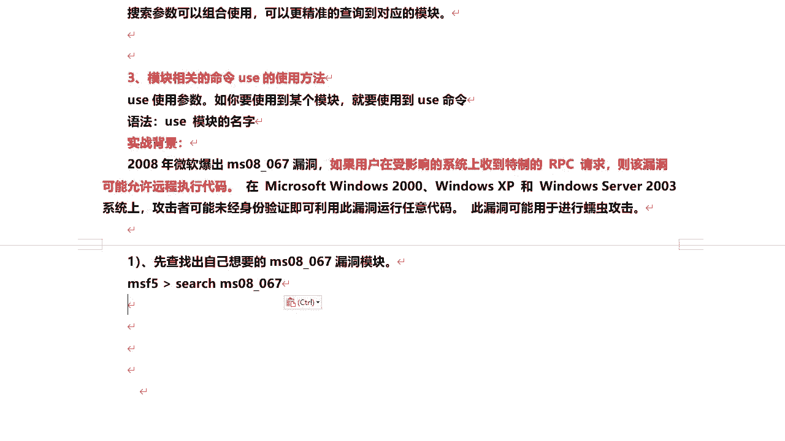
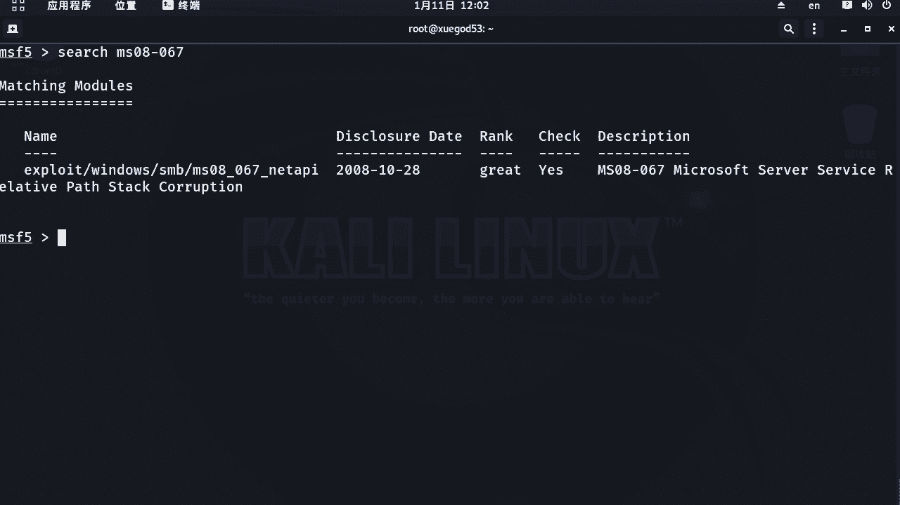
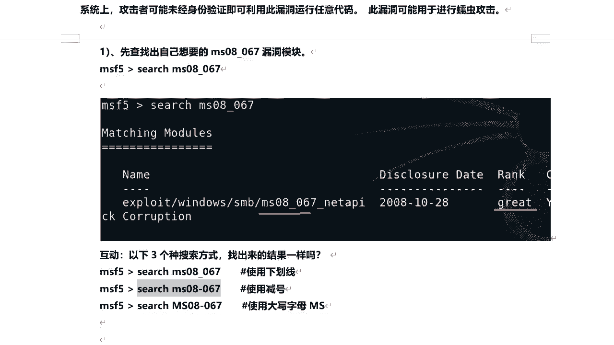
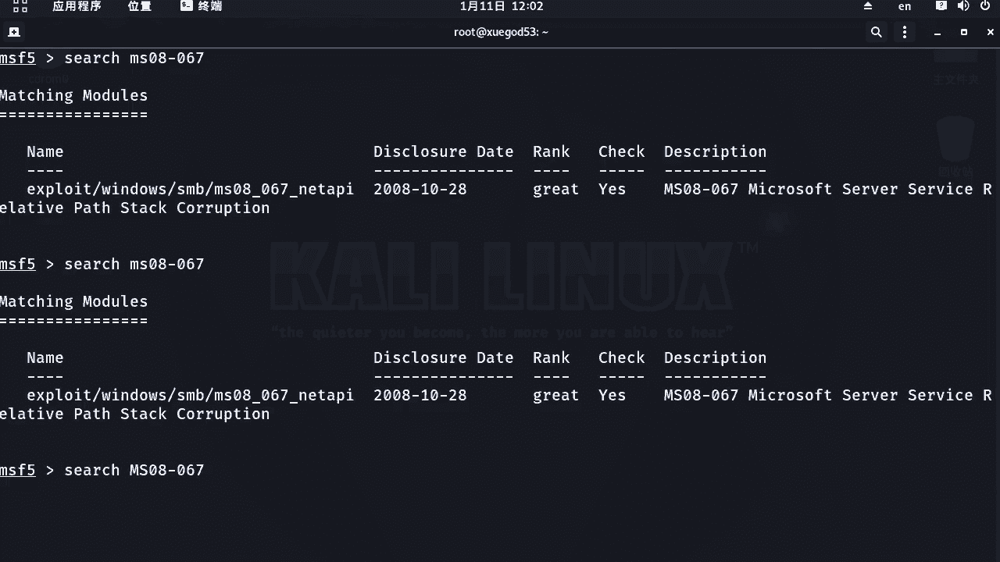
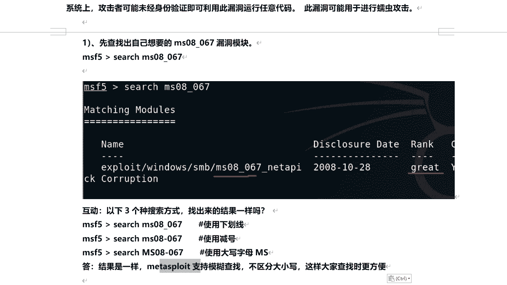
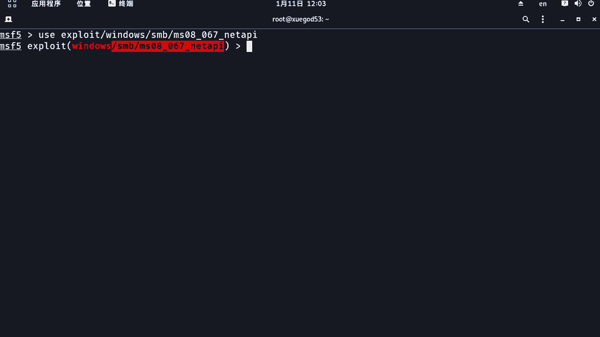
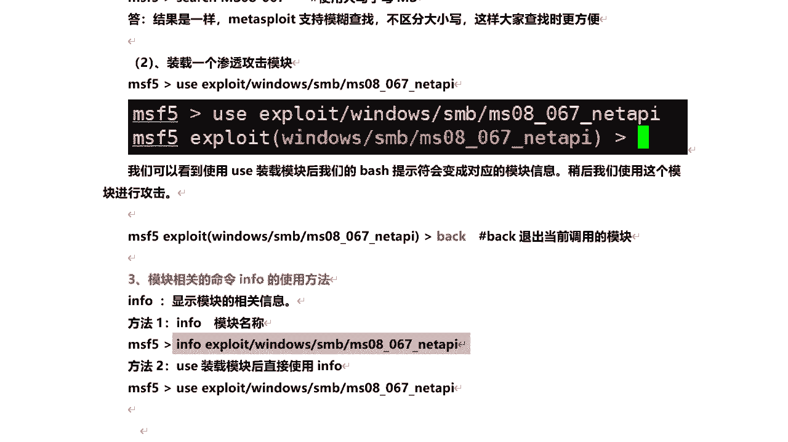
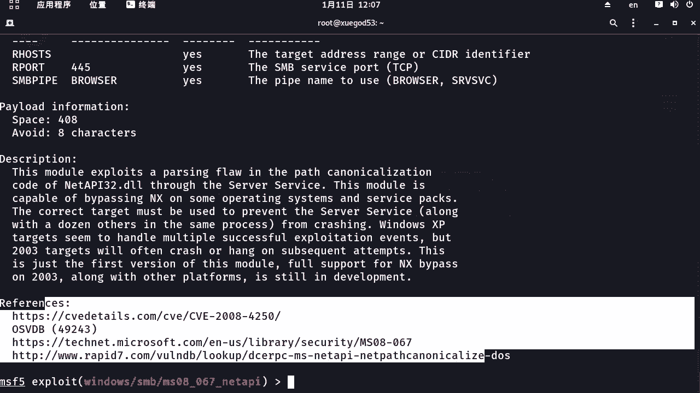
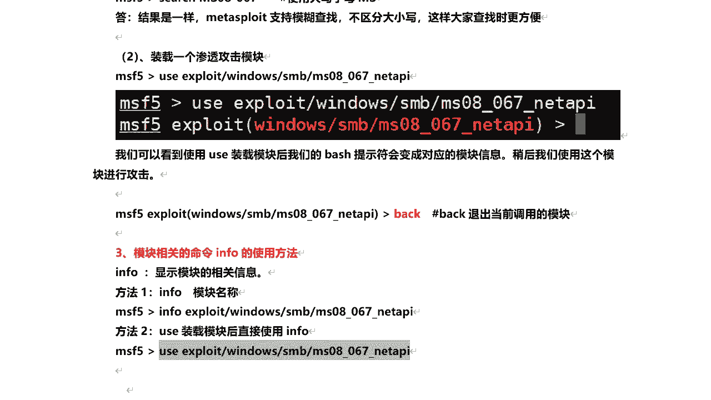
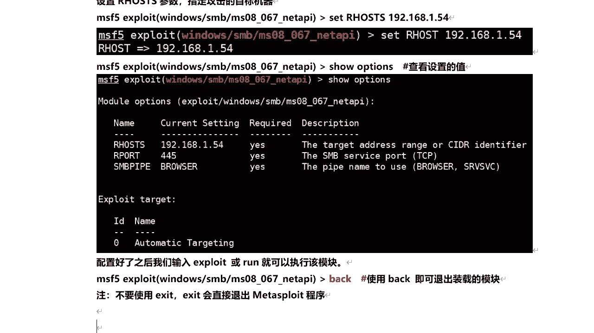

# P64：11.4-【Metasploit渗透】Metasploit基本使用方法-2 - 一个小小小白帽 - BV1Sy4y1D7qv

好接下来我们来看另外一个比较重要的命令，也是我们会经常会用到的一个命令啊，模块相关的命令，柚子的使用方法啊，柚子那么英文翻译过来呢是使用的意思哎，主要通过这个命令来来去加载啊模块。

比如说我们要想使用那个每个某个模块对吧，必须得通过柚子来加载这个模块，然后呢对这个模块进行相关的设置，然后去执行这个模块，呃，这里呢我们来了解一个比较典型的，一个比较著名的啊，一个经典的一个漏洞。

ms 08067，在2008年啊，微软爆出m s08 杠067，这个漏洞，如果用户啊在受影响的系统上，受到特制的rpg请求，那么该漏洞可能允许远程执行代码，那么也在windows 200022000啊。

windows xp和windows server 2003系统上对吧，都可以利用，攻击者呢可能未经身份验证，即可利用此漏洞来运行任意代码，还可以进行吗，蠕虫攻击啊，那么要想使用这个漏洞相关的模块。

首先呢我们来去查找对吧，关于这个编号，通过这个漏洞编号去查找有没有对应的模块啊。

我们来搜索一下ms 08杠067啊，直接查找有一个对应的模块是吧，好那么等待rank等级的great啊，也是相对比较好的，也是比较好容易利用的啊，那么这里呢我们来考虑一个问题啊。

也是我们在进行搜索的时候啊，我们不可避免的可能会说哎我这个模块名称啊，哎输入错了，比如说下划线输入横杠了，这个小写呢输入大写了好吧，那么比如说像以下的这三种方式，这三种方式使用下划线呢，使用减号啊。

使用大写字母m s这三种方式都能搜到结果吗，对吧，那么我们来可以验证一下的啊，那么这个呢我们之前用这种方式可以搜到是吧，那比如说像横杠呢，这种方式好能不能得到结果，一样可以搜索到。

那比如说这里大写呢，啊一样可以吃到。

那么说明什么问题呢，对啊这三种搜索方式啊，结果啊都是一样的啊，那么也就是说mate supply支持什么模糊查找。

不区分大小写，这样的话，那么在查找相关的模块的时候就更加方便了，好吧，那么我们找到这个模块了，那么如何去使用，那么需要什么装在就加在这个模块。

加载这个模块呢，通过use这个命令，那比如说我们来通过这个模块名称，柚子后面跟上模块名称就可以了，柚子后面加空格好回车，那么它出现这个提示符，证明已经加载成功了对吧，那么我们可以看到啊。

使用柚子加载模块后，我们后面这个by 10命令提示符变了啊，变成了对应的模块信息啊，那么稍后呢我们会使用这个模块来进行了吗。

来进行攻击，好那么这个是关于柚子命令的使用方法，嗯好的，那笔记呢给大家整理到这里啊，柚子空格后面跟上模块的名称。

那么就可以来装载这个模块啊，呃这里呢装载到这个模块之后呢，比如说我想退出这个模块，而不想退出mata load这个框架怎么办呢，使用back这个命令对，那么退出当前调用的模块啊。

back啊，注意这个命令啊，而不是excite啊，好那么加载这个模块啊，我们会了，那么关于每个模块啊，比如说我们拿到一个陌生的模块，我不会去使用它，或者这个模块是干什么用的，我不知道，那么怎么办呢。

可以通过info这个命令，来查看这个模块相关的信息，那么关于这个info啊，它有两种使用方法，一种是来通过info空格，后面呢跟上模块的名称来查找这个模块，他相关的信息，好。

或者是另外一种方法呢是加载到这个模块里面，加载进来，然后呢，再执行info命令，来去查看关于这个模块相关的信息，然后我们这两种方式都给大家来演示一下了，比如说第一种方式。

好吧，那么可以查看关于这个模块详细的信息啊啊，然后呢另外一种方式呢。

就是说来先加载一下这个模块。

然后呢执行info命令好吧，然后呢这里我们看啊，他都可以查看到哪些相关的信息啊，这里头好，那么这里呢模块的名称啊，他的哪个模块是吧，针对什么平台的啊，还看到关于许可证，还有他的等级，还带了披露日期对吧。

还有一些版权相关的一些信息啊，然后接下来的target就是可用目标对他就是长按，可以攻击哪些操作系统，那么这里这个漏洞呢可以攻击这些操作系统，这些啊，还有check是否支持check支持。

也就在漏洞利用之前，可以对磨机进行检查，是否存在这个漏洞，还有现在一些基础的相关设置参数对吧，有调用漏洞需要的利用的一些参数好吧，使用相关参数，比如目标主机ip必须设置的。

那么还有关于pyload新闻信息，就是pyload，pyload，也就是真正呃也就是在漏洞利用成功之后，真正在目标机上要执行的代码啊，那么它的这个代码的大小408字节，然后description。

那么是关于这个漏洞的相关的一些描述啊，后面还提供了一些关于这个漏洞的一些。

参考的文档好吧，那么这是关于查看模块相关的信息啊，那么我把它这个笔记呢给大家来整理到这里，那么我们加载完这个模块。

也就调用了这个模块之后，接下来我们该做什么呢，可以使用show命令来查看模块了，相关信息，也就是说在利用这个模块。

我们需要设置哪些相关的一些参数啊，这个呢也是我们会经常用到的命令，so opposite查看模块的选项啊，那么运行之后呢，我们看这里，那么这里关于这些参数有哪些参数呢，这些name参数的名称来好好的爱。

来我们看一下啊，name参数的名称啊，curve setting当前的默认值required，那么它是否是必填的，那么yes是必填的，no就是不是必填的啊，呃不是必填的，就不设置也可以啊。

那么像这个都是必填的，大家给这个默认值，像一般的情况下这些默认值啊，你直接选默认就可以了，不需要改啊，而除非有个别情况啊，你需要去修改description，那关于这个参数的详细描述。

有这个参数是干什么用的，那么这里我们要注意啊，这个our host后面有个s是吧，这是目标机的ip，比如说你攻击的目标，他的ip地址需要设置一下的那个s，你就可以设置多个目标对，那么利用这个模块呢。

也就可以对多目标同时进行渗透攻击，他给他，他给他的，也就是说你这个攻击的目标，它的操作系统类型对吧，默认呢是自动的，那比如说这个模块啊，这个楼ms 08杠067对吧。

那么它可以攻击的目标系统呢是比较多的，我们可以通过受他给来查看一下的，有这么多是吧，那所以说呢这里头我们就需要去指定一下的，对设定一下他他的目标，否则的话一般来讲，那么你的利用不会成功的好吧。

利用不会成功的，比如说我们这里来看一下的啊，呃后面呢我们会提供给大家一个x p，它是xp sp 3简体中文版的，也就是他的id是34，比如说你想对这个xp呢来进行来渗透呢。

你必须指定他给他set target 34啊，set是设置的意思，后面跟参数的名称设置哪个参数啊，然后它的值是多少啊，这么去设置就可以了好吧，然后呢我们设置完成之后呢，通过so来查看对吧。

哎这里已经测试成功了啊，还有一个必须设置就是our host，那么也就是目标机的i p地址啊，set后面该项参数的名称，然后呢你的目标级ip是多少啊，比如说我的目标级ip是1。54好吧。

哎设置下就可以了，然后设置完成之后呢，我们透过so o p t i o n s和opposite，来查看一下的这个设置是否成功了，ok没有问题是吧，那么另外呢假如说你设置完成之后。

比如说哎我这个不想设置了怎么办呢，对通过an set后面跟参数名称就可以了，然后呢再查看一下so options对吧，诶他已经取消了好吧，但是呢这里要注意啊，那么这个目标及ip地址。

our host必须得设置啊，对那你不设置目标，你怎么来进行渗透攻击啊，对不对，大家要想这个问题啊，好那么这就是关于我们这个so啊命令的使用，加载文本模块之后。

使用so opposite来查看相关需要设置的参数啊，呃另外这里要注意一点啊，那么你所有的参数都配置好之后呢，你可以通过exploit或者是run，就可以来执行这个模块。

对目标机进行渗透或者是漏洞利用啊，对意思是一样的啊，然后呢这里有个命令，bag bag呢就是退出装载的模块，不退出mate splay的框架啊，那么这里不要使用a exce。

使用埃塞的会直接退出mate flag框架，这里呢大家一定一定要注意，好吧好，那么这是关于mate supply的一个最基本的使用方，法对啊，主要是一些常用命令的使用方法，这些大家都必须要掌握啊。

也就是大家在以后的渗透测试过程中，利用这个模块会经常使用到的。

