# P64：11.4-【Metasploit渗透】Metasploit基本使用方法-2 🔧

在本节课中，我们将要学习Metasploit框架中几个核心命令的使用方法，包括`use`、`info`、`show`和`back`。我们将通过一个经典漏洞MS08-067的模块来演示这些命令的实际应用，帮助你掌握加载、查看和配置模块的基本流程。

## 模块加载命令：use 🚀

上一节我们介绍了如何搜索模块，本节中我们来看看如何加载并使用一个模块。`use`命令是加载模块的关键命令，其英文翻译为“使用”，主要用于加载指定的模块。

加载模块后，才能对该模块进行相关设置并执行。其基本语法如下：
```
use <模块名称>
```

例如，要使用一个模块，必须通过`use`命令来加载它。

## 经典漏洞：MS08-067 💥

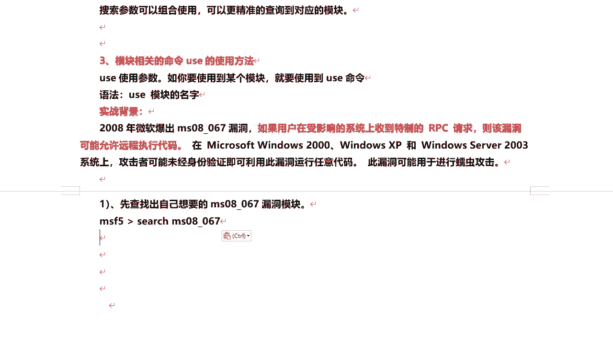

这里我们来了解一个比较典型且著名的经典漏洞：MS08-067。该漏洞于2008年由微软披露。如果用户在受影响的系统上收到特制的RPC请求，该漏洞可能允许远程执行代码。

此漏洞影响Windows 2000、Windows XP和Windows Server 2003系统。攻击者可能无需身份验证即可利用此漏洞运行任意代码，甚至可以进行蠕虫攻击。

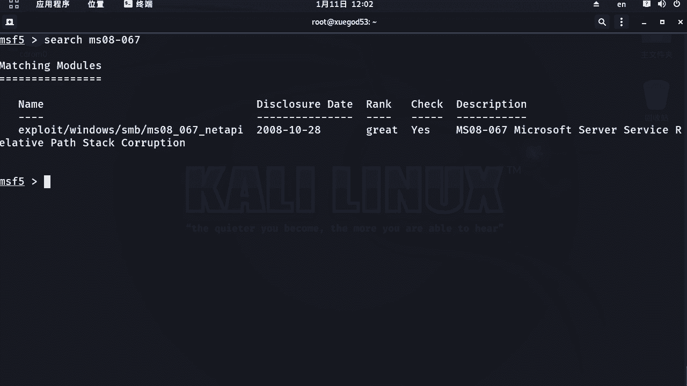

要想使用与此漏洞相关的模块，首先需要通过漏洞编号来查找对应的模块。


我们可以搜索“ms08-067”。直接查找会有一个对应的模块。该模块的Rank等级为“great”，表示相对较好且容易利用。

## 模糊查找功能 🔍

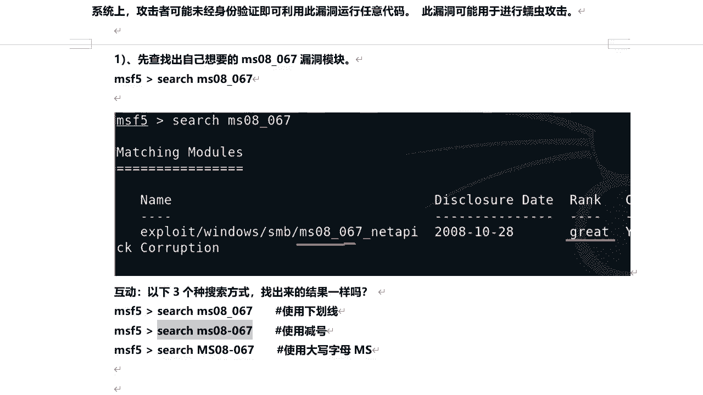

在进行搜索时，我们可能不可避免地会输错模块名称，例如将下划线输成横杠，或将小写字母输成大写。

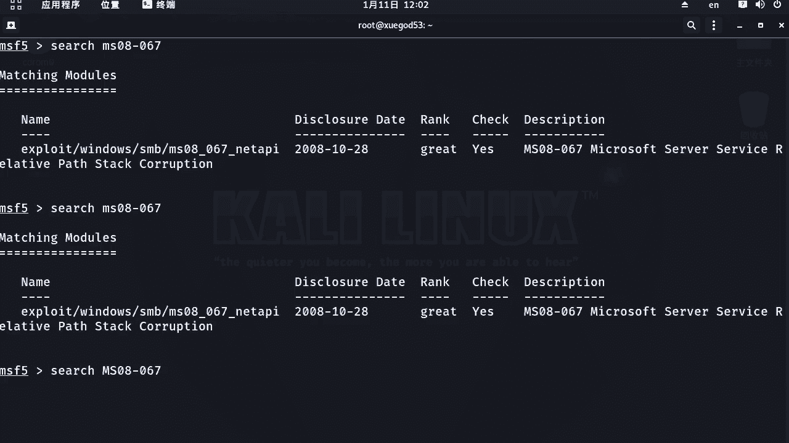

以下是三种可能的输入方式：
*   使用下划线：`ms08_067`
*   使用减号：`ms08-067`
*   使用大写字母：`MS08-067`


那么，这三种方式都能搜到结果吗？我们可以验证一下。

之前用`ms08_067`的方式可以搜到结果。使用横杠`ms08-067`的方式，同样可以搜索到结果。

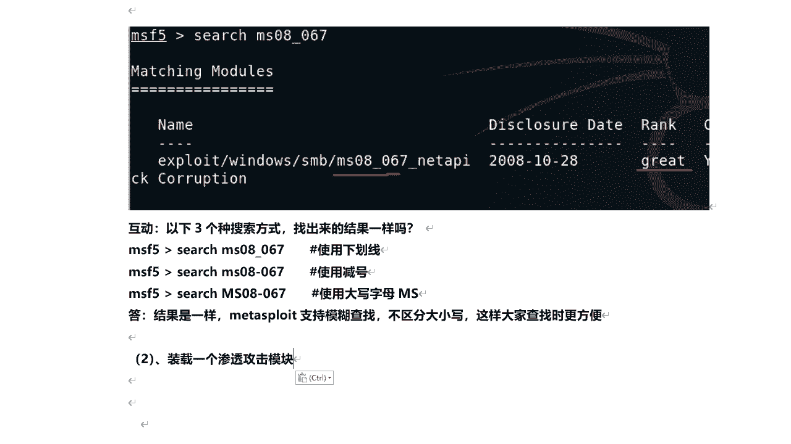


使用大写`MS08-067`的方式，也一样可以搜索到。


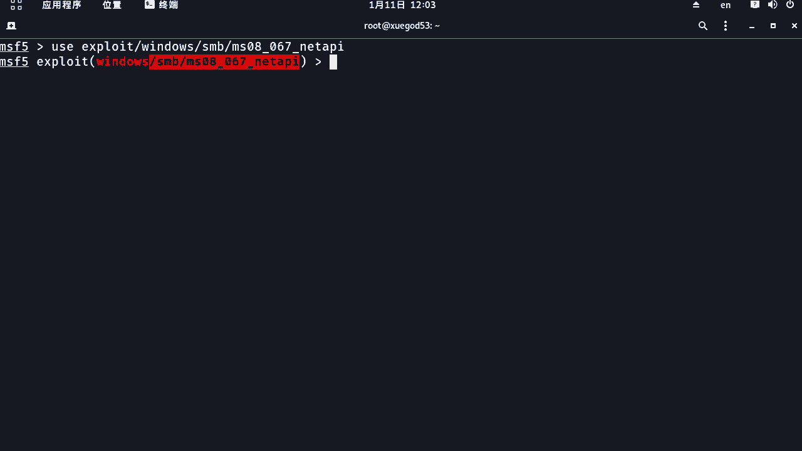

这说明这三种搜索方式的结果都是一样的。也就是说，Metasploit支持模糊查找，并且不区分大小写。这使得在查找相关模块时更加方便。

## 使用use命令加载模块 ⬆️

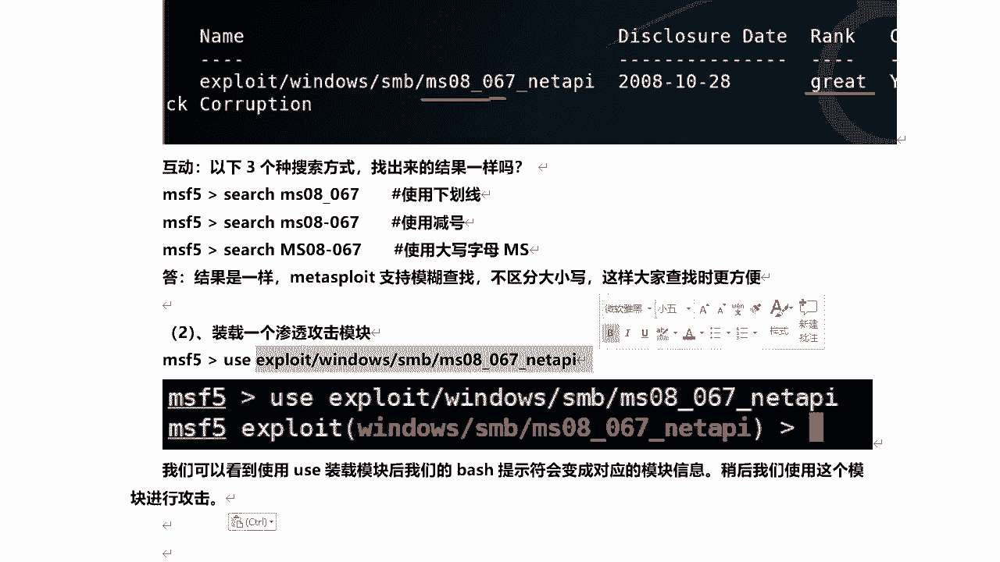

找到模块后，我们需要使用`use`命令来加载这个模块。

加载模块的方法是通过`use`命令后跟上模块名称。例如，输入`use`后加空格和模块名称，然后回车。

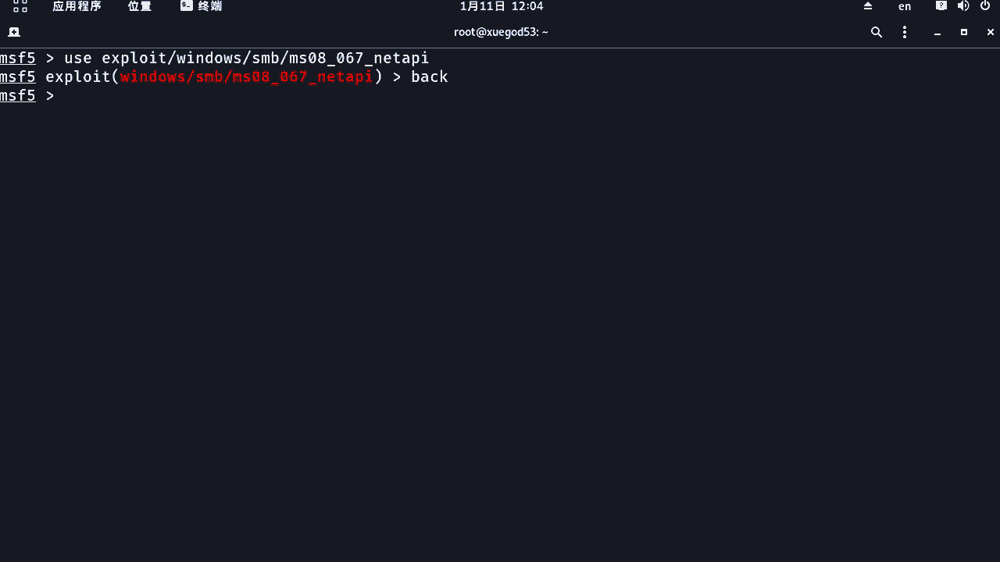


当出现模块提示符时，证明已经加载成功。使用`use`加载模块后，MSF的命令提示符会变为对应的模块信息。稍后我们会使用这个模块来进行攻击。

这是关于`use`命令的使用方法。笔记整理如下：`use`空格后面跟上模块的名称，就可以装载这个模块。

## 退出当前模块：back命令 ↩️

装载模块之后，如果想退出当前模块而不退出整个Metasploit框架，应该使用`back`命令。

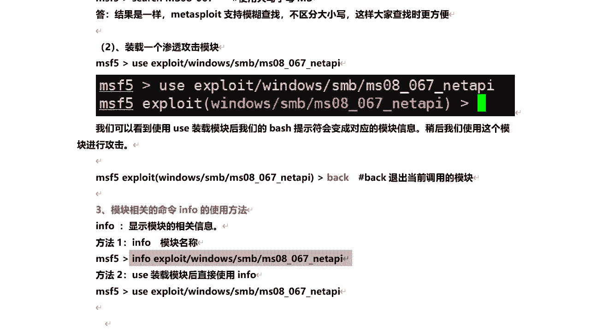


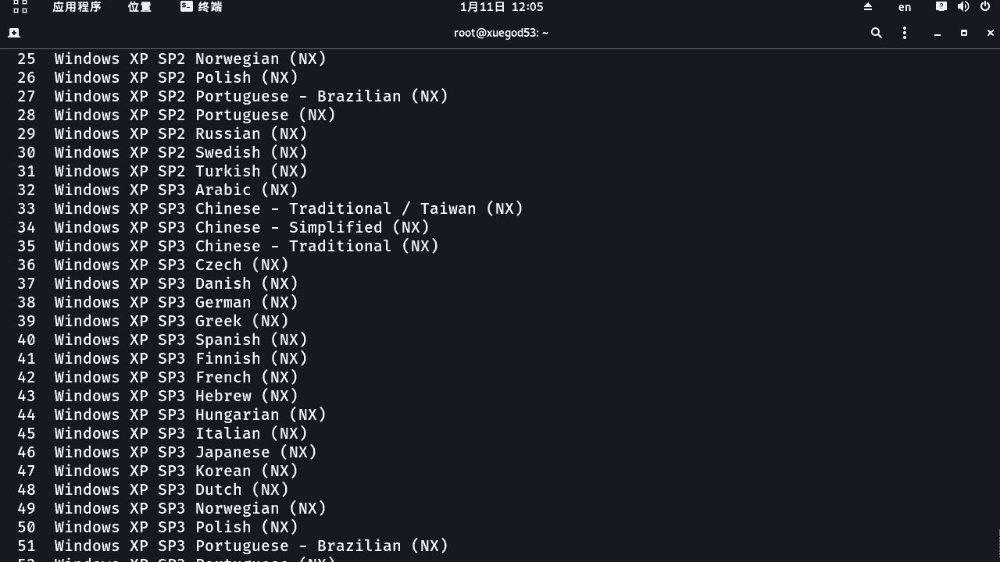

注意，这个命令是`back`，而不是`exit`。`back`命令用于退出当前调用的模块。

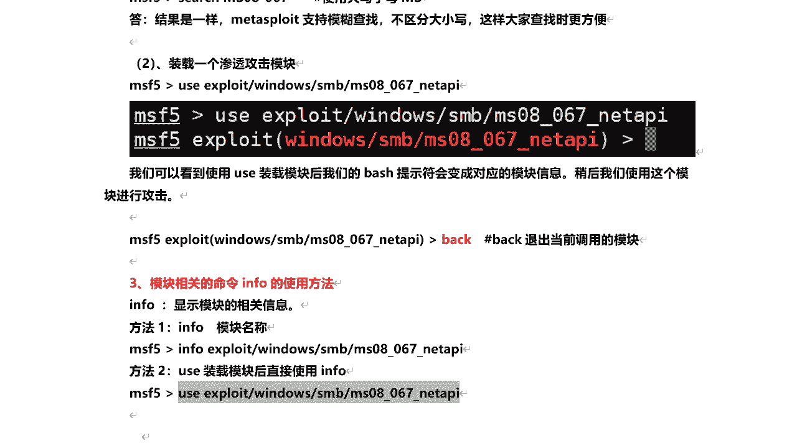

## 查看模块信息：info命令 ℹ️

加载模块后，我们可能会遇到一个陌生的模块，不知道如何使用或不清楚其功能。这时可以通过`info`命令来查看模块的详细信息。

`info`命令有两种使用方法：
1.  通过`info`空格后跟上模块名称来查找该模块的信息。
2.  先使用`use`命令加载模块，然后在模块内执行`info`命令来查看信息。

我们来演示这两种方式。第一种方式是直接使用`info <模块名称>`。


这样可以查看到关于该模块的详细信息。

第二种方式是先加载模块，再执行`info`命令。

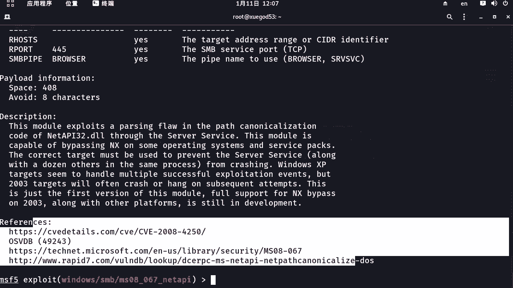


首先加载模块。

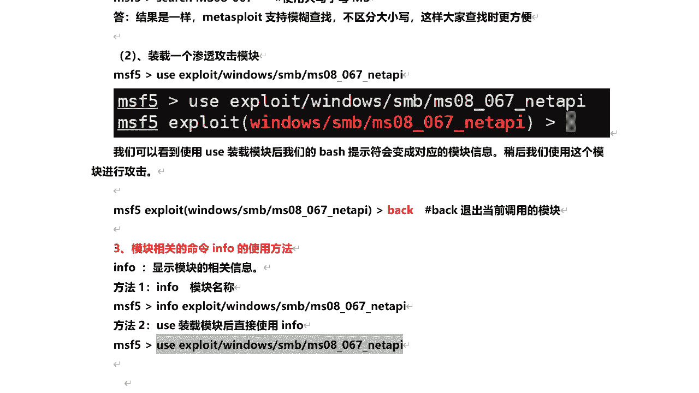


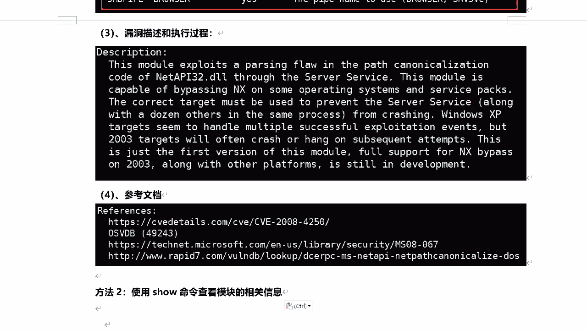

然后执行`info`命令。

通过`info`命令可以查看到以下相关信息：
*   **模块名称**：该模块的名称。
*   **平台**：模块针对的操作系统平台。
*   **许可证**：模块的许可证信息。
*   **Rank等级**：模块的可靠性等级。
*   **披露日期**：漏洞被披露的日期。
*   **版权信息**：相关的版权信息。
*   **可用目标**：该漏洞可以攻击哪些操作系统。
*   **Check支持**：是否支持在利用前检查目标是否存在该漏洞。
*   **基础参数**：调用漏洞需要设置的基本参数。
*   **Payload信息**：漏洞利用成功后，在目标机上执行的代码及其大小。
*   **描述**：关于该漏洞的详细描述。
*   **参考文档**：提供了一些关于该漏洞的参考文档链接。


这是关于查看模块相关信息的介绍。

## 查看与设置模块参数：show命令 ⚙️

加载并调用模块之后，接下来我们需要使用`show`命令来查看模块的相关信息，特别是利用该模块需要设置哪些参数。这也是一个经常用到的命令。

使用`show options`可以查看模块的选项。


运行后，我们可以看到相关参数。参数列表包含以下列：
*   **Name**：参数的名称。
*   **Current Setting**：参数的当前默认值。
*   **Required**：该参数是否为必填项。`yes`表示必填，`no`表示非必填。
*   **Description**：关于该参数的详细描述，说明该参数的用途。

需要注意，`RHOSTS`参数后面有个‘s’，这代表目标机的IP地址。你可以设置多个目标IP，这意味着利用该模块可以对多个目标同时进行渗透攻击。

`TARGET`参数是指攻击目标的操作系统类型，默认是自动选择。例如，MS08-067漏洞可以攻击的目标系统较多，我们可以通过`show targets`来查看具体列表。

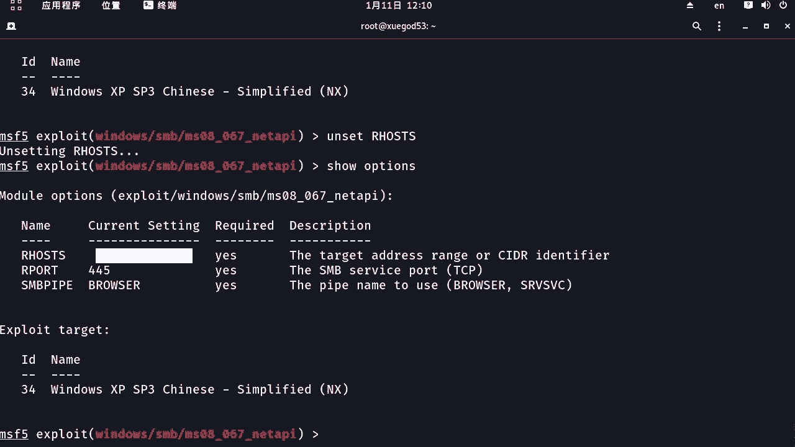

因此，我们需要指定目标类型，否则利用通常不会成功。例如，如果目标是XP SP3简体中文版，其ID是34。要对该目标进行渗透，必须指定目标：`set target 34`。

`set`是设置命令，后面跟参数名称和要设置的值。设置完成后，可以通过`show options`来查看设置是否成功。

另一个必须设置的参数是`RHOSTS`，即目标机的IP地址。设置方法为：`set RHOSTS <目标IP>`，例如`set RHOSTS 192.168.1.154`。

设置完成后，通过`show options`查看设置是否成功。


假如设置完成后想取消某项设置，可以使用`unset`命令后跟参数名称。然后再通过`show options`查看，该参数已被取消。

但需要注意，目标机IP地址`RHOSTS`是必须设置的。不设置目标，就无法进行渗透攻击。

## 执行模块与退出 🏃‍♂️

所有参数都配置好之后，可以通过`exploit`或`run`命令来执行该模块，对目标机进行渗透或漏洞利用。这两个命令意思相同。

`back`命令用于退出已装载的模块，但不会退出Metasploit框架。**切记不要使用`exit`，因为`exit`会直接退出整个Metasploit框架**，这一点必须注意。

## 总结 📝

本节课中我们一起学习了Metasploit框架的一些基本使用方法，主要是一些常用命令的操作。这些是大家在后续渗透测试过程中，利用各种模块时会经常使用到的核心技能，必须熟练掌握。

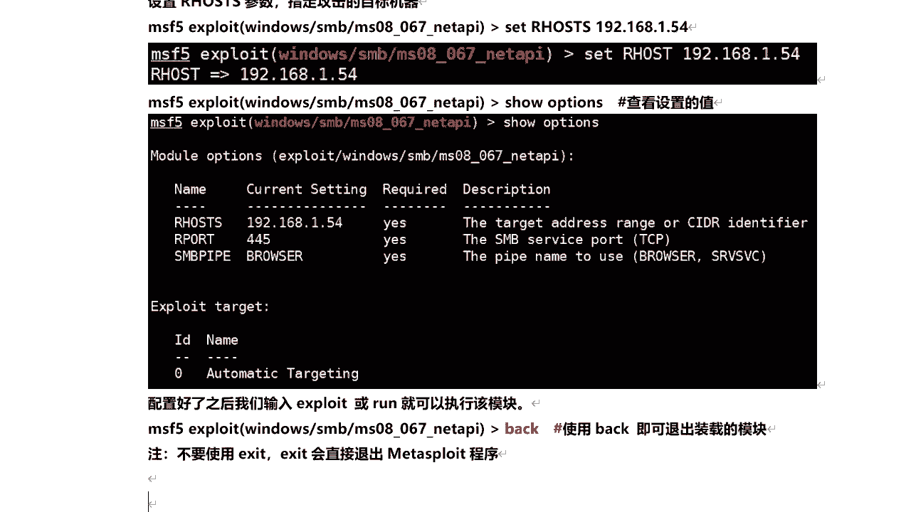

我们学习了：
1.  使用 `use` 命令加载模块。
2.  通过 `info` 命令查看模块的详细信息。
3.  利用 `show options` 查看和配置模块所需的参数。
4.  使用 `set` 和 `unset` 来设置或取消参数。
5.  最后用 `exploit` 或 `run` 执行攻击，并用 `back` 退出当前模块。