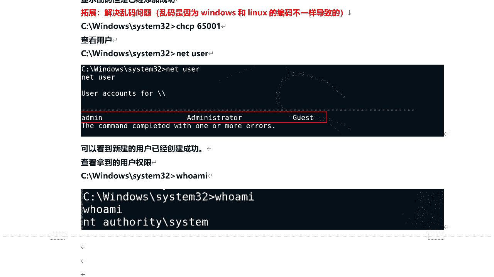

# P65：11.5【Metasploit渗透】实战-使用msf渗透攻击Win7主机并远程执行命令 - 一个小小小白帽 - BV1Sy4y1D7qv

好下面呢我们来个实战啊，那么使用msf渗透攻击win 7主机，并远程执行命令，那么这里呢我们利用一个比较经典的漏洞啊，那么永恒之蓝嗯，永恒之蓝呢我想大家都听说过啊是吧。

那么永恒之蓝是2017年4月14日晚，黑客团体，影视经纪人公布了一大批网络攻击工具啊，那么其中呢永恒之蓝就是其中的一个啊，那么永恒之蓝利用windows系统的sm b漏洞，可以获取系统的一个最高权限啊。

5月12号呢，不法分子通过改造永恒之蓝，制作了vary勒索病毒，win翻译过来是哭泣的意思，那么也就是说中了这个病毒让你哭笑不得，你让你电脑里的所有的文件都加密啊，那么你要想解密，必须支付高额赎金。

比特币啊，而且对吧，你即使支付了这个数据呢，也不一定能给你解密，那么英国俄罗斯，整个欧洲以及中国国内多个高校对吧，还有大型企业内网及政府机构都中招了，被勒索支付高额赎金才能解密恢复文件啊。

那么大家对于win 7啊是什么时候发布的对啊，win 7是2009年发布的，好不好对，那么至今已不维护了啊，但是这个永恒之蓝漏洞依然还存在，那么使用这个win 7对吧，对用户还是有的啊。

那么这节课呢我们利用win 7的经典漏洞，永恒之蓝对来拿到目标机的一个权限啊，给大家演示一下如何利用mate slide对吧，渗透攻击模块来利用目标机的某个漏洞啊，来拿到目标机的一个权限啊。

那么关于永恒之蓝这个漏洞啊，那么在微软官方也有相关的描述啊，那么通过这个地址呢，我们来打开ms 17杠010来访问一下，那么大家看到左侧啊，那么左侧这个m417 杠零，用来支持漏洞的编号。

一七代表示17年，010代表是漏洞编号，那么17年呢还有其他的一些关，很多都漏漏洞啊，这些都是漏洞，那么大家呢对在了解这个漏洞之前提下对吧，那其他相关漏洞呢也可以去了解一下他，那比如说某个漏洞。

它基于什么操作系统的，基于什么条件的，那么大家可以去复现一下的啊，那么学习这个过程当中，就要我们去多动手啊，多练多思考啊好吧，然后呢关于这个永恒的融入了m170010 。

他呢严重影响的是windows s m b服务安全更新啊，这是4013389，那么这个更新程序修复了微软对吧，这个windows中的多个漏洞啊，那如果攻击者向windows sm b v一服务器。

发生特殊设计的消息，那么其中最严重的漏洞，可能允许远程执行代码啊，这个我们做个简单了解就可以了啊，那下面呢关于它影响的系统对，那么大家如果感兴趣的，可以针对这些系统的去复现，看看能不能复现成功是吧。

然后呢我们来接着往下看啊，接下来我们来利用msf来这个模块啊，获取win 7主机远程的cell权限，那今天我们利用的win 7啊，是旗舰版sp的啊，然后关于这个镜像呢我也提供给大家啊。

那么这是win 7旗舰版sp 64位系统的一个镜，像，里面有激活工具，大家呢如果想自己安装呢，可以通过这个链接啊，百度网盘链接去下载啊，自己安装，而我不想自己安装的嘛，下面还给大家提供了一个免安装版本。

对免安装的，那么下载下来直接解压，用v mail打开啊，就可以好吧，那么百度网盘链接是这个啊，注意啊，这个系统登录密码是123456，已经给大家做好了一个初始快照啊，如果出现问题的话，可以直接恢复好吧。

ok那么我们来看，那么如何利用msf对目标机呢进行渗透，那么它整个一个流程是什么样的，我们来了解一下，比如说那么我们已知啊一个漏洞的编号，比如说ms 17杠010，利用这个漏洞编号呢。

我们进入mate supply这个框架，然后呢去查找啊，关于这个漏洞编号有没有对应的模块好吧，那么如果啊大家查找方式很多了，色是so等等，我们前面讲的那些搜索方式，都可以结合在一起去用。

那么最简单直接的方式呢，就是设置后面直接跟上漏洞编号这种方式哦，然后查找到模块之后呢，我们去加载，在加载这个模块啊，加载然后呢去看看他需要设置哪些参数，它针对的目标操作系统是什么样的。

导游有哪些编码器可用啊，还能有哪些高级参数，关于这个模块的相关信息啊等等，然后呢去设置相关信息啊，设置参数，那么设置完成之后呢，然后执行explode或者是run，这两个都可以去执行这个模块进行攻击。

对目标啊，那么这是整个的一个渗透的流程啊，利用已知我一个已知一个漏洞的编号，如何在mate里面对目标机发起一个攻击，那么现在我们已知一个漏洞，编号m417 杠010，那么我们来看关于这个啊。

漏洞有没有对应的一个扫描模块啊，就是说来扫描一下磨机，确认一下它是否存在这个漏洞啊。

那么我们可以通过这个编号来查找一下它，010好呃，得到这么多模块呢，我们看啊，那么a u s开头的是辅助模块，辅助模块主要是进行信息收集和扫描的啊，然后呢airpolite模块主要是漏洞利用的好。

那么我们现在呢既然存在辅助模块，那么就是说我们是不是诶可以对目标机来扫描，确认一下呢，它是否存在啊，这个漏洞呢对吧，那么这里呢我们来看啊，这个accelery scanner。

s m b s m b m s17 杠010，我们来加载一下这个模块啊，柚子加载进来之后呢，哎我们来通过so options，看一下它需要设置哪些参数啊，那既然是扫描啊。

我们来看这个参数名称是否是必须设置的啊，那么这里只有一个没有设置什么our host，那么也就是这是目标机的ip地址好。

那么说到这里呢，在设置目标机的ip地址之前，我们来先看一下目标机，这里大家要注意一点啊，那么这个win 7啊，这个版本问题它存在永恒之蓝，但是啊即使它存在，你也不一定能渗透进去，也不一定能利用成功。

要看目标及它的设置啊，配置，那他看什么配置呢，首先看这里啊，网络零一，这里头我们来有点属性看啊，那首先它的45端口肯定是得开启的对吧，s m b c45 端口嘛，利用是这个端口。

如果45端口是关闭的一样渗透不进来，那么当然这个我们可以通过n map，去扫描这个win 7，也就是目标记的次数登录，判断它是否是开启的，一般来讲默认呢都是开启的啊，然后才有一点。

这里有一个网络网络好看，这里默认是工作网络，我这里啊，那么点开之后呢，有三种网络模式啊，家庭工作和公用三种网络模式呢，如果防火墙处于开启状态的话，那么三种网络模式的防火墙策略是不一样的。

如果你选的是公用网络防火墙开启的话，那么你肯定是渗透不进不进来的对吧，那么这个放在这里，我们来打开防火墙，看啊看啊，防火墙这里啊，把这个王子不能穿点，好呃我这方向当前都是关闭状态啊，那么这个防火墙啊。

大家看上面是家针对家庭和工作网络的，下面是针对公用网络的，如果你选择是公用网络，公用网络比较适合像公共场合，肯德基，麦当劳这些啊，那么它的网络这个防火墙策略是比较严格的，安全嘛啊，如果你这里是开启的。

选择公用网络，你是渗透不进来的啊，当然如果你选择家庭或工作网络，防火墙这块是开启的，那么当然是没有问题的，可以渗透进来的，那我把防这个风墙都打开。

啊大家注意啊，那么这个就是说有人说哎，为啥老是仅开启防火墙就渗能渗透进去，我开启防渗透不进去啊，原因就在这里啊，我选择工作网络啊，好呢，这里呢我们设下目标记的ip，目标一的ip地址是多少呢。

我们可以来查一下啊，c m b a p跟这个1。56是吧，好的，set our host，1921681。56，设置完成之后呢，呃习惯性的看一眼啊，设置成功了没有，ok目标记ip设置成功了。

接下来我们就run或者是exploit都可以啊，来扫描一下目标机是否存在这个漏洞，那么出现一个加号证明有结果了，host is likely vulnerable to m s171010 。

就证明目标一它存在这个漏洞，既然能检测出它存在这个漏洞，那么接下来我们在进行漏洞利用的时候，应该肯定是没有问题的好吧，同时呢还扫描出了目标机的版本号，的win 7旗舰版sp。

那么这个呢扫描结果出来了啊，我们已经确认它存在这个漏洞，接下来我们利用什么渗透攻击模块，来对它什么进行攻击啊。

查找攻击模块啊，同样我们还是利用这种方式啊，直接呢我们back一下search m417 杠010嗯，这里该用什么模块啊，那么a light这里有三个，那么到底用哪个呢是吧，那么首先第一个啊。

那么windows sm b m s17 杠010，后面的英文意思是永恒之蓝的意思，对用它啊，那么这个呢是针对win 8的啊，后边呢这个是这个是p s e s e c，这也是一个功能模块啊。

渗透攻击模块，但是这里头我们不用它，我们用它啊，这两种模块使用的方式基本上差不多，但是配置参数是不一样的，需要配置参数是不一样的啊，我们来使用这个模块use，然后so options好。

那这里首先我们来试一下目标记的ip，1921681。56呃，设置完成之后呢，我们搜一下的好，那么目前这里呢针对端口45没有问题啊，其他的默认都不需要设置好，然后呢这个target默认是i d0 。

win 7或者server 2008 r2 都可以，那当然我们可以来搜一下他so targets，它主要针对哪些操作系统呢，哎只有一个是吧，那么只有一个的话，那这里默认就可以了，不需要设置好吧好。

那么下面我们考虑一个问题啊，到这里我们就可以进行攻击了吗，对啊我们就可以来进行渗透了吗，现在大家考虑一下这个问题啊，那么接下来呢我要说明给大家讲一个原理啊，原理也就是说这个是我的攻击机，咱们的啊。

那是win 7对，win 7啊，win 7，这是kelly好吧，打开里，然后呢这个问题啊存在永恒之蓝m417 ，杠010这个漏洞，那么也就是说，那么现在这个模块呢我已经加载完了啊好吧，然后呢。

利用这个xp模块对目标机呀，来进行什么漏洞利用啊，如果利用成功了，在接下来你要干什么呢，那其实我们来渗透目标机，目的呢，需要达到目标机的权限，和目标机呢建立一个连接，然后呢对目标机可以进行一些操作啊。

执行一些命令，对不对，但是你漏洞利用成功之后有什么用没什么用，接下来呢还需要什么，向目标机发送一个什么后门，对，那么这里呢就是原来就是plow的payload啊，pload啊啊配乐的我们说了啊。

它叫攻击载荷啊，作用的是建立目标机和攻击机之间，一个稳定的连接，好吧，那说白了他是真正在目标机上要执行的代码，也就是后门或者是木马啊，那么当这个漏洞利用成功之后。

随后攻击机向目标机发送一段配low的代码，后面在目标地执行，执行成功之后呢，对吧，它的作用是要建立攻击机和目标机之间，一个稳定的连接，这个连接怎么建立对吧，那首先呢这个kelly在发送这段代码之前。

或者在执行这个漏洞利用模块之前，首先要开启一个端口，比如四四端口进行监听的好吧，然后呢还有这个注意啊，这个payload在发送给目标机执行之前啊，对发送给目标机之前，它这里面携带的叫端口ip ip。

那一般都是攻击机的ip kid的，我这里1。53啊，然后呢，同时这个四字端口呢在攻击机呢进行侦听啊，这段代码发送给目标机，在目标机真正执行成功之后，它会建立一个反弹的连接，连接谁连接这个ip和这个端口。

这个ip和这个端口啊，一旦连接成功之后，那么这样攻击机和目标机之间就建立一个连接，绘画啊，那么这样的话就拿到了目标记的一个权限啊，好吧，那么利用这个在这个绘画的基础上。

就可以就可以对目标机呢执行一些命令啊，那么同时我要说一下，它还有另外一种方式哎，那么也就是这个pload在目标机执行成功之后，在目标机上去打开一个端口啊，比如说四个五，然后呢攻击机去主动连接它这个啊。

两种连接方式好，那么说到这里，那么我们这个模块还需要设置什么。

对是这个po的对，我们得需要设置好吧，哎那设置配套这个po的最好是你手动去指定，那你不指定的话，他可能也会默认的去给你指定一个pyload，好不好，对，直接默认指令配置的不一定是最好的啊。

不如我们手动去选一个。

那么也就是说我们配置好了漏洞相关参数了，接下来我们应该做什么呢，对不对，同学们在找一个pyload，那么如何去找啊。

那我们就可以利用什么设置对，比如说我们找windows下面的，那么这个x64 什么意思呢，就看目标机，它是多少位的系统，如果是32位的，不要差60对吧，直接windows sl就可以了，如果是64位的。

你可以带x64 ，然后tab什么类型的模块啊，pay load，那么我们来搜索一下好不唉。

然后来search啊，windows下面的x64 ，然后tab t y p a load，这个windows这个windows打错了w啊，对ok 6好，那么我们得到了这么多的结果是不是好的。

那么这一点我刚刚说了，咱们这里利用反弹连接，反弹连接的话应该用哪个呢，是吧好，我们看啊，这里头有一个band的，这些都是不是反弹的，这个bd都是在目标机打开一个端口侦听的啊。

reverse这个ok用它对跳一个反弹的cl呃，windows x264 cell reverse tcp，那么反弹的连接好吧好，那么这里呢我们就来设置一下的啊，那么设置是后面那块。

前面payload不要带把它复制一下的，set payload，跟上好设置完成之后，我们来查看一下的啊，那么这里会多为选项payload，那么payload这里需要设置什么呢，监听的ip地址和端口好吧。

这个必须得指定啊，那么这个l host一般来讲都是攻击机的ip，我kelly的1。53，那好端口呢，这里是四行默认啊，就可以默认就可以啊，呃我设置好在这个监听ip地址端口之后。

那么当我执行渗透攻击的时候，run或s play的时候好吧，那么首先对目标基进行漏洞利用，利用成功之后呢，它会发生这段pload，payload的携带这个ip和端口到目标机执行。

执行成功之后会反弹连接这个ip和这个端口，如果连接成功，建立绘画对，就达到目标机的一个权限好吧，然后呢这是整一个过程，那么我们下面呢来run一下的，带稍等。

那么也就是在你所有的配置啊，都没问题的前提下啊，那么你在进行漏洞利用的时候也可能会失败，如果失败了，多吃几次啊，但首先前提的确认你设置没有问题啊，那么到这里就是win是吧，对那么已经利用成功了。

打开这个链接，会画1。5344端口，与目标机1。5649235端口建立连接了，ok对然后呢我把这个笔记呢给大家整理一下的，好不对，那么这里呢要注意啊。

唉我们搜索到的结果呢是这样好吧，那么当你设置的时候，这个payload和windows键有个空格啊，有空格，这里大家一定要一定要注意好吧，哎那么这里呢叫set空格payload。

然后面这个payload hub有hub，还有一个空格啊，后面然后呢加上这个名称啊，这里我们是用一个反弹的cell啊，这么一个payload啊，然后呢设置完payload之后呢。

还需要设置监听的ip地址和端口，好不好，对你要注意啊，这个一定要设置，那么也就是说在你执行run的时候对吧，对目标进行漏洞利用的时候，他你设定这个端口已经处于监听状态了对吧。

然后payload的目标即执行完成之后啊，那么它呢反弹连接这个端口ip，本机ip，那这里呢我们已经利用成功了对吧，同学们啊，然后呢这里呢我们回来看诶，现在怎么还除以这种，好像是没结束呢。

其实呢已经结束了，因为这里我们选的是cl这个pyload，你按下回车好吧，那么它就进入到这个提示符啊，这个提出比较属于是目标机windows system 32啊，这个目录好吧，对，已经进入到这里了。

这里呢大家一定要注意，不要坐那干等是吧，干等他怎么还不来呢，是不是啊，按一下回车呀。

诶它就好了，ok那么这里如果没有提示cell提示，可以敲一下回车就可以了，那么现在呢我们就可以在目标机啊，去执行一些什么，执行一些命令对，那么比如说我们可以来查看一下用户啊，net user对。

当然这里出现一个乱码，为什么会出现乱码，乱码是因为windows和linux的编码不一样啊，导致的啊，所以呢这里我们来解决一下乱码，那么使用c h c p65001 就可以了，来改变一下这个编码。

然后接下来我们net有想查看用户呢，就不乱码了啊，那比如说呢我们来添加一个有net user，admin adm a d啊，像这些常用的dos命令啊，搞渗透测试的必须要会啊，添加用户添加完之后呢。

我们light user来查看一下的添加成功了，bm好吧，那么已经成功的在目标机呢添加了一个账号啊，那么我们下面看啊，我们拿到这个是什么权限啊。

户外卖system在windows系统里面最高权限就是system啊，再一个administrator，超级机构里面还有个普通用户三种缺陷，那么在linux系统里的最高权限是root用户好吧。

那么这里呢我们利用永恒之蓝啊。

拿到了目标系统的一个最高的一个权限啊啊对，那么也就是说这个漏洞是还是比较严重的啊，ok然后这里呢我们已经拿到它的一个绘画了。

是不是啊，如果我想断开这个后面的n ctrl加c就可以了，它提示你是否中断会画啊，我们输入y好，ok然后这里呢教大家另外一种方式啊，比如说我想拿到它的连接，同时呢直接把这个链接绘画保存到后台后台啊。

可以从airplay杠接，刚接的表示后台执行后台进行监听渗透，那这三台连接会保存后台，那但是呢我们也可以通过后台这个切换到对，连接到目标机啊，或者通过run杠机也可以，好我们来稍等啊，再渗透一次。

好按一下回车嗯，发现链接怎么没了对啊，因为它保存到后台了，通过sence我们可以查看建立的一个连接啊，好吧，然后呢，会画id就可以进入这个链接，sence啊，搜个s杠好。

回下车，ok那么我们又进来了啊，对那么这个大家这是一个小技巧啊，对那么也就是在我们进行渗透测试，可能会这些比较简单，最基础的啊，最基础的那比如说啊，那现在我已经进入到目标机的一个绘画了。

那现在我想回去。

我想把它保存到后台怎么办，back ground，通过这个命令回车，那么它提示你是否把绘画二啊保存到后台y，然后呢，当然如果啊如果你不想要了对吧，那你可以把它删掉。

science杠k后面跟上他的id对吧，这个绘画id就可以了，直接给他删掉啊，然后呢。

ok好，那么这个呢是整个利用咱们的永恒之蓝漏洞，渗透目标机啊，拿到权限之后呢，可以执行一些命令，下面呢我们来做个总结啊，那么在使用mate suppli对攻击啊。

对目标进行攻击的时候，它的步骤是什么样的，首先已知一个漏洞编号，去查找他这个公布的漏洞啊，cv e公布的漏洞对吧，通过这个公布的漏洞拿到的，拿到一个漏洞编号，通过这个漏洞编号呢。

到mate supply里去查找对应的模块啊，exploit漏洞利用模块找到这个模块之后呢，然后柚子加载加载之后呢，so options查看需要设置哪些参数配置模块，参数配置完成之后呢。

那么去添加payload后门对设置完了，最后执行exploit开始攻击，那么这个呢就是我们最使用mt supplied，利用目标机存在的漏洞对目标机进行渗透。

