# 课程 P66：11.6 - 【Metasploit渗透】实战-使用msf扫描靶机MySQL服务空密码 🎯

在本节课中，我们将学习如何使用Metasploit框架（msf）来扫描目标主机上MySQL服务的空密码漏洞。这是一个常见的安全检测场景，有助于发现因配置不当导致的安全风险。

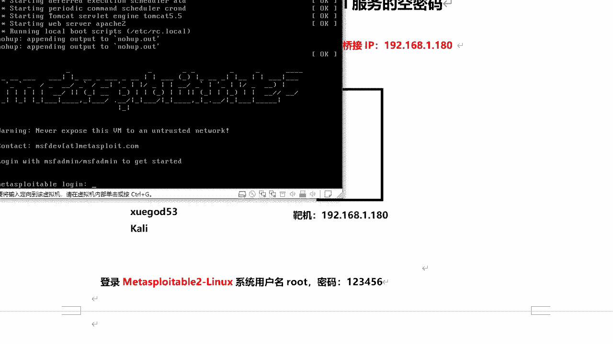

---


## 环境准备与目标确认 🖥️

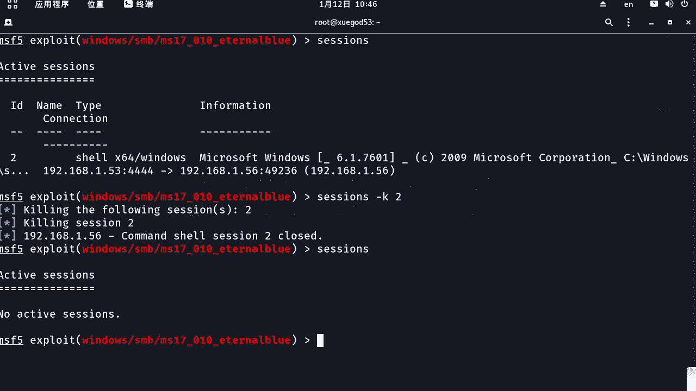

首先，我们需要启动一台预配置好的Metasploitable 2 Linux靶机。在本例中，靶机的网络模式为桥接，IP地址为`192.168.1.180`。攻击机为Kali Linux，IP地址为`192.168.1.53`。

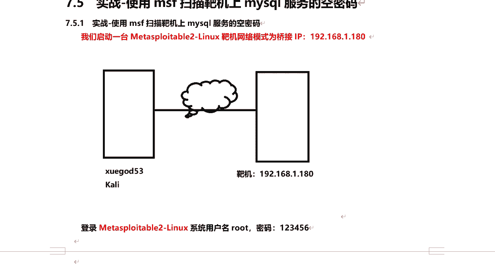

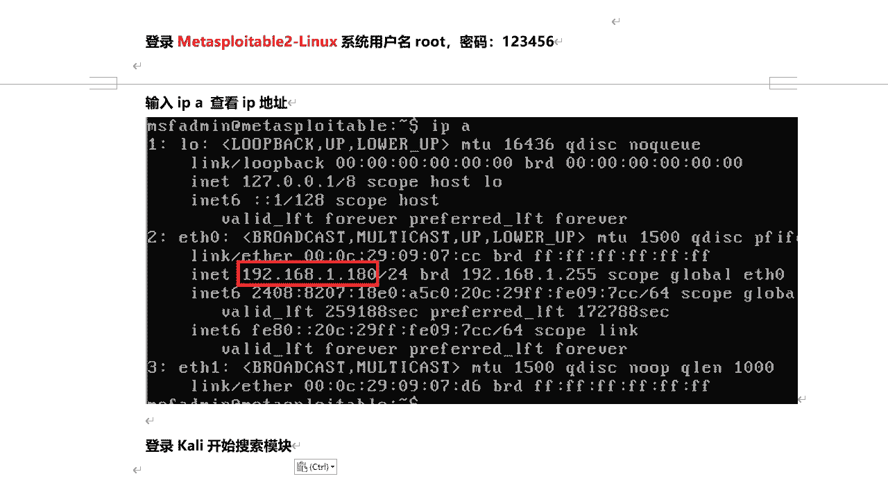

以下是网络拓扑示意图：


在真实的渗透测试中，我们通常无法直接登录目标主机。因此，需要通过信息收集技术（如扫描）来发现目标。为了演示，我们暂时登录靶机以确认其IP地址。


登录靶机使用的账号密码为`root/123456`。执行命令`ip a`可以查看其IP地址，确认为`192.168.1.180`。


确认无误后，我们回到Kali攻击机开始操作。


---

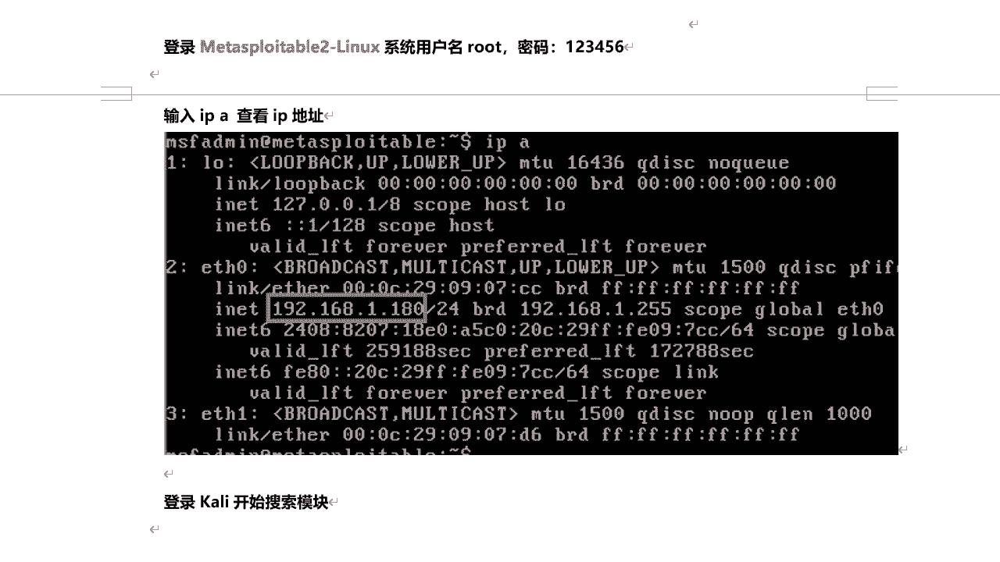

## 搜索并加载扫描模块 🔍

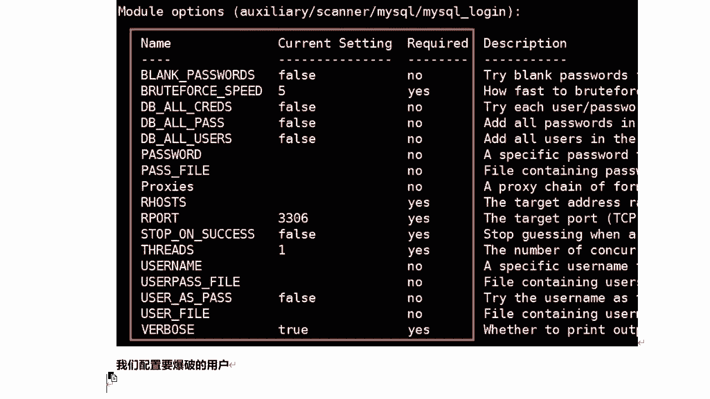

接下来，我们需要在Metasploit中搜索用于扫描MySQL空密码的模块。正常的MySQL服务应设置密码，空密码是一种不安全配置，本练习旨在检测此类风险。

在msfconsole中，我们可以搜索与MySQL登录（`login`）相关的模块。
```bash
search mysql_login
```
搜索结果会显示一个辅助（auxiliary）模块，其作用是进行信息收集和扫描。

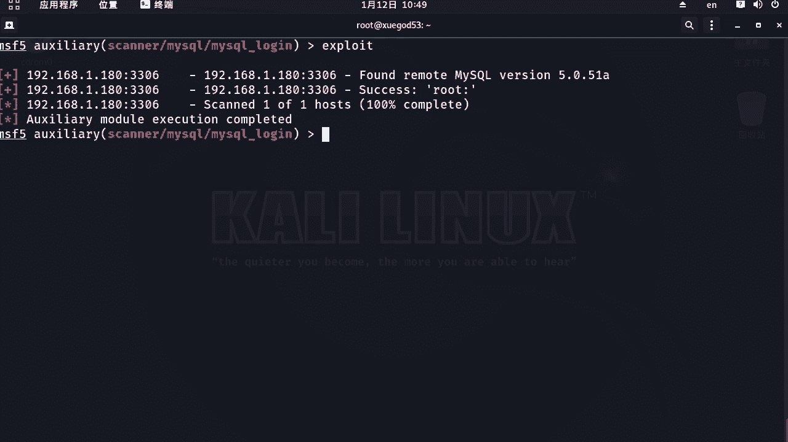


我们使用`use`命令加载该模块。
```bash
use auxiliary/scanner/mysql/mysql_login
```


---

## 配置模块参数 ⚙️


加载模块后，我们需要查看并设置相关参数。使用`show options`命令可以查看所有可配置项。

以下是需要设置的核心参数：

1.  **启用空密码检测**：默认参数`BLANK_PASSWORDS`为`false`，即不检测空密码。我们需要将其设置为`true`。
    ```bash
    set BLANK_PASSWORDS true
    ```

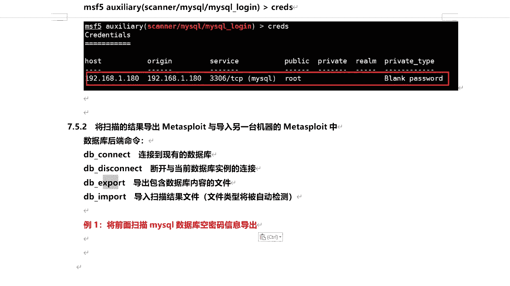

2.  **设置目标主机**：参数`RHOSTS`用于指定目标主机的IP地址。
    ```bash
    set RHOSTS 192.168.1.180
    ```
    *请注意，您应根据自己靶机的实际IP地址进行设置。*

3.  **指定检测的用户名**：为了有针对性地检测`root`账号的空密码，我们需要设置`USERNAME`参数。
    ```bash
    set USERNAME root
    ```

参数配置完成后，即可运行模块。

---

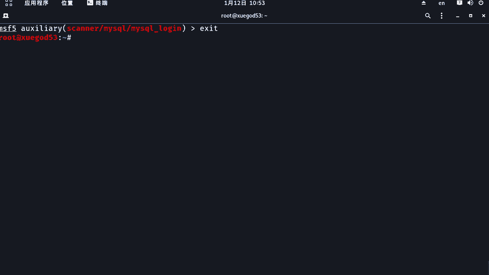

## 执行扫描与分析结果 📊

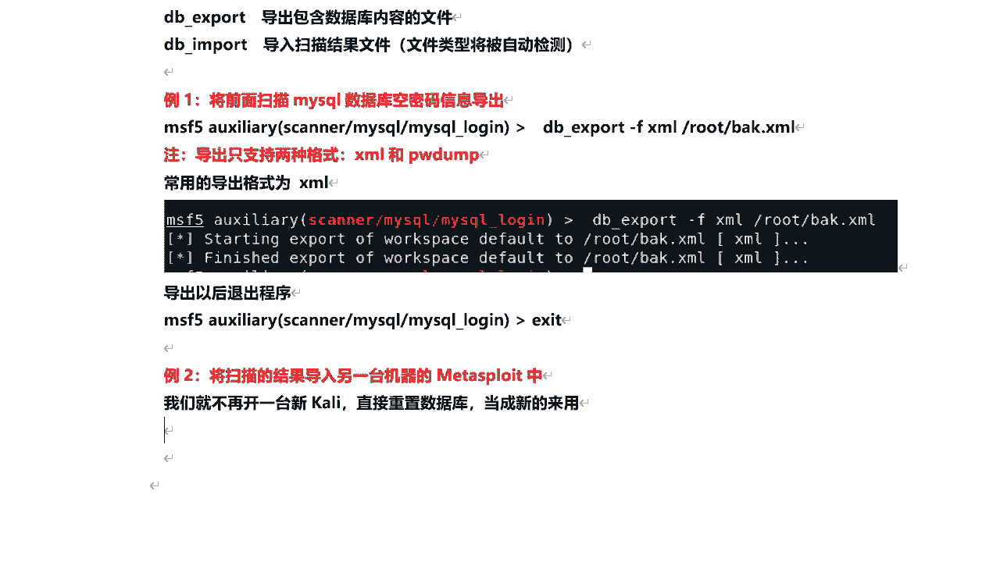

使用`run`或`exploit`命令执行扫描。
```bash
run
```
扫描结果会很快显示。如果目标存在空密码，结果中会出现`+`号标识的成功信息。

例如，结果可能显示：
```
[+] 192.168.1.180:3306 - Found remote MySQL version X.X
[+] 192.168.1.180:3306 - Success: 'root:'
```
其中`Success: 'root:'`表示成功检测到`root`用户的密码为空。


扫描到的凭证（用户名和密码）会自动保存到Metasploit的后端数据库（PostgreSQL）中。我们可以使用`creds`命令列出所有已保存的凭证。
```bash
creds
```
该命令会列出所有主机的凭证信息，包括服务类型、端口、IP地址和发现的账号密码。


---

## 数据库操作：导出与导入扫描结果 💾

在渗透测试中，我们经常需要将扫描结果从一台Metasploit主机导出，并导入到另一台主机中。这涉及到数据库的后端命令操作。

以下是几个常用的数据库命令：
*   `db_connect`: 连接到现有数据库。
*   `db_disconnect`: 断开与当前数据库的连接。
*   `db_export`: 导出包含数据库内容的文件。
*   `db_import`: 导入扫描结果文件。


### 导出扫描结果

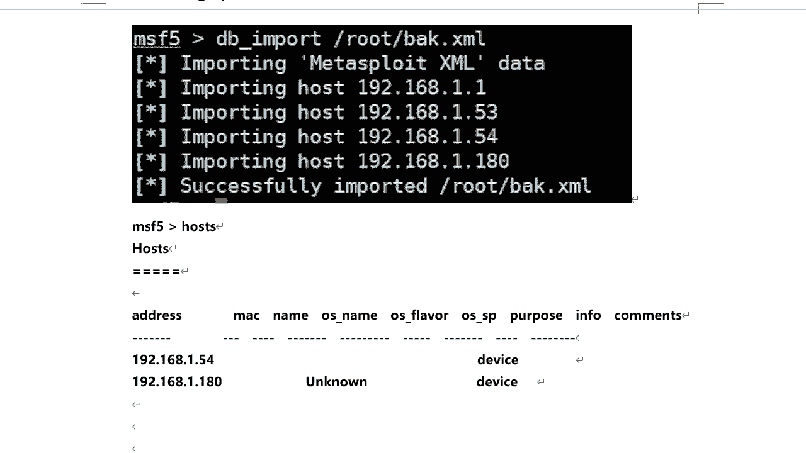

我们可以将扫描结果导出为XML格式，这是一种通用的报告格式。
```bash
db_export -f xml /root/backup.xml
```
此命令将数据库内容导出到`/root/backup.xml`文件中。


### 导入扫描结果

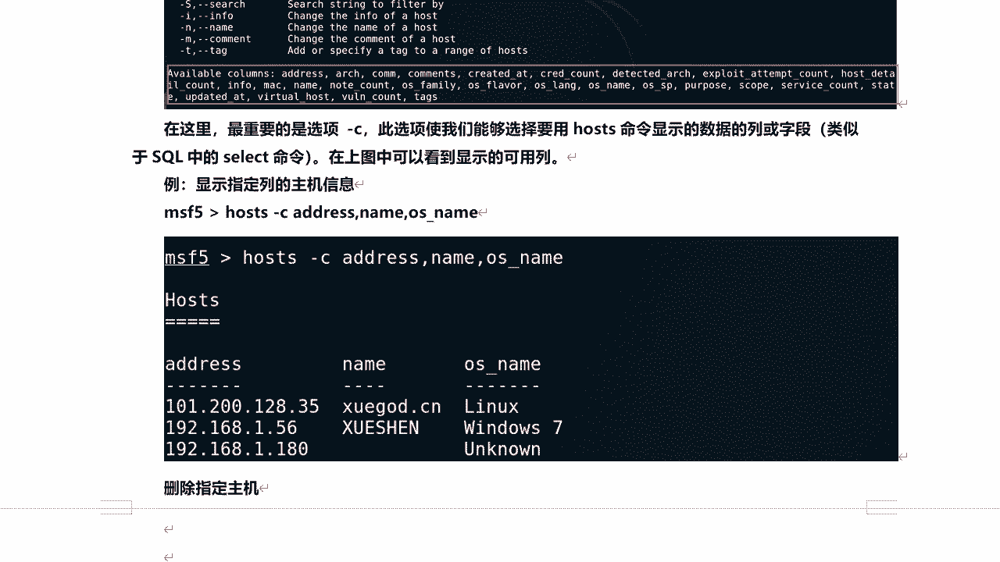

为了演示导入功能，我们可以先重置Metasploit的数据库（清空现有数据），然后再导入刚才备份的文件。
1.  重置数据库：
    ```bash
    msfdb reinit
    ```
    *注意：此操作会清空所有现有数据，请谨慎使用。*
2.  重新进入`msfconsole`。
3.  使用`hosts`命令查看，确认数据库为空。
4.  导入之前导出的备份文件：
    ```bash
    db_import /root/backup.xml
    ```
5.  再次使用`hosts`命令，可以看到之前扫描的主机记录已成功导入。

---


## 管理扫描结果：hosts与services命令 🗃️

当扫描了大量主机后，我们需要有效地查看和管理这些结果。`hosts`和`services`是两个核心命令。


### hosts 命令

`hosts`命令用于列出所有扫描到的主机信息。它支持多种参数进行过滤和自定义显示。


以下是`hosts`命令的一些用法示例：
*   **查看帮助**：`hosts -h`
*   **自定义显示列**：使用`-c`参数指定要显示的字段。
    ```bash
    hosts -c address,os_name,vuln_count
    ```
*   **搜索主机**：使用`-S`参数进行模糊搜索。
    ```bash
    hosts -S 192.168
    ```
*   **删除指定主机**：使用`-d`参数后跟IP地址。
    ```bash
    hosts -d 192.168.1.180
    ```

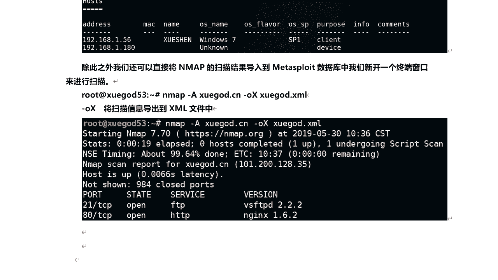

### services 命令


`services`命令用于查看所有主机上开放的服务、端口及版本等详细信息。

以下是`services`命令的一些用法示例：
*   **查看所有服务**：`services`
*   **查看指定主机的服务**：使用`-R`参数后跟IP地址。
    ```bash
    services -R 192.168.1.180
    ```
*   **搜索特定服务**：使用`-S`参数进行搜索，可匹配端口号或服务名。
    ```bash
    services -S 3306
    services -S mysql
    services -S open
    ```

---

## 导入其他工具的扫描结果 🔄

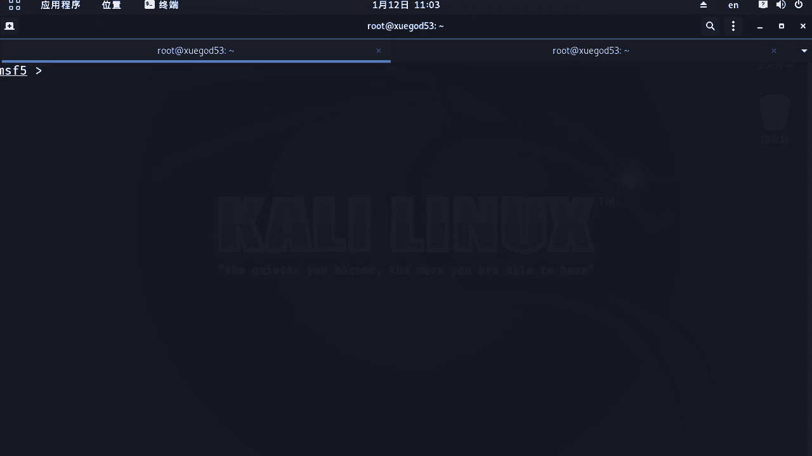

除了Metasploit自身的扫描结果，我们还可以将其他工具（如Nmap）的扫描结果导入到Metasploit数据库中。

例如，使用Nmap进行扫描并输出XML格式的结果：
```bash
nmap -A -oX /root/scan_result.xml xuegod.cn
```
在msfconsole中，使用`db_import`命令导入该XML文件：
```bash
db_import /root/scan_result.xml
```
导入后，即可使用`hosts`和`services`命令查看和管理这些来自Nmap的扫描结果。

---

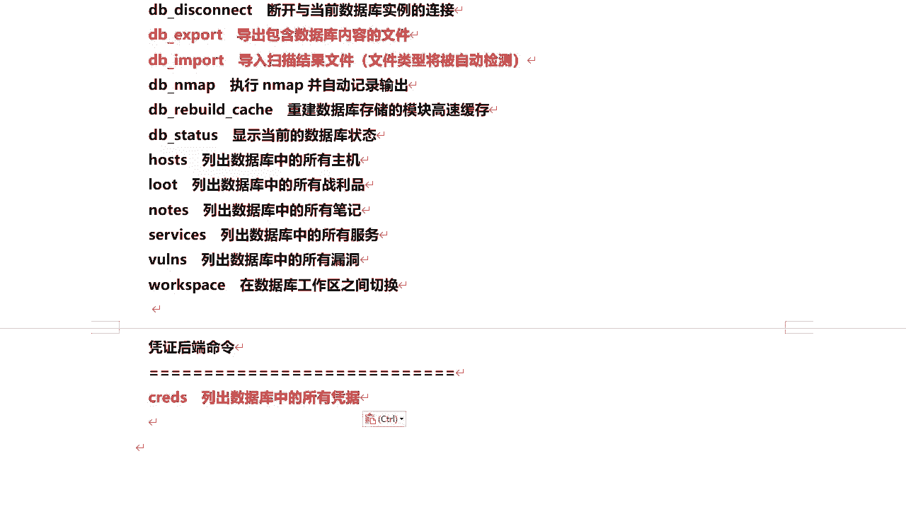


## 常用命令总结与课程回顾 📝

本节课我们主要学习了以下内容：

1.  **Metasploit框架基础**：回顾了其架构、目录结构及基本使用方法。
2.  **实战扫描MySQL空密码**：从搜索模块、配置参数到执行扫描和分析结果，完成了完整的检测流程。
3.  **数据库管理**：学习了如何导出和导入扫描结果，以便在不同环境间迁移数据。
4.  **结果查看与管理**：掌握了使用`hosts`和`services`命令及其高级参数来有效查看、搜索和管理大量扫描结果。
5.  **集成外部工具**：了解了如何将Nmap等外部工具的扫描结果导入Metasploit，实现信息的集中管理。

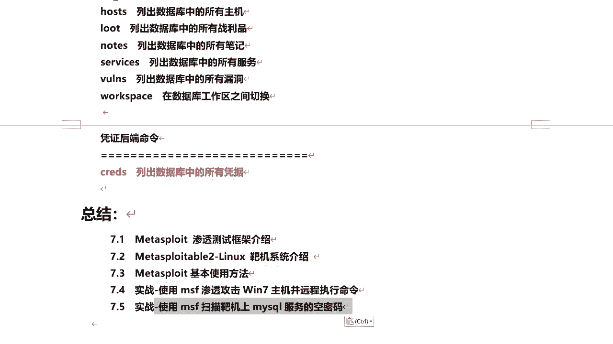

通过本课的学习，你应该能够熟练使用Metasploit进行特定漏洞的扫描，并有效地管理渗透测试过程中收集到的海量信息。多加练习这些命令，它们对于提高渗透测试效率至关重要。