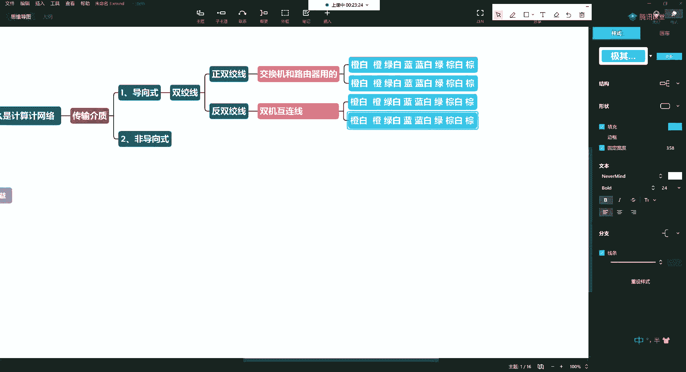
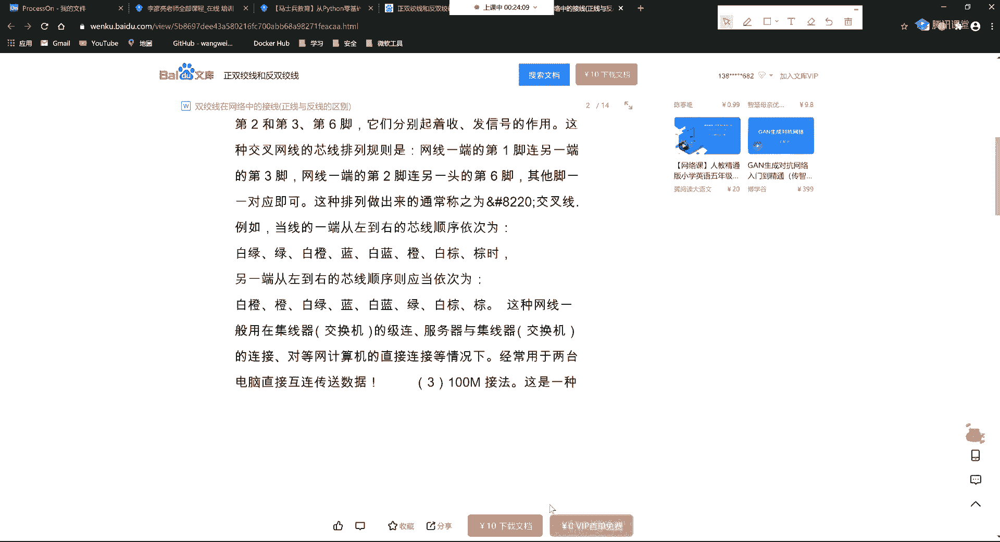
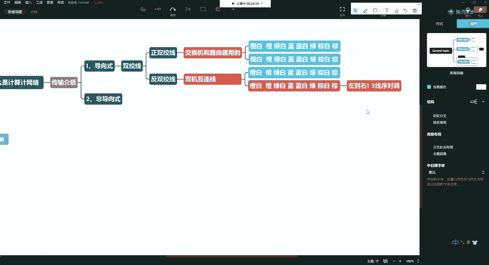
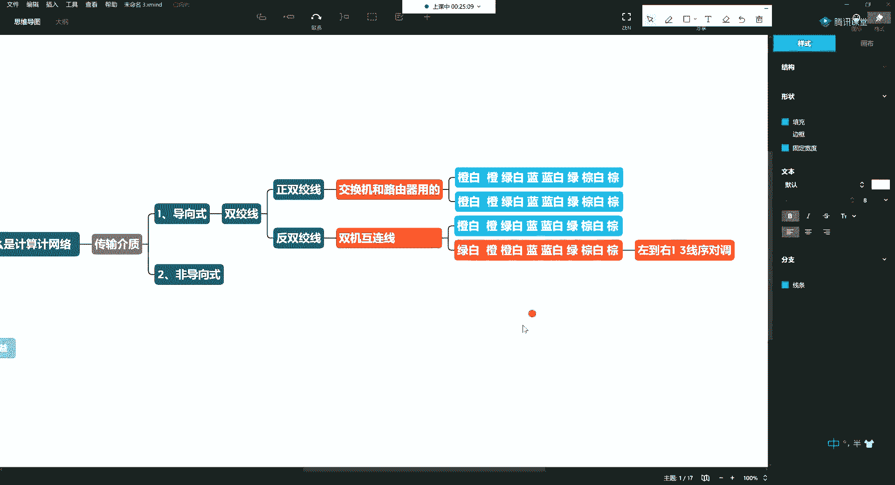
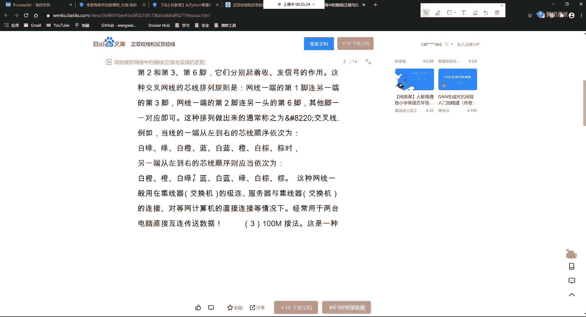
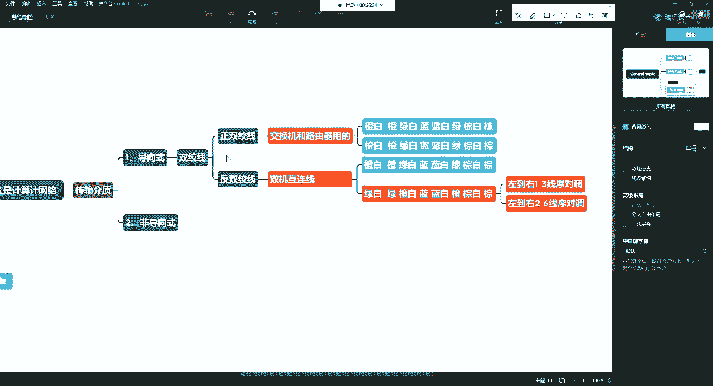
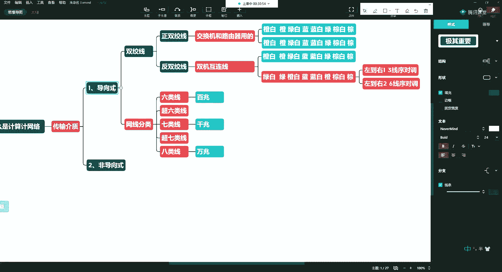
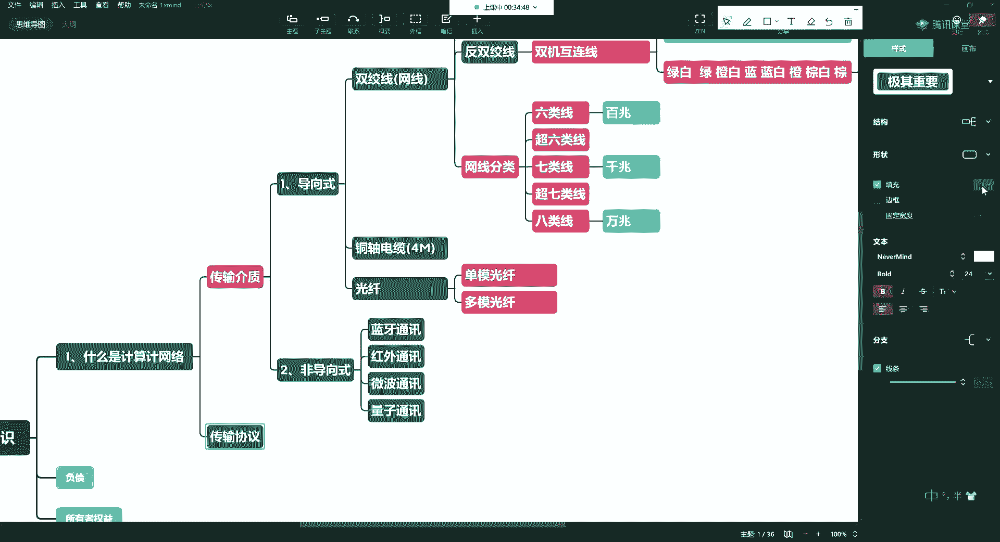
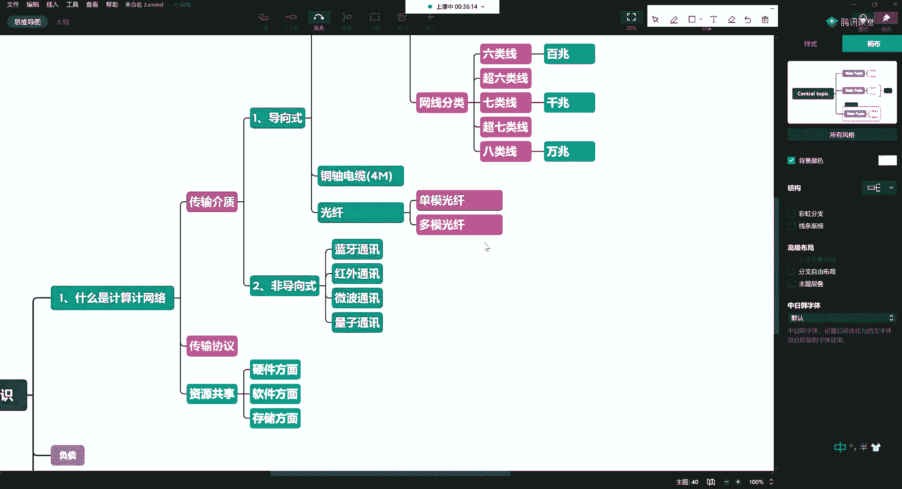
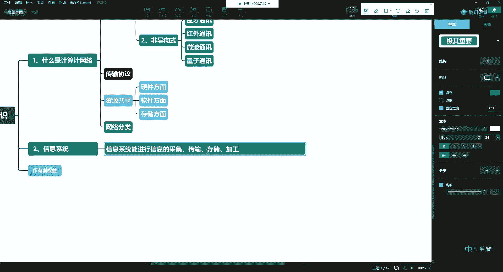

# P7：3.1-网络安全基础-计算机基础（上） - 一个小小小白帽 - BV1Sy4y1D7qv

不讲了，那么在这次五讲中呢，主要还是给大家介绍一些，我们在学习安全课程中的一些准备工作，介绍了我们网络安全法是吧，介绍了黑色的守则，介绍了常见的网络网站的这种攻击方式，以及我们常见的这些安全人员。

需要掌握的一些基本的命令，好，那这一讲呢，我们把一些我们课程中常出现的一些名词，我们做一个解释啊，那么以免呢将来呢我们出现这个我说胯骨轴子，你说玻璃球子这种情况啊，是不是好了。

那么这里头呢有一些内容需要普及的啊，什么是计算机网络，在前几讲中呢给大家介绍过了，什么是网络，网络呢，其实呢就是通过传输介质啊，把分布在世界各地的计算机系统对吧，连接起来。

那么实现一个资源共享和信息传递的啊，这样的一个目的，那么常见的网络呢有比如说广域网，局域网是吧，哎还有城域网等等等等，那么这里头呢有几个概念啊，在这儿呢我们给大家说说，首先第一个呢你要知道传输介质啊。

常见的传输介质，那么传输介质呢之前我说过两种啊，一种呢是导向式的，一种呢是非导向式的，啊导向式的呢我们常见的那就是网线，网线这个东西呢也叫什么呢，也叫做双绞线，啊双绞线。

那么这个双绞线呢又分为两种不同的，方式啊叫有重双脚线，还有反双绞线，所谓正反呢就是在你的线序中会出现问题啊，线序中出现问题，那线序中会有啥问题呢，那么说正双绞线，它一般呢是连我们的交换机和路由器用的。

啊所以正双绞线呢一定要掌握，那么是一个网络工程师必备的一个技能啊，那正常角线的线序是什么呢，橙白橙，绿白蓝，蓝白绿，棕白棕，八根线，那么这八根线这个线序就是正双掉线啊，那还有呢一个叫做反双绞线。

反双绞线呢一般的现在的这些新手啊，这些小朋友就基本上都见不到了啊，那么在一些老鸟呢，他们还见过啊，它也叫做双机互联线，之前呢，你这个在没有移动硬盘或移动硬盘呢，还比较贵的情况下，就会用双机互连接好。

所谓双击互联线呢是什么呢，就是它一头和另外一头二者会有所区别，好有所区别，那么一头是这样的，另外一个头呢会出现一些线序的对调。

我给你搜一下啊，让你看一下，好这个诶哪去了啊，好这边就是一个正弦是吧，正弦啊就成白橙绿白蓝蓝白绿棕白棕，这是一种常见的解法啊，那么反双绞线呢就是一三啊。

你在这线序的时候，这里的一三，从左到右一三线序对调，嘟嘟，啊啥意思呀，哎比如说你这个服务器里头没有外网啊，服务器没有外网，那么你甚至连交换机也没有啊，那这时候呢那你要想跟他通气，两台pc之间。

或者说一台pc和一台服务器之间进行通信，怎么办对吧，唉你可以抱着电脑过去啊。

把这一三对调，那这就变成绿白，那这就变成橙啊，这是一三对调的。

那么再看看这二谁二和谁呀啊，这个绿和蓝，对吧，你看这是二啊，23456。

那就是二六对调啊，1326对调就可以了，好八根线啊，266呢，那这就变成了绿，把绿呢就变成了橙啊，这也叫反双绞线，也叫做双击互联线，那现在的很多做运维甚至做网络工程师的啊，就见这东西。

就见到这东西都觉得少了，嗯有很多袍子呢，他们这个线序啊，就是听不明白，现在大学也也胡扯啊，老是弄个什么白橙橙白绿蓝啊，白蓝绿白棕棕什么玩意儿对吧，这个语言的话它是门艺术啊。

就是你一定要读完了以后是很顺口的，就是你说完就能记住啊，橙白橙绿白蓝蓝白绿棕白棕啊，然后呢反双脚呢就是一三啊，这根和这个对角二六哈，好吧，这就是正反双绞线，那么在网线的这玩意儿里头。

如果说啊如果说展开讲，网线里头还分为很多类啊，很多类对吧，那么高级一点的，比如说你做一些好的工程啊，或家里头用一些七类线啊，比如再贵一点的会用一些屏蔽线对吧，哎会有屏蔽线和非屏蔽线。

对于信号这种屏蔽防窃听啊，防干扰啊等等啊，那么那就是网线分类了，不要小看这个东西啊，这东西你做好了呢，对于你是有帮助的，比如说你去一个机房，你进去了，你看这有一屯网线是吧，哎你随便拿两根儿啊。

你要认识的话，你随便拿两根儿啊，这两根网线值好几百对吧，你要不认识呢，有同学拿一堆其他玩意，那些玩意有啥用啊，对不对，好我们现在常见的啊，大家在装修，比如说你在家里的布线的时候，最起码的你要到六类线。

六类型，还有呢叫超六类线，七类线，超期类型嗯嗯，扒了一些，那么分别对应的网速呢，就是你六类以上的，一般到超六的啊，这样的话呢他们一般都能跑满百兆啊，就是你带宽你家里用千兆的光猫，你用网线不行。

那一样速度上不去啊，所以说呢我们很多装修的时候呢，他为了这个省县啊，他一般都是不一个网线，然后呢拿成百，拿这个棕白和棕这两个人当弱电的，比如说电话的啊，所以呢你六类以上的线才能跑过百兆。

也就是这样的网速才能跑到百兆，啊百兆传输速率，那如果线没选对，那你也白搭啊，你那网快不了，这是第一个，那么到七类线的时候呢才能达到千兆，所以你家的话呢，如果你用的这个光猫是千兆的光猫是吧。

唉你线和交换机都要达到千兆的，包括你的wifi，有人说为什么我wifi访问我千兆路由，感觉有这么慢呀对吧，那就是你那个路由啊，交换机啊啊和你的wifi呀都达到了千兆，比如说现在呢啊wifi 6是吧啊。

然后到八类的时候呢能达到万兆啊，所以这个线不一样好吧，那么还会有一些呢带屏蔽的屏蔽的线呢也很贵，一根线大概也就12米能卖到二三百块钱啊，这样的样子腺体本身比较粗，在水晶头的时候呢。

你会发现这个水晶头两边啊会有这种屏蔽的线，包括这个线材里边儿也会有这种屏蔽的哈，所以呢这个线材不一样，那么几类线，几类线是网线的一种划分方式啊，这里头跟你的线的粗细和线的材质有关系。

比如说你买的网线越便宜，它里头用的是铁线啊，说着网线一折就不回过来了，唉有的人认为这种网线好，不是这种网线一般都比较便宜啊，是铁线啊，用起来电阻比较大，信号衰减也比较多，所以说呢你要装修啊，布线啊。

最好不要用这个啊，什么好一点的，就是这种纯铜的无氧铜的啊，相对来说好一点，所以说你要能够去机房里头那里的线，至少都是七类线啊，都是千兆的啊，所以一根线就很贵，那么这种是导向式的，那么除了双绞线以外呢。

还有什么呢啊。

双绞线就是我们大家说的网线啊，那何为双脚啊，所谓双绞线，双绞线就是两股拧在一起，你把他那线线皮剥开了，用剥线钳剥开了以后，它是两股两股拧在一起的，比如说为什么叫成白城呢，就是这两根线是一组。

他俩是拧在一起的啊，好除了网线以外，还有这种同轴电缆，那么这时候呢是我们一些比较老旧的小区啊，说你家里头的小区比较老，啥意思呀，说没通光纤呢，像这种同轴的这种电缆啊，最快的承载速率呢。

大概你的宽带呢能跑到四兆四兆最高了，后来经过光改，很多老小区呢都经过刚光改，光改完了以后啊，就会有更高的啊，这一般都是老旧的会比较多啊，这四张，那除了这几个玩意儿呢，还有一个呢就是光纤啊。

光纤呢它又分为很多种啊，那么我们常见的有黑皮的这种单模光线，啊还有这种多模的光线，比如说你们家中国联通，中国电信啊是吧，哎中国移动了啊，你用他们的光宽带是不是哎，那么一般的我们进家里的这种宽带。

就是这种单模的光线啊，两边两根是钢丝，然后中间有一根线啊，中间只有一根线是光纤啊，那么这样的话呢，一般的一根光纤呢能达到千兆啊，是没问题的，当然了，你得配的这个千兆的光纤猫啊。

多模光纤呢就是在这里头会有多根啊，多组线让你去用，所以我们经常你看这楼房外的啊，一般城市里头呢都是通过这种电信，通信井过来的，那一般呢有时候在农村呢就是一根黑线，在天上飘着啊，在天上飘着。

那你拿钱的倍儿计较，他家就没网了啊，好了等吧啊，这里头常见的有这些种，好吧，那非导向式的呢，那么导向式的呢一般都是看得见摸不着的，所谓非导向式的是什么，非导向认识的是，比如说我们经常听到的这种蓝牙通讯。

对吧，红外，微波，量子通讯啊等，就是这些看不见摸不着的，包括我们所说的这种wifi式的啊等等等等，这些啊就是无线网等，这些就是传输介质，那么这是网络中的第一个概念啊。

叫传输介质好吧，第二个呢我们要明白的就是传输协议，啊网络中呢会见到很多的传输协议啊，那么通过协议来进行内容的一些约定啊。

那么这一块的传输协议呢，我们在这儿呢嗯简单优的了解，等专门讲网络的时候再给你去说好吧，哎然后达到一个什么样的目的的资源共享啊，这个所谓的资源共享呢，在这里呢也给大家提一嘴。

这里的资源共享不是说就共享一下种子，共享一下片儿就得了啊，这里头这个资源共享的这个范畴就比较大啊，可以是硬件的，硬件方面的还可以是什么呢，还可以是软件方面，啊然后还可以使我们一些存储等，是不是啊。

好比如说我们现在呢这个云计算，实际上就是资源共享这样一块啊，那么它实际上呢是提供了一个资源池，把我们的计算机这个cpu的算力对吧，你的内存，你的硬盘，你的网络等这些东西啊，都可以资源共享给你对吧。

只不过你是按需按量的一个付费方式等等啊，这就是简单的说了一下计算机网络啊。

那么计算机网络的类型里头还会有很多啊，按照它的作用面积对吧，唉它的覆盖的面积我们可以分，还可以按照它的拓扑图来分是吧，好这个呢有所了解就行了，这是第一个简单的给大家说说计算机网络。

那么网络这一块儿呢先入个门啊，第二个概念呢要给大家强调的就是信息系统，啊后边我还会再给大家单独的讲网络啊，所以这块的话呢你先捞点露水哈，到专门讲网络的时候仔细的去听，那么什么是信息系统。

啊所谓的信息系统啊，好所谓的信息系统呢就是能够进行，信息的采集，能够进行信息的采集，信息的传输，信息的存储，还可以对信息进行加工。

