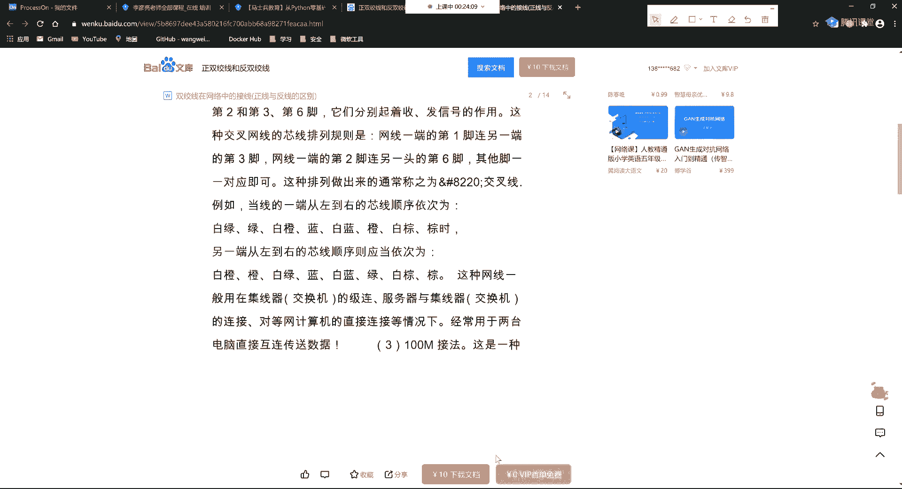
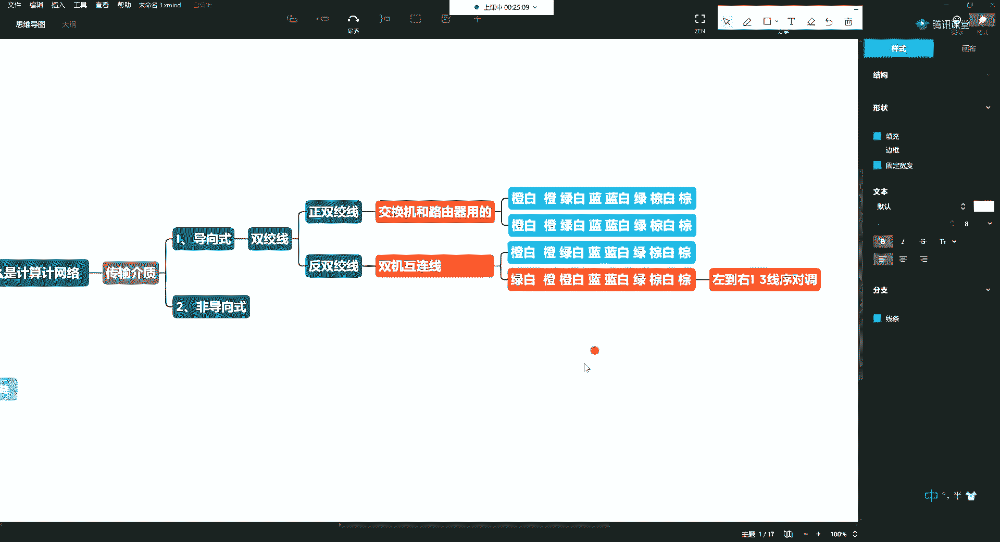
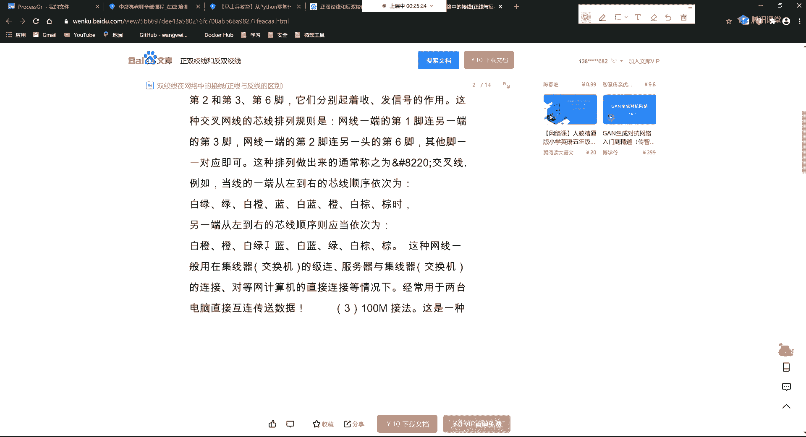
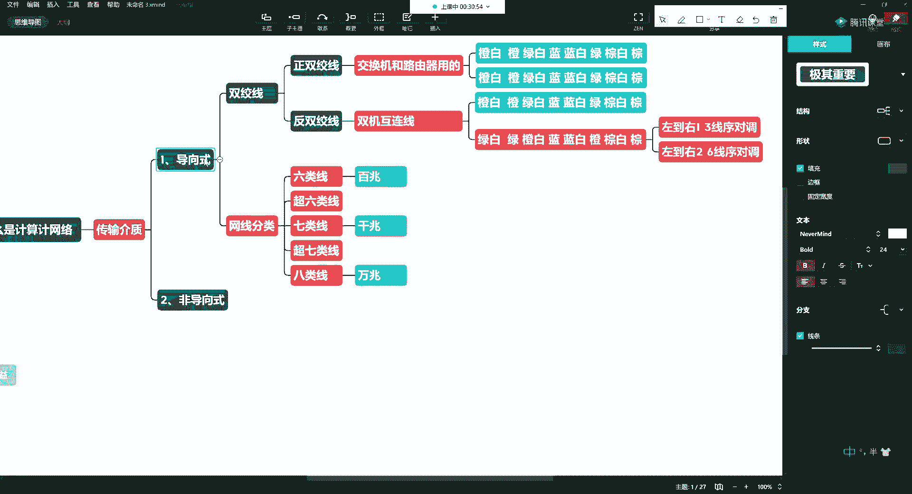
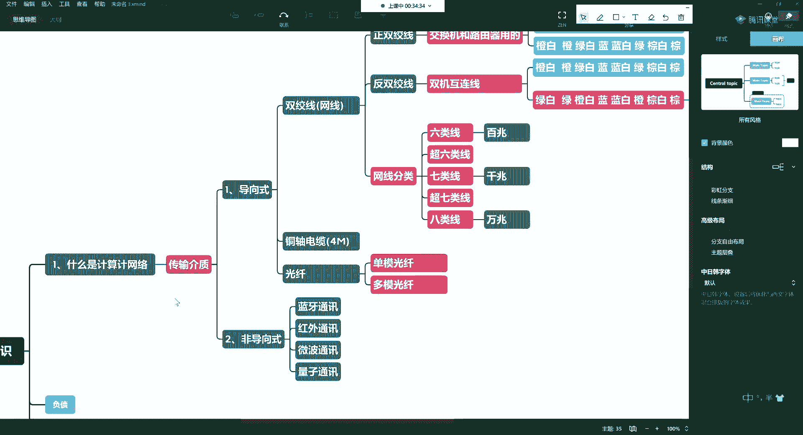
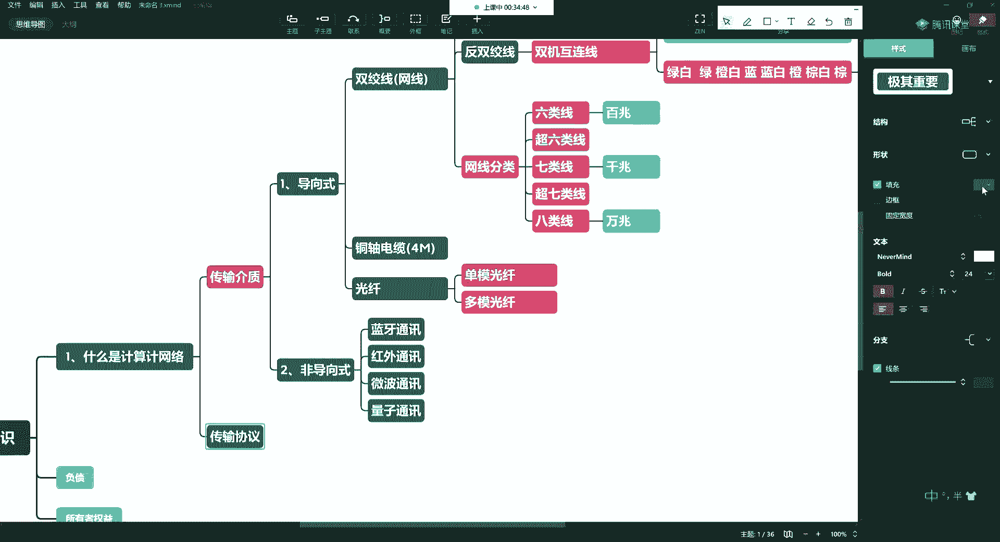
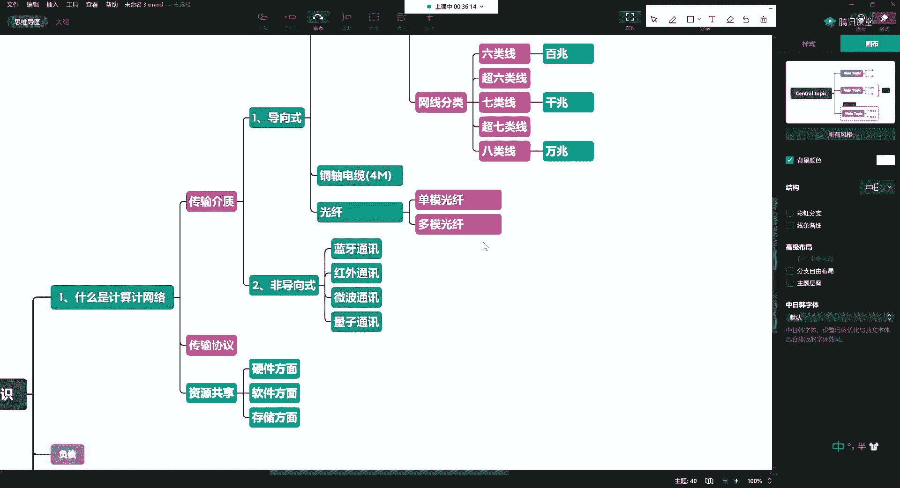
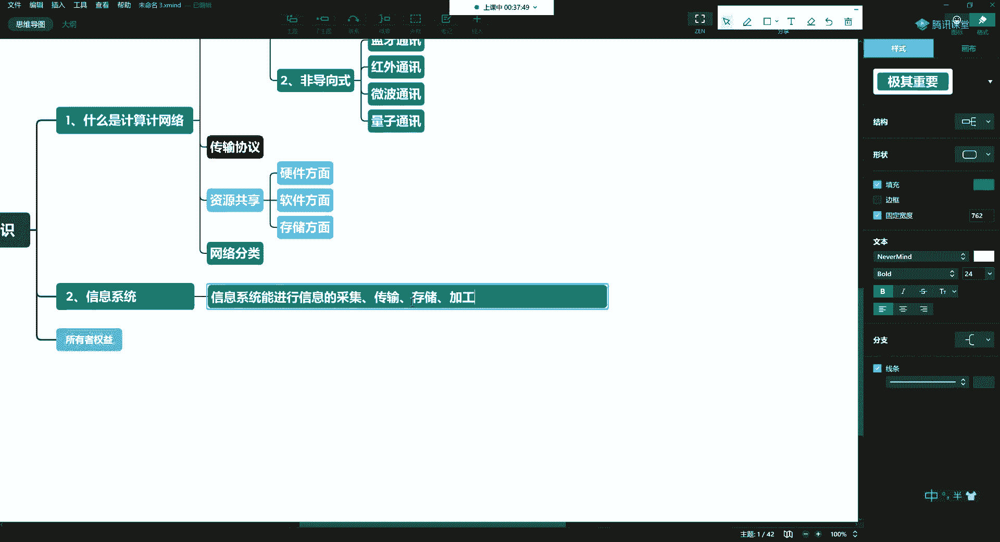

# 课程P7：3.1-网络安全基础-计算机基础（上） 🖥️

在本节课中，我们将学习网络安全学习前必须掌握的一些计算机基础概念。我们将解释课程中常出现的名词，以避免理解上的偏差。主要内容包括计算机网络的基本构成和信息系统的定义。

---

## 计算机网络基础

上一节我们介绍了网络安全学习的准备工作。本节中，我们来看看计算机网络的基础概念。

计算机网络是通过传输介质，将分布在世界各地的计算机系统连接起来，以实现资源共享和信息传递的系统。常见的网络类型包括广域网、局域网和城域网等。

### 传输介质

传输介质是网络连接的物理载体。以下是常见的传输介质类型。

#### 导向式传输介质

导向式传输介质指有形的、信号沿固定路径传播的介质。

**双绞线（网线）**
双绞线是最常见的网线，由多对双绞的铜线组成。它主要分为正双绞线和反双绞线。

*   **正双绞线**：用于连接交换机、路由器等网络设备。其标准线序（T568B）是网络工程师的必备技能。
    *   **线序公式**：`橙白、橙、绿白、蓝、蓝白、绿、棕白、棕`
*   **反双绞线（双机互联线）**：用于直接连接两台计算机，无需通过交换机。其制作方法是将一端的线序进行调整。
    *   **线序调整规则**：将一端线序的 **第1根** 与 **第3根** 对调，**第2根** 与 **第6根** 对调。

**网线分类与性能**
网线按性能分为不同类别，直接影响网络速度。

*   **六类线/超六类线**：可支持百兆及以上网络速度。
*   **七类线**：可支持千兆网络速度。
*   **八类线**：可支持万兆网络速度。

选择网线时，应注意线材质量（如无氧铜优于铁线）以及是否带屏蔽层（用于防干扰和窃听）。

**同轴电缆**
这是一种较老的传输介质，多见于未进行光纤改造的老旧小区，最高承载速率通常仅为4兆左右。

**光纤**
光纤利用光信号传输数据，速度极快。主要分为两种：

*   **单模光纤**：中心只有一根纤芯，传输距离远，常用于家庭宽带入户。
*   **多模光纤**：中心有多根纤芯，传输距离相对较短，成本较低。

#### 非导向式传输介质

非导向式传输介质指无线传输介质，信号在自由空间中传播。

常见的非导向式介质包括：**蓝牙**、**红外**、**微波**、**Wi-Fi** 以及 **量子通信** 等。

### 传输协议与资源共享

网络中计算机之间的通信需要遵循共同的规则，这些规则就是传输协议（如TCP/IP）。协议约定了数据如何打包、寻址、传输和校验。

计算机网络的核心目的之一是 **资源共享**。这里的资源范畴很广：

*   **硬件共享**：如共享打印机、存储设备。
*   **软件共享**：如通过网络访问服务器上的应用程序。
*   **数据与存储共享**：如访问网络硬盘（NAS）、云存储。
*   **计算资源共享**：**云计算** 的本质就是提供一个可共享的CPU、内存、存储和网络资源池，用户按需付费使用。

---

## 信息系统

了解了网络的基础后，我们来看另一个核心概念：信息系统。

所谓信息系统，是指能够进行 **信息的采集、传输、存储和加工** 处理的系统。

简单来说，信息系统是处理“信息”这一核心要素的完整流程。从获取信息（采集），到发送信息（传输），到保存信息（存储），再到处理和分析信息（加工），构成了信息系统的基本功能。

---

## 课程总结

本节课中我们一起学习了网络安全入门所需的两个重要计算机基础概念。

首先，我们介绍了 **计算机网络**，了解了其定义、常见的传输介质（包括有线的双绞线、同轴电缆、光纤和无线的Wi-Fi等）以及网络的核心目的——资源共享。

其次，我们明确了 **信息系统** 的基本含义，即一个能够对信息进行采集、传输、存储和加工处理的完整体系。

理解这些基础概念，将为后续深入学习网络协议、系统架构和安全原理打下坚实的基础。