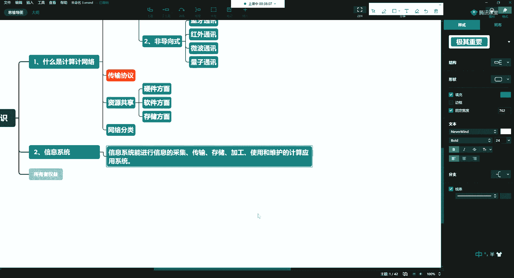
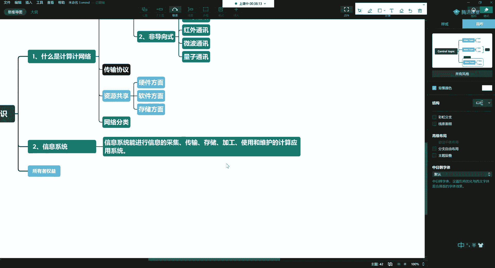
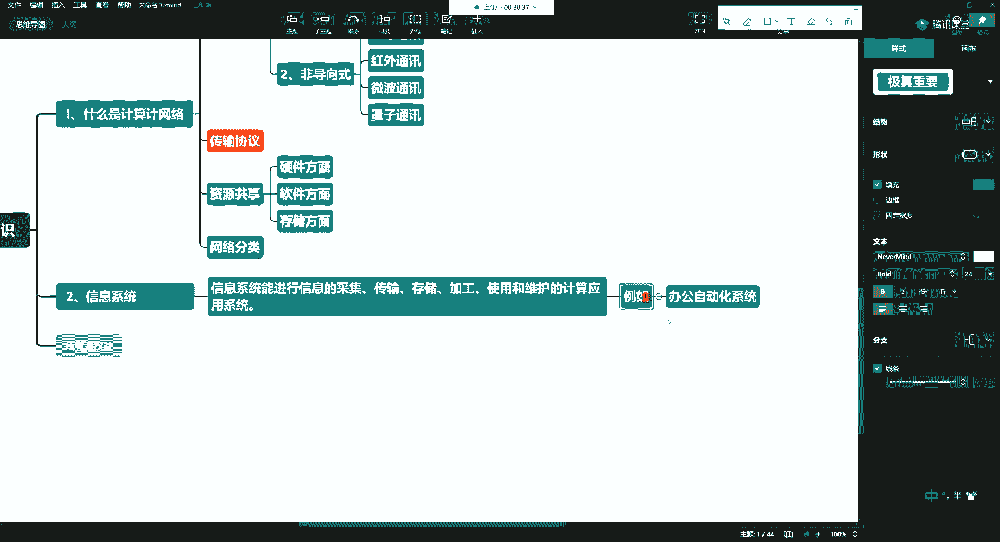
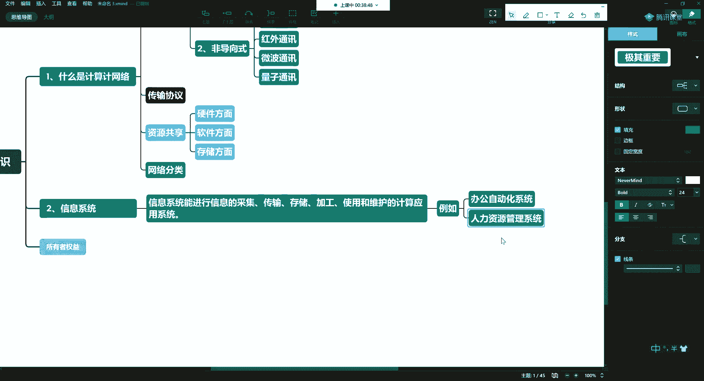
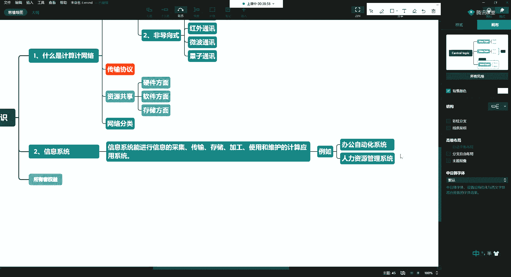
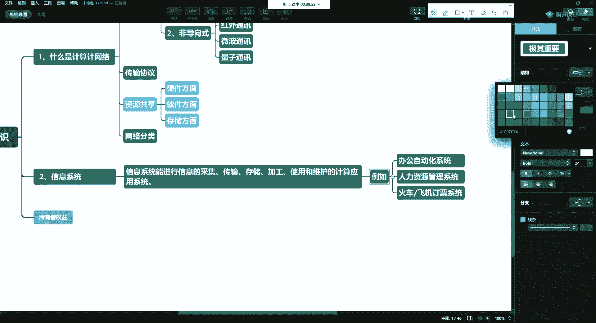
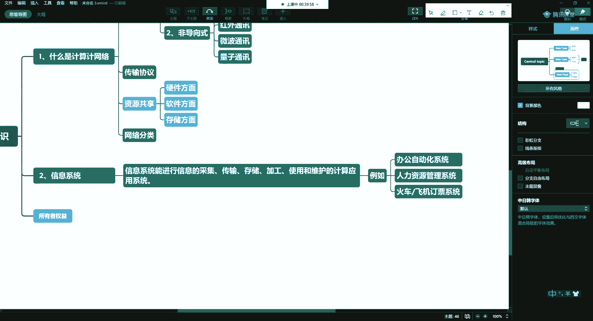

# 课程P8：3.2-网络安全基础-计算机基础（下） 🔐

在本节课中，我们将要学习计算机信息系统的基本概念，了解其定义、常见类型以及它们在我们日常生活中的应用。

## 什么是计算机信息系统？ 💻

上一节我们介绍了计算机系统的基本构成，本节中我们来看看什么是计算机信息系统。

一个能够被使用，并且能够进行维护的计算机应用系统，就称之为信息系统。

## 信息系统的常见类型 📊

理解了信息系统的定义后，我们来看看它在现实世界中的具体体现。以下是信息系统的一些常见例子：

*   办公自动化系统。
*   人力资源管理系统。

*   客户关系管理系统。
*   在线教育平台。
*   云计算平台。
*   各类手机应用程序，例如火车、飞机的订票系统。
*   超市的收银操作系统。
*   超市的库存盘点系统。

## 总结 📝

本节课中我们一起学习了计算机信息系统。我们明确了信息系统的定义，即**可被使用和维护的计算机应用系统**。同时，我们也列举了办公自动化、人力资源、在线教育、电子商务等多个领域的常见信息系统实例，认识到它们已深度融入我们的工作和生活。