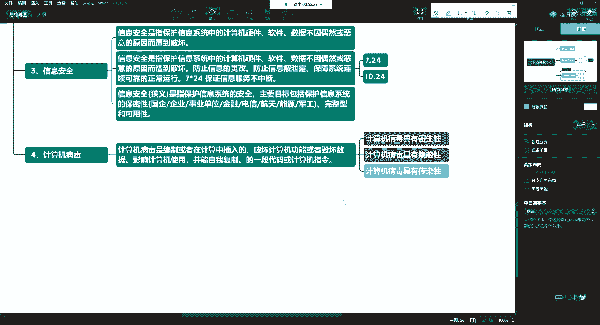
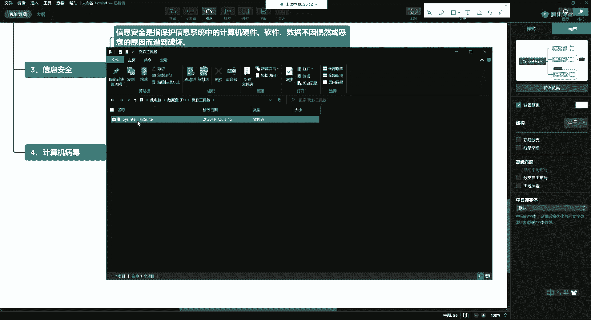
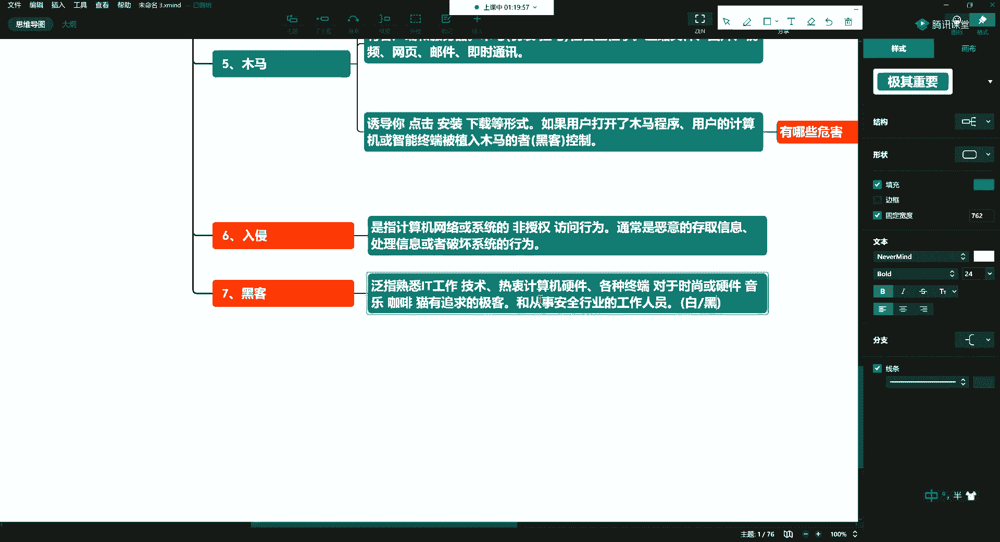

# 课程P9：4.1-网络安全基础-病毒、恶意程序、入侵（上） 🔐

在本节课中，我们将要学习网络安全的基础概念，包括信息安全、计算机病毒、木马以及入侵等核心内容。这些知识是理解网络安全攻防的基础。

## 信息安全概述 🛡️

上一节我们介绍了信息系统，本节中我们来看看如何保护它。信息安全是一个广泛的学科领域。

信息安全是指保护信息系统中的计算机硬件、软件及数据，使其不因偶然或恶意的原因而遭到破坏、更改或泄露。网络安全是一个持续对抗的过程，新的攻击手段出现后，相应的防御手段也会随之产生。

信息安全的目标主要包括以下三个方面：

以下是信息安全的主要目标：
*   **防止信息被更改**：例如，网站首页被恶意篡改。我们可以利用操作系统的特性（如监测文件MD5值的变化）编写监控脚本来进行告警。
*   **防止信息被泄露**：例如，敏感数据（如选举信息）被黑客盗取并公开。
*   **保障系统连续可靠地正常运行**：这通常意味着系统需要保持高可用性，例如实现 **`7x24`** 小时不间断服务，这主要由运维工程师负责。

从狭义上讲，信息安全主要指保护信息系统的**保密性**、**完整性**和**可用性**。金融、电信、能源（如国家电网）及军工等对数据保密性要求极高的行业，是信息安全人才的重要去向。

## 计算机病毒 🦠

了解了保护信息的目标后，我们来看看常见的威胁之一：计算机病毒。

计算机病毒是指编制或在计算机程序中插入的，用于破坏计算机功能、毁坏数据、影响计算机使用，并且能够自我复制的一组计算机指令或程序代码。

计算机病毒通常具有以下几个特点：

以下是计算机病毒的典型特点：
*   **寄生性**：病毒可以注入到其他正常程序中，随该程序的运行而激活。
*   **隐蔽性**：病毒不易被用户察觉，但可通过专业工具进行检测。
*   **传染性**：病毒能够自我复制，并感染其他文件或系统。

防御和查杀病毒并不局限于特定工具。除了Kali Linux等安全系统，微软也提供了官方的安全工具集（Sysinternals Suite），其中包含上百款实用工具，可用于维护和诊断Windows系统，例如管理启动项、分析进程等。

本质上，病毒就是一段实现了特殊功能的程序代码。技术本身是中性的，关键在于使用者将其用于何种目的。

## 特洛伊木马 🐎

另一种常见的恶意程序是木马，它的目的与病毒有所不同。

特洛伊木马（简称木马）是一种用来非法收集信息或远程控制另一台计算机的特定程序。

木马的目的在于像操纵木偶一样，悄无声息地收集目标计算机中的资料，或接受黑客指令进行远程控制。这类程序通常采用**C/S架构**（客户端/服务器架构）。攻击者会在目标计算机上植入客户端程序，并与攻击者控制的服务器端建立连接（通过 **`TCP/IP`** 协议），从而传输数据或指令。

木马程序常通过社会工程学手段进行伪装和传播。所谓社会工程学，就是研究并利用人的心理和行为习惯。

以下是木马常见的伪装和传播方式：
*   **伪装成程序包、压缩文件、图片或视频**：例如，以“最新电影”、“精美图片”为诱饵，诱使用户点击。
*   **通过网页、邮件或即时通讯软件传播**：例如，发送带有恶意附件的钓鱼邮件或即时消息。
*   **利用公共Wi-Fi**：在机场、火车站等场所提供免费但危险的Wi-Fi，诱导用户连接并下载恶意软件。

用户一旦打开或运行这些木马程序，计算机或智能终端（手机、平板）就会被植入木马，可能导致数据被窃取、篡改，或账户被盗用（例如，盗用QQ号向好友诈骗）。

在Windows系统下编写功能强大的木马，需要对Windows的 **`Win32 SDK`** 编程有深入的了解。

## 入侵行为 🚨

最后，我们来探讨一下什么是入侵行为。

入侵是指对计算机网络或系统进行的非授权访问行为。这通常是恶意的，目的是存取、处理信息或破坏系统。

入侵者并非为了“好玩”，其目的非常明确：

以下是入侵者的主要目的：
*   **存取与处理信息**：窃取账号密码等敏感信息，了解受害者习惯，甚至为长期控制而植入免杀木马。
*   **破坏系统**：直接破坏目标系统的正常运行。

防御入侵需要综合手段。仅依赖某些杀毒软件可能不足，因为恶意程序可能通过加壳、花指令等技术绕过检测（例如，简单的几行代码就可能绕过某些防护）。保持系统更新、使用可靠的安全软件并提高安全意识至关重要。

## 黑客与白帽 ⚖️

我们经常听到“黑客”一词，其内涵在国内已发生变化。

黑客最初泛指熟悉IT技术、热衷计算机与硬件的极客。现在，它多指从事安全行业的人员，其中既有利用技术进行非法活动的“黑帽黑客”，也有致力于发现并修复漏洞的“白帽黑客”。好与坏是相对的，许多白帽黑客白天在安全公司工作，晚上则可能以个人身份研究技术。

## 课程总结 📚

本节课中我们一起学习了网络安全的基础核心概念。
我们首先定义了信息安全及其三大目标（防篡改、防泄露、保可用）。
然后，我们剖析了两种主要威胁：具有**寄生性、隐蔽性、传染性**的**计算机病毒**，以及采用**C/S架构**、通过**社会工程学**传播的**特洛伊木马**。
接着，我们解释了恶意的**非授权入侵行为**及其目的。
最后，我们讨论了“黑客”一词含义的演变。理解这些基础概念，是进一步学习网络安全攻防技术的必经之路。