# 学不会我退出网安圈！中国红客技术正需要传人！全套666集还怕学不会？（网络安全／黑客技术） - P10：4.2-网络安全基础-病D、恶意程序、入侵（中） - 一个小小小白帽 - BV1Sy4y1D7qv

没有变成了一个到处去破坏啊，去窃取别人资料的这样的一个黑帽子啊，所以这个东西呢世事无绝对啊，世事无绝对，不要觉得啊他在安全的公司，他就是一个好人啊，有可能有一些病毒就是这孙子写的啊。

所以呢我们很多安全的公司啊。

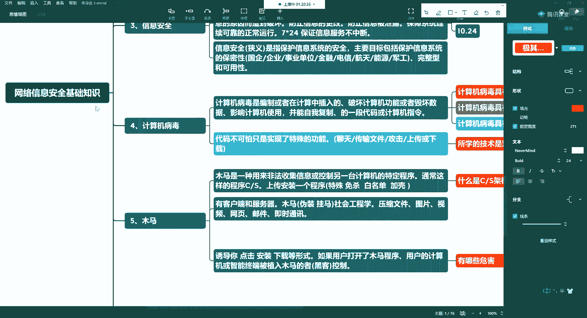

啊登木马其实就是他们俩写的啊。

他们写出来呢让你去买他们的杀毒软件，免杀工具啊，这些工具他们好收费啊，他们其实也挺坏的好，第八个呢就介绍什么是攻击啊，啥叫攻击啊，那怎么说我被攻击了呢，你上厕所让你打一拳是不是唉。

所以也就是说只利用网络，那我们这些个攻击你的，肯定都是看不见摸不着的呀，他打你一拳，你报警了，是不是逮着他了，对不对，所以呢他另外一端可能是大洋的彼岸，可能并不在中国，或者也可以。

就是你隔壁邻居都有可能，所以说呢他指的是利用计算机的网络啊，或者呢计算机系统中存在的漏洞，比如说我们所说的c v e r m s17 杠010，永恒之蓝漏洞，除了有永恒之蓝，还有永恒之黑啊。

等有时间的我们给大家去聊一聊对吧，哎利用漏洞还有安全缺陷，对其进行的破坏泄露更改，更改或攻击啊啊玩ddos是不是唉一道子呢，或使其，丧失，功能的行为，拒绝服务，好这就是我们指的攻击啊，攻击。

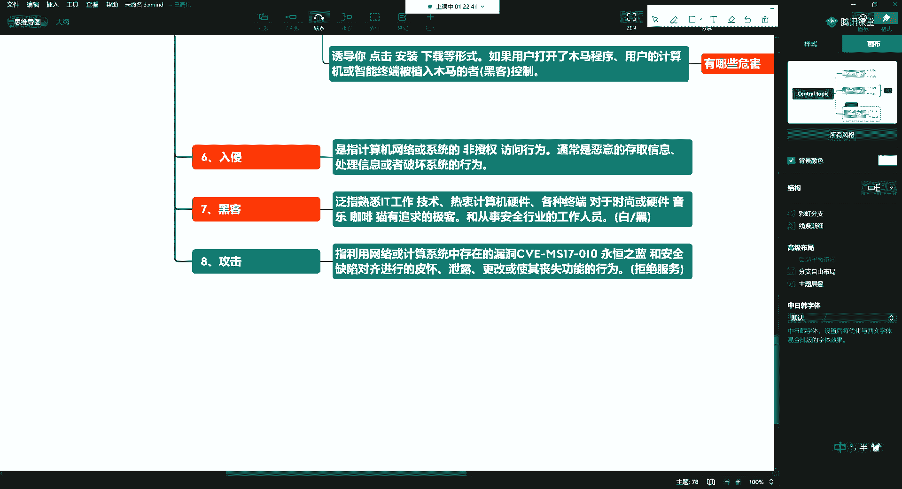

唉呀。

说得有点累呃，我们中场休息一会儿好吧，休息十分钟，21。20继续，♪ 除了你我不能感到一丝丝情意 ♪，♪ 如果有那么一天 ♪，♪ 你说即将要离去 ♪，♪ 我会迷失我自己 ♪。

♪ 从无边人海里不知暖阳 ♪，♪ 只要天天在一起 ♪，♪ 我不能只依靠片片回忆活下去 ♪，♪ 任时光匆匆流去 ♪，♪ 我只在乎你 ♪，♪ 心甘情愿感染你的气息 ♪，♪ 人生几何 ♪。

♪ 能够得到知己 ♪，♪ 失去生命的力量也不可惜 ♪，♪ 所以我求求你 ♪，♪ 别让我离开你 ♪，♪ 除了你 ♪，♪ 我不能感到一丝丝情意 ♪，♪ 任时光匆匆流去 ♪，♪ 我只在乎你 ♪。

♪ 心甘情愿感染你的气息 ♪，♪ 人生几何 ♪，♪ 能够得到知己 ♪，♪ 失去生命的力量也不可惜 ♪，♪ 所以我求求你 ♪，♪ 别让我离开你 ♪，♪ 除了你 ♪，♪ 我不能感到一丝丝情意 ♪，啊。

♪ 啊the time is running up ♪，♪ take a talk ♪，♪ set a minally a threat life to you ♪，♪ by evin karma ♪。

let's live，♪ it up like ♪，♪ i'm sorry ♪，♪ but someone might tell you ♪，♪ life is deli ♪。

♪ but with us ♪，♪ it's just want my money come on ♪，♪ let us set the tone ♪，♪ follow the rain ♪。

♪ let's get it ♪，♪ i take me home to some slight ♪，♪ ins lose control works from sara ♪。

♪ samsara enjoy us ♪，♪ but make it and join us ♪，♪ will take it take me home to some si ♪。

♪ i'm so sorry ♪，♪ oh i'm just ♪，♪ i'm sorry ♪，♪ i'm sorry ♪。

♪ don't waste your time ♪，♪ sick tx ban internati on the wheels of light ♪。

♪ take a trip to nirvana ♪，♪ let's live ♪，♪ it up like samsara ♪，♪ someone might tell you ♪。

♪ life is standing ♪，♪ but reversujust one more nny come on ♪，♪ let us set the tone ♪。

♪ follow the rain and get ashes take me home ♪，just samsara，♪ samsara ♪。

♪ lose control likes and sorry ♪，♪ so sorry ♪，♪ and join us will make it come join us ♪。

♪ we and take me home to some stars and stars ♪，啊啊啊啊。

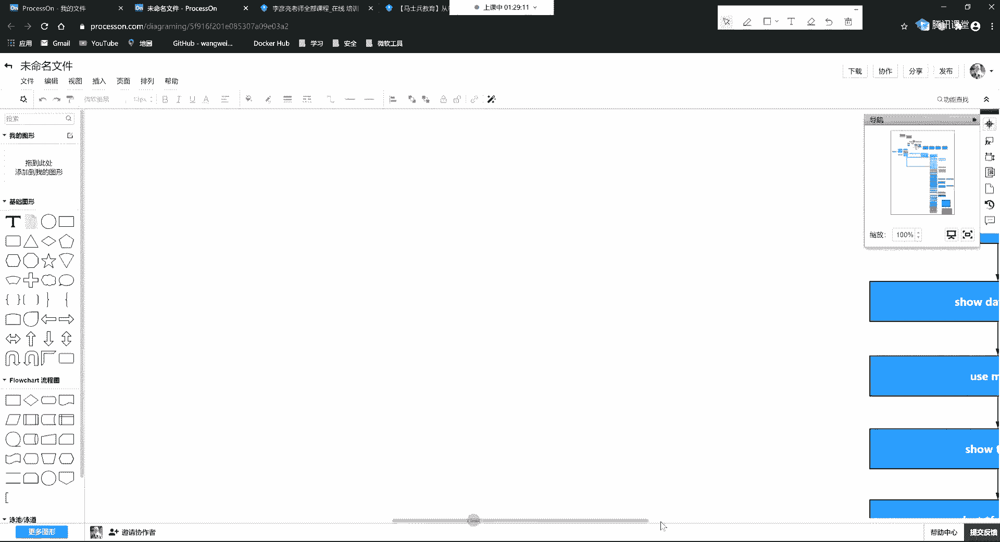

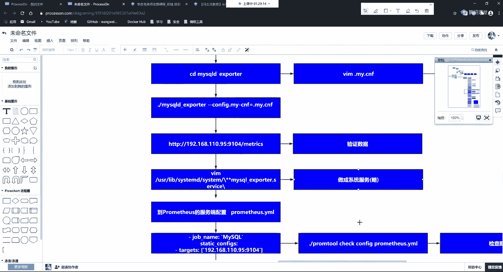

喽哈哈德华，♪ 谁是真正的技能 ♪，♪ 歌名比此比此山巴多巴巴罗巴没有眼睛 ♪，比我大声喊出来，就是要你嘻嘻哈过一辈子安好，请你比出中指命运，佛祖感恩老师，♪ 谁是哈国王的祭天 ♪。

诶嘿嘿哈哈哈哈哈哈哈哈，♪ 我不是总经理 ♪，不会使出分身，只有在这里可以看到我的本尊，2001塔狗帮正式成立，你们坚定信仰是我麦克风的强大火力，kpos防腐剂，让你一听上了瘾，不用假装镇定。

你的耳朵告诉你，here come on，yeah，我们都在同一挂街头制造是非，只怕十字架，hiphop梦想到底谁像是那打过防守，最苦不出象牙，我们都在同一块，我才会传到400。

放假hiphop风笑到底谁像苏老白，在哈国王国最有夫之逍遥，你看到了我左手拿一个佛珠，♪ 但是我这里有一个耶稣 ♪，♪ 这代表着我汉堡王在的地方就存在的抽苦 ♪，敢不敢加入，听我饶舌神父讲解片。

怕圣经的启示录约束，♪ 现在就让我来跟你讲 ♪，yo yo，第一章，♪ 上帝也为饶舌疯狂 ♪，第二章史书传播中文饶舌福音没力量，第三章，买我cd的人上天堂，♪ 第五章听我传教回家 ♪，♪ 记得祷告 ♪。

生活才有希望，第六张沙袋吃麻辣，耶和华吃枇杷，♪ haha don't stop ♪，never give up，逍遥了，♪ 我才能继续骂蔡依林坐坐 ♪，第七章，我每天是我的生母玛利亚。

♪ 第八章演唱会的时候 ♪，有没有来嘲笑我mia，♪ 第九章 ♪，hiphop信仰就是让我不一样，最后一张也是商人吧，等我附送一遍，哈尔王万岁，哈利路亚，我们都在口一天空创造世杯80字架。

hiphop到底谁像是拉开把狗王狗最好不出象牙，我们都在偷一罐，我前不参照，是马上下hip放下，♪ 到底谁上输了牌 ♪，买hg b各种独自向阳跳clash，防止鸡王府，♪ 鸡王府哈哥帮你每个人 ♪。

喂喂喂喂，咳咳好了，咱们继续啊。

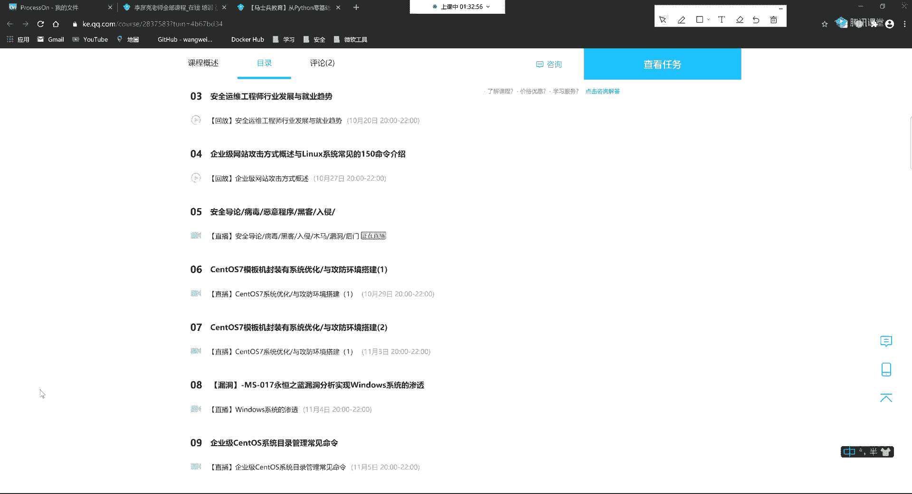

嗯讲到了攻击啊，这也是我们常见的一些呃，名词啊名词，那么我们通过这一讲呢，大家知道以后我们在提的每一讲，说的每个名词，它是在干啥啊，那么继续还有一个东西呢叫漏洞，漏洞，这东西有意思啊，这东西有意思。

那么怎么说呢，就是我们的操作系统，不管是手机的，不管是电脑的，不管是服务器的，大多都是美国的啊，不能这么说，基本上都是他们的，所以呢他们为什么说美国可以做，对中国进行制裁。

是人家真正站在这个食物链的顶端，人家可以制裁对吧，那你也可以制裁他，你制裁不了，所以他有很多东西并不对我们开放，即便是对我们开放了，我们中国也没有那么多人去研究这些东西。

比如说你有没有人去研究windows底层源代码，没了没有啊，很少，所以说如果他们在系统层面做一些邪恶的事，那你是根本就发现不了的，比如说我们上面提到的永恒之蓝漏洞。

它会在windows 7的所有版本以及windows server 2008，2012等1些的服务器版本直接就有，那这是这个漏洞被爆出来了，如果不爆出来，也就是说这个东西想被谁利用，就被谁利用。

那么对你可以进行任何的这种上传和下载，就是怎么说呢，叫道高一尺，魔高一丈，就是比你更牛逼的这些人，他挖掘出来这些漏洞，他可以把这个漏洞提交给你的微软官方，那么大也可以不提交啊，他也可以不提交。

那么这一块的话呢，比如说大家嗯我可以给你推荐一部电影啊，电部电影，比如说你可以去看看，有一部叫虎胆龙威四的啊，这部电影，就是你这个黑客啊啊你再去做入侵的时候，别人可以反入侵啊。

然后同时呢给你上传给你一部分的这个呃，病毒啊，呃那部电影里头用到了很多，比如说邮件炸弹呢组合键木马啊啊，还有一些远控啊，加密算法呀等等等等，所以有时间的朋友们可以去看看啊。

可以增加你对信息安全行业的这种兴趣，好了啊，刚才呢这个感谢冰系魔法是吧，嗯感谢朋友啊，这个我刚才在在上边苦逼的敲这个嗯，字的时候呢，呃敲错了对吧啊啊这个，感谢大家的这种刊物啊，感谢大家贪污好。

那我们说说漏洞啊，那么这个漏洞呢华为现在这个鸿蒙系统啊，现在呢一个漏洞奖大概156万啊，两个漏洞给你300多万，那么那么这个当你这个操作系统，一旦上到这个手机上啊，就会有攻击，你现在可能没有啊。

但是你一旦用起来就会有了啊，然后呢，这个这个这个这个国外呢他肯定会抨击啊，就该说了，你看这个这个我就说吧是吧，哎那个系统不好用，这就该各种bb了啊，所以现在呢，这个华为也是在努力的去打造这个生态啊。

就让这个很多的安全人员加入进来，让你呢你呢去去做这个工作啊，去做这个渗透的这个工作，然后呢从中能够拿到华为的这个奖励啊，也会有这样，好其实呢华为这样的话呢也是在博眼球啊，因为华为本身他们自己就是做安全。

那他们本身就是做通信，同时他们也在做安全，那么这个漏洞呢就说到这儿了啊，那么就是指网络，指网络或信息系统中的硬件啊，比如说这个硬件就指的是你的路由器，交换机挡好，那么这里头就可以报漏洞对吧。

还有你的软件，包括你的网络协议啊，尤其是网络协议，比如说大家见得非常多的，就是这种tcp ip协议，大家见到非常多对吧，唉就基于这样的网络协议，就能搞很多邪恶的事儿啊，的具体实现或者安全策略上存在弱点。

或者，弱点或缺陷，那么这个漏洞呢它可以有几个方面啊，可以来自于操作系统，那么这里的话呢windows比较多，linux呢相对少，麦克呢几乎没有，偶尔啊，偶尔会有，那么比如说flash啊。

就应该你在mac电脑上，比如你装了flash java等，这些东西可能会有一些漏洞啊，这个是操作系统层面，windows最多，所以我们用服务器的话，那就相当于用linux啊，mac啊。

偶尔unix也叫什，那么mac呢就是unix的一个分支啊。

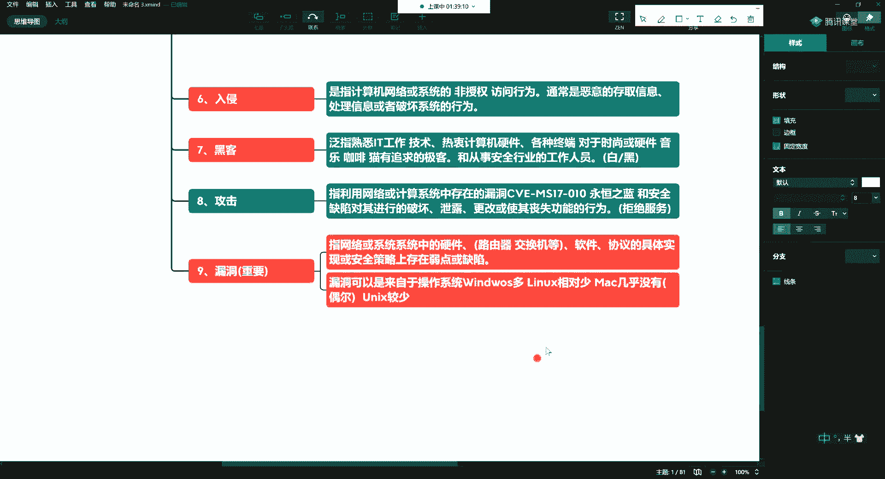

第二个呢来自于什么呢，来自一些中间件，比如说大家经常用什么mysql对吧啊，比如说你经常你们在学的有spring，对吧哎等比如说还会有tomcat，nginx啊，阿帕奇，s的啊，这节课软件中间件。

他们这里头存在的一些漏洞啊，然后呢比如说就是你写代码了，里头还有一些逻辑漏洞，啊业务劳动，所以说呢做安全的人员呢还有一个工作呀，就是做什么呢，做这种代码审计的哈，代码审计啥叫代码审计的。

就是你写完了以后，他看你这个代码啊里头有没有一些问题，所以说这也要具备一些读代码的能力，那么所以漏洞可以来自于应用软件，操作系统中间件啊对吧。

那么这里头呢产生这个漏洞的原因呢是什么呢，产生这样的原因也有很多，产生原因呢，因为这个东西呢你肯定都得是人来去设计的，去去写它，对吧啊，你可能呢就是在一开始设计的时候，就没考虑全面啊。

这时候就造成了这种漏洞了，就是在设计阶段就造成了，这个是ok的啊，有这种情况的对吧，那么第二个呢就是啊我设计的还ok，但是这个产品经理就是我不管你啊，咋实现啊，反正明天要上线，对不对，那就是编码阶段啊。

也就是你在实现这个部分，唉这时候出现了漏洞，啊还有一帮人呢是干嘛呢，他诚心的啊诚心的，但是我们不鼓励程序员写bug对吧，刚才说了业务分支里的交互过程中对吧，这种设计缺陷或者说这种不合理的逻辑啊。

唉逻辑流程啊，都可能会造成啊这样或那样的这种漏洞啊，这些问题等等，所以说呢这里头呢唉还是很有意思的，那么通过这个呢就要求呢我们这些安全人员呢，实际上呢也不是说你一点代码都不学。

有的人说这东西跟编程没关系，我跟你说有关系啊，这里头就需要我们做代码审计，哎我们要看他这个代码，那这时候呢就要求呢，你至少能够看懂70%啊，所以你要想成为一个高级或中。

中高级以上的这种啊安全方向的工程师。

那么你对代码审计能看懂代码的能力就比较强。

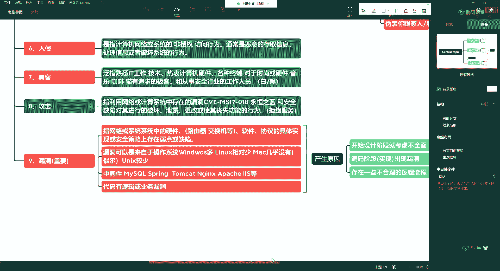

所以这个是对于漏洞啊，我们简单的给大家呢来说一下哈，那么除了漏洞以外呢，还有很多的内容啊。

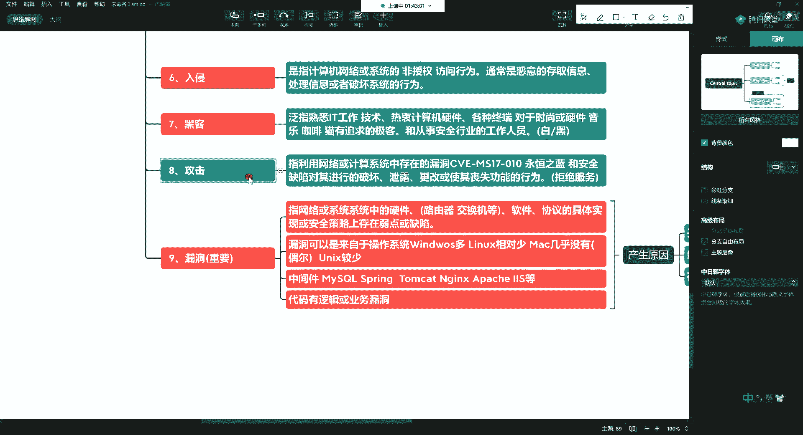

第十个第十个啊，后门，啊后门，嗯我们经常听说送礼走后门，是不是唉所谓的后门就是我们的有一些程序员，或者呢是受到了某些特定国家，你看美国啊，他们就要求他们这些国家的企业，在这些电信设备呀或软件呀留后门。

比如说安卓系统就留后门啊，就是他们已经明目张胆地说了，就是他们想要监控谁，就能够监控控谁啊，那么这里头就是指能够绕过安全性控制啊，而获取对程序，我系统的访问权限，啊这这样的一种方法。

唉这个往往呢就是故意的，故意写好的啊，是有意，留在你的系统中的，供什么呢，供某些特定的人，特殊使用者通过某种特殊的方式，控制计算机系统的途径，啊这么干说了这么多啊。

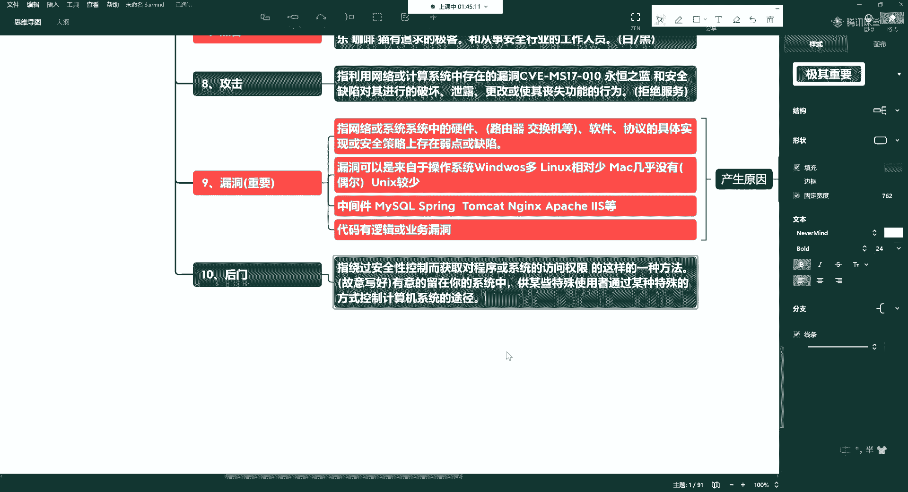

是这意思，就是背后的老板是谁啊，也想控制你都能控制，包括我们的windows啊，包括我们的安卓系统都可以对吧，那么这个东西呢就有同学会说了，那这个户门跟这个漏洞他俩不挺像的嘛，啊刚才我们说了。

这个漏洞产生的原因可能是这几种，它可能是非人为因素造成的，可能是你设计上的这种缺陷啊，那这二者的区别是在于啥呢，对吧，那么你后门和漏洞的区别。

啊那么一个就是与生俱来的，一个就是后天的好，好我们把他俩简单的说一下啊，对比一下，漏洞是一种无意义的行为，啊无意的行为就是大街上走道的是吧，哎他不可能呱呱飞，死乞白咧的往你脚上踩，是不是。

所以说如果真踩着你了，人家说对不起，你就不用打他了啊，这种无意的真没看见，那后门呢它就是一种故意的行为，成心往你脚上踩，那就打压的忒忒呲牙一脸，是不是哎就这样了啊，而这个后门呢就是一种有益的行为。

我诚心的故意的啊，这个东西是不能容忍的好吧，这二者是有区别的哈。

后门和漏洞啊，然后利用这个后门就可以获取你的信息。

对你进行一些监控，第11个也是我们经常遇到的啊。

我们做安全经常遇到的就是防火墙，哎防火墙，好我们平时在运维和开发的过程中，也经常跟防火墙打交道啊，只不过你打交道呢要么就是放行一个端口，要么呢你就把它关掉，那么这个防火墙从层面上来讲呢。

有硬件防火墙和软件防火墙啊，硬房的这个层面呢，可能有些朋友呢一直都接触不到，那么接触的是软件层面，那么我们这里指的防火墙是软件层面啊，说它是一种什么呢，它是一种将内部和外部网络进行隔离的，保护内部。

内部网络免受到，非法用户的侵入，的访问控制技啊，就相当于你们家那防盗门一样啊，把你们家和外部进行隔离了对吧，你没有钥匙的，你就进不来啊。

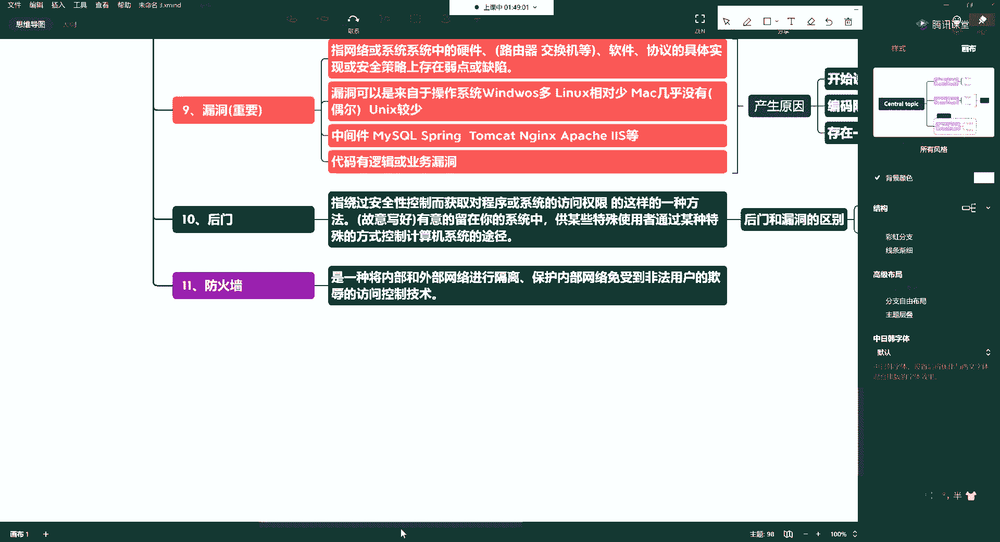

就相当这样的一个作用，那么这时候呢我们可以干嘛呢，我们可以操作的就是比如说我们可以开放，我们可以对于端口进行操作，那么网络中如何区分你的各协议啊，以及你的各服务，你的各应用就是通过端口进行区分。

那么还可以对线对什么呢，对吧，哎还可以对你的啊ip地址进行操作啊，这里头可以有很多的规则，对吧哎然后我们进行这个端口啊进行限制，比如说我会有一些入站的规则，啊我还会有一些突然的规则啊，就是别人访问你。

因为你别以访问别人这种啊，然后通过端口来区分，那么在这里我们就可以监控一些ip地址啊，比如说一些国内的和国外的一些内部局域网，内的局域网外的。

所以ip地址的一些划分啊，在网络里的实际上还有一些地址啊。

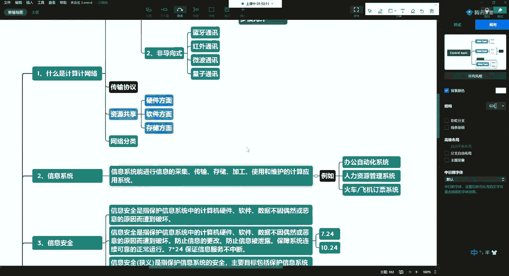

比如网卡mac地址以及你的ip地址，ip地址的一些分类。

分离内外网呢通过这样进行隔离，好这是刚才说的啊，防火墙呢可以是软件的防火墙。

也可以是硬件防火墙，啊比如说你要是被ddos了，你光软件是不行的啊，那么一般呢会要求你有硬方，所以呢这一块的啊，不要单单的以为它就是一个软件啊，那么说了后门了，说了防火墙了。

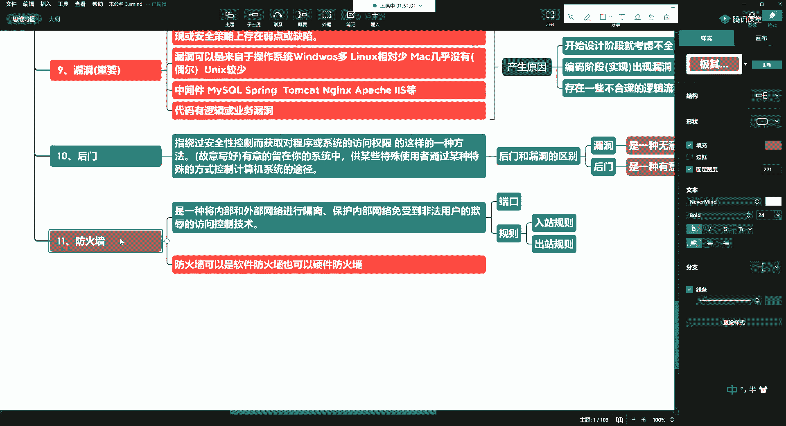

再来一个，比如说有了漏洞了对吧，或者发现一个后门了怎么办，我们要打补丁。

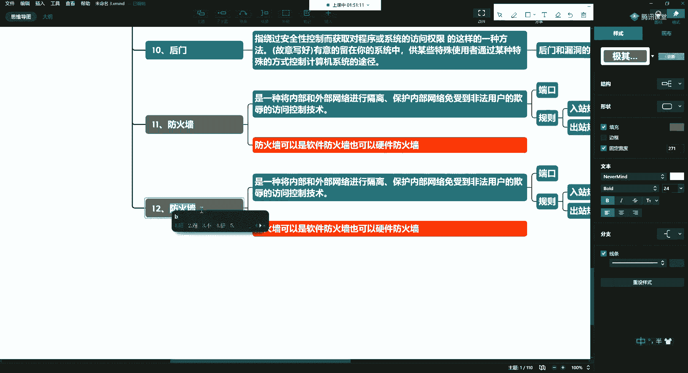

好打补丁，好补丁呢它也是我们经常常见的啊，就是我发现这个漏洞了，我一定要提供一种解决方案，如果说没有补丁我怎么办，有补丁我怎么办对吧，这个补丁呢就是指啊军队，软件系统使用过程中啊，比如说暴露的缺陷。

说我发现这么一个漏洞了啊，说你们这个微软你有你有你有这个缺陷，然后比如说他发给他，他能够复现了，然后他针对于这个东西作为一个补丁，把这个漏洞给你解决掉是吧，发布的修补成修补的，漏洞的，程序。

那么这个不光是我们的windows，还有我们的linux，啊以及我们的mac系统，啊unix系统对吧，每年他们都会发很多的这种补丁啊，windows会多一点啊，windows会多一点。

其他的几种呢稍微少一点啊，这个是什么是补丁啊，补丁，好第13个内容啊。

第13个内容要跟大家普及的。

13个13个这个内容叫什么呢，这个东西呢就叫做密码，啊密码，好那么密码呢我们也介绍一下下啊，我们也介绍一下下，好这个东西呢主要是为了这种零基础的小白啊，说一种用于保护数据的，我信息的技术。

就跟我们比如说你出门，你家里要把有把锁，是不是哎你嘎叽得给他锁上好，所以呢这个是一个啊，那么呢我们通常呢会建立密码系统啊，它的基本功能，是实现信息的机密性，啊比如说你没见到哪个人啊。

上大街上喊自己银行卡密码是多少，是不是哎所以为了保证你的业务有一些保密性，不想让人知道的啊，这些东西你个人隐私的对吧，所以这个东西要用啊，这个就是密码。

那么有密码了啊，就有加密和解密。

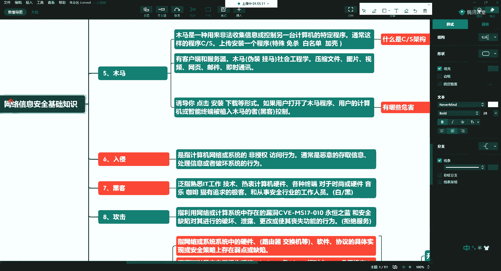

哎那么我们看看什么是加密，加密其实就是给他上诉，给信息上锁的一个过程是吧，那么这里一般呢会涉及到某种算法，所以说是以某种特殊的算这个算法呢，比如说有a e s m d5 等。

甚至你可以用自己写的一套算法，那么这样的话呢就叫改变原有的，信息数据的表现形式，啥意思，就是比如说一开始没加密啊，你能看到一些铭文的，我们称之为铭文是吧，字符等等，然后你加密了以后。

你可能变成一些乱码啊，比如说用c语言就能写啊，这一讲呢我就不带着你写了，因为时间原因，下一讲呢就明天我带大家用c语言啊，因为明天我们还要这个讲系统一些命令嘛，对吧，哎我们上来先用c语言给你写个加密程序。

你看一看啊，就c语言就那些就是世界上独一无二的算法，只有你自己知道啊，这都这都这都这都很爽的，所以说那么哎接着说啊，将正常的什么叫正常的数据，就是可以直接识别的铭文的，啥意思啊。

这里写的密码123456，就是123456，这种信息变换为无法识别，信息的过程，但这个过程呢它就是什么呢，他就是混淆，那我让让你看不看不清楚，所以你去一些银行啊，等部门的一些工作的时候呢。

他们这个服务器这u口什么叫u口，就usb口都是不能访问的啊，就包括他们一些主机，非特殊情况下都是不能访问的，就是你一旦插u盘，它实际上都能监控到，啊包括从他们啊，公安等一些这个这个这个这个这个这个哎。

他们出去的数据啊，都变成加密的，或者是这种垃圾数据，就是你拖出去也没有用好，好那么所谓的加密呢实现一个啥样的目的呢，目的就是有这个保密性。

保密性，后边再往后说，其实实现的就是什么呢，就是让加密的目的其实就是让这些非授权的，非授权的用户，那么它比如说它即便是破解你了啊，不能叫破解吧，反正就算获得了你的数据，依然无法了解信息的内容，好吧哎。

明天我们还有课是吧，唉这儿呢我们今天呢，这留一尾巴，明天带大家编程好吧，明天我们写一个自己给自己加密，这个加密程序呢你就可以写在自己u盘里了，地球上就你自己知道啊，就你自己知道。

所以这个数据他拷走也没有用啊，所以一是防自己的这个这个这个丢东西是吧，二一个呢。

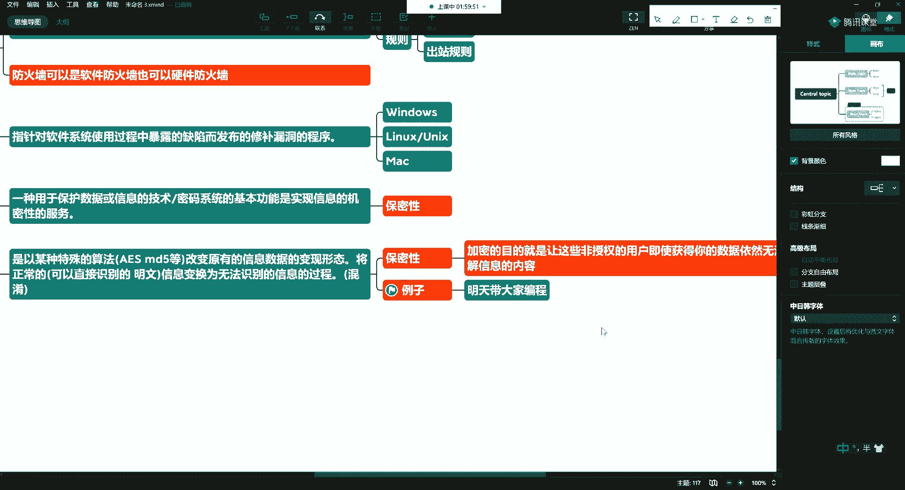