# 学不会我退出网安圈！中国红客技术正需要传人！全套666集还怕学不会？（网络安全／黑客技术） - P11：4.3-网络安全基础-病D、恶意程序、入侵（下） - 一个小小小白帽 - BV1Sy4y1D7qv

零的事件，就是啊有个程序员自己开发了一套算法啊，这样算法呢也是自己知道，然后呢把这个新浪的服务器啊，大概有几百台服务器都给加密了啊，嗯当时这个程序员呢也很嚣张啊，就直到找到他们最高的这种领导。

就直接打电话说，你现在就报警啊，你现在就报警，你有两条路可以选，第一条就是你报警抓我啊，第二个就是你这个所有的服务器对吧，都已经运行了我的这种加密程序，如果你要嗯不嫌复杂的话呢。

你可以逐台的服务器进行恢复是吧，哎你通信装系统，那人家受不了啊，对不对，这就是最早期的勒索病毒啊，就是算法玩的特别好的，你像左神这样的特别有有有这个前途啊，到哪写一套算法就自己知道啊，去搞别人好吧。

这个是对于加密的，明天我们自己写一写好吧，哎有加密就有解密。

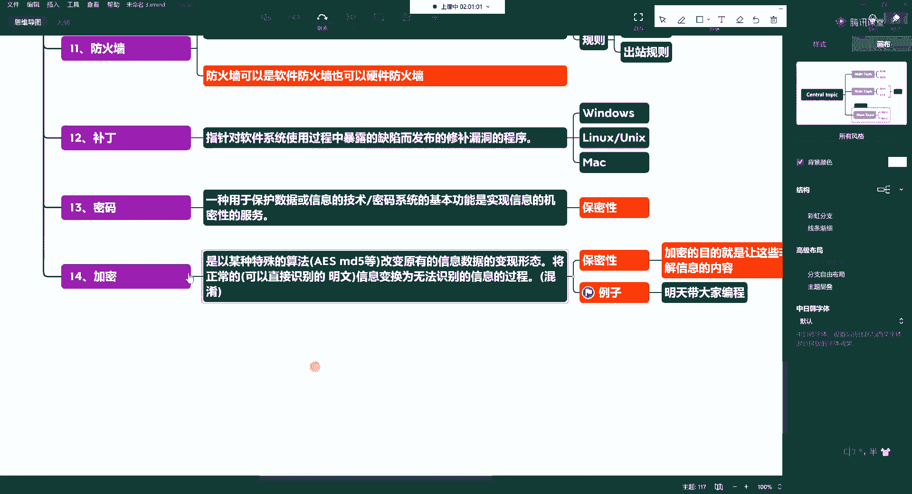

15解密。

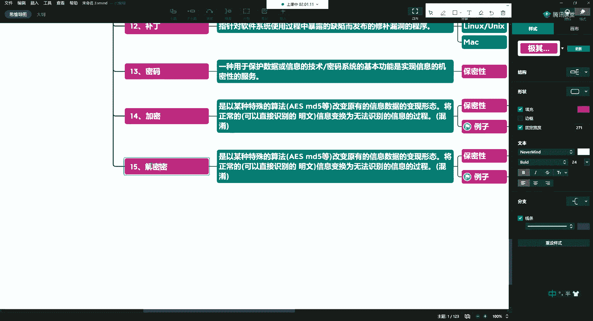

解密呢实际上就是它的一个反过程，就是加密，反过程，将，加密以后数据信息通过还是啊某种，特定的算法，这个算法，需要和加密时，一致啊，你俩要不一致对吧，就出现了，你说玻璃球子，他说城门楼子了啊，这种情况。

那你就还原不回来，你这些数据对不对啊，恢复，为可识别的，信息，那么使得授权用户谁呀，就是你自己啊，合法的啊，授权的，被允许的啊，这样的用户能够了解原有，的信息数据啊就会还原回来啊。

这个例子我明天也带你写，我就我就用c语言带你写好吧。

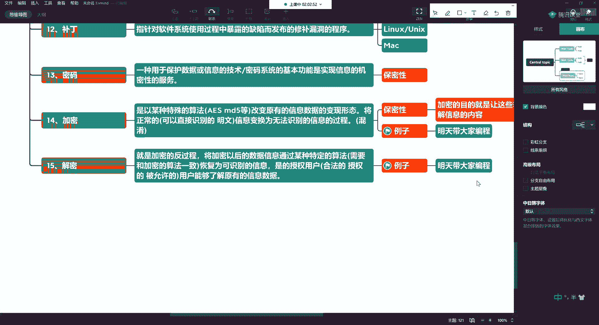

这个我们也感受一下编程啊这样的一个过程。

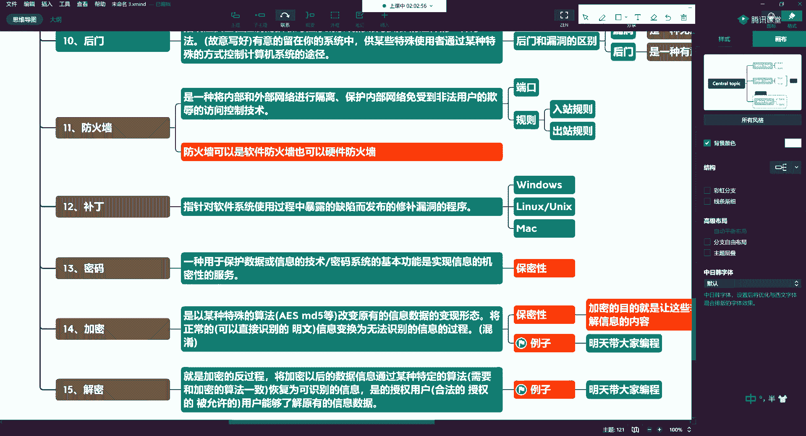

那么还有什么呢，还有呢东西呢就叫做数字签名。

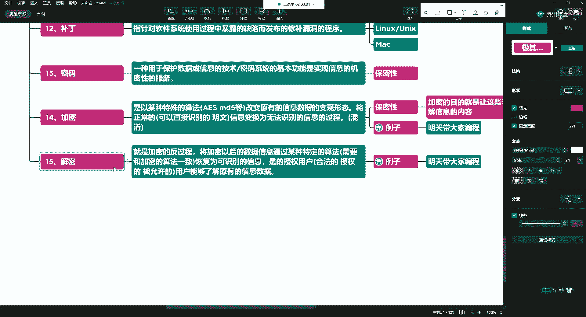

数字签名。

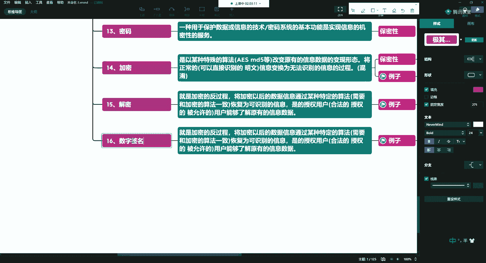

那也就是说证书啊，大家经常也会遇到，比如说你买了一个阿里云，是不是啊，数字前面整数信息的发送者，信息的发送者通过签名算法，二产生的，用于证明信息发送者发送信息的真实性，那说这是我发的这一段数字。

其实就是个数字串，啊也就叫字符串，数字签名一般通过密码技术。

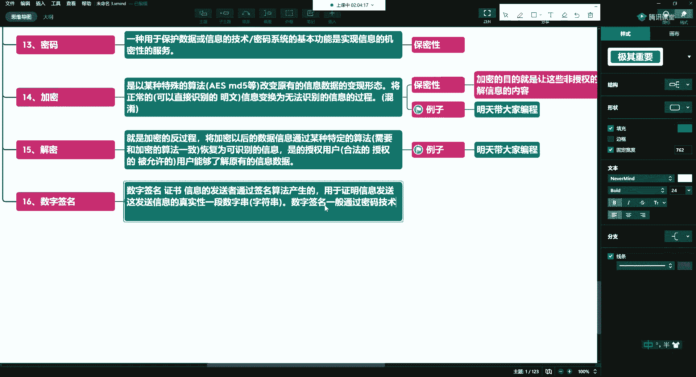

就比如说我们打开一个网页，这个浏览器上面有个小锁对吧。

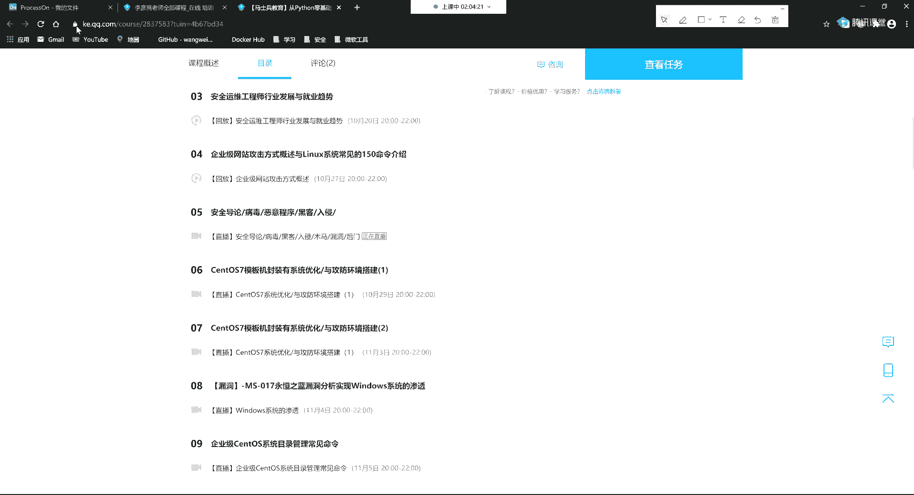

这个小锁呢，其实就是需要我们通过数字签名来完成啊，那么这些呢可以是，一，比如说可以是a e s啊，1024位的，那么现在呢1024的都不行了啊，现在谷歌浏览器是比较激进的啊，所以呢它都是2048位的。

至少才是你才能在谷歌浏览器以上，用到一个小律所，那么这时候通过ssl证书啊，认为它是经过加密安全的，那么谷歌浏览器在调用js的时候，只有是http的协议，你才能调用你的摄像头和你的音频。

所以现在很多网站都是做这种http f的这种验证，那么数字签名呢一般通过密码技术，刚才说了，通过密码技术实现好，与普通的物理签名，具有同等的同样的法律效力，好这就是一些数字签名啊，就是以后我们在。

工作中对吧。

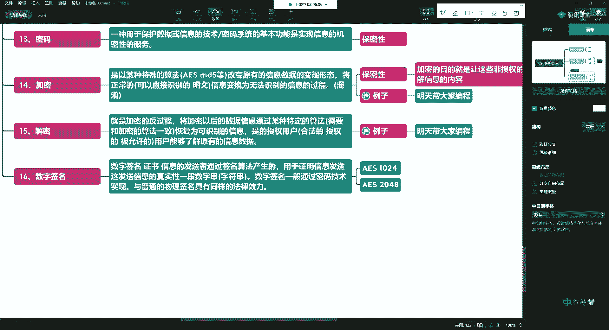

以及我们的课程中会遇到的这些专有名词。

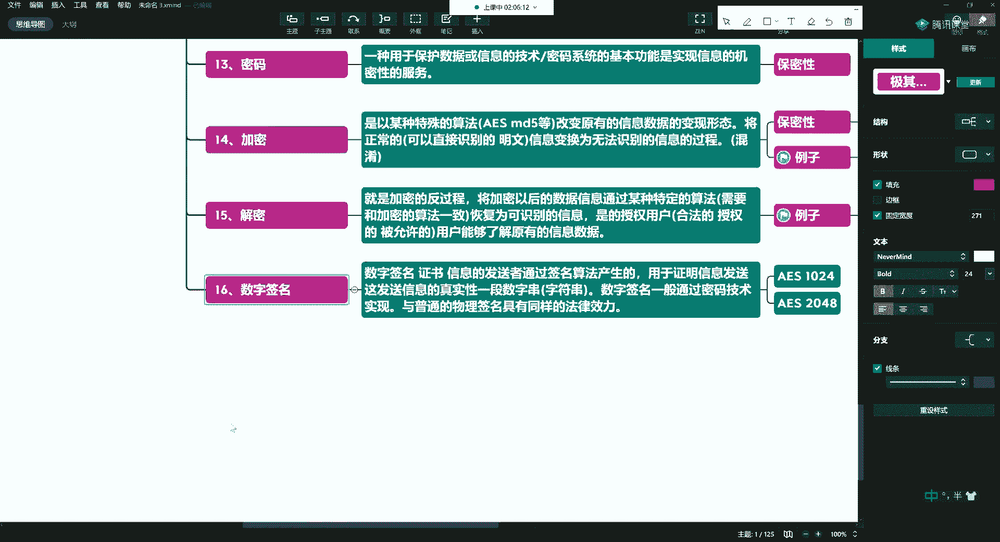

还有什么呢，第17个，有数字签名了，还有叫数字水印啊。

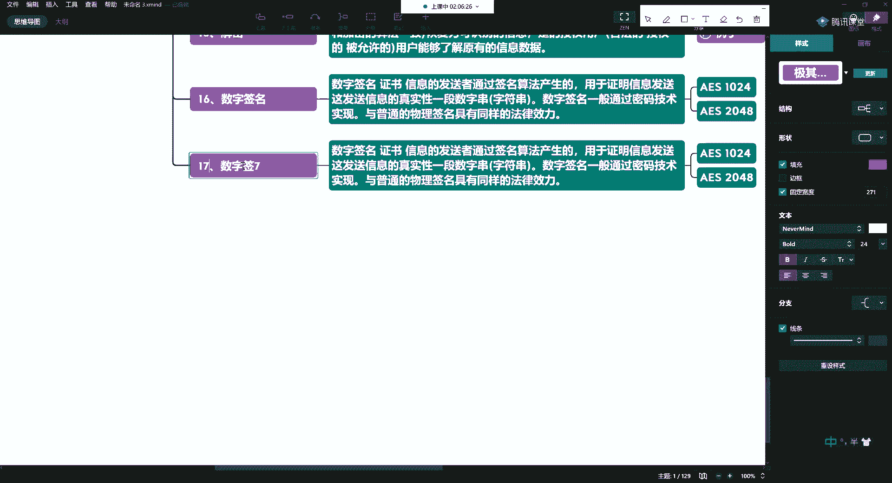

做一些防伪的，我们看人民币上啊。

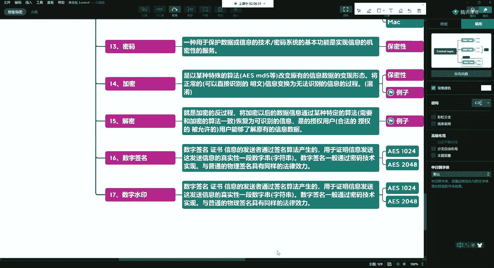

你拿这钱，是不是上面就会有数字防伪的这种东西，数字水印的是啥，在这儿呢也给大家简单介绍一下啊，那个数字水印呢就是一种将，标识的信息嵌入到数字载体当中，用于确认载体所有者啊，是谁判断在体，是否被篡改了。

或传送，秘密信息的。

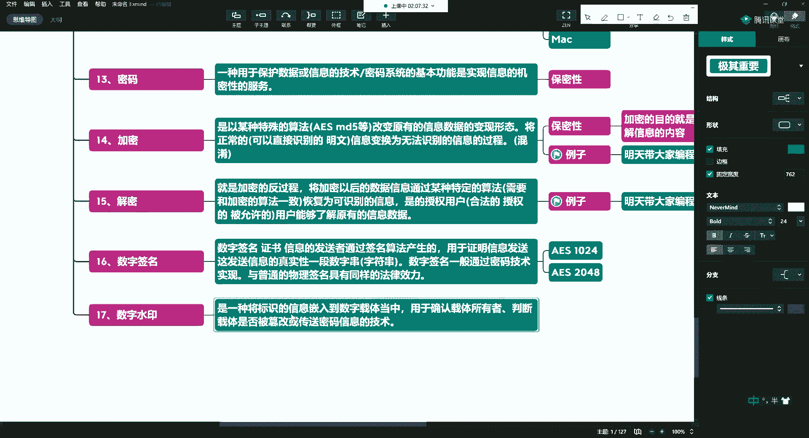

嵌入的标识信息也称为数字水印，就我们见过的水印最多的就是人民币啊，你拿着100块钱照一下，哎这就是水银啊，但是呢在我们计算机中，也可以通过人民币的这种技术。

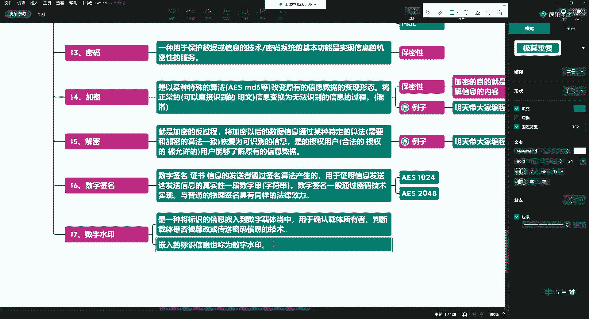

那么所谓的数字载体，数字载体呢可以是什么呢，可以包括是多媒体啊，比如说可以是音频，可以是视频，就是防盗版的啊，他们可以用这种，比如说还可以是文档对吧，还可以是软件，啊。

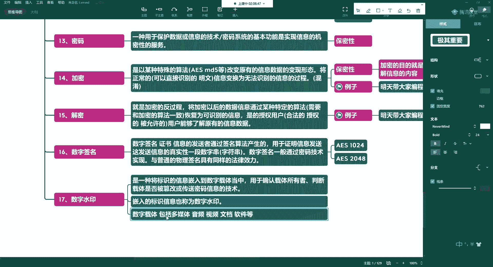

那比如说呢我们加了一些水印啊，说不能说你加的水印，我原来的这东西我就不能使了，所以说数字水印，他如果想嵌入到数字载体中，应该不影响，原来载体的使用价值，说你这玩意儿不能说我里头有个水印。

我这个人民币就不能花了啊，那这玩意儿对吧，你要的有啥用啊，是不是，好啊，这样的话呢我们关于这个17个的专有名词啊。

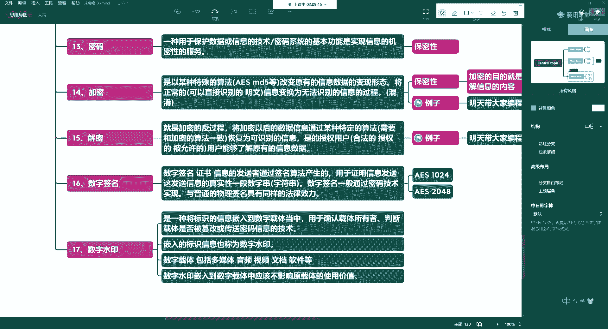

我就给大家说了，那么还有一个啊，还有一个还有点时间啊。

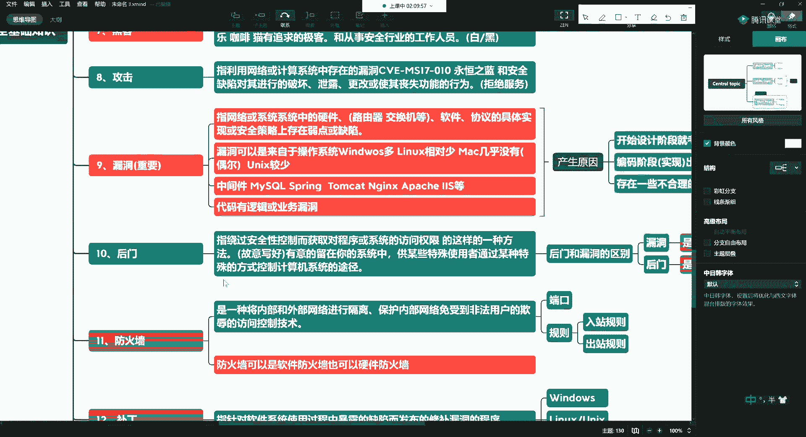

还有三分钟啊，那我再给大家说说啊，赠送你点东西嗯。

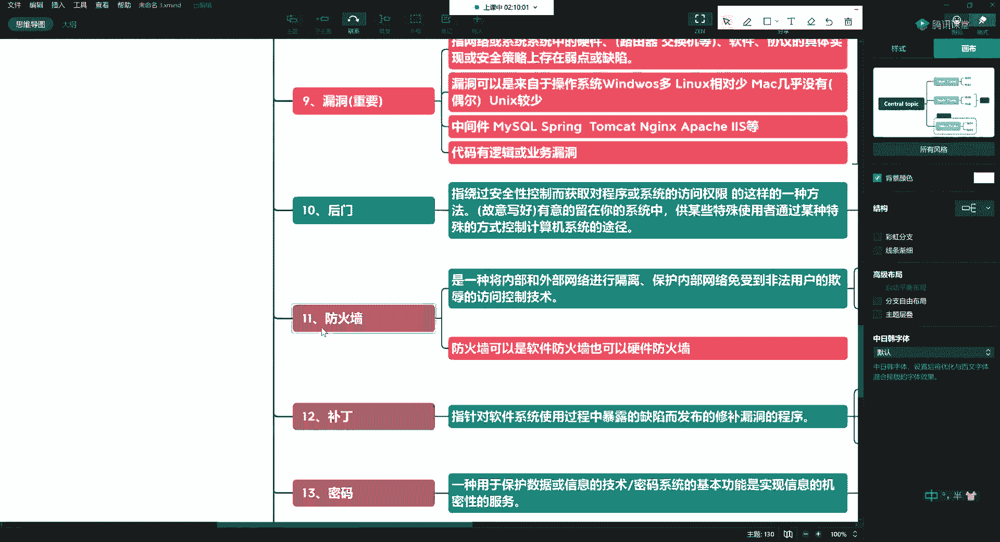

今天晚上呢你可以好好消化一下啊，这个是基础知识，那么实际上呢对于信息安全的啊，这里的分类。

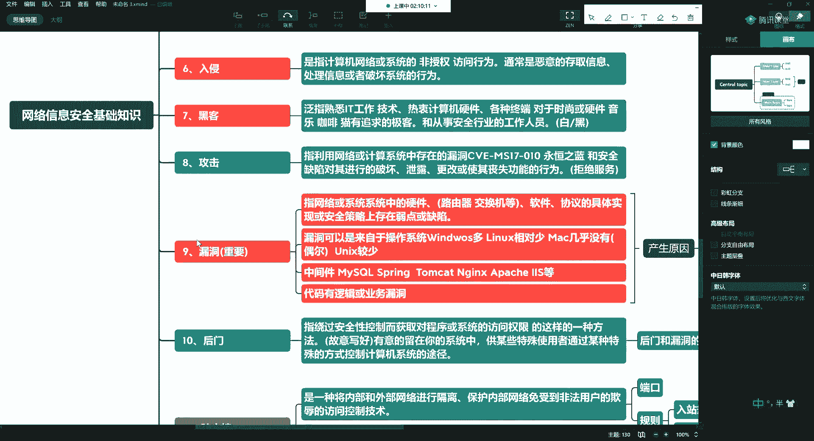

那么我们也给大家介绍过啊，那么信息安全的基本分类呢，那天啊实际上有一个文档我也给大家说了啊，比如说我们有物理安全，有系统安全，有网络安全，数据安全等等等等啊，这里头的也比较多。

那么我们常见的这种物理安全呢，就比如说我们存放的位置啥意思，就是机房就是人家可以物理的高，你说拿你服务器上插个u盘，上面嘎嘎给你传病毒诶，那这是一种方式，比如说存放的位置呢就在哪儿呢。

比如说我们的i d c啊，有条件的就i dc机房，还有一些自建机房对吧，哎那么还会有一些呢这个物理安全里头，提供硬件的这种设备的冗余啊，还有一些硬件，比如说你这个服务器开机是吧，哎设一些bios密码。

主板的一些密码啊，你想开机进入系统，那不行，你受不了对吧，然后呢在主板上禁止usb啊，光驱u盘，光盘啊等这些的系统引导啊，包括还可以禁止闲置的网络接口，比如说泥台服务器有四个接口对吧，有的呢比较老的。

像r410 这样的服务器呢可能有两个接口，所以说呢哪个不用，我可以把它屏蔽掉啊，所以这样的话也可以去屏蔽是吧，哎那么对于人员的管理，那首先呢就是限制人员接触设备，谁摸的那个机柜了是吧，扣他500块钱。

对不对，谁离内机柜1米远，扣他500块钱，只有特定的人数可以才行，所以呢除了对于这些知识点要知道以外，那么还有很多，其实是对于工作人员的安全意识啊要进行培养，那么很多的企业现在他还没有这种安全意识。

他还觉得这事儿是很好的，比如说他离开电脑的时候，他都不在锁屏的，那么我们以前在银行的时候，实际上比如说你离开电脑啊，你只要站起来，从你的座位上站起来，那你就必须锁屏，如果你不锁屏，就直接扣你钱啊。

直接扣你钱，这是真事儿对吧，满屋子都是摄像头，也需要进行锁屏啊，我们叫谦退啊，所以这些东西都是要形成明文的规定，那包括您去了一些其他的这种公司或机构啊，要求稍微严格一点啊。

这种金融级别的这种安全都是这样啊，所以这块呢也给大家简单的说一说好吧，那么系统和软件的漏洞啊，这一块也会有。

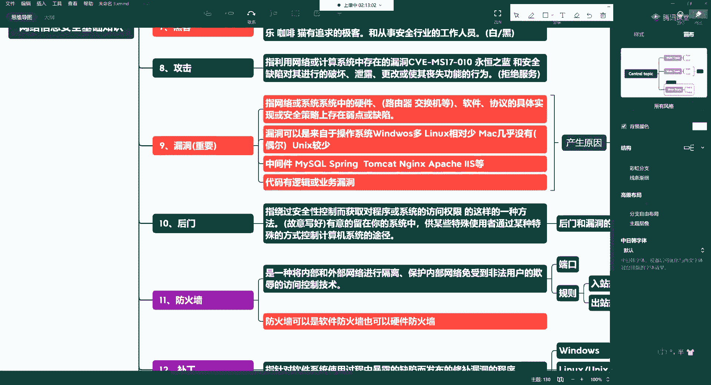

那么这时候呢我们可以从源头上去做啊。

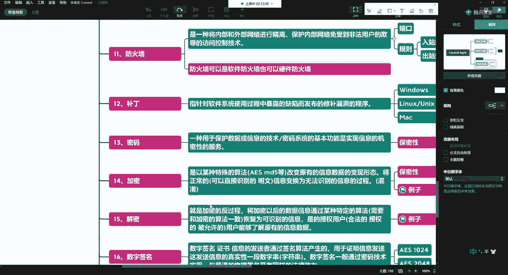

你比如说我要想减少这些漏洞怎么办啊，减少这些漏洞怎么办。

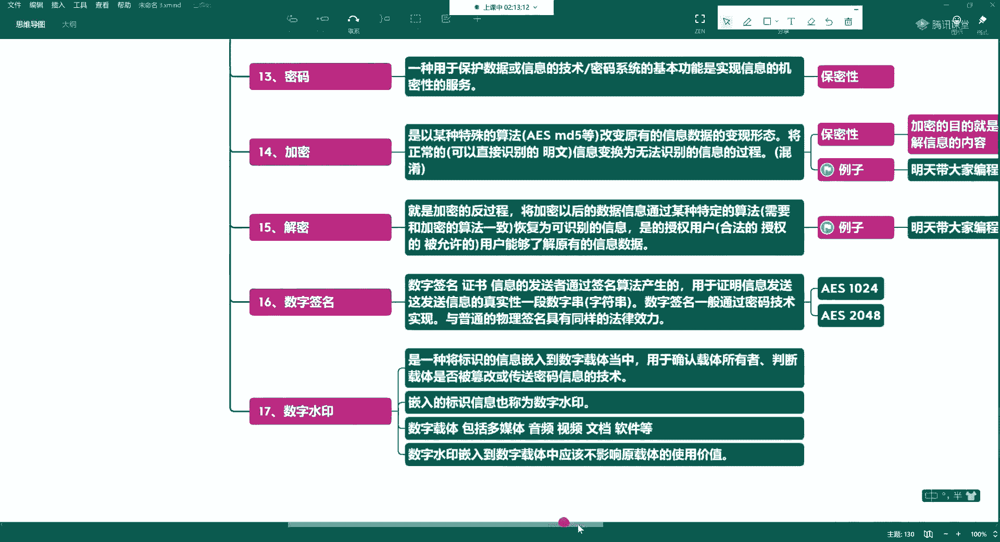

那么我就可以在啊，安装我对应的操作系统的时候，选择一个较高的版本啊，比如说为什么我们经常跟大家说说，你选择一个高一点的呀对吧，那你选个7。6以上的版本呀，就是因为如果你选择个7。2，7。3，7。4，7。

5，有时候你会发现你在操作的时候，会遇到各种各样莫名其妙的这种问题啊，所以我们的选择就是，我们可以找一些较新版本的，那这样的话呢，它会修复一些之前版本的一些漏洞，所以说我们选择呃减少漏洞的话呢。

我们在这块呢也可以啊，也可以呢去选择较新的这样的一个版本，这样的话呢也是一个方式，所以我们在这个这个这个一开始啊，再去操作的时候，所以明天我们就会讲操作系统的选择，其实这个东西就是一块。

另外的话呢就是尽可量尽可能的选择正版软件，就是如果大家挣的也不少是吧，说你一个月挣个五六万块钱，你买一套正版的，那那才能多少钱，是不是你用正版的啊，一个也是稳定，二。

一个呢也是说这个这个防止会出现一些漏洞啊，就是破解的这些东西是有风险的好吧，那包括一些应用软件啊，以及及时的安装一些漏洞和补丁对吧，那么账号和权限管理啊，那么账号和权限管理呢，这一块呢一定要把它分清楚。

如果管的好一点的话呢，就是我们开发人员是不给root权限的啊，这个root权限呢一般的运维老大我越来越远在这，所以这些东西包括呢我们一些密码设置，一些高强度的复杂性，包括呢这个每周啊。

或者说每三天或每一周啊，最长不超过一周，就要求你更换这个密码，所以密码策略啊也是需要有的，那么软件和服务的管理，就是比如说一些无关的软件，平时也不常用的，那该卸载卸载好，该关闭的关闭对吧，哎等等等等。

嗯五六万，我说少了是吧，嗯那十多万是吧，你们可能挣的更多对吧，10万 8万的对吧，对，所以没关系哈，啊这对我如果我说的少，你们就自己填个数，是不是啊，这个这都没关系，嗯还有呢就是网络的安全。

就比如说你呢做运维也好，做开发也好啊，或者说你开发运维都做啊，同时你也做安全，你也做测试，那这时候呢比如说你公司里头的网络，这个密码啊，嗯包括加密方式，那么这些个都是需要考量的啊。

所以怎么去设计这个无线网络的安全等等等等，都是都要提供不同的解决方案，比如说加密传输啊啊启动系统保护啊，防火墙的一些策略呀，入侵的一些检测呀啊等等等等，这些个东西也是非常多的，那另外的话呢还有一些呢。

就比如说啊你公司有些word ppt对吧，等这些内容的一些播放，比如说你要用u盘拷走了，到别人家了，这样不就是危险的，所以说呢我们将来呢还会基于微软的一些东西，做一种这种策略啊，就是企业中的。

我们可以用windows server去做这种组策略对吧，那么然后呢windows呢也提供一些服务啊，也提供一些服务，就是啊对于你的这个word和excel通过证书，在你公司内部能够打开。

它会有一个证书授权，那如果你离开了以后呢，这个东西呢那你就打不开啊，等等等等，那么数据安全呢就会涉及到了数据备份啊，数据的加密啊，存取权限控制以及人员管理等等等等，所以说在这一块的内容中。

我们将来还要不断的去强化安全意，普及运维思想啊，同时也会有一些运维基础在在里头，那你光跟人家扯犊子啊，人家让你备份，你不会背，那就不行了对吧，唉所以这里头也会有啊，这个是信息安全的一些概述内容。

呃恶意代码病毒分析在我们下一讲会有讲啊，那么关于安全防护啊，最终呢我们再说两句啊，咱又零五了，再说两句，这个关于安全防护呢，首先第一个呢，就是我们通用计算机的安全防护策略啊，就你做安全的话。

将来这些东西也由你来写，比如说啊我们这个计算机系统啊，大家怎么怎么怎么怎么怎么去要求是吧，什么服务关了，怎么怎么做呀，统一的镜像啊，怎么怎么样啊，比如说加入这个组策略啊对吧，普通用户装不了啊等等。

这是一个通用的一个策略，那么第二个呢就是互联网安全防护的策略，我们可以通过路由的层面，比如说什么样的网站我不让你访问啊，我只让你访问一些我白名单里头的对吧，比如说一些东西不让你下载或者怎么怎么样啊。

这些东西也有，第三个呢就是无线网络安全的防护策略啊，这也是安全人员将来要做的，因为无线网络这块可以做钓鱼，可以做各种各样的事啊，呃防泄密等等等等，都可能从无限这样打过来啊，所以有限的话。

在一些在企业里头呢还是存在的啊，还是比较传统的一些东西，第四个呢就是网上银行安全防护策略啊，就是我们防来防去，其实不就是怕你自己丢资料，丢数据丢人了是吧，唉大概也就是呃这些简单的词。

再配合上现在呢国家的这种等保的这种要求啊，将来的话我们可以自己做等保啊，这样的内容唉呀，对防火墙啊，嗯时间原因啊。

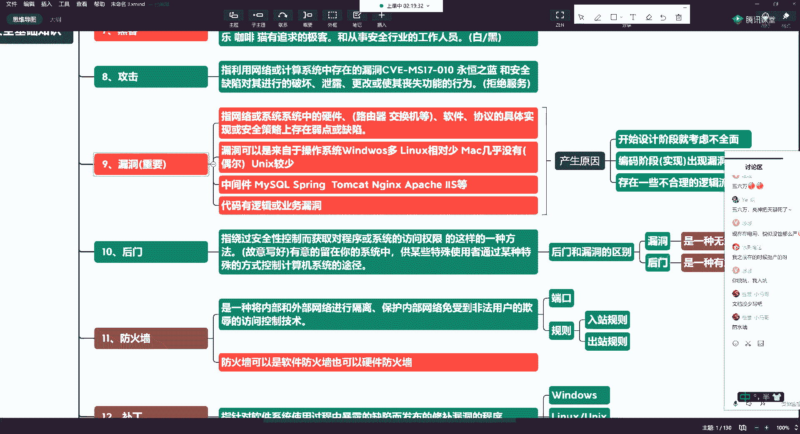

嗯今天呢我们又得不得得不得得不得啊，得病了不少东西，那么这些东西呢大家不要认为它不重要啊。

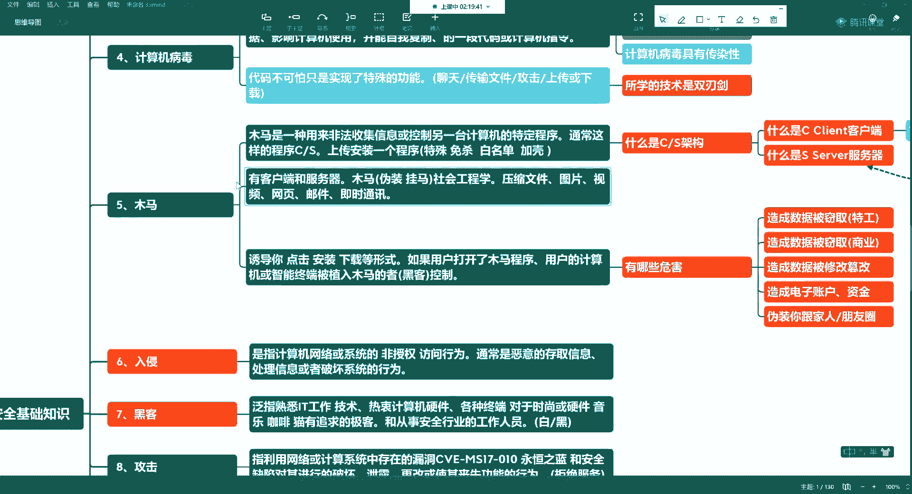

但是这些东西呢也很重要啊，这样的话呢保证我们信息能够同频好吧，嗯今天的话呢我们就先说到这儿。

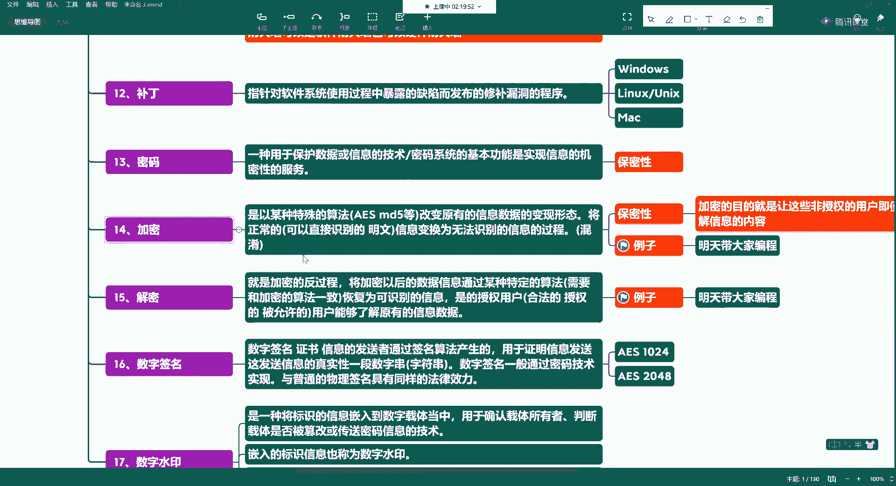

然后明天的话呢还是这个时间啊，我们就要进入到实质的一些内容的一些学习了，就开始写各种恶意啊，各种写工具，那么呢我们这个课程中呢，我不想让大家呢就光用一些工具，同时我也会带着你去写一些啊。

如果说你对python呢这个c语言啊，有有一些涉猎的话，那我们就写一写，当然了，你如果说这个嗯没有太多的这些基础的话呢，我们也可以用别的工具都行，好吧好，那今天呢我们就说到这儿啊，又十点了。

然后大家早点歇着啊，不会c没关系啊，不会c没关系，不给c，明天我给你们讲讲。

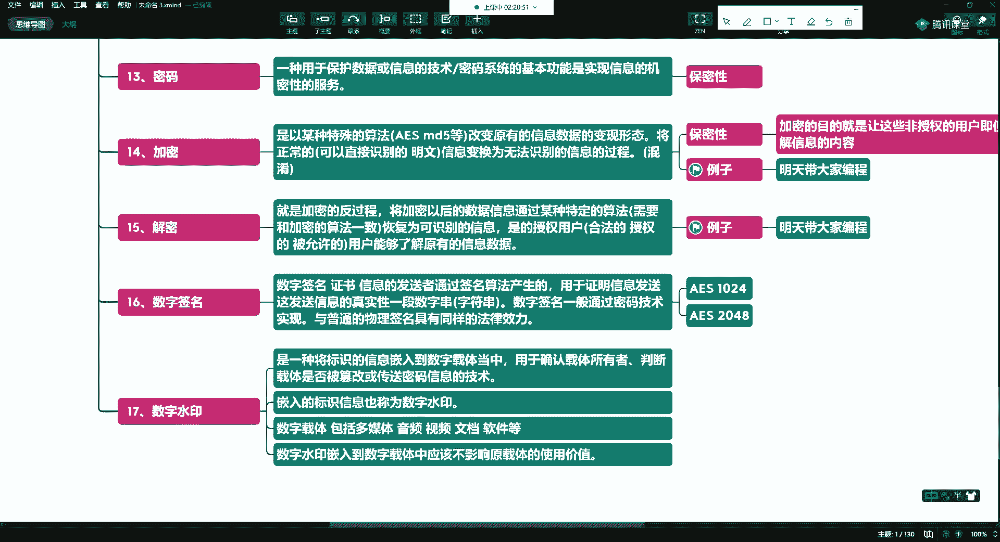