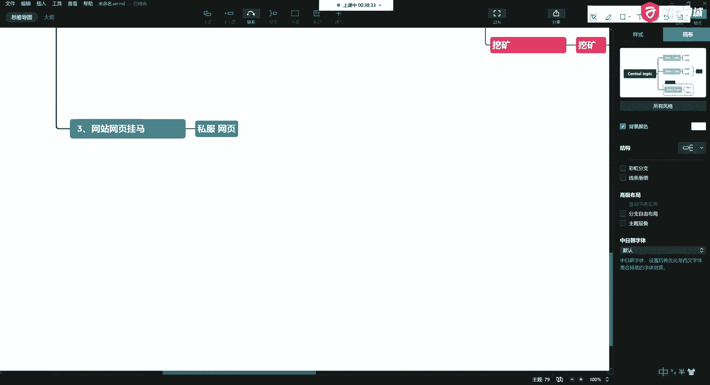
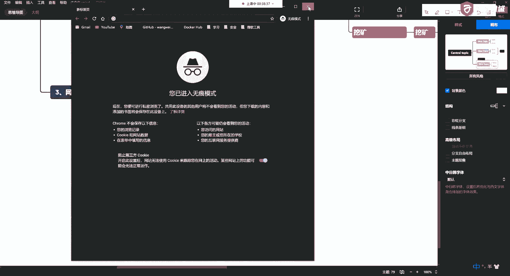
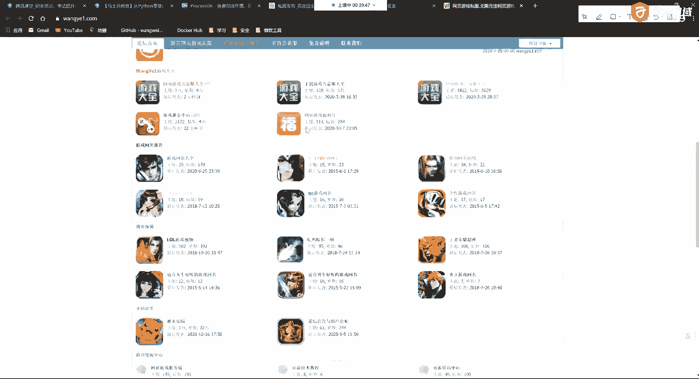
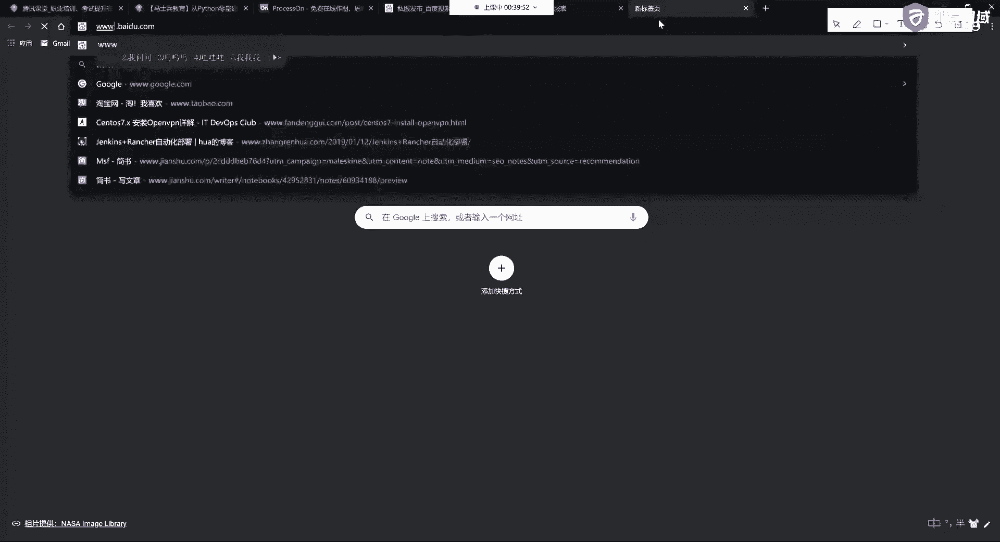
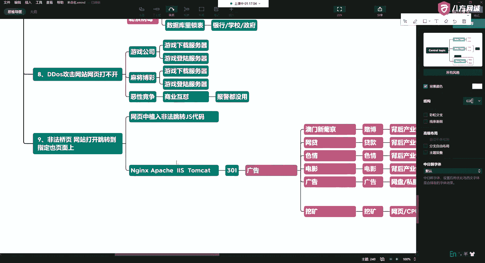

# 学不会我退出网安圈！中国红客技术正需要传人！全套666集还怕学不会？（网络安全／黑客技术） - P13：5.2-网络安全基础-常见网站攻击方式概述-网站的根目录中出现大量的植入网页 - 一个小小小白帽 - BV1Sy4y1D7qv

好这是第一个啊，网页中出现这种黑脸，第二种呢是什么呢，第二种依然也也也有很多啊，也有很多，第二种呢这种攻击方式呢就是我们也常见，就是网站的根目录啊，你的服务器被搞了啊，网站的根目录。

网站的根目录中呢会出现，大量的植入网页啊，啥意思啊，唉就是跟你网站不相关的，其他的，这种网页，那么这种东西是什么呢，就比如说我开发完了以后没人管，谢谢啊，网站维护不到位啊，就是。

属于这种野孩子或者没有运维啊，就是开发完了以后往上一扔，那你就可能会出现这种情况，那还会，它会有什么问题呢，比如说它有一些上传啊，下载漏洞对吧，那么这个东西怎么办，这里头有一个很好很有意思的一个东西啊。

这东西呢我也给你介绍一下好吧，在我们的课程中后面都有，比如说我们叫做压缩炸弹，那有时间公开课了，我给大家演示演示啊，这是一个压缩炸弹啊，啊以太坊啊，有的人先来折这，好啥意思呀，啥叫压缩炸弹啊。

这我给大家说一说啊，这个可以用java来写，用呃用用用用用用用用用用用用python来写，但实际上呢它里头呢就叫递归啊，原理今天我先不讲，我先说危害好吧，在后边的课我们里头会有给大家说啊。

比如说什么意思呢，我这里头啊我可以上传一个蹦点zip的压缩包，这个压缩包呢只有四kb，四kb，这是它的大小存储力的四kb好吧，那么我解压出来以后啊，我解压里头解压出来以后，我可能有大量的这种压缩包。

我能解出多少来着，我能解出四pb，那一下子就把你的磁盘占满啊，所以当你通过监控啊等方式，你发现你这个这个这个主机对吧，你这个磁盘卧槽瞬间爆满了，那就是被搞了啊，这叫这就叫压缩炸弹，那么这是最狠的啊。

现在这个压缩炸弹呢能最高干到四个pb，就是你几个t的硬盘直接造满你啊，然后呢你的服务就停了，那么还可以呢，比如说解出来是多少呢，几个g啊，哎几个g也可以，比如说我解出来七个g啊，也有这样。

所以呢就是我们经常有的网站啊，比如说什么意思呀，啊说我上传学校吧，我说老师我留了一个作业，是不是我这个我如果叫homework。jp，那我们看来老师不爽，哎呀这这这个例子不好，这个例子不好啊。

这容易我们备考不能这么说啊，你就教大家学坏了啊，你这这你说说这句话，晚上你们睡不着觉了，你们肯定琢磨这个事是不是啊，这不能叫homework卡啊，不能叫荒木，我纠正一下，我纠正我又邪恶了。

哎呀嗯嗯对不住对不住对不住啊，比如你们公司领导是吧，唉你想离职了，你想搞他一把，平时说他对你特别不好，就又打又骂的，哎，一问你就那个谁谁谁啊，是吧啊，或者你做完了这东西说这东西不是我想要的。

你如果遇到这样的人是吧，哎这帮孙子说，比如说你走了，他还他还坑你钱了，不给你钱，那你怎么办呢，那就搞他啊，你给他发一个什么什么公司资料移交，对不对，他一解压缩机电脑就爆了啊，对不对。

哎你就告诉他老子这钱不要了，是不是就搞死他，还可以通过各种比如邮件炸弹呀等等等等啊，这东西可以小玩一下邪恶啊，这个东西呢这我就暂时先说这么多啊，不展开讲，展开以后呢，更邪恶。

好这个比如说网站里头有上传下载漏洞啊，那么还有什么呢，还有呢就是发现了，啊发现这个东西叫什么呢，网站的得得得得得得得目录目录内容包装，那为什么说这个目录呢，啊，网站的目录啊，一暴增以后呢。

有些病毒呢它是什么呢，就是在搞你的时候，他递归操作的，啊我不知道大家晓不晓得，这个递归，你就可以理解成为一层一层的量操作啊，因为我们在这个操作系统里头，他这个文件存储结构，它是一个倒着的树树形结构啊。

所以它会遍历你每一层的目录啊，然后呢在这里每一层里头都会形成对吧，这种内容，所以如果目录暴增了，那么有可能也会被搞啊，那么这是什么情况呢，一般的话呢就是你流量比较大，通常是一些流量网站。

啥叫流量网站啊啊，就是你每天的这种访问人数比较大，啊访问人数比较大，那么这样的话呢比较黑客就比较喜欢，为啥呢，因为如果把你搞掉了，是不是这样的话，有很多人对吧，哎就可以被控制啊，对不对。

哎比如他挂一个马啊，可能今天有七八千人诶，那ok那么他们就喜欢这样的麻烦，啊，好吧哎比如说还有呢就是啊一个特点，对不对，包括你这个收录的内容都不是，网站本身的内容，哎不是你本身的内容呢是什么呢，是这。

啊依然是这些的啊，所以他要搞你肯定是有目的的，他不会瞎搞啊，说弄完你对吧，他完全任何的收益没有，那他不白弄吗，对不对，所以你看哎通过这两种啊，我们遇到的都是这些问题，而且这些问题很常见，很棘手。

好这是第二种常见的这种攻击方式啊，第三种那就直接了啊，更直接了，第三种，第三种呢，比如说我通过各种方式啊，我获得了你的这个网站的这个权限以后，就直接给你挂马，这种人最操蛋了啊，唉直接灌木马了。

那这时候这是哪些网站容易出现这种情况呢，好就像我刚才说的啊，比如说私服诶，我打私服怎么了啊，这是啊私服的网页。

呃我给你搜一个啊，搜一个，就这样的啊，类似于这样的，这样的话呢大家呢比如说你点进去啊，你点进去下载这个私服的登录器，这个登录器啊一点开啊就会，就会被人家监控了啊，这个是很危险的，那么还有的一些私服呢。

他是做了什么呢，私服的登录页面啊，登录页面看看哪个这也没有啊。

对吧唉像这样了啊，像这样的，你看我这个flash被屏蔽了对吧，像这样的，比如说在线去输入一些你的什么账号啊，什么这些东西，这是这样的网站，就在这些网站里头就容易去挂吧，所以说大家在玩私服的时候。

这些网站都比较可怕啊，这我也简单说一说啊，这个不是为了给他们推广啊，啊就是告诉大家有这样的一个东西，这个很危险，好丝无霸业啊，那么这里头呢通常呢会获取一些什么东西呢，就是你的用户信息。

啊那有的人用户信息我我不知道啊，哎你不知道，有时候就是潜移默化的，那么我们在玩一些游戏的时候，它会让你注册，啊能收集到你个人信息，比如说你的姓名，输入你的邮箱，啊比如说这样的话，你就知道你的邮箱。

好然后还让你输入一个密码，那么有的书到这儿就够了啊，还会有一些东西呢收到你的敏感信息呢，就是呃生日，好那我能说那五这个网站或者这个私服，他们的服务就这么这么好吗，他就对我们这么友好，不是啊。

这些个东西实际上就足够威胁你啊，这些事了，比如说我通过你的生日啊，我可以在有你的用户，你的姓名我可以猜啊，猜你的这个根据你的邮箱账号啊，和你的游戏密码，对吧，唉我可以破解你的邮箱，才可以这么干。

啊那比如说破解完了你的邮箱呢，你的邮箱里头有很多的内容对吧，通过你的邮件，比如说可以看你家里住哪儿，啊有说这这咋看呀，比如说你邮件里头有一些你的购物信息啊，你的信用卡账单，对吧唉等等等等啊等等等等。

所以这些东西都是非常危险的，啊那么刚才第一个说了，像这种私服的网页，我们已经说了，哎私服的网页，那么还有那么网站它挖矿了，它是通过啥来给你挖的呢，它实际上就是很简单好，对吧唉他通过gs一些脚本在这里头。

那这里头我要想放这里头，你要想弄的东西就多了啊，还是刚才老一套啊，比如说有盗号的，啊，盗号了呢，那有钓鱼的，啊有键盘记录的啊，就是让你输入对吧，唉你输入完了以后发到指定的邮箱，在后台。

或者呢你在他网站上，比如说充值是吧，哎等等等等啊，这就是盗号的，好，那么还可以做什么呢，挖矿的，啊甚至还可以干什么呢，唉看ss的啊，然后利用你的系统漏洞，直接可以，获取你系统权限的，啊等等等等。

这些都可以，好吧，那还有好多呢啊还有好多呢，比如说做circle ru的啊等等等等，所以这呢我就简单的说一些啊，简单的说一些，那么这里头呢啊通常是什么呢，比如说还有什么呢，比如说是你一些交易所。

啊虚拟货币的一些交易所，好吧，还有一些是什么呢，还有一些是你的一些这个这个这个，这个这个这个这个，下载类的，唉下载类的网站啊，有时候还有电影类的网站，就是一些工具啊，还有一些什么呢，还有一些呢就是。

怎么做，比如说我网上放一个iso镜像，啊比如大家听说过的这个番茄花园，什么雨林木风啊等这些系统的这些iso镜像啊，说我不是放在网页里啊，我把它打包成一个镜像，让你下载下载，你安装完了以后，这里就有啊。

也可以，所以这是第三种常见啊，那么这时候呢刚才说了，可以骗你的账号啊等等等等，这些东西都非常危险啊，比如说还可以什么呢，打开你的摄像头啊，打开你的音频对吧，唉浏览你你你你你你的信息等等等等啊。

手机也可以，好这是第三种啊，第四种啊，第四种呢是什么呢，第四种呢就是中病毒了，就是发现你的网站，服务器运行缓慢，啊那么这时候呢也有的呢，就是常见的就是被植入了啊，我们叫什么呢，蠕虫病毒。

其实就是计算机程序啊，不同病毒恶意代码，那么它一般的有什么特点呢，这样的特点呢就是打开异常缓慢，钱在转转转转转转的，啊那这时候它容易怎么怎么容易中啊，就是比如说你下载了一些东西啊，下载一些软件。

不是从官方下载的，比如说一些运维工具，什么运用工具啊，自动化运用工具，好你下了一些工具，不是从官网下的啊，从一些第三方网站，诶那这里头比如说你的一些安装包啊，可能会被动手脚。

那这时候直接你就运行上去了啊，所以呢这些人呢他们做这些事呢，都是叫什么社会工程学啊，他不是跟傻狍子一样对吧，你说他要告诉你说我这个有病毒，我这有病毒，那你还下吗，对不对。

哎所以说他伪装的就是正常的一个需求啊，你就从网上去下载对吧，哎你下载完了以后，哎你就中了啊，所以一般打开缓慢里头，有可能你当然这个只是打个比方啊，打个比方说你是通过这些东西，那么如果我们去看的话啊。

那我们后台监控啊，后台监控的话呢，这时候就比较有意思了啊，你后台监控的话呢，你会监控你的硬件，比如你的cpu，啊所以比如占用率比较高，说为啥你想要慢了呢，就是因为cpu占用率高了，比如说这里头刚才说了。

有挖矿的是吧，可以有蠕虫的，是这种病毒的啊，还可以是什么呢，有fork炸弹的啊，有深层递归的，都可以啊，造成你的内存和你的cpu这些硬件资源被耗尽，那么还有什么呢，唉就是你的进度啊。

它会生产生生这个生成很多的这种可疑进程，啊还有什么呢啊还有呢就是通过你定时任务啊，说他知道他你要搞他对吧，哎你把它搞掉了以后呢，有时候呢你就把这个技能杀掉了，是没有用的对吧，那么它会周期性的。

什么叫定时任务啊，就是我们在linux系统下就跟你闹钟一样，比如说定明天早上八点起来，那它会周期性地进行检查，那怎么检查呢，就检查他自己是否活着哈，哎某一个脚本，那么这说到脚本了。

那这就可以是shell写，可以是python写的诶，他中心定一个脚本，如果发现你这个进程被杀掉以后，他可以偷偷的从远程服务器再把它下下来，所以这个典型的攻击呢，还有一种呢。

就是比如说大家使一些开源的c a，c d这些工具，比如说get lab啊，这里呢可以通过redis直接进来，用过阿里云的好多人都被搞过啊，你们这里的很多人也有同学会被搞啊，有的人我现在还没有。

那只是没到时候啊，去年唉不是去年今年3月份，今年3月呢有一个学生啊，他们公司200多台服务器都被搞啊，200多台服务器都中了挖矿病毒，你想想这是何其壮观啊啊这是何其壮观啊，200台业务全停啊。

你就这200台，你重新做一遍系统，你想想你得多长时间是吧啊，好这里都有定时任务啊，那么这里头还有一些呢，它是挖矿脚本，挖矿无处不在啊，哎那么还是，好你挖我挖大家挖啊，那么一些高流量的网站。

你这些用户中毒唉，中毒以后，那么你们挖这个矿，大家都聚到一个钱包里啊，人家一天也能挣不少钱，那么还有一种呢就是刚才说了自动化运维工具，啊还有一种最典型的就是内部人员，啊那么内部人员作案这块我说一下好吧。

哎那么要么就是你的运维人员，要么就是你的开发人员，比如说他们用的工具，或者他们传的包，本身里头就是带读的啊，这时候部署到你的服务器上，通过c a c d部署上去也可以啊，你依然也可以。

那么还有一个呢就是做什么用的呢啊，通过你的漏洞，唉比如说通过你的xss呀，通过你的sql入驻啊，懂拿到你这个站，通过web shell等拿到你这个站，拿到你这个站以后，然后你这台服务器就被控制了。

这个东西就叫做肉鸡诶，黑客就入侵你了，那你这台电脑它被挂满了，然后就手机啊，可能有一台有两台，它可能会复制传播，啊就变成了有很多台手机，那这时候就可以为将来的ddos做准备，啊有成百上千台啊。

平时不用用的时候发送一条指令啊，k全低他低某一台服务器，这时候啊就相当于十个人围殴一个人，对不对，哎最终造成那么你在数据接收推流，在这个过程中超过了它硬件的网卡，硬件的吞吐率，它的负荷。

那这时候服务器就会拒绝响应啊，比如这个网站你可以两小时都打不开啊，这种东西就是流量工具的一种常见的一种方式，好这块也不能多说是吧，哎电视上也不让播太多，所以说呢简简单的跟大家说一说啊，这长这是四种。

还有啊还有那么你会发现你将来的这种问题呢，80%都发生在网络中啊，网络中我们在访问一个网站的时候，那么我们可以从他最早的上游入手，网站呢还有域名，对不对，我们要访问一个网站。

可以通过他的ip地址进行访问，也可以通过域名进行访问对吧，那么网站的域名叫什么呢，是通过dns服务器啊，把域名和你要解析的ip地址一一对应起来对吧，唉做了这件事，那么网站已进行劫持啊，唉比如说。

啊我们大街上有一个问路的是吧，唉问路的那怎么办呢，哎你往那一坐啊，对不对，哎说上谁谁家怎么办对吧，哎不是告诉你不是那家，对不对，这种东西就跟劫持的是一样的啊，就是你原本是这个网页。

但是我不让你解析到这个ip地址对吧，我给你解释到别的这个网页上，然后达到我引流的一个目的，一说到引流又马上想起来是这一对啊，这一对好吧，当然不止啊，我们只是简单的跟大家说一说。

这东西到后边的话还会有好吧，那么这个东西呢刚才说了啊，它有一些危害啊，打开你要的网页，是不是，跳转到跳转到非自己的往来好，好吧唉然后呢，你上去看看你自己的服务器啊，服务器呢和你的网站都没毛病啊。

这上面也没有病毒，对吧，唉你这时候呢，比如说你拼自己的，返回不是你的网站啊，在这个ip等等等等，啊那这时候呢那你你你你访问的这个网站，那就多了啊，可以是境外，啊可以是静脉，也可以是境内的。

那境外的呢那就，多了啊，第六种，第六种呢就是网站，和服务器密码，篡改，那么这种呢通常呢就是啊，我们在使用服务器的过程中，比如说我们有ssh啊，好第一种就是s s h符，二端口，啊常见的就是二端口。

当然你可以转换成别的端口啊，可以藏是吧，哎那么这个时候呢是典型的ssh暴力破解，啊这样的问题有很多，这是最常见的一种方式，就包括你用阿里云啊，你的s是被爆破的话太多了啊，还有呢是一些远程连接的。

啊那这个种常见的像3389，啊3389这种远程连接的，对吧，那么这个最典型的呢就是比如说你windows是吧，哎windows windows server呢它会有一个啊叫粘连键啊。

就是你连续按住shift按五次就可以进行破解啊，以前老的版本对吧，这很多的时候呢就是被曝出来的啊，还有很多是不知道的，那么通过漏洞，唉通过漏洞啊，永恒之蓝，或其他的啊，不止用，当然漏洞不止永恒之蓝啊。

因为我们现在还没有学，所以这块我也没法讲太多啊，只是告诉大家有这种方式对吧，那么永恒之蓝呢，他对windows和linux都有，好吧，那你看看他篡改了你的密码，这个就和这种东西呢就就就就就就就很了。

啊对吧啊，那两种人，就是一旦改了你密码了，这就明明让你知道他在搞你了啊，这样的一般都是属于小白，就是刚开始你看我们群里也有，经常有孩子问对吧，你说你讲完了这个东西，他整天问老师，我能不能黑别人电脑。

老师能不能黑别人电脑啊，这种人呢就很简单，他们都是为了炫技啊，没别的，就是在炫技啊，就是要搞你，对吧，唉这种人，那你真的啊，早晚被抓，啊那真正的高手是怎么办，他改了你的，他不说，啊甚至改了一些核心的。

不知道还有一种东西，啊一种是这种人被抓了，也有一种呢是炫技的啊，炫技的，他这种东西呢是为了勒索，看这个啊，那么在这个过程中，他会把你的一些日志啊，比如一些操作记录都会隐藏掉，然后挂一些木板，会写字了啊。

好这是第六种啊，我们能见到的第七种，第七种呢就是网站的数据库啊，被植入内容这种东西呢就是你的数据库啊，就是我不搞你的这个网站，那你是用户，你这个数据你得存在数据库里，是不是啊，你存在数据库里头。

那这里头还是前三个其实都都适用，都通用ssh远程端口，通过漏洞啊，啊比如说还有的呢就是通过你3389啊，扫到了你的mysql，对不对，唉扫到你的mysql，然后通过你的mysql来进来啊。

这时候也依然能改过，也依然能搞你啊，所以我们现在的话呢，很多人的这个数据库优化是弱项啊，所以在我们的课程中呢，就是这里头，实际上我们要讲我们一些常见的数据库，啊，比如说有一些人他没有运维基础是吧。

比如说我们阿里云云上的这些主机，我们为了访问方便的时候，经常会比如说3306或者说把36藏了，做一些远程的登录，是不是，啊远程登录，那就给他一个权限啊，你给他一个权限，那么这时候可以是root。

也可以不是root啊，当然有些人比如说他没有运维基础的话，他可能直接给你设立一个root百分号的权限，那这时候就麻烦了啊，那再赶上你root啊，这个密码和你系统的密码是一致的。

那这时候就有可能直接就过来了，人家就可以直接来猜，所以在这个过程中，那主要是从比如说你搭建环境是吧，哎搭建主从做高可用等等等等，这时候去操作啊，所以我们很多的朋友的这个数据化的，数据库的优化呢。

它本身是一个弱项啊，那这时候还可以通过一些什么呢，还可以通过一些sql注入，啊社会注入报你的库啊等等等等，后边我们会讲好吧，好这时候也是啊，你植入的东西发现你列的东西不一样的，不一样了。

还是勒索病毒专门有数据库的啊，尤其是mysql特别多啊，专门现在有一帮人就是在搞这个阿里云啊，阿里云，所以如果你这个数据库有问题啊，就就经常会勒索勒索什么呢，就是在你的数据库里是吧，锁你的锁你的库。

啊还有呢存你的表，让你交钱啊，交赎金了以后给你解开，交美金或比特币，否则的话呢不给你解，不给你解呢，你数据丢了啊，所以一般的呢像一些这种，银行啊，学校啊，政府啊，啊对吧，等这些部门容易中啊，这是第七种。

第八种，第八种呢就是我们见到的很多的一种叫ddos啊，dlss ddos攻击呢也是我们网站攻击中常见的，比如说我们经常看到一些游戏啊，游戏经常会被那什么，就是比如这个游戏厂商看那个游戏厂商不爽。

人家那边好多人，这边没有人，那怎么办，就搞他啊，就通过刚才我们上面说的这些种，比如说你抓到这些肉鸡，然后进行ddos啊，那么ddos攻击呢攻击网站的时候啊，会遇到什么呢，就是你这个网页打不开。

啊网页打不开，啊常见的，游戏公司，那么经常你游戏公司呢，比如说你某某游戏的下载服务器，你某某公司的登录服务器，对吧，唉就为ddos，那么还有一些呢是这种特殊行业啊，也是做游戏的。

比如说呢我们很多有很多这种麻将，博彩类的啊，这种暴力啊，就让你登录上去，啊就是娱乐行业是吧，会出现的会比较多啊，还有一种呢是这种什么呢，恶性竞争，唉就是你不让我好，我也不让你好啊对吧，唉整死你。

商业互怼啊，那这时候怎么办呢，警察叔叔管不了你，那有多少怎么操作呀，啊要么那你就找应房对吧，哎那经常这样的，比如一家游戏公司被打了，整个i d c机房，这数据都会受影响，网速都缓慢，这是一种啊也能防啊。

但是呢现在呢一般的话呢也是很难防，这个东西呢效果呢也不是特别好啊，不是特别理想，费用特别高，所以一旦产生ddos对你大量的这种攻击的时候呢，损失都惨重，还有一些人呢是专门写这个谋生的啊，你上了一款游戏。

但你完了以后呢，我再卖给你这个防护的这种技术啊，然后大概呢每个小时去算钱，比如一个小时收你203000 10万啊，就这些游戏的公司也得掏不掏，没办法啊，我有一个哥们儿呢，然后呢他们经常给我打电话啊。

我们有时候呢这些i t c机房呢，是因为我们早年间啊，我们做业务的时候认识，否则的话一到晚上你比如说你游戏被打了，那根本就没人管你，他说你损失几个亿，几百亿跟人家没关系啊，根本不给你弄对吧。

但是呢你像完美他们的机房对吧，我我这个都可以靠我们的一些关系，早年间的一些关系我们都刷脸是吧，打个电话让人给你处理处理，否则他根本就没得你啊，他们现在每每个月的这个，这个损失就是非常大的啊。

所以这是第八种啊，还有一个啊，说完了我们休息会儿啊，还有一个咳咳，第九种啊，第九种常见的呢，那就是这个怎么说呢，这个技术叫做非法乔叶，非法交易啊，就是还是网站打开，啊打开以后是先让你打开。

打开以后跳转到指定的页面上，啊，好这种东西呢是通过什么实现的呢，啊就通过js，啊js代码，还有一些啊，比如说windows啊，那么这个网站的一提这个就多了，比如有ngx啊，阿帕奇s2 ，tom cat。

好比如说这里的，经常我们会发现有一个301重定向啊，也就是重定向好吧，那最终呢这个回过头来还是这些东西啊，还是为了，广告流量让你从中进行获益，好吧。

