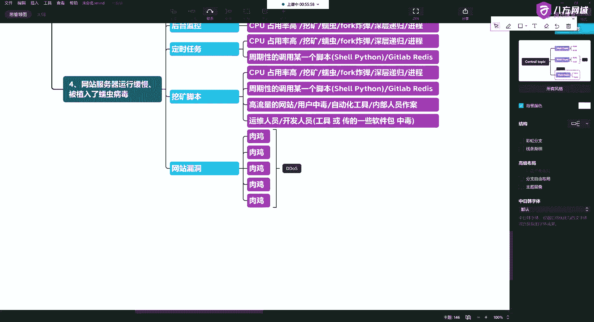
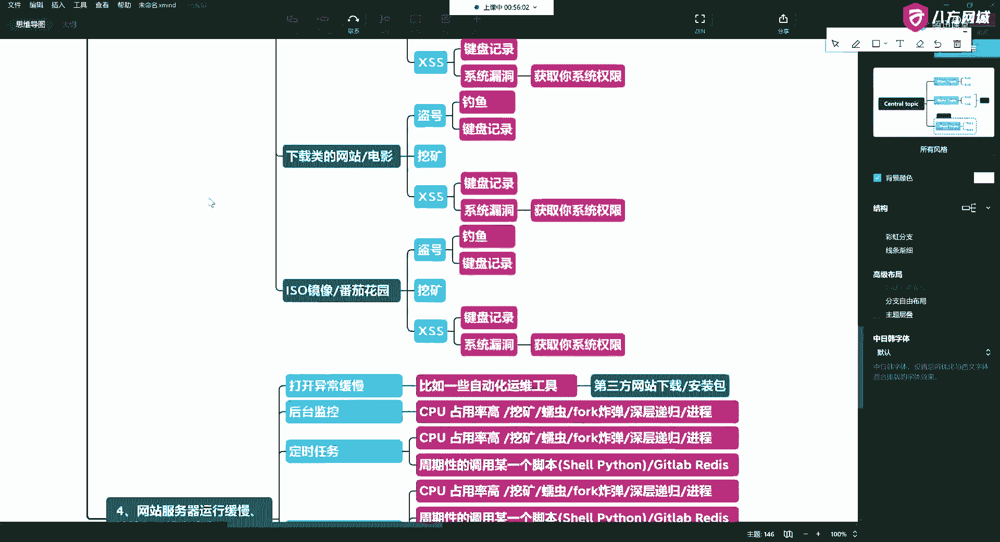
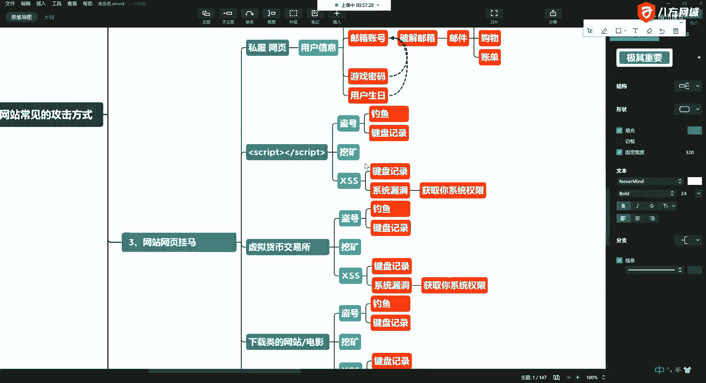
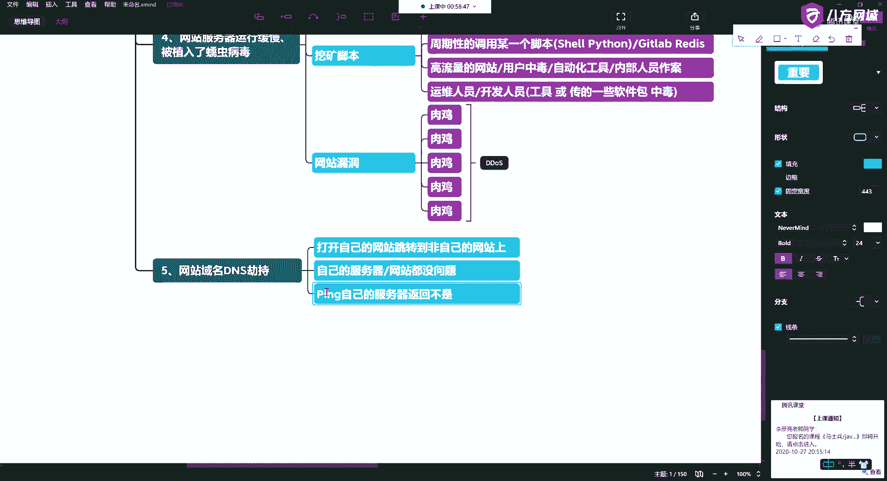
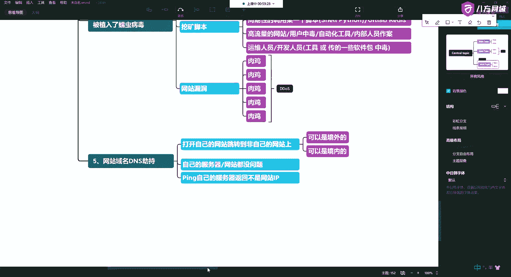

# 学不会我退出网安圈！中国红客技术正需要传人！全套666集还怕学不会？（网络安全／黑客技术） - P16：5.5-网络安全基础-常见网站攻击方式概述-网站域名DNS劫持 - 一个小小小白帽 - BV1Sy4y1D7qv

好这块也不能多说是吧。

哎电视上也不让播太多，所以说呢简简单的跟大家说一说啊，这长这是四种。

还有啊还有那么你会发现呢，你将来的这种问题呢，80%都发生在网络中啊，网络中我们在访问一个网站的时候，那么我们可以从他最早的上游入手，网站呢还有域名，对不对，我们要访问一个网站。

可以通过他的ip地址进行访问，也可以通过域名进行访问对吧，那么网站的域名叫什么呢，是通过dns服务器啊，把域名和你要解析的ip地址一一对应起来对吧，唉做了这件事。

那么网站域名的dns我们就可以进行进行劫持，哎比如说，啊我们大街上有一些问路的是吧，唉问路的那怎么办呢，哎你往那一坐啊，对不对，哎说上谁谁家怎么办对吧，哎不告诉你不是那家，对不对。

这种东西就跟劫持的是一样的啊，就是你原本是这个网页，但是我不让你解析到这个ip地址对吧，我给你解释到别的这个网页上啊。

然后达到我引流的一个目的，一说到引流又马上想起来是这一对啊。

这一对好吧，当然不止啊，我们只是简单的跟大家说一说，这东西到后边的话还会有好吧，那么这个东西呢，刚才说了啊，它有一些危害啊，打开你要的网页，是不是，跳转到跳转到飞自己的挖来着，好，好吧唉然后呢。

你上去看看你自己的服务器啊，服务器呢和你的网站都没毛病啊，这上面也没有病毒，对吧，唉你这时候呢，比如说你拼自己的，返回不是你的网站啊。

在这个ip等等等等，啊那这时候呢那你你你你访问的这个网站，那就多了啊，可以是境外，啊可以是境外。

