# 学不会我退出网安圈！中国红客技术正需要传人！全套666集还怕学不会？（网络安全／黑客技术） - P18：5.7-网络安全基础-常见网站攻击方式概述-网站的数据库被植入内容 - 一个小小小白帽 - BV1Sy4y1D7qv

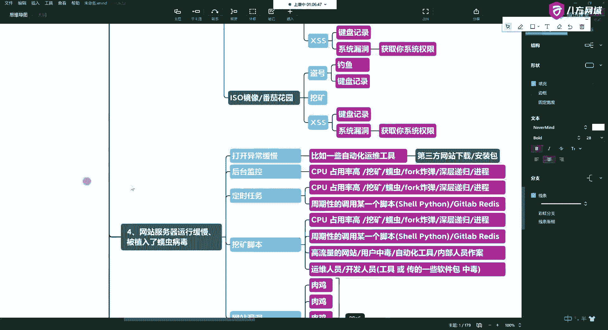

第七种，第七种呢就是网站的数据库啊，被植入内容这种东西呢就是你的数据库啊，就是我不搞你的这个网站。

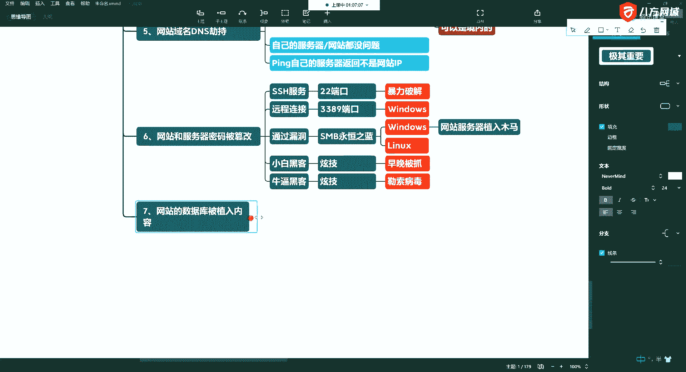

那你是用户，你这个数据你得存在数据库里，是不是啊，你存在数据库里头，那这里头还是前三个其实都都适用。

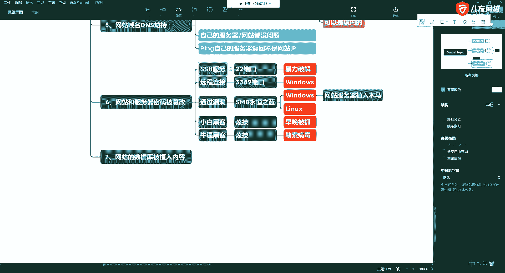

都通用ssh啊，能端口通过漏洞啊。

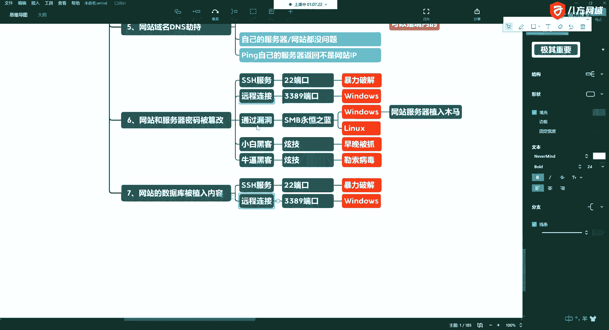

比如说还有的呢就是通过你3389啊，扫到了你的mysql，对不对啊，扫到你的mysql，然后通过你的mysql来进来啊，这时候也依然能改过，也依然能搞你啊，所以我们现在的话呢。

很多人的这个数据库优化是弱项啊，所以在我们的课程中呢。

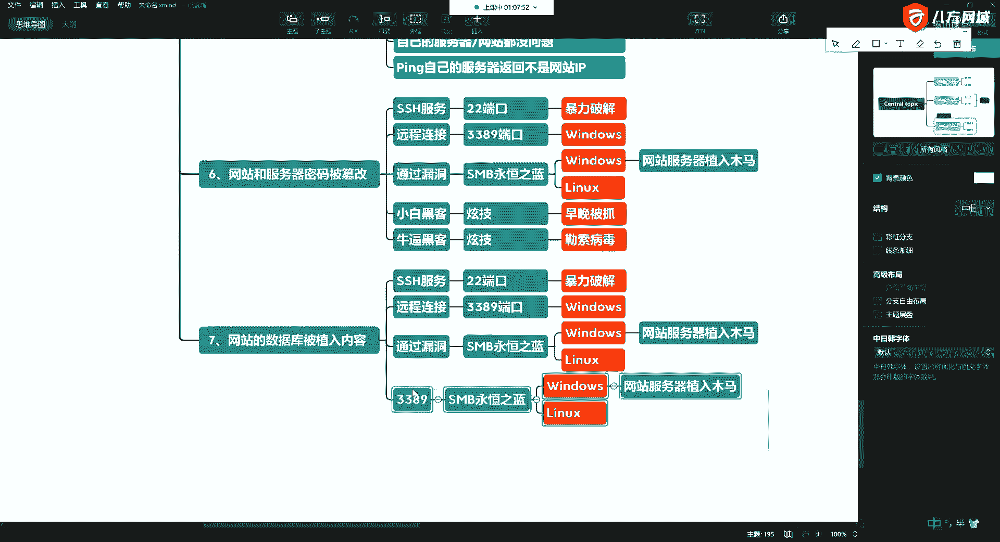

就是这里头，实际上我们要讲我们一些常见的数据库，啊，好比如说有一些人他没有运维基础是吧，比如说我们阿里云云上的这些主机，我们为了访问方便的时候，经常会比如说3306，或者说把36藏了，做一些远程的登录。

是不是，啊远程登录，那就给他一个权限啊，你给他一个权限，那么这时候可以是root，也可以不是root啊，当然有些人比如说他没有运维基础的话，他可能直接给你设了一个root 2%的选项。

那这时候就麻烦了啊，那再赶上你root啊，这个密码和你系统的密码是一致的，那这时候就有可能直接就过来了，人家就可以直接来猜，所以在这个过程中，那主要是从比如说你搭建环境是吧啊，搭建主从做高可用等等等等。

这时候去操作啊，所以我们很多的朋友的这个数据化的，数据库的优化呢，它本身是一个弱小啊，那这时候还可以通过一些什么呢，还可以通过一些sql注入。

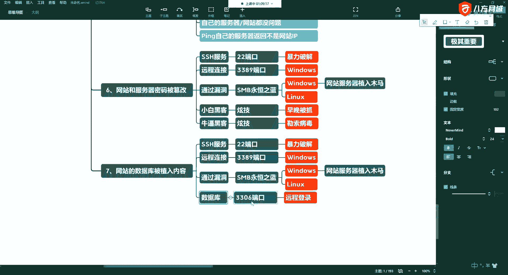

啊社会注入报你的库啊等等等等，后边我们会讲好吧，好这时候也是啊，你植入的东西发现你列的东西不一样了。

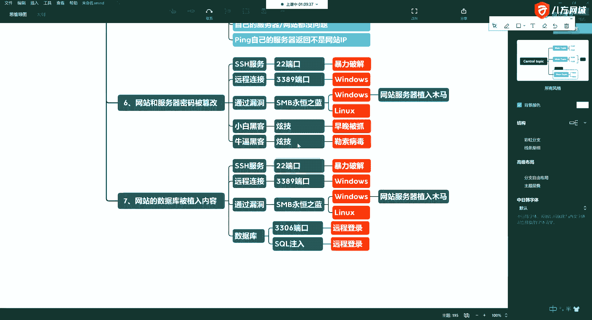

不一样了，还是勒索病毒专门有数据库的啊，尤其是mysql特别多，专门现在有一帮人就是在搞这个阿里云啊，阿里云，所以如果你这个数据库有问题啊，就就经常会勒索勒索什么呢，就是在你的数据库里是吧。

锁你的锁你的库，啊还有呢存你的表，让你交钱交赎金了以后给你解开哈。

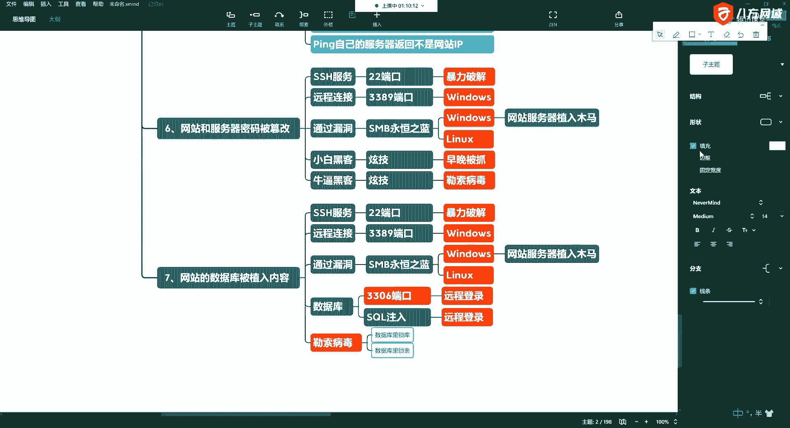

交美金或比特币，否则的话呢不给你解，不给你解呢，你数据丢了啊。

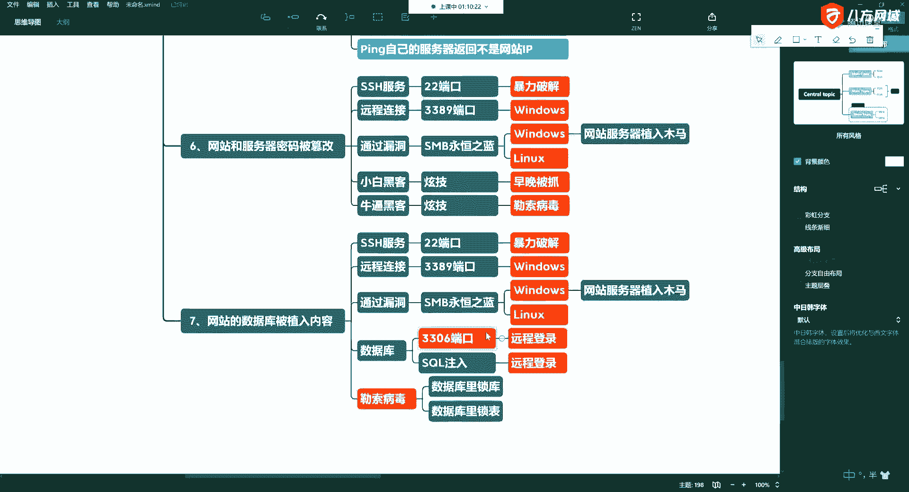

所以一般的呢像一些这种，银行啊，学校啊，政府啊，啊对吧。

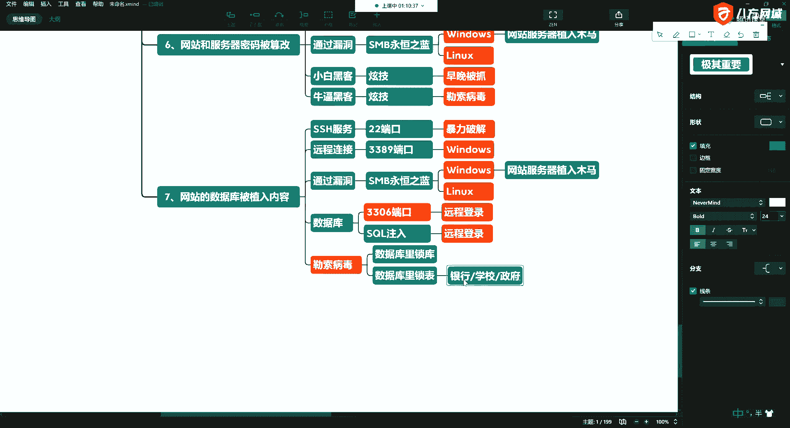

等这些部门容易中啊。

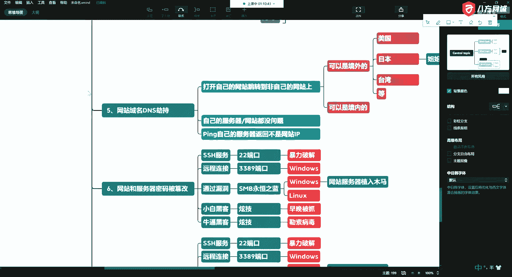