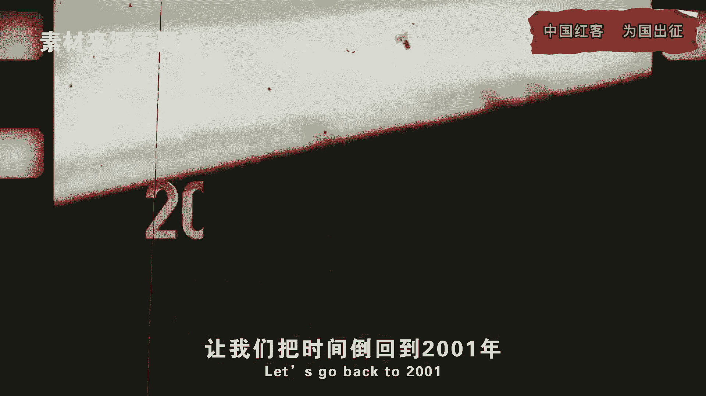
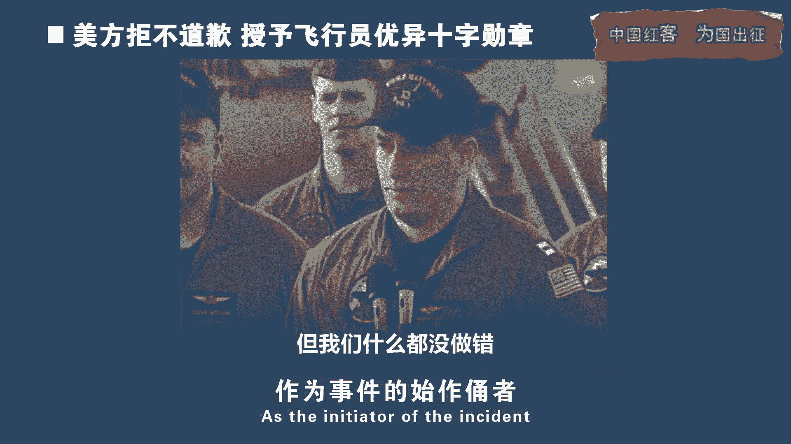
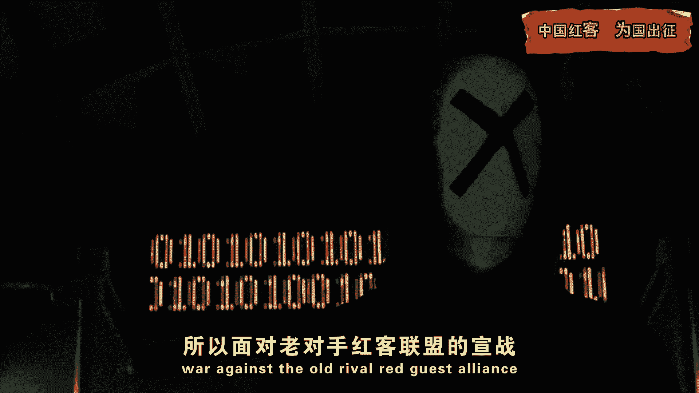
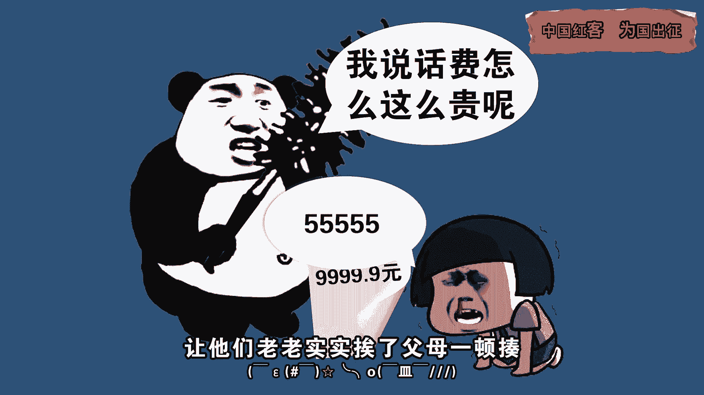

# 学不会我退出网安圈！中国红客技术正需要传人！全套666集还怕学不会？（网络安全／黑客技术） - P1：0.1-中国红客技术需要传承！ - 一个小小小白帽 - BV1Sy4y1D7qv

每一次行动是为了让世界听到中国的声音，爱你对峙过绝望不肯哭，一中国，最近我国互联网频频遭遇境外网络攻击，希望红客们像20年前一样，再次组织一场黑客大战，他们为什么要这样做，那这群红客到底是什么人。

20年前又发生了什么，今天小天就来说说当年震惊世界的黑客大战，让我们把时间倒回到2001年4月1日。

美丽EP3侦察机擅自闯入中国领空，遭到阻拦后，竟然向拦截的中国81194战机发起攻击，战机驾驶员王伟只留下了这样一句话，81192收藏，我去我妈妈，她就可无比荒谬的是，作为事件的始作俑者。

美不仅不道歉，一些美黑客更疯狂对中国网络发起攻击，如此嚣张的行为彻底激怒了中国网民，大家纷纷高喊着要反击，就在这时候，红客联盟站了出来，其实这并不是中国红客联盟第一，每次出现在人们的视野。

早在1998年，中国红客就靠黑掉印尼网站一战成名，在1999年，他们更是和美电脑高手来了个正面交锋，成功黑掉美网站，为中国发声，所以面对老对手红客联盟的宣战。

美方面也是相当重视，特别下发了加强网络安全通知，把网络漏洞一再加固，美国网络安全团队还预判了红客的攻击路径，故意只留下一个漏洞，等着来一个瓮中捉鳖，香槟正规军精锐齐出，红客联盟只能算是一群散兵游勇。

当时的中国互联网远没有现在发达，不仅没有互联网安全部门，就连拥有电脑的人也是少之又少，懂得黑客技术的人就更是凤毛麟角，没有人没有技术，这场黑客大战还能打吗，而结果就是在5月4日的这天晚上。

美白宫网站出现访问卡顿，甚至整个白宫官网竟然都瘫痪了，而这正是红客的杰作，这下美网络安全专家傻眼了，他们怎么也没想到，中国红客竟然选择了第一道攻击，导致网站不堪重负，停止不误。

原来红客联盟早已预判美方哲预判，采用了最简单直接的人海战术去扬长避短，根据发友的回忆，当时红客联盟特意制作了一个几10KB的软件，并且告诉他们，只要按照指挥使用软件，就能为这次黑客大战贡献一份力量。

但同时电脑也会有被攻击损坏的风险，网友们发现不需要任何技术技术，只要有一台电脑就能参与作战，瞬间激动起来，他们调动了所有资源，家庭电脑，网吧电脑，甚至学校的多媒体教学设备，拼凑了一支8万人的红客队伍。

齐心协力向美挖起攻击，虽然美国黑客马上对这些发展来源IP进行反攻，可这全民红客，把红客联盟的主力部队严密掩护起来，美黑客只能胡乱攻击这些诱敌部队，红客们就这样前赴后继，为保护国家尊严而战。

帮红客联盟争取到了黑入白宫网站的宝贵时间，于是当白宫网站恢复浏览后，全世界的人都惊呆了，大佬黑客白宫网站首页竟然飘扬起了五星红旗，所有人都看到了王伟永垂不朽，那一刻，美专家只能酸溜溜地承认中国的脚本。

小孩们竟然真的能瘫痪白宫网站，黑客宣布取得阶段成果后，红客联盟并不恋战，在5月8日，红客们主动撤离战场，结束了战斗，这一战，我方一共攻陷每1200多个网站，参与这次行动的电脑过半数受攻击波及损坏。

成了50包邮，都被图吧垃圾佬嫌弃的真垃圾，还有不少小红客用家里电脑参与战斗，昂贵的拨号网费，让他们老老实实挨了父母一顿揍。

这场靠无数红客换来的胜利，无疑是一场奇迹，他让全世界看到中国人的团结，听到了真正的中国声音，但这次网络大战也让红客联盟认识到，自己和美国还存在很大差距，当务之急是要让更多人掌握电脑技术，培养出新的红客。

每一次行动是为了让世界哪里不跪的模样，爱你对峙过绝望。