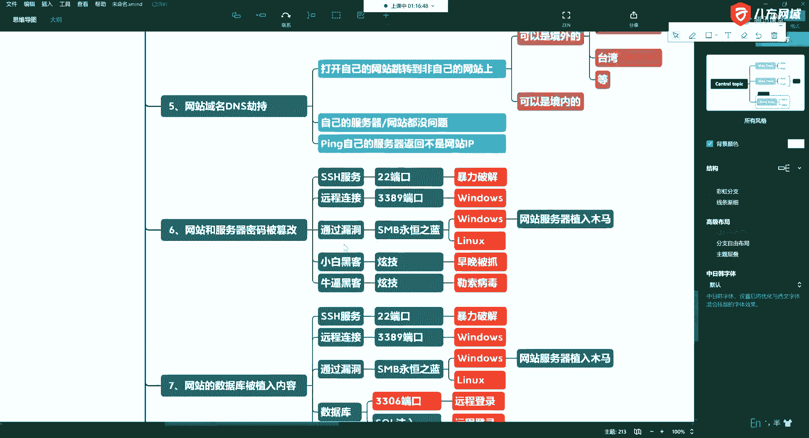
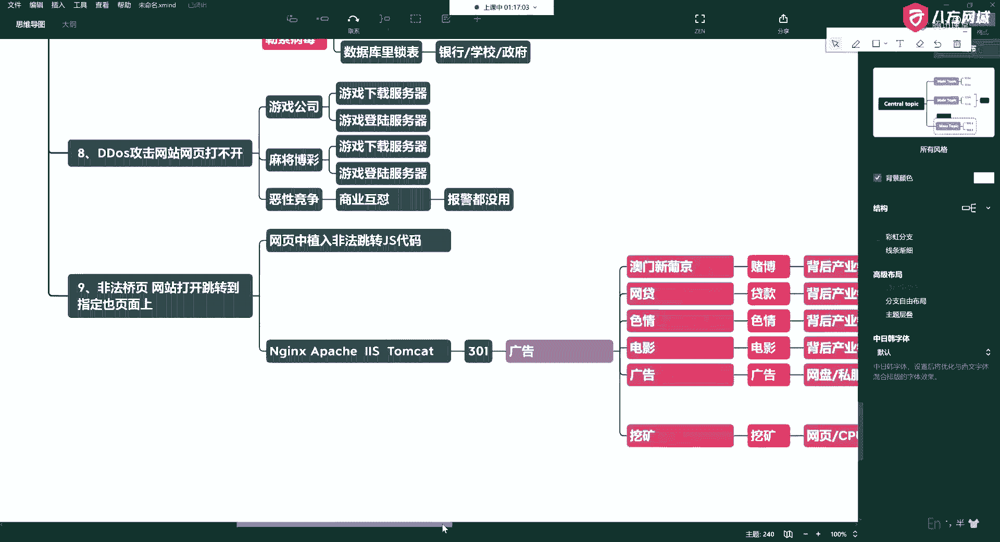

# 学不会我退出网安圈！中国红客技术正需要传人！全套666集还怕学不会？（网络安全／黑客技术） - P20：5.9-网络安全基础-常见网站攻击方式概述-非法桥页 - 一个小小小白帽 - BV1Sy4y1D7qv

啊所以这是第八种啊。

还有一个啊，说完了我们休息会儿啊。

还有一个咳咳，第九种啊，第九种常见的呢，那就是这个怎么说呢，这个技术叫做非法乔叶，非法交易啊，就是还是网站打开，啊打开以后啊，先让你打开，打开以后跳转到指定的页面上，啊。

好这种东西呢是通过什么实现的呢，啊就通过js，啊js代码，还有一些啊，比如说windows啊，那么这个网站的一提这个就多了，比如有ngx阿帕奇s啊，tom cat，好比如说这里的。

经常我们会发现有一个301重定向啊。

也就是重定向好吧，那最终呢这个回过头来还是这些东西啊。

还是为了。

广告流量让你从中进行获益。

好吧。

