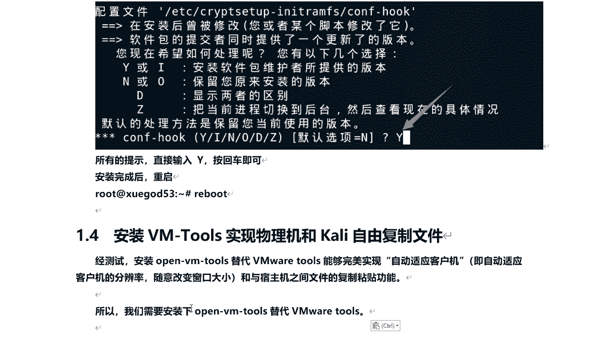
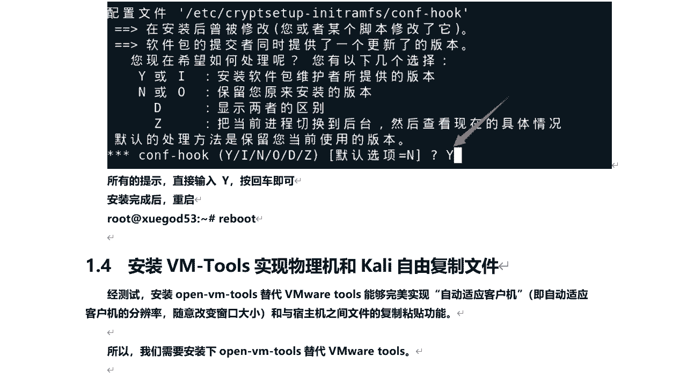
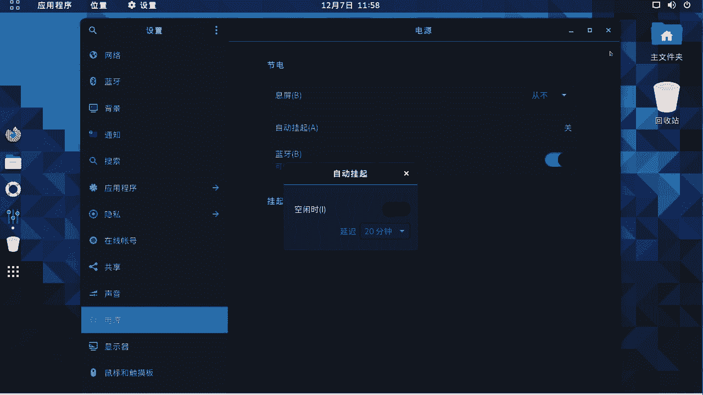

# 学不会我退出网安圈！中国红客技术正需要传人！全套666集还怕学不会？（网络安全／黑客技术） - P27：6.7-【Kali渗透系列】安装VM-Tools实现物理机和Kali自由复制文件 - 一个小小小白帽 - BV1Sy4y1D7qv

好那么接下来呢我们来安装vm tools，实现物理机和kelly自由复制文件，那么有的人会说啊，前面我们不已经安装过了，可以来实现自由复制了吗，物理和开启之间，但经测试啊。

我们安装open vm tools，来替代我们v mar自带的这个tools，能够完美实现自由适应客户机对吧，有自由自动适应客机的分辨率，随意改变窗口大小，同时还可以和物理机数，主机和物理机之间啊。

文件的复制粘贴功能，同时还可以进行拖拽，要比我们v mar自带的win tools要稳定一些啊，所以说那么我们需要安装一下的open vm tools，好吧。

那么如何去安装呢，我们来在kly啊，打开终端，啊然后呢执行一下了这条命令，apt install open vm tosca desktop空格f u s e啊。

那么这条命令是什么意思呢，对啊我给大家说一下啊，给大家说一下的，那么这里要说一点什么内容呢。

这个app对之前我们刚刚用过哈p命令呢，它是一条linux命令啊，那么它适用于deb包管理式的操作系统，主要用于从网上互联网的软件包仓库中，搜索安装升级卸载软件和操作系统啊，注意啊。

这个d e b是debt核心的linux系统，软件包的格式啊，也就是文件的扩展名啊，那么当我们执行a b t update对吧，从他是去开立圆中同步对吧，有哪些软件需要更新。

也就是运行这个命令其实没有更新软件，而相当于windows下面的检查更新，获取的是软件包的状态啊，那么有时候在我们进行安装任何一个软件命令，之前，都要先执行一下apt update啊。

然后这条命令呢什么意思呢，a p p install是安装，那当我们只安装软件的时候是啥，app store，它通过你设定的源去在线下载，你需要安装的软件包，下载到本地之后，然后呢再执行安装它。

软件包的格式呢是第1b后缀名啊，第1b格式的啊，那么这里我们安装最新的vtools，相关的软件包啊，前面的这个是啊，它是呢能够实现什么，你的kelly的屏幕的分辨率，能够自动适应客户机窗口的大小。

然后fu s呢它是用户空间文件系统，通过它呢可以实现物理机和开离之间，自由拖拽文件和复制内容，自由拖拽文件啊，如果你不安装它，你不能实现从物理机往kly里面去拖拽文件，好吧。

然后呢这里呢我们在执行它之前呢，我们先执行下apt update检查更新。

然后我们再去运行啊，安装win tools，然后输入y回车，我们等待它安装完成之后重启下的就可以了啊，然后呢下面我给大家说几个命令好吧，关于apt和apt刚get对吧，这两个命令什么区别呢。

其实他俩没有什么区别，都是一样的啊，都一样的，那么a p t呢可以看作是a b t杠，get和app杠cash命令的一个子集，可以为包管理提供必要的命令选项，而a p t它提供大多数都是与a p t杠。

get及gb t杠cat有的功能，也就是说他这个命令相当于他俩的合集啊，方便使用，那么这个命令和这个命令哪个更好记一些啊，当然大家可能会比较喜欢app对吧，它比较简单吧。

就三个字母a p t杠get的虽然没有被弃用啊，但是作为普通用户来讲，我们应该首选使用哪个apt，那也就是所有使用apt杠get的地方，都可以用app来替换。

那么apt install和a b t杠get install功能是一样的，都是安装软件包，他俩之间呢没有任何区别，那么常用的命令呢，我给大家来说一下它啊。

install apt install安装软件包，那么移除三图软件包，用apt remove更新呢，可用软件包列表有检查更新apt update好吧，然后通过upgrade呢。

是通过安装升级软件来更新系统，p up grade，还有for grade，通过卸载安装升级来更新系统啊，还有一edit source这编辑软件源信息文件，那么就相当于啊vm来打开这个文件。

就是我们设定源的那个文件啊。

然后这里头需要按一下大y啊，还得看啊，大y输入到y大y大y一路大y就可以了啊，一路yes，都安装最新的，好安装完之后呢，我们来重启一下的reboot，回车。

root 123456。

好那么到此为止呢，我们整个的系统啊相关的配置就完成了啊，那下面呢我们来注意下其他的相关设置啊，点击这里的啊这个小图标，点击设置，关闭它的自动锁屏功能，因为假如说比如我们的windows系统哈。

那么你时间长离开了是吧，它会自动锁屏，那么开呢我不想让它自动锁屏，怎么办呢，点击这个设置之后，点击电源啊，熄屏五分钟改成点击一下了，重复，好吧。

这就可以了啊，关闭关闭，关闭完成之后呢，然后呢别忘了做个快照啊，什么是快照呢，相当于备份在，那么就是你后面啊进行的设置或者操作，如果系统出现问题了，你没有拍照就重新做系统，很麻烦。

做快照呢建议大家最好是先关机做快照，因为你开机做快照比较占内存啊，点击这里关机，然后点击虚拟机快照拍摄快照，给自己的快照起个名啊，那别的快照叫什么名字，ky刚安装好，然后呢没有配置啊。

因为后续呢还需要进行一下网络配置啊对吧，s h配置啊，然后让xl sl可以连接到ky去传些文件啊等等，点击拍摄就可以了，拍照呃，这个快照做好之后呢，我们点击虚拟机快照快照管理器。

可以看到我们所做的所有快照啊，比如说后面比如我的kelly啊，出现问题了，那怎么办呢，我可以点击这里转到啊，可以恢复到这个快照啊，它就相当于一个备份啊，好的，那么下面呢我们来做个一个总结啊，好的。

今天呢我们给大家分享了哪些内容呢，kelly linux啊，简介什么是kelly linux，然后使用win w虚拟机安装kelly配置，开立的a b d命令，在线安装包的源为国内源。

最后呢我们安装一下women tools。

