# 学不会我退出网安圈！中国红客技术正需要传人！全套666集还怕学不会？（网络安全／黑客技术） - P2：1.1-网络安全基础-白帽守则（上） - 一个小小小白帽 - BV1Sy4y1D7qv

课程啊今天呢这个干货比较干啊，希望大家呢一定要谨记我们今天说过的话啊，所以今天呢这个呃这个课程呢，对大家以后的职业生涯啊是有作用的啊，有影响的，好了我说了啊，八点准时起飞是吧啊。

你到八点呢我们就准时开讲，好吧，今天呢要给大家分享的这个东西呢叫做什么呢，就是我们入行啊要做的第一件事，我不知道有没有同学在银行干过啊，如果银行呢你去入职银行的第一天要干什么呢。

嗯一般的上午带你办入职啊，然后下午呢就带你这些新员工呢去参观监狱啊，就是在北京的大兴就会有这个监狱啊，那为什么呢，因为过去有句老话叫人在河边走，哪能不湿鞋呀是吧，如果你在银行，你天天跟谈钱打交道。

你万一趁人家不注意，你揣兜里一沓是吧，唉那这样的话，那你不就犯罪了吗，啊我们这行业呢跟他们也差不多啊，虽然呢我们不是每天摸着真金白银，但是我们守护的呢是安全啊，这个学科呢它比较特殊。

那么我们现在所有的it行业，这些学科没有一个啊能跟安全一样，那为啥呢，因为这个东西它比较敏感，在2017年之前，也就是上一讲给大家讲网络安全法，在2017年之前，这个行业比较混乱啊。

可以说是一个灰色地带，并没有人说什么能做什么不能做啊，所以呢像人肉搜索呀，像这种ddos攻击呀，像盗人qq号啊，电信诈骗呀，那时候比较猖獗啊，不像现在有所收敛，所以呢还有一种呢。

就是比如说你要从事安全行业，比如说渗透的工作啊，那比如说您去了电信行业啊，交通行业对吧，在金融行业啊，税务行业等等等等啊，或者精工的行业，就是去了以后啊，会给你签一堆保密协议。

你祖宗八代都给你查的特别干净啊，你给祖宗八辈都得是贫农才行，说到你爷爷那辈是地主，那完了啊，这事你干不了，有的人有有真的有这么必要呢，确实有这个啊，因为数据现在呢是非常可贵的。

那么随着我们学习不断的深入，您就会发现其实我们的操作系统，我们的手机啊对于我们来说没有任何安全啊，只要每个人愿意啊，只要微软愿意，只要谷歌愿意，随时打开你的电脑，看你里头的内容，随时打开你的手机。

看你里头的内容啊，所以呢我们这些学安全的人员呢啊，咱们这些同学一定要注意，不要大家不要有这种阿q精神，说觉得我要我装了一个360，我就怎么着了，跟裸奔差不多，啊所以我们在这个安全行业呢对吧。

有一个技术叫免杀这个技术，当然这个东西呢课程上不让讲，不让播，但是呢有这么一个东西的存在，那么也就是说我们写完一个代码以后，生成一个e也好，生成一个plog也好，生成一个a p k也好。

我们都可以做免杀，啥意思，啥叫免杀呀，就是要欺骗我们的防火墙杀毒软件对吧，让他觉得这个东西是一个合法的，安全的，是在白名单里头的啊，他不是个病毒，不是个恶意程序，你得通过我不能拦截我这东西就要免杀。

那么我们通过360这个做免杀，大概写代码也就四五行左右啊，这是世界上最容易过的一个免杀的技术，那么在这里头是哪种安全软件，相对来说比较复杂的卡巴斯基啊，卡拉斯基，所以说呢大家如果如果强调安全啊。

你用卡巴斯基软件好吧，那他们为啥呢啊，他俄罗斯人存不存在对我们的一种监控呢，还是那句话，只要他愿意都可以啊，只要他愿意都可以，但是那为什么这么选择呢，是因为像欧洲国家，像俄罗斯。

他会要求微软开放底层源代码，但是呢微软呢对中国是不开放底层源代码，所以呢我们写一些软件呀，就是杀毒软件啊，在中国它顶只停留在你的应用层，再深层次一点，跟微软有深深层的合作的。

那你这个钩子才能下到它的驱动层，扩到系统层，我举个例子，比如银行是吧，你银行都会用到u盾，有的银行呢叫usb key啊，i c b c呢叫做优盾，除了i c b c呢都叫做usb key，有一代和二代。

那么这个usb key的这个驱动还有这个证书，那么它对我们普通的啊这种软件，它作用就不一样了，它会要求优先级最高，那么你的优先级高，那么你就不能是应用层的，那你就得逐渐往下降，降到系统层。

那么也就是你输的时候，这个东西它从底层的先把你内容获取到啊，然后你应用层，在有一些恶意软件或代码的时候呢，这时候又获取不到了，那么这样的话呢就需要微软去授权，就是你得去找微软谈啊，说我这个东西。

我这个证书有个驱动对吧，要想获得你系统的这种认可啊，那么一点ram微软去谈谈完了以后，你得给他钱，大概花多少钱呢，大概2000万左右，就是人民币啊啊所以你要给他这么多钱。

然后他才能让你的这个usb key啊到他的系统层啊，所以这也是题外话好，那开始我们这个今天的内容啊，今天这个内容呢是我们一个入门的课程，首先第一节我们进了一个普法啊，那么今天呢其实我们由浅入深啊。

不管你是个小白也好，或者您是有经验的也好，对吧，唉我们都统一的让大家呢能够跟得上啊，能够从入门的开始学，首先第一个我们想说一下呢，就是我们认识一下黑客，啊就是这个东西呢大家经常在网络上听说过啊。

就觉得这个东西呢现在呢他被我们这个网络呀，自媒体呀给丑化了啊，它本身是个褒义词，但是现在呢随着一些安全事件的发生呢，现在就变成了这种贬义词了。

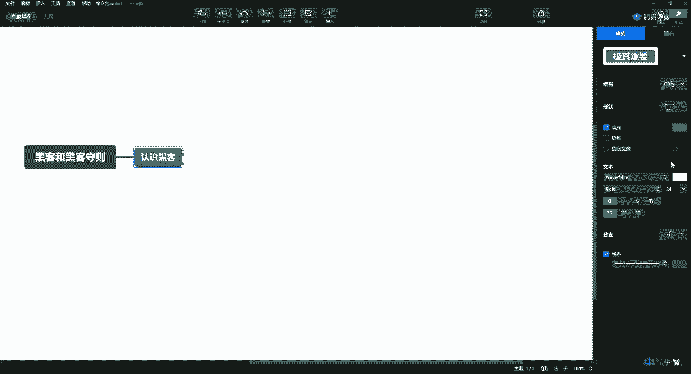

就变成了这种贬义词了，那么最早呢所谓黑客两个字啊，他就跟我们现在所谓的极客啊有点像啊，那么这帮人呢一般呢都是比较神秘的啊，可能是修车的老大爷，也可能是在金融行业啊，这个光鲜亮丽的这种白领啊。

也可能是这种蓝领是吧，唉各种各样的可能是各种各样各种行业的精英，他们呢一般呢的话呢，都是具备这种极客的精神啊，比如说你看这个人对吧，他追求的这个设备电脑啊都是一种高配的，那这些人你要小心了啊。

他有可能是打游戏的，也有可能这些人呢就是搞邪恶的，所以他们对硬件的追求是这种极端的，每年的话呢如果不造个十几20万，在这种硬件设备上，你都不好意思说啊，尤其是这种资深的对吧，玩超频的啊。

玩设备的家里都有服务器的，有企业级设备的，有防火墙，有硬防的啊，光宽带拉三条的啊，就这样的，你去他们家做客的时候，这些人你千万不要惹他啊，惹他到时候就容易麻烦对吧，所以在一般人的印象中呢。

就这些人有的都很神秘啊，我们一听说黑客这玩意儿好神秘啊，这好牛逼啊，都看不见这种人啊，他们呢一般呢都说在网络中这个战无不胜啊，攻无不克呀啊几乎呃是无所不能的啊，这都是我们这个这个电视剧啊或者电影啊。

为了照顾这种效果啊去说的，但是呢真实的现实生活中啊，真有啊，真有对吧啊，而且呢这个咱们解密一下啊，黑客呢也并没有那么神通广大啊，也不是说无所不能，你让人家造原子弹去，是不是哎他也造不出来啊。

但是你要说让人去偷造原子弹的图纸，人家真没准能给你弄出来对吧，哎所以呢有一个人叫伽利略嘛是吧，他说你给我一个支点，我能翘起来这个地球，所以黑客们呢一般的都说什么呢，你给我一根网线，我也能搞死地球对吧。

那这这这也也都是这样的啊，那么通过我们给大家去普法，去给大家介绍这些技术，想告诉大家，那黑客的技术呢也并不是那么复杂啊，甚至我现在给你一些工具，你也可以直接用啊，你也能搞死他对吧。

哎这就有时候既是一个网络小白啊，如果按照我们科学的方法对吧，你也可能成为一个合格的黑客啊，所以这是我们的一个开场白，跟大家去介绍一下啊，但是呢黑客和骇客不一样啊，黑客呢刚才我说了，一般都是崇尚技术。

追求极致硬件的这种这种人啊，你可能觉得她买个衣服，你可能有个女孩子去买个衣服花好几万是吧，但是你看那黑客呢可能那就是个屌丝样子啊，头发也不洗对吧，哎这这个这这这1年四季穿个t恤牛仔裤啊。

登个耐克鞋也就这样了啊，他可能对于这种外在的并不追求，但是这些人呢刚才说的对，硬件啊，那玩意儿是无无止境的投入，你比如说键盘啊，什么这那的啊，好了这咱们简单的就说一下，大家记住这是一个褒义词。

那为什么变成了贬义词了，就是因为有很多的安全事件，说谁谁谁啊，这个哎呀这个这个钱包，这个这个钱又被盗了，谁又被攻击了啊，所以呢黑客呢也有好的也有坏啊，咱们过去的老化呢叫一颗老鼠屎，坏了一锅汤是吧。

坏了一锅粥，那么也会有一些老鼠屎，所以呢就为了杜绝呢，我们将来里头有更多的老鼠屎啊，所以这一节呢我一定要给大家讲讲黑客的守则，我们什么能干什么不能干啊，为什么一定要强调这个呢，就从我们招生开班以来是吧。

我们在这个两三周内啊，我们现在已经达到了60多人啊，就是证明大家对这个非常的感兴趣，经常有同学问我老师能不能教点技术，我去搞死我的同学，这东西怎么说呢啊第一天我就说了。

我们学这个技术是为了防止世界被破坏，为了爱和正义，那你如果问我说老师你教我点什么东西，我就搞死谁，那我只能告诉你，对不起，我教不了啊，我教你的技术一定是出于对吧，我们做正经事儿啊，这样才行对吧。

唉剩下还有一些话呢，就电视上不让播，这个只能意会，不能言传，就是你不能说非文字性的，你跟我说，让我给你留下什么文字性的东西，就是留不了啊，所以这个呢请您一定要多体谅，第二个呢我想呢说一下呢。

我们真实的故事就是发生在我自己身上的，这个真实的故事，通过这些故事呢告诉大家什么能做什么不能做，否则你一定会被抓啊，所以一会儿呢我会给大家介绍，介绍你们的师爷啊，还有呢师叔对吧，就是我们啊。

当时呢学这个东西的这些师兄弟儿啊，介绍一下我们的故事，那一是呢也是为了普法，给大家打个样啊，告诉大家，其实这个行业如果你要去做，你有很多的选择啊，不一定不要走上一条犯罪道路啊。

因为我的师兄弟就有走上犯罪道路的，我给大家说一些案例，回头会给大家说哈，好这个就是简单介绍一下黑客啊，就是大家先解开这种神秘的面纱啊，不要跟他去啊，去矫情去叫板这件事。

第二件事呢就是我们如何成为这样的人啊，就是我们很羡慕，或者说我们很崇拜这样的人，想成为这样的人啊，经常有人问我说亮哥，我怎么才能成为成为你，我经常就说你长大后你就成了我哈，对老师总说我老长老长不大。

是不是，那你慢慢长呗，别着急啊，那么第二个呢就是要告诉大家黑客的守则，这个很重要啊，以前我做线下的时候，都要求学生把这东西背下来，但是呢我们线上的话对大家呢就不要求了，但是我已经告诉你。

这个东西很重要啊，这个东西很重要，你如严格遵守我们给你制定的黑客守则，你就不会被抓啊，否则你被抓了，你再跟我说怎么怎么着，怎么怎么着，你这东西就晚了啊，如果您还是上学，还是孩子。

这样对您将来的这个职业生涯啊，可能对你的人生都会有影响，所以呢这个东西呢不要以身试法啊，我再强调一下，不要以身试法，你如果真的憋不住手痒，你找我啊，你找我对吧，哎我有自己的网站，我可以给你授权。

让你去搞，但是你千万不要在未授权的情况下去弄别人，好吧，所以呢我们还有很多的技术要学，很长的路要走啊，你现在连怎么隐藏ip你都不知道，你现在就想搞人家，人家一下就能追踪到你，追踪到你。

那是不是手铐子一戴，那就不好了好吧，所以做咱们这个行业呢一定要特别的低调对吧，没有整天满大街喊我是黑客，我是黑客，那都是大傻子，你知道吧啊人家真正的黑客大家都很低调的啊，都说这东西我略懂。

没有人上来说哎呀，这东西我都懂，不会的，都很谦虚，很谦卑啊，明明很厉害，上面都有个略懂啊，略懂知道一丢丢一奶奶一扣扣啊，就不会说他很张扬，所以说大家呢一定要很低调啊，好了啊，刚才我说了啊。

这个黑客咱们敲两句啊，省得你忘了好吧，其实就是热爱技术，热爱还不行，应该说叫嫉妒啊，极度热爱狂热的那种，就是你把它扔这了，你都找不到他的存在感啊，啥意思呢，就是嗯你就不知道他还活着啊。

你只要给他一个电脑，给他一个键盘，只要有wifi能上网，哎他就可以去干那件事，极度热爱技术啊，所以这儿呢引申的一句话呢，就是唉兴趣是你最好的老师，你自己去悟这句话啊，我教你也是把你领上道儿啊。

那么他热爱技术，崇尚技术，那为什么有些人一说哎呀这个技术很简单啊，你说呢上来说c语言很简单的，那都是小白啊，你不用跟他聊了啊，没有什么货对吧，哎反而到有很多人他非常崇尚技术，他就玩到一定程度。

他就知道哎呀，c语言真的是博大精深啊，他能干的事儿太多了，真的你问的特别简单的，连指针都玩不明白，函数都整不明白的那种对吧，所以崇尚技术啊，他们也许是程序员，也许是网络管理员，可以是各色各样的人啊。

还可以是这种，可以是程序员啊，网络管理可以是白领，啊可以是学生啊，还可能是辍学的啊，这种自学成才的啊，我之前教过一个14岁的学生啊，也很有天分是吧，所以呢这块呢就大家可以了解啊，还有什么diy达人。

啊这这这都行，就是玩硬件啊，但是他们都有一个共同点啊，那么他们都热衷于这种推陈出新啊，有自己的想法和准则，好这很重要啊，想法和准则好了，那么说说准则吧，这个黑客手镯的版本啊有很多啊，有很多的版本。

那么基本上呢都是大同小异啊，那么我给大家说一下呢，就是你们师爷传给我的啊，我传给大家就是属于这个全球啊，所有这些从事安全的人，不管你是白猫还是黑猫啊，你还是搞邪恶的，就是大家共同的。

具有共识的认可度比较高的一个版本好吧，首先第一条啊请您牢记，第一条请您牢记啊，也是很重要的一条，就是比如说呀我们现在就是做渗透啊，这东西实际上就是攻防嘛，对不对，但是呢不让他们说，只能说是渗透对吧。

第一条就是不要恶意的，破坏任何系统，这东西我跟你说，咱们大家呢就达成一个共识啊，就是我给你所有讲课的第一条，肯定都是不要恶意的破坏任何系统，人家也不容易啊，比如说人家那个平台。

人家花了十天半个月才搭起来，你上来一句，你直接进去了是吧，比如说你rm啊，杠rf啊，杠星对吧，你这么来一下人就受不了了啊，所以说你们又没有杀父之仇啊对吧，哎不要乱来啊，不要乱来，还是那句话，不要乱来。

大家都不容易啊，所以第一条不要破坏任何系统，啊你这个恶意的破坏，恶意的破坏他人的软件啊，比如说让你写一软件是吧，或者他的服务器啊，将料承担法律责任，现在立法了啊，唉就像我们这个同学说的啊。

唉这都是骗鬼的话，这都是骗鬼的话啊，哪怕你就是进去用他的电脑打开了一个百度，这都不行啊，这都不行，如果你只是使用啊，计算机这东西也就叫做非法的，也是非法的使用，后边呢我会给大家讲啊，你黑掉人家一台服。

sorry啊，说错了，你渗透人家一台服务器，这整个的流程是什么，你应该怎么做，你才能不被人抓住，让人神不知鬼不觉啊，这才叫你本事是吧，哎那人家一看他知道你了，那那那你那只能说你是大傻子啊。

所以这个东西呢，我们为什么这个课程要有大礼包呢，这东西就跟你将来的成长啊，或者你要学习这个东西有帮助好吧，所以第一条啊再次强调，不要恶意的破坏人和系统啊，不要破坏任何系统对吧，唉好第一条大家注意啊。

那么这里一条隐和隐身的一条啊，就是今年呢，我们不就出了这个微盟的这个事件吧，啊这个东西就是不道德的，这是恶意报复啊，这都不叫黑客的行为，这就是你有权限，你直接进去了，所以这里头就告诉大家，千万不要。

破坏啊别人的，文件或数据，啊我我我退一步啊，我退一步，万一有些人他手痒是吧，你真操作了啊，你真操作了，你也要备份一下，你记住啊，你真的就你就恨它咬的牙根都不行了啊，你就恨死他了，那你在删除之前。

你也备份下载到本地一份啊，万一有一天逮着你的时候，你把这拿出来，那还能将功补过啊，少判你2年好吧，这个如果你真要删啊，你要备份一下，记住啊，再次强调这是第一条啊。

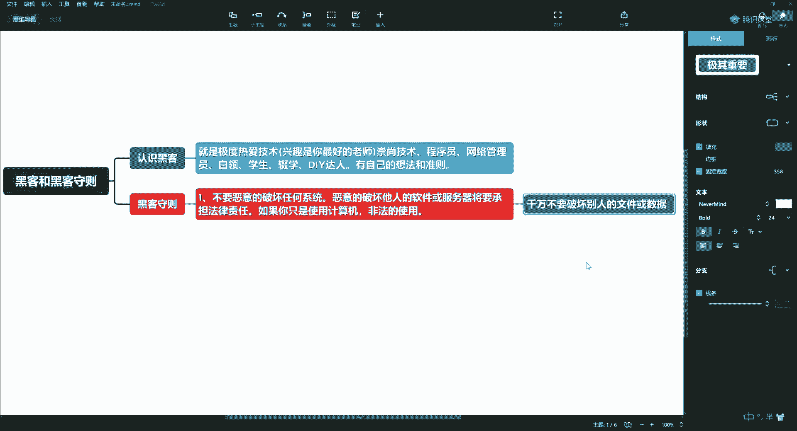

第二条，第一条说完了，第二条说的是什么呢，唉刚才是不让你修改啊，不是不让你删除啊，有同学说，那你不让我删除，我修改一下行不行啊，啊也不修改啊，不修改任何，说我是一个用户的对吧，我干掉他了啊，我黑进去了。

我我改一下用户级别的，行不行行啊，你别搞人家系统对吧，唉你搞人系统，人家损失就大了啊，不要修改任何的系统文件，如果你是为了进入啊而修改，说我想进入这里头这个这个系统中，我不修改不行，可能我权限没有是吧。

我要提权我去操作啊，那如果你修改了是为了进入，那这时候你修改完了以后，你再给人家还原回去啊，说请在达到目的以后将它，还原啊，波尔加恢复，这是第二条，好吧所以大家呢一定要有有道德啊。

你别说你说我改完了我就不弄了啊，这玩意你爽了是吧，人家到时候受不了，是不是哎所以这第二条一定要注意啊，这个东西呢你给我考虑，原则上是不让改啊，但是你不改，你进不去，那没办法，那那你就改。

改完了以后再给他改回来啊。

所以这个东西呢也是能减少人家损失的啊，大家过过招，这没关系对吧，但是你别太过分啊，第三个是很重要的啊，我们年轻的这些黑客呢经常会容易犯这个错误，就是不要轻易的将武，将你黑掉的站点，sorry啊。

将你渗透的站点好，密码啊，告诉你不信任的朋友。

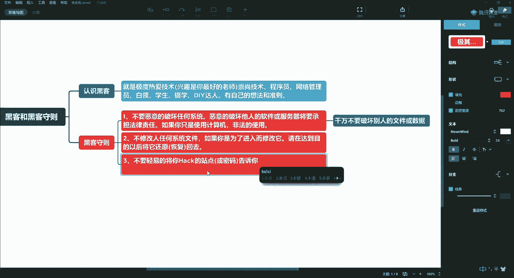

唉这第三条啊啥意思啊，那有些人呢他就跟那个学车一样啊，他刚拿到本的时候呢，他手痒就特别想开车啊，就我们这也一样是吧，他有的同学学完了以后呢，他他也手痒，他特别的就就早就追上那个站了啊，他早就想弄的对吧。

你弄归弄是吧，弄完了你你你你别这个这个发朋友圈啊，发什么论坛呀，你到处吹逼去啊，你说我前两天把这站黑了啊，这个管理员administrator of the mean，他密码是多少啊。

你你你别弄得地球人都知道啊，是不是哎这就跟那姑娘一样是吧，你瞧她好对吧，你睡归睡，你不要拍人家照片，什么发朋友圈，你这事不到的啊，所以这第三条大家要注意，画一星标，别到处说啊，一是保护你自己。

二是保护别人好吧，那如果你到处说哎让人dao，那你活该，第四条，不要在什么论坛啊，什么群呐啊，谈论或讨论啊，任何比如说你黑掉网站的事，啊即便是这个网站真正被你黑掉了，手机真被你黑掉了，烂在肚子里啊。

就自己知道啊，跟没事人一样，这时候就得看演技了，是不是就问你在哪儿，我不知道啊，不会啊，我连esc键都不知道是哪对吧，哎呦就我那电脑开机就得开十分钟，你觉得这事儿像我干的吗。

哈是他是他就是他我们的朋友小哪吒，就是他干的啊，但是他很低调，知道吧，不要讨论，不要在群里说，因为你不知道群里都是啥人是吧啊，跟你关系再好，可能就是你亲弟弟，哎你跟他一说，他对你产生这种崇拜。

盲目的崇拜，他觉得卧槽你好牛逼啊，然后呢你弟弟出去满世界的说啊，说我哥把谁谁谁网站给黑了，那一会儿警察不就去你们家了吗，啊这种坑坑哥的事就有人做过啊，我师傅当年怎么入的狱啊，就是被他弟弟给坑了啊。

那时候中美大战的时候，我们打的都非常激烈啊，后来呢他弟弟到处炫耀说你看我哥多牛逼是吧，中国很牛逼的黑客很有名对吧，哎结果呢就因为他去炫耀啊，不服不忿儿啊，一传十十传百飘柔，就是这样自信，有个同学啊。

他爸爸就是干这个的啊，就就在公安里头净逮着这帮人呢啊，没地出气去了，结果那你不撞撞上了吗是吧，天火燎这么毛该着啊，所以呢到时候，哎呀一会儿我再跟你们聊师爷的事儿啊，一会儿会聊到他啊。

所以不听话的这个呃是的。

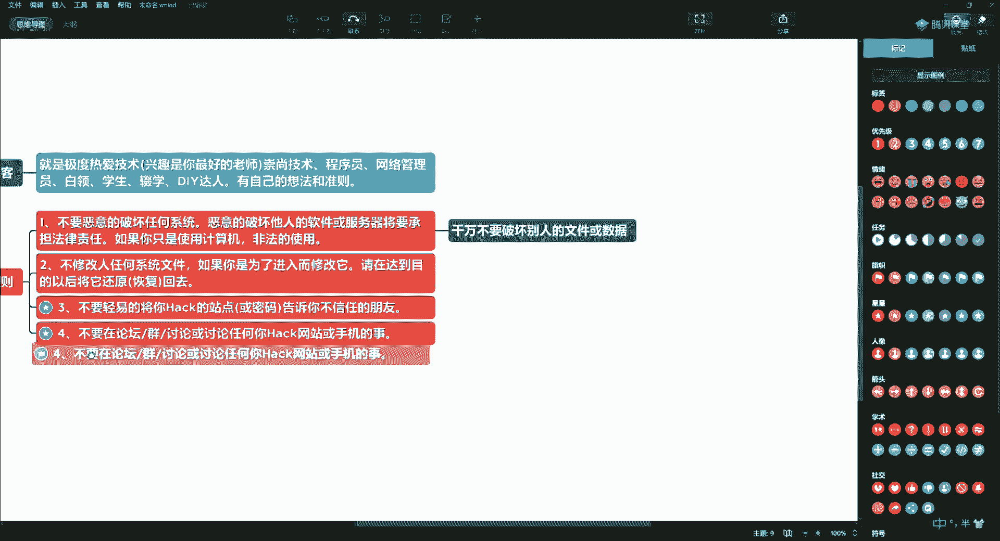

还有是这个如果遇到比较坑的啊，这种坑爹的货啊，坑爹的货，到时候就能弄一，第五个就是大家呢一定要取一个网名啊，一定要取一个网名，就是你不要用真名，比如说你用微信啊，微信或者啊，比如说我们现在都有微博。

有博客，尤其是我们这些技术人员，经常会写写一些技术博客对吧，哎你写技术博客的时候啊，就是我们所说的叫你post的文章的时候，请不要使用真名，啊不要使用真名起个艺名，起个艺名不是小哪吒呀是吧。

哎这玩意儿的啊，起个跟你不相关的好吧，你你你不要整天拿着真名到处这个招摇啊，说那个为了打自己的知名度上面，非得写自己真名啊，或者说那电视台采访那两句哎，说大哥是吧，哎我听说你们技术都挺牛逼的。

那你一定要用一个化名，不要用真名啊，你看那上电视台的黑客，真正做安全的那些很牛逼的，怎么办，把脸都遮上，戴个面具啊，为啥呢，就是一些国家信息安全人员，就是连脸都不让你露，你知道吧啊。

所以这块大家要注意那个葫芦娃啊，这可以啊，葫芦娃可以。

已经说了五条了啊，第六条，第六条是什么呢，啊，入侵期间，这俩字不让说啊，渗透其间，说什么你们不就是是吧，哎入侵期间，比如说你这正入侵的呢啊，这已经shell都已经进去了，对不对，题全都ok了。

你突然间上厕所，那你要上厕所的时候怎么办呢，一定要把你的键盘什么的锁屏啊，不要说这个这个这个，或者说你从事安全行业是吧，客户很信赖，你说你现在呢已经进入到人家服务器上了对吧，你不要说你说哎呦，我拉肚子。

我上个厕所啊，这边一个人没有对吧，你就走了，一会过来个人嘎嘎在上面一操作，你也不知道他干了啥啊，人家要给你弄个加密软件对吧，那完犊子了，对不对，回来勒索你200万，300万，2000万。

你到底是有钱还是没钱，所以这种锅都是你要背的，所以你在入侵的期间啊，不要轻易的，离开电脑，如果离开了营养锁屏，好银行去吃饭没锁屏，都被各位告知对啊，这就叫风险防范的意识啊，比如说你跟你挺好的。

一哥们儿一看你哎你这开着呢，上去嘎嘎一顿乱搞对吧，哎写个复活炸弹，你都受不了，所以这块呢一定要大家要注意。

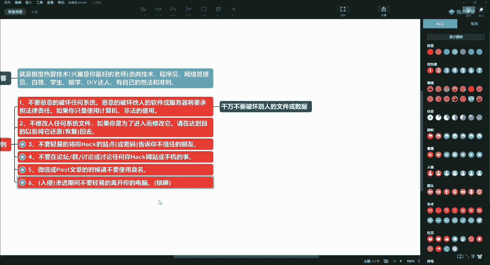

我给你说的这些东西肯定是有很多人吃过亏了，所以才做了一个守则，让你去看，第七条，也是所有全世界黑客都认可的一条准则啊，就是不要入侵，不要入侵或攻击电视行业或者重复的，机关的服务器，唉对吧。

你一般的你比如说你对吧，你搞中国移动是吧，你这你你中国联通，中国电信，那你把他把他搞崩了，大家都上不了网，那你自己也上不了网，是不是啊，对你也没啥好处啊，第二个呢就是政府机关的服务器。

这些网站你不要随便搞啊，这个当然了，这些都是正常状态下啊，那么也有非正常的讲，你说当年中美大战啊，中日混战的时候呢，那时候我管你是什么呢，对吧，哎专门打日本的时候，专门就干日本的这个官网啊。

他们的一些政府的网站，所以这个东西呢适用于一般情况啊，如果是有一种特殊情况，比如说当年中美大战是怎么开的呢，就是呃在南海撞击了啊，大家都知道这事儿吧，嗯然后呢就开始了，开始干啊。

这个我这个守则还没说完啊，这个师爷还不能出场是吧，让他先再憋一会儿吧，回头说他的事啊。

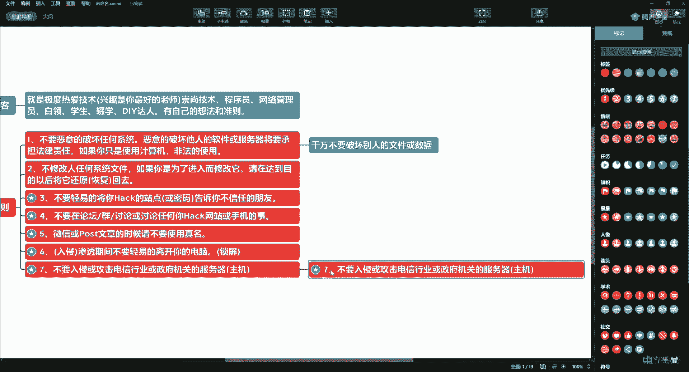

好debutter啊，第八条呢就是这个秦桧都有仨相，好的啊，第八条规定的就是不要在电话里啊谈论任何唉，关于你的从事黑客的任何事情，这意思就是你长点心吧，啊那边你这哇哇电话里谈论呢，这边给你录音了。

就是这意思啊，也不要在微信里的文字性的去聊，就是说有同学说我觉得我跟他挺好啊，你发现最终对吧，坑你的都是跟你关系非常好的那些人啊，所以这一定要注意啊，就别谈论，包括我在内，你也甭跟我说啊，你烂在肚子里。

如果你这一点做不到，那你不适合这个行业。

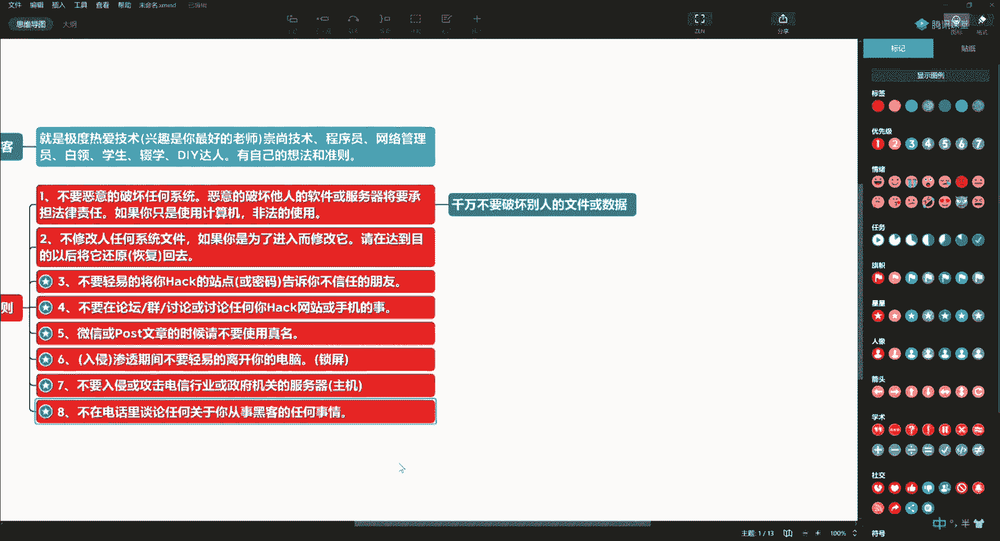

明白吧，这是第八条，第九条，将你的，将你的笔记本啊，你的pc这个移动硬盘啊，当对吧，唉这些设备放置在安全的地方，啊很远的地方啥意思呀，你别弄那个这个人家拎包就走了哈，所以基本上呢除了车。

就是你的包很重要啊，媳妇都是排第三位的，基本上都是这样对吧，包在人在啊，包不离身，这里头的设备里头的数据都非常的重要啊，不要让人随便就拿走，人家拿走以后，这些数据一拷走，那硬盘一卸直接拷走不出来了对吧。

哎所以这一点也很重要啊。

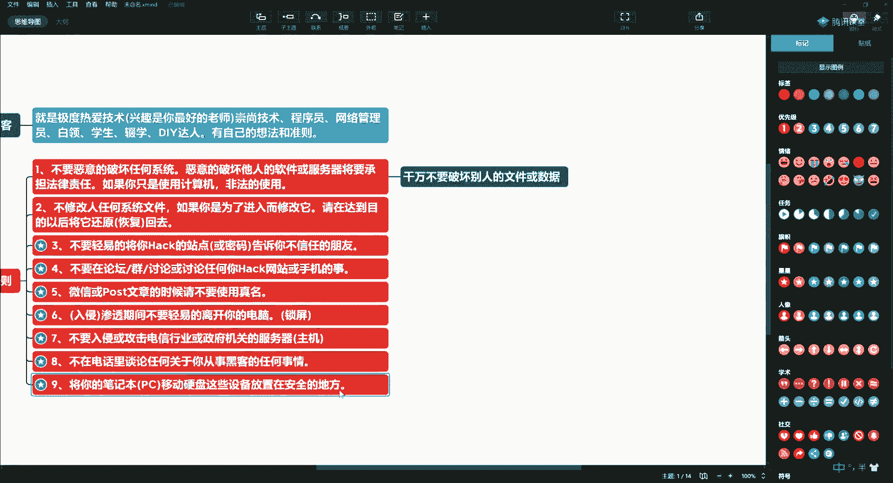

第十条，第十条呢就是，嗯告诉大家呢啊多读书读什么呢，不变，有关系统安全，或系统漏洞的文件，比如说我们去这个微软官方，他又说了哎出现了一个什么样的漏洞啊，我们做安全人员就要上去去看看。

这些东西是为了什么呢，就是看你能不能把这个问题复现出来，好我关注一些安全的漏洞，说你要能复现，比如永恒之蓝，我们经常去用卡里给大家去复现，当然等等等等，还有很多啊，不重样的。

我们都能给你弄个弄个很多的啊，所以这些东西呢平时要多去看看对吧，那么一是看说复现这个问题，啊去复现这个漏洞，这是一方面，二一个东西呢就是我们做这件事，我们啊学的安全。

我们是白帽对吧，白帽子啊，我们血液这个东西是为了防御它啊，那么我们看看有没有修复漏洞是吧，唉防止别人利用这个漏洞。

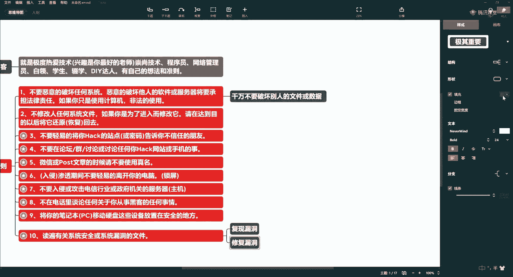

对我们产生一些攻击啊，产生一些不利的影响，所以这个东西一定要注意啊，多看。

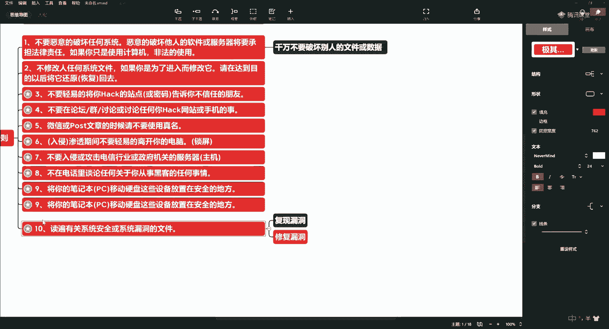

快说完了啊，第11条，好说呀，我比如说我就我们就拿到了一个windows，说我拿到了一台服务器啊，那有的同学，那我为了这个，这我好不容易才拿到这台服务器啊，你拿到这台服务器呢。

他肯定要添加一些远程登录的这些账号，进行授权以后去用是吧，哎那么已经入侵的电脑，啊这个电脑中原有的这种账号不要删除，不要修改对吧，人家还得用呢是吧，哎，再一个这句话有个潜台词，你把人家账号删除了。

他傻子也知道他被搞了呀，你把他这个这个这个密码改了，他傻子他也知道是不是中毒了，人家嘎嘎一查杀一一扫，翻译有问题啊，是不是，所以你悄摸的，你加一新账号就得了，让人家神不知鬼不觉吗，对吧。

哎所以这块呢也要注意。

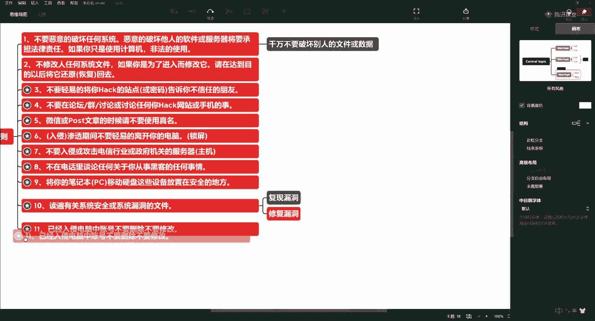

第12条啊，就比如说啊有同学说我那我这东西我不要了啊，我拿了一个站，我觉得这个站呢比较low对吧，他是一个什么博彩啊，什么色情啊，广告啊啊盗版啊啊弄这个了对吧，哎就是不要将，你已经破解了账号网站。

分享给你，哎就比如说咱们这个这个这个群里头是吧，我们有好多的这些同学，大家都是搞这个啊，比如这个大师兄是吧，哎这没准哪天一高兴吧唧拿一个站啊，哪天呢这这个喝高了是吧，跟群里的一分享啊。

你看我吧唧就得把他从群里踢出去，是不是，哎如果你拿到了哈，拿到了你也别分享啊，可能你是很好的一个人对吧，你遵守了我刚才跟你说的这些个守则，但是你分享的这个人他可能不靠谱，是不是哎你约束了自己。

你你怕剁手啊，那哥们无所谓，我靠那上来就一顿破坏，那结果他被逮了，他被逮了以后，他把你供出来了，你说你冤不冤。

是不是啊，所以这块呢大家也要注意啊，防止大家呢就是这个很冤的这种事啊。

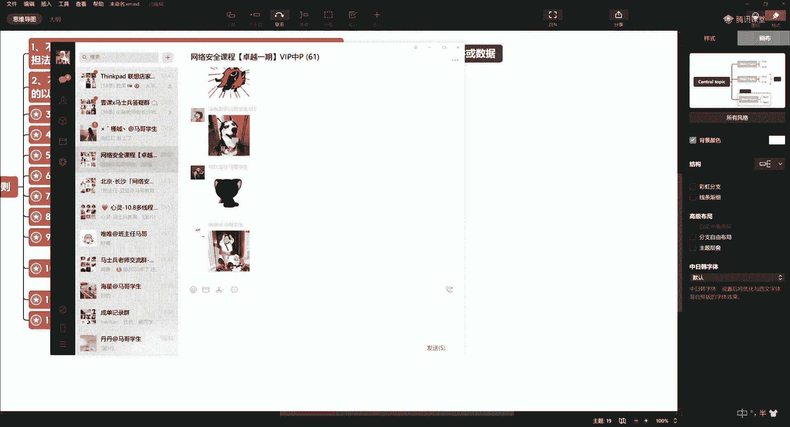

出现这就不好了啊，因为总有一些坑爹的人啊，好第13条啊，第13条。

不会编程的黑色不是一个好黑色哈，不会运雷的黑色也不是一个好黑色。

所以为什么我们在学安全的时候，要先给大家讲运维的技术，那你连linux系统你都不会用对吧，你你入侵个毛啊，你弄了一个windows server，你进去以后你都不知道怎么玩，那你你入侵个毛啊对吧。

所以安全这个东西，这个学科它要比你做开发，要涉猎的这些内容要深要广得多啊，因为你可能在某一个环节，每一个环节你都可以存在搞邪恶的这种机会啊，比如说他可能只会linux用。

但是我们还得回windows server，还得会linux啊，还得会unix，所以呢，你要了解的这个知识面的深度和广度要多，比如说他只能用一个s s h协议，当然这个我没有说人家不好啊。

我只是说你在这方面要更加的努力，多学一些，那么你不但要会用这个协议，我们还要知道这个协议的底层啊，知其然知其所以然对吧，那么一般人呢他就会知道，比如开发面试的时候跟你聊网络的时候。

比如说他会说到这个三次握手，tcp ip协议的三次握手，四次挥手对吧，那么我们就要比它更多一层，那你还要知道三次握手和四次挥手，伴随着这11种状态都是什么啊，所以将来你在玩儿ddos啊，死亡之拼啊。

等这些东西的时候，你才能游刃有余，你才能知道这里的底层是干什么，所以我们这个课程给大家定位的这个定位，不光讲工具，还要带着大家写工具，就体现我们编程的功底，同时我们还要给大家讲底层的原理啊。

所以这个东西呢它是非常有意思的一件事，好第13条。

第14条。

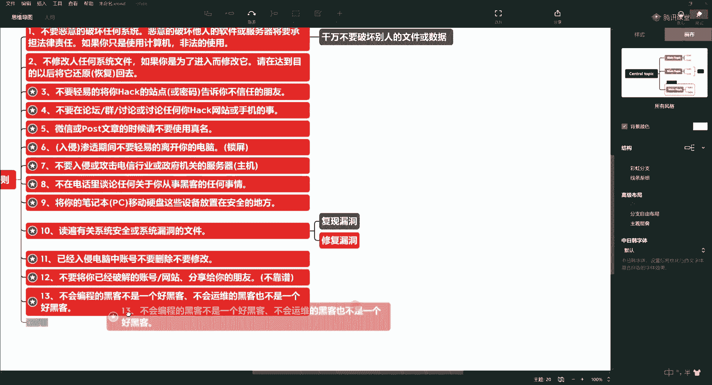

第14条呢实际上呢就是呃怎么说黑客不同于，黑客不同于道。

那么即便是道，我们也是属于道义有道的那种啊，就是永远得是正义的一方啊，所以呢我们不能说是啊，就是说我我我我盗他个账号什么的，都是小儿科啊，随便写个键盘记录就ok了，所以这句话也很重要啊，黑客不等于道啊。

不同于道，我们跟那盗窃我们看不上的那都比较low对吧。

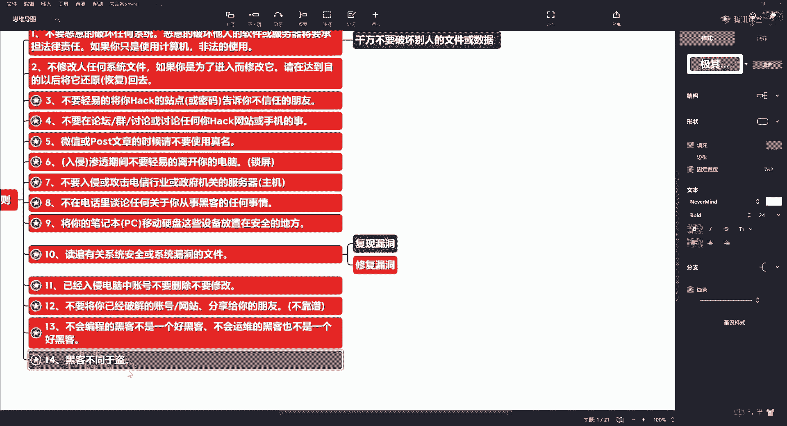

我们这个叫渗透。