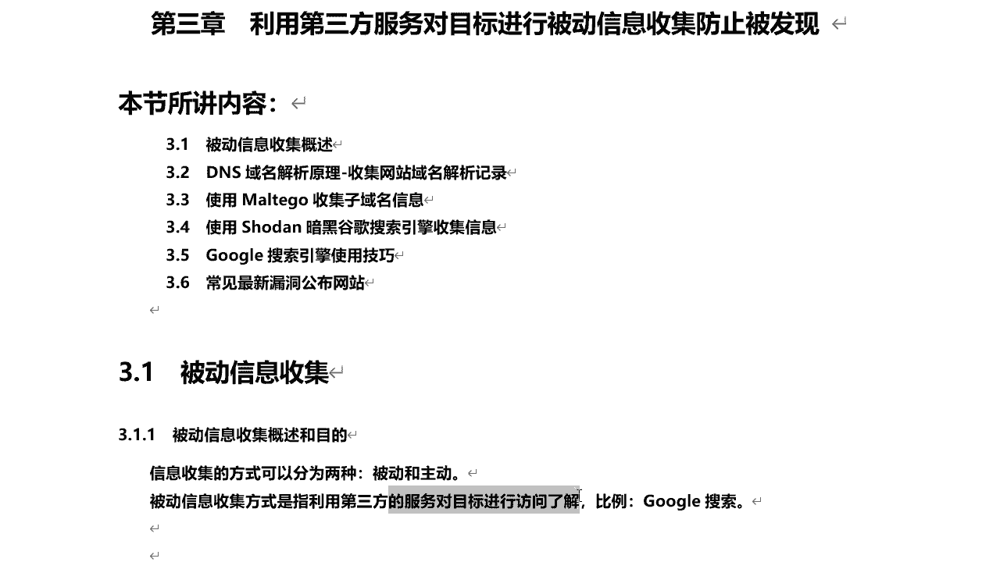
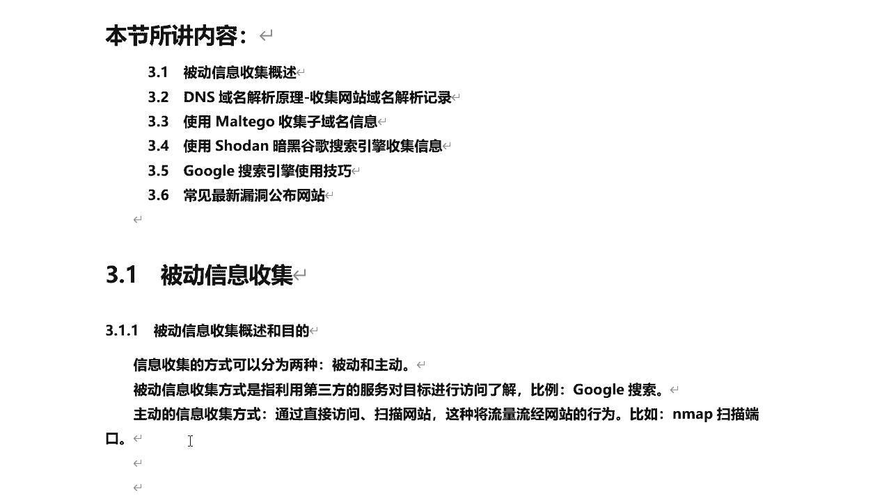
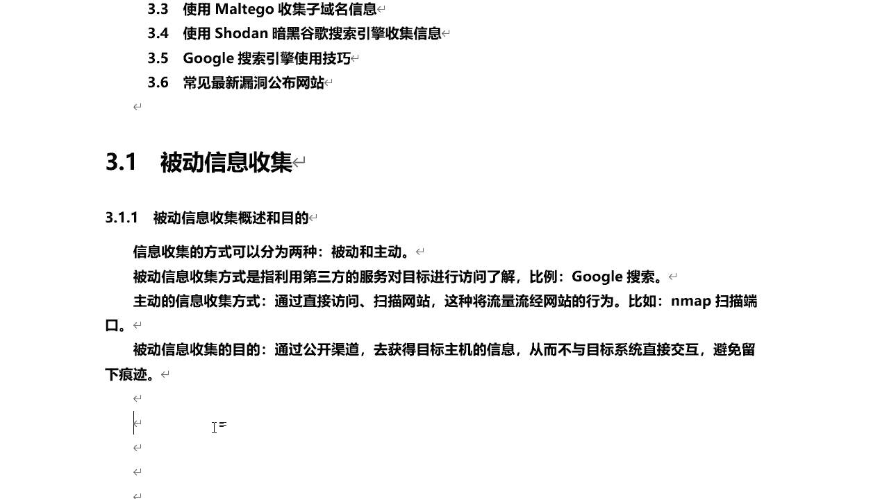
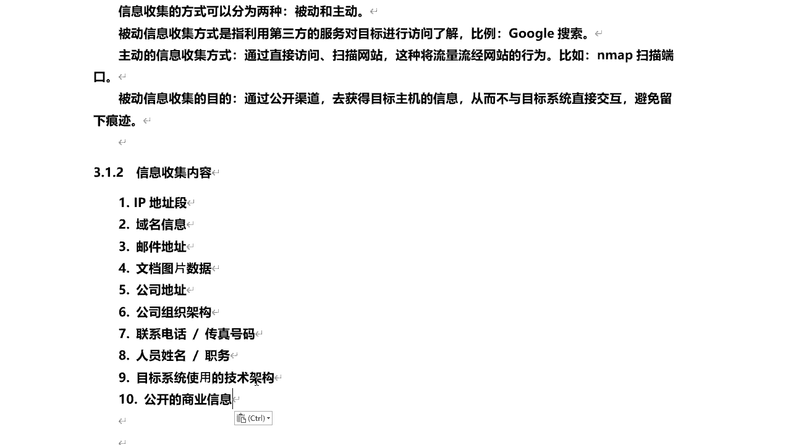
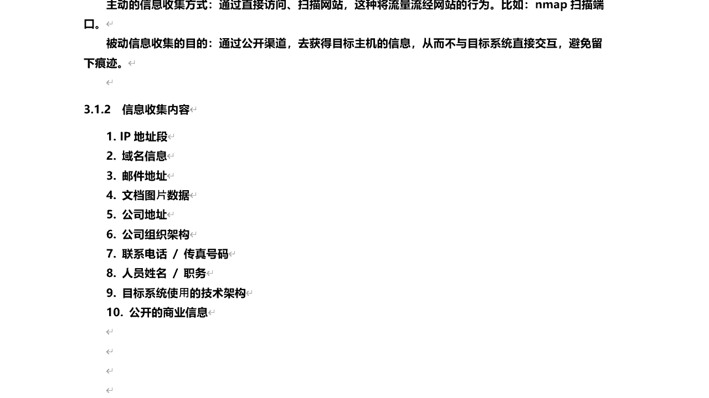

# 学不会我退出网安圈！中国红客技术正需要传人！全套666集还怕学不会？（网络安全／黑客技术） - P30：7.1-【被动信息收集系列】被动信息收集概述 - 一个小小小白帽 - BV1Sy4y1D7qv

大家好，我是讲师root，今天呢给大家讲一下了，利用第三方服务对目标进行被动信息收集，防止被发现，那首先呢我们来了解什么是被动信息收集，然后呢接下来讲一下dns域名解析的原理，收集网站域名解析记录。

然后使用meta go搜集子域名信息，使用搜暗黑谷歌搜索引擎搜集信息，然后呢再讲一下谷歌搜索引擎使用的技巧，最后呢带大家了解一下常见的最新漏洞，公布网站好，那么我们来先来看一下被动信息收集啊。

什么是被动信息收集呢对吧，那说到信息收集啊，这块呢它分为两部分啊两种，那么分为主动和被动，那么咱们今天主要给大家讲一下，被动信息收集啊，那么被动信息收集的方式啊。

主要是指利用第三方服务对目标进行访问了解，那么比如说谷歌搜索引擎诶。

还有收纳等等啊，那么这个一个网站啊，那么一个公司网站，那么他做好上线之后呢，他会被各大搜索引擎收录，那么除了谷歌百度，还有一些其他的搜索引擎呢，都可以去收集到关于这个站点的相关信息啊，好吧。

然后呢被动啊，那是被动信息收集，那么另外还有一个主动信息收集，我们也了解一下了，那么主动信息收集，那么它主要是通过直接访问扫描网站，那么这种呢将流量流经网站的行为呢，称之为什么主动信息收集啊。

那比如说用nmap扫描端口，那么这种呢会直接对目标发起对吧，对发起扫描啊进行信息收集。

它呢不可避免的会将流量流经网站，在目标网站呢会留下一些记录啊，那么这是主动的嗯，那么被动信息收集的目的呢，主要是通过一些公开的渠道来去获得，目标主题的信息，那这种方式有什么优点呢。

它呢不与目标直接进行交互啊，也就是说不能留下任何痕迹，相对比较安全一些啊，那正常来讲，那我们在进行信息收集的时候啊，那么主动和被动需要的结合的啊，来一起去使用啊，那么信息收集我们到底收集哪些内容呢。

收集哪些信息呢，下面呢我们来看一下啊。

那么信息搜集的内容，那么首先来看ip地址段，那么也就是说我们在互联网上，那么黑客在互联网上，那么他要想去寻找目标来讲，那不可能一个一个去找对吧，那么肯定是批量的需求，那么通过什么一个ip地址段唉。

然后呢去扫描对吧，探测存活的活跃的主机啊，那么当你确定一个目标之后呢，比如说拿到一个网站的域名，那么通过这个域名呢，还可以收集到相关的域名信息啊，它的解析记录对应的真实ip地址。

域名的注册商谁注册的对吧，注册邮箱是什么，什么时间注册的，什么时间到期等等，还有相关的备案信息等等，那还有邮件地址啊，那么收集的邮件地址有什么用呢，那么通过邮件地址，那比如说我们可以进行什么演示工啊。

钓鱼啊对吧等等，还有关于这个公司啊，这个站点的文档图片啊，数据从这些文档图片数据里面，我们也可以找到一些有用的，有价值的，可以利用的信息对我们进行渗透，有利的啊信息还有公司的地址啊，组织架构啊。

联系电话，存存号码，人员姓名啊，职务啊等等，那么有同学会问，那么我们在进行渗透的时候，这些信息对我们有什么用呢，那么来想一个问题，当你无法突破对方网络边界的时候，找不到任何漏洞的时候。

那么这些信息可以用来干什么，进行社工对吧，还有目标系统使用的一些技术架构，技术架构，比如说目标的服务器是linux和windows啊对吧，它使用的是阿帕奇和安吉克斯啊，还tm cat中间件等等。

开放哪些端口啊，啊每个端口对应的什么服务啊，等等相关的信息啊，对使用技术架构，还有公开的一些商业信息，那么比如说一个公司啊，为了宣传自己，那么可能会在各大的分类信息站点诶，发布一些文章啊。

信息啊来进行宣传推广啊。

通过这一期呢，我们也可以了解到这个公司的一些情况，或者是关于这个站点你目标的一些情况啊，那么这些信息都需要收集啊，收集的越详细越好，不要放过任何一个细节，那么这个也就是我们信息收集要收集的内容。

那么这些信息收集之后，那么主要用来做什么，那其实呢刚才我已经说到了一些啊。

那主要是用来第一个描述目标对吧，那么描述目标呢，首先你探测出来目标服务器是什么系统，开放了哪些端口对吧，每个端口对应的什么服务，这些信息综合整理，来能确定这个目标是一个什么样的目标啊。

然后呢最终呢可以去发现目标啊，比如说我收集了ip地址段对吧，对通过ip地址，然后去发现啊存活的目标，然后可以社会工程学攻击，那比如说公司地址，我知道了组织架构联系电话对吧，还有人员的姓名和职务。

那么针对这个公司的内部人员可以进行吗，社工对吧，进行内网渗透，然后呢，通过内网再渗透到他的web服务器都是可以的啊，然后通过这些信息可以找到一些物理缺口，也就是漏洞啊漏洞，那比如说它特定版本。

我搜集到的linux服务器是什么版本的，什么内核呢，好吧，开放哪个端口对应的是什么服务，比如阿帕奇他是哪个版本的，那么就可能存在相关的一些漏洞对吧，那同时呢还可以通过扫描对啊，发现一些漏洞。

也就是物理缺口啊。

