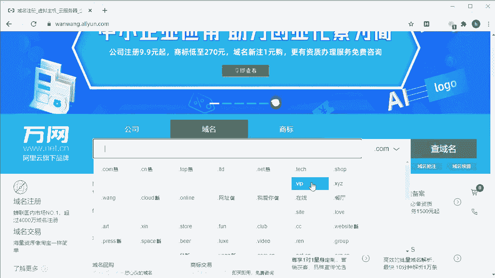
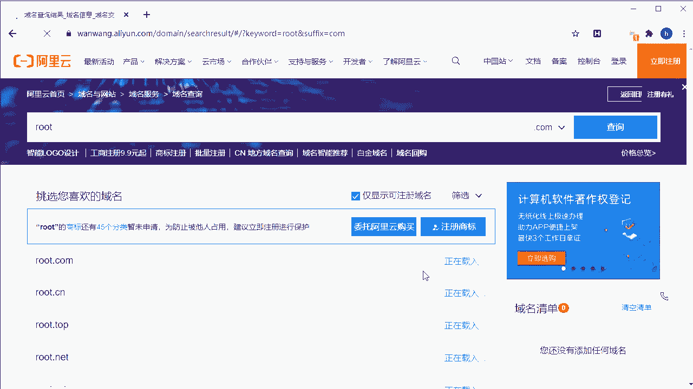
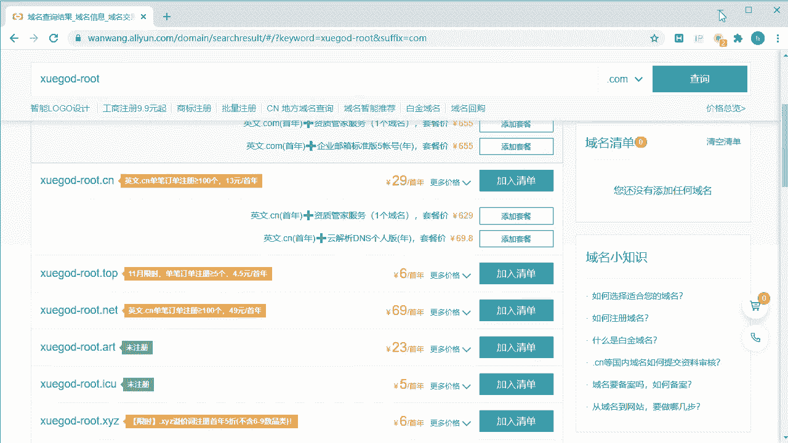
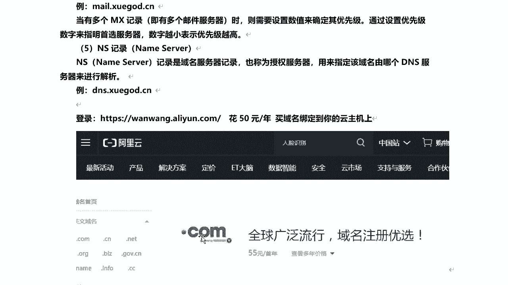
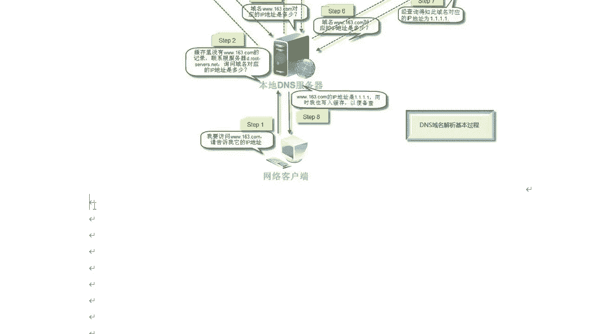

# 学不会我退出网安圈！中国红客技术正需要传人！全套666集还怕学不会？（网络安全／黑客技术） - P31：7.2-【被动信息收集系列】DNS域名解析原理 - 一个小小小白帽 - BV1Sy4y1D7qv

好那么下面呢我们来看一下信息收集dns啊，那么域名解析原理啊，那么说到异域名解析原理呢，我们先来了解一下dns服务器啊，那么什么是dns服务器呢，那么也就是运行dns服务器程序的计算机。

那么这里呢存储的dns数据库的信息，dns服务器呢它分为根据dns服务器，顶级域名dns服务器啊这两个，那其中呢根据d s服务器呢，有13个都存储了全部的顶级域名，服务器所在的地址。

而顶级域名服务器存储的，每位客户所注册的主机地址啊，那么这里对应到163。com这个级别，那么也就是说啊我们注册一个域名啊，比如学get。cn啊，那么域名注册成功之后呢，那么你要想使用它。

必须得购买一台服务器对吧，每台服务器有对应的ip，那么会将这个域名解析到这i服务器，对应的ip地址，也就是域名解析，那么这个解析的记录呢就存储在dns服务器里面，那么当你通过浏览器去访问这个域名的时候。

对吧，他都能解析到这个ip访问到这个服务器对吧，直接就可以打开这个站点了啊，是这个意思啊，好的，那么下面呢我们来看一下域名的记录啊，那么这个解析的记录啊，刚刚我说了。

将域名解析到对应的服务器的ip地址啊，那么这里就是一个域名解析记录，那么系统包括a记录，cnm别名解析n s mx和p t r这几种类型啊，那首先呢我们来看一下a记录。

那么a记录呢是我们大部分站点都需要做，而且必须要做的一个解析啊，那么叫正向解析啊，a记录address地址，那么a记录呢是将一个主机名对，和一个ip地址关联起来，那说白了就是将域名和ip地址关联起来啊。

这也就是大多数啊客户端程序默认的查询类型，那比如说我将学个二点cn解析到这个ip，这个ip呢对应的就是学霸的cn的服务，器的ip地址好，那么就是我们来通过浏览器呀打开一个域名，它之所以能否打开这个站点。

是因为我们将这个域名和对应服务器的ip地址，绑定在一起了，对解析到这个ip地址了，这是a记录啊，那么第二个呢对相对于a记录正向解析，那么它还有一个什么反向解析，ptr记录反向解析呢。

就是将一个ip地址对应到主机名，也就是域名啊，那么这些记录保存在这个i in a d d r点，a r p a域中，那么也就是说啊通过ip解析到域名啊，正好和a记录是反过来的，反过来的好吧。

这个我们了解一下就可以啊，那接下来呢我们来看一下的另外一个c name，那么也叫别名解析，那别名解析别名记录，那也称为规范名字，那么这种记录允许你将多个名字，映射到同一台计算机，那么也就可以将多个域名。

映射到同一台计算机啊，那么比如说我们可以将对吧，这个域名3w点斜杠的cn，比如说对应的ip是8。8。8。6的好，web点斜杠点cn也对应了这个ip地址好吧，那多个名字对吧，对应到一个ip。

那么这是什么别名解析啊，好的那下面呢我们来看另外一个啊，mx ms也叫邮件邮件交换记录啊，唉它指向一个邮件服务器啊，主要用于电子邮件系统，发邮件是根据收信人的地址后缀，来定位邮件服务器的啊。

那像一般企业啊，对那么有的可能有自己的邮箱服务器，或者使用第三方的企业邮箱，那么它就会存在这个mx记录啊，这大家了解啊，那比如说一般常规的啊，常用就是这种mo点雪糕点，cn或者是m。163。com。

mo。qq。com是吧，qq邮箱163邮箱是不是都没有开头的，那么像这些他们都有自己的什么mx记录，自己的邮箱啊，那么当有多个mx记录的时候，那么也就多个邮件服务器啊，有可能会存在啊。

那么这需要呢是数值来确定其优先级，通过设置的这个优先级数字啊，来指明首选的服务器啊，你首选使用哪个邮箱服务器对吧，那么数字越小表示它的优先级越高越优先，那比如说像这种好吧，唉那个没有点学霸的cn啊。

或者是这个学神啊，还有其他的瑜伽服务器，那么可以通过这种优先级来确定，我首先首先使用哪个，我们再来看一个ns啊，记录ns name server啊，名称服务器，那么它记录呢是域名服务器的记录。

那也称为授权服务器，那主要是用来指定啊，该域名有哪个dns服务器来进行解析啊，那比如dns点学尬的点cn啊，那么这个呢就是一个域名服务器啊，那比如每个域名服务商啊，对每个i s p啊服务商。

那么它比如说阿里云呢，腾讯云呢它都有自己的dns服务器，那么这个dnf主要是进进行了域名解析的啊，好吧，然后呢，大家呢，我想很多同学是不是有没有玩过那个周舍，和自己有没有自己的域名对。

那么这里呢给大家留个作业啊，留个作业，就是大家呢也可以自己去体验一下的啊，比如说我们一般注册运用在哪里做呢，阿里云是吧，对比如说旺旺点，阿里云点com，那么大家可以到这个对网站上，注册一个自己的域名啊。

那么域名呢其实很便宜啊，有几块钱，几十块钱的，1年50块钱对吧，买个域名，然后绑定到你的云主机上，那么你就可以自己搭建一个站点，通过域名去访问了啊，访问了，当然有一点就是说呢嗯这个域名啊，你买完了。

如果你买的是国内的服务器啊，或者是虚拟空间，那么你要将域名解析到你自己的服务器上，要想使用的话，这个必须得进行备案啊，国内的复习必备案，不备案的话，你是用不了的，那除非呢你要不想备案呢。

买个国外的福气也行啊，那么这域名也很便宜，像有的域名有几块钱啊，我记得国外好像有一个站点吧，对那域名不到十块钱一个啊，那么大家呢可以自己去买一个啊，体验一下吧，比如说我们打开这个站点，阿里云的啊。

我稍等一下子。

好那么如何注册呢，那其实首先你得注册一个账号对吧，这个就不讲了啊，这很简单，那比如说我要注册域名得有个名称吧是吧，那么这个有这个名称自己随便起，然后后缀呢你自己选，你想注册哪个后缀的。

有点com。cn的，点top的各种后缀都有啊，那比如说我想注册一个root的是吧，那这个域名肯定早被注册了啊。

非常火啊非常火，我们查询一下，查询的目的是看这个域名有没有被注册。

如果没有被注册，我们就可以来对进行注册了啊，你看这已经注册了，然后这个其他几个呢都是啊，也被注册了，那现在是对外卖的啊，这个比较贵呢，root。vip啊，那或者说我们随掰随便起再起一个学干了。

root这个域名啊，我估计这个不能有备注册好吧，来这个域名横杠也可以啊，然后呢比如说这是首年价格55，这个是29啊，六块钱啊，这个便宜是吧，那其实大家买个最便宜的就可以了啊，自己体验玩嘛是吧。

对或者这个都可以都比较便宜，点击加入清单，先注册登录，加入清单购买就可以了啊，光有域名呢你还不行，他还得有一个服务器啊，服务器的话一般呢对于一个阿里云啊，新注册一个用户啊，都比较便宜。

1年一你不需要买这配置太高的啊，那1年也就不到100块钱吧，是吧嗯，买个香港的也可以，不需要备案，这样比较方便一些啊，或者是买个v p s。

将自己的域名直接解析到对应的ip地址，服务器ip地址就可以了啊，那么这里呢给大家说到这里购买一个域名。

那么这个呢突破强制要求大家可以自己去体验。

好不好，买不买呢，对咱们后面课程的学习呢都没有任何的影响，好吧好，那下面呢我们来看那么一个dns缓存服务器啊，dns服务器我们了解它里面是存储的，关于域名对应的ip解析的记录，对不对。

那么dns缓存服务器是什么呢，这个缓存服务器啊，它不负责解析域名，只是什么缓存域名解析的结果啊，缓存嘛啊，将域名解析我存储到这里缓存里面啊，那你下次再访问的时候，直接从缓存里就能读了。

不需要再走dns是域名服务器了，这样能够能够快更快速一些啊，更快速一些，下面呢我们来说一下dns解析查询的方式，我们来了解一下它啊，那么这个呢有递归查询和迭代查询。

那么也就是说我们当在浏览器输入一个域名，按下回车那一瞬间对吧，他背后都发生了什么事情，这个网站是怎么显示出来的，域名是怎么解析到ip地址的是吧，那么我们来看整个查询的过程。

那么一个dns查询过程通过八个步骤的解析啊。

就是的客户端可以顺利访问，比如说像3w。163。com这个网站啊，这个域名，但是在实际的应用中啊，通常这个功能是非常迅速的，那比如我们打开一个网站，也就两三秒或一点秒就打开了对吧。

但是它这个dns查询要需要经过了八个步骤。

通过一张图呢来看一下整个域名解析，这么一个过程啊，那么首先呢对这是一个网络的客户端啊，那么也就是你啊你的电脑，那么通过你的电脑打开浏览器来访问，3w。163。com这个域名啊。

那么当用户通过浏览器来访问某个域名啊，浏览器呢首先要在自己的缓存中，本地缓存中去查找，是否有该域名对应的ip地址啊，那么这个缓存的如果你曾经访问过该域名，而没有清空缓存的话，它便存在好吧。

如果有直接就访问了读缓存好吧，那么这是浏览器缓存啊，那么浏览器缓存呢如果没有的话呢，它会从你的系统缓存中对吧，就是说呃如果浏览器中啊没有域名对应ip，那么则会自动检查。

你用户计算机系统有一个host文件，sos对这个文件里面，那么dns缓存是否有该域名对应的ip啊，那么就说什么问题，比如说那么你可以改host文件啊，在这里加个域名解析记录。

比如说你把那个3w点淘宝点com对，解决掉你本地的ip是吧，那么他肯定会读它，先逗它，它优先级大于它这个dns服务器的优先级对吧，那你说还能打开，打不开了是吧，首先是读浏览器缓存。

浏览器缓存没有读系统缓存，也就host文件，如果host文件里没有对应域名到ip的记录对吧，然后接下来他会查询d路由器缓存啊，那么当路由器款呢，就是当进入路由器管程中去检查好吧。

有没有对应的域名的ip的一个记录，如果没有，对这三个都没有，怎么办呢，那么他会往上走好不好，往上查询，网上去查询啊，这个是缓存啊，本地dns缓存在先查缓存，这缓存呢其中有浏览器缓存，系统缓存。

还有路由器缓存，这些都没有呢，怎么办对啊，那么它呢会网上查啊，进入i s p，也就是互联网服务提供商dns缓存中去查询，那比如说你用的是电信的网络，那么则会进入电信的dns缓存服器进行查找。

对那么这次都是啊咋缓存，如果你的对运营三缓存都没有，那怎么办呢，再往上走到ds根服务器去查询啊，那么全球呢仅有13台根域名服务器啊，一个主根域名服务器，然后呢，还有其余的12个为辅辅助的根域名服务器。

根域名收到请求之后，对这跟疫苗服务器啊，收到请求之后，然后他会去找啊对吧，去查看区域的文件记录啊，如我没有对吧，没有看啊，比如说他告诉你了啊，那么这个点com是这个区域管理，是不是啊。

对然后呢让你去找谁啊，找他他知道答案，那么计算，那么他可返回给你了是吧，反馈给你了对吧，他根据请求呢到后台查找区域文件记录对吧，若无则将其管辖范围内的顶级名，它管辖范围内，你看你那属于点com的。

对不对对，不要把点com这个顶级域名的服务器，ip地址告诉你，本地dns服务器，你去到那儿去找吧对吧，他负责解析这个好吧，点com域名服务器好的，那么你呢收到这个响应之后呢，你到这去找好吧。

那么顶级域名服务器是干什么用的，顶级域名服务器啊，收到你这个查询请求之后啊，对啊，他去查看区域文件记录，那么如果没有对吧，如果没有，他对吧，没有怎么办，他即将管辖范围内，主域名服务器的ip地址告诉你。

就告诉你啊啊你这是163。com的是吧，那么163。com这个主区的服务器啊，应该知道答案，那么给你呢地址对吧，把it地址告诉你，让你去问他吧好吧，然后返回给你啊，反馈为本地dns服务器，然后呢。

你再去查询什么163。com这个预服务器，那么这个属于什么，这是主域名服务器，主域名服务器呢接收到请求之后呢，查询自己的缓存好吧，如果没有，则进入下一个下一级域名服务器进行查找啊，并重复该步骤。

直到找到正确的一个记录就ok了，然后返回给这个本地dns服务器好，那么此时呢收到这个结果之后啊，是吧，163。com对应的ip地址是这个，那他先把这个解析记录呢缓存到本地，缓存起来呃，以备下次使用好吧。

同时呢把这个结果ip地址告诉这个客户啊，那么他就打开这个网站了，下次再访问这个域名，直接读缓存，不有已经有记录吗，直接访问过了吗，直接就不需要向上查询了，直接从缓存中读取他的记录了。

这个呢是整个域名解析这么一个过程啊，好能把这整个解析查询的过程啊。

我整理到这里啊。