# 学不会我退出网安圈！中国红客技术正需要传人！全套666集还怕学不会？（网络安全／黑客技术） - P32：7.3-【被动信息收集系列】DNS信息收集 - 一个小小小白帽 - BV1Sy4y1D7qv

好下面呢我们来看一下dns信息收集啊，ns look up啊，那么这里咱们得到一个网站的域名，如何将域名解析为ip地址呢，对呀，如何获取这个域名对应的ip，那么这里最简单的办法是通过什么对，通过拼命令。

我想这个大家都比较熟悉，也经常会使用它啊，那pm命令除了这个功能之外呢。

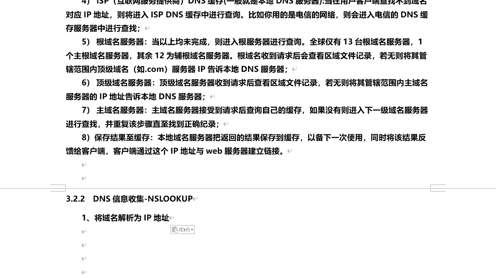

还可以探测网络之间是否畅通啊对吧，来我们来打开终端，比如说呢我们来想获取啊，学神啊，这个学r的cn这个域名的对应ip，我们这可以通过拼来自己可以得到他ip地址啊。

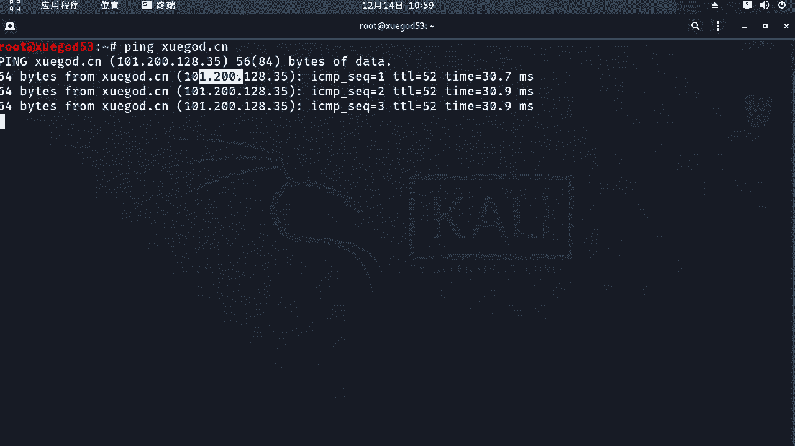

是这个啊，那或者是我们也可以，这样用杠c指定发送一个数据包，这样也可以直接获取到的大对ip地址啊，好的那么这个是拼命令啊，啊这个比较简单啊，比较简单，那么除了这个命令之外呢。

还可以通过什么n s look up，这是一个比较实用的一个工具啊，命令通过它呢。

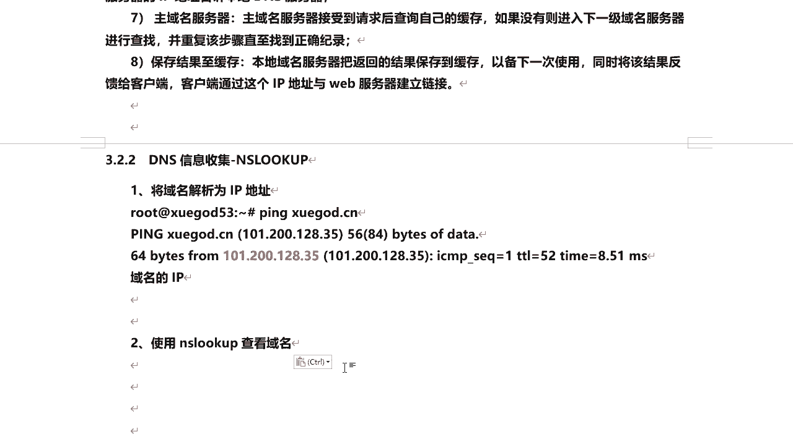

也可以查看这个域名对应的ip地址，好我们来看一下啊，n s look up后面直接跟他域名啊，那么走的是8。8。8，这个dns啊在于域名学霸的cn啊，ip地址是这个啊，可以查看到，那么另外呢。

我们还可以查看其他网站到底是都一样的啊，look up 3 w点百度点com，那么走的也是这个dns，那么这里查看啊，那么这个是诶有一个什么3w a一点十分点com，我想这个平时大家都没注意啊。

也不知道这个是百度的一个嘛别名啊别名，那么它的ip地址呢哎得到两个啊，为什么有两个呢，那可能他做了一个cd n或者是负载均衡是吧，ok好的，那么这个是n s look up啊。

那他查看通过域名来得到他ip地址，那么除了这个之外呢。

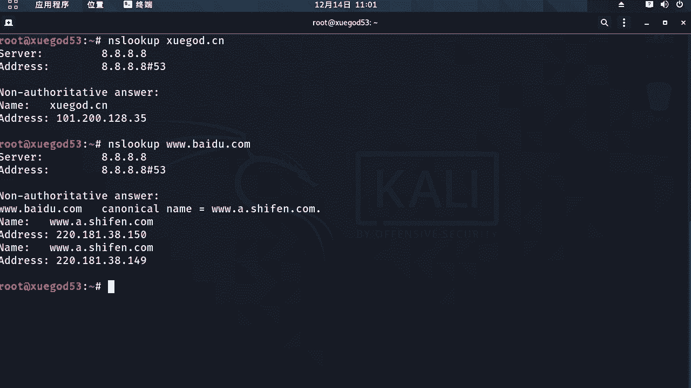

还有一个必要嗯厉害的工具啊，那么这个啊这个这个工具，我想大家呢有的同学可能知道，有的不知道啊，那它的使用方法呢也很简单啊，直接这个后面跟着要查询的域名就可以了，那么中间呢还可以加一下其他的一些参数啊。

或者是你可以指定使用哪个dns服务器进行查询，用and符，那么这个dns服务器我们前面讲了，它是存储的域名解析记录的啊，那么这个di途径呢，你可以用公用的114。114。11，4。114或者8。8。8。

8都可以啊，那么使用公用的dns服务器呢，它会自动的去查找这个域名对应真正的啊，从他真正的dns服务器去查啊，或者是如果你知道该域名对应的dns服务器，你可以直接指令，然后去查就可以了。

那还有一个参数any，any是显示所有类型的域名记录啊，那么默认呢如果不指定啊，any，那么它默认只显示a记录好。

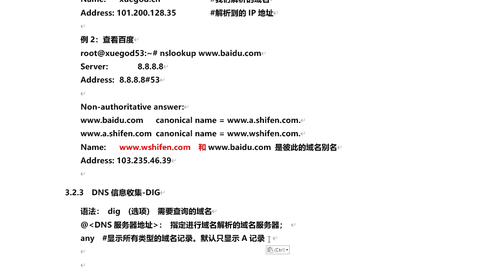

下面呢我们来看一下了，这个后面直接跟域名学的cn，那么我们来看啊，那么这里呢得到一个a记录，对什么都不加，那默认只显示a记录啊，那么它的ip地址呢是这个啊，a记录是什么正向解析对吧。

那么同时呢这里呢我们在查询的时候，可以指定使用哪个dns服务器啊，比如我们用114再来114点，114点，114。114来查询。

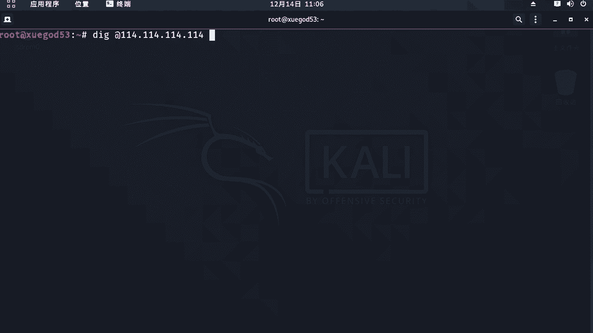

得到结果是一样的啊，一样的好，那么除了这个呢，我们还可以来后面加个any，这样呢我们可以查询出所有的记录啊，所有的域名记录，那么这里有a记录，刚刚我们查询到的多两个啥mx记录邮件是吧，邮箱记录。

ok那么有邮箱记录，说明这个这个域名它使用了吗，对有企业邮箱啊，那么这个啥是腾讯的啊，腾讯的企业邮箱ns这两个是什么呢，ns是dns服务器high channel。com，那么这是阿里云的啊。

那也就是我们在查询的时候，这里我也可以指定用它自己的dns服务器查询，也可以，这样的速度的话要比使用公用的dns服务器才用，速度要快一些，要快一些，那么我来对比一下它，那么这里呢我们来看啊。

这是使用啊114啊，好在这对114是吧，这个dns服务器查询公用的啊，对这这么长时间320，然后呢使用他自己的dns服务器查询呢，它的结果是多少啊，在六四啊，速度会快一些好吧，那么这是dns信息收集。

那么除了可以查询他的一个正向解析记录，之外啊，那比如说我们知道一个ip地址啊，我已知一个ip地址，能不能查出这个ip地址，对应它绑定的域名是什么，对也叫反向解析啊，那么这里呢对通过这个命令呢也可以啊。

也可以的使用杠x参数哎，ip反通ip来反查域名啊，比如说我们常用的dns服务器，114。14。114，那它对应的域名是多少。

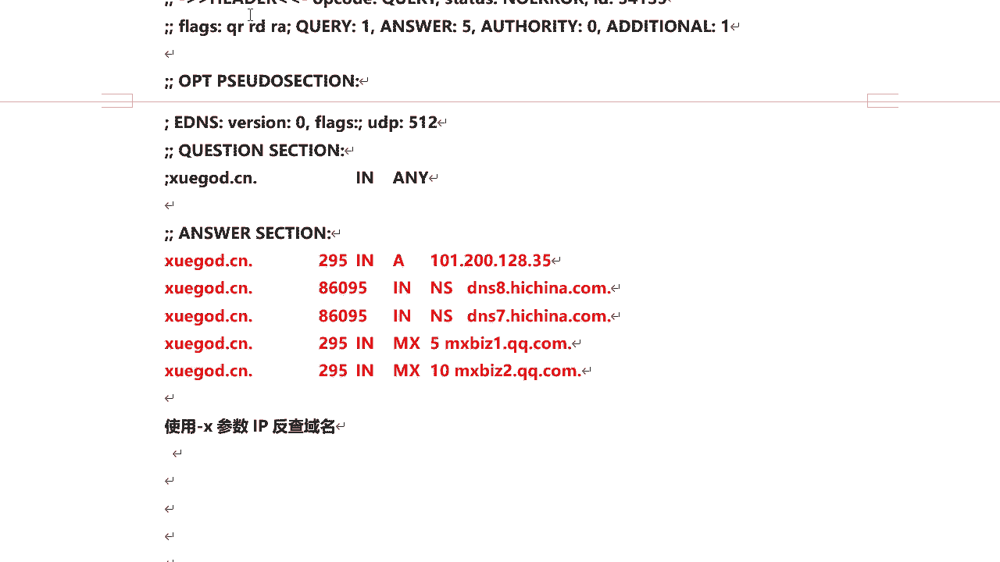

我们都不知道，其实这里呢我们可以来查一下这个杠x啊，114。114。114啊，哎那么看啊它对应的域名是啥，ptr记录ptr反向解析对吧对，就是通过ip解析到域名，那么它的域名是多少啊，啊是这个。

那很多同学不知道。

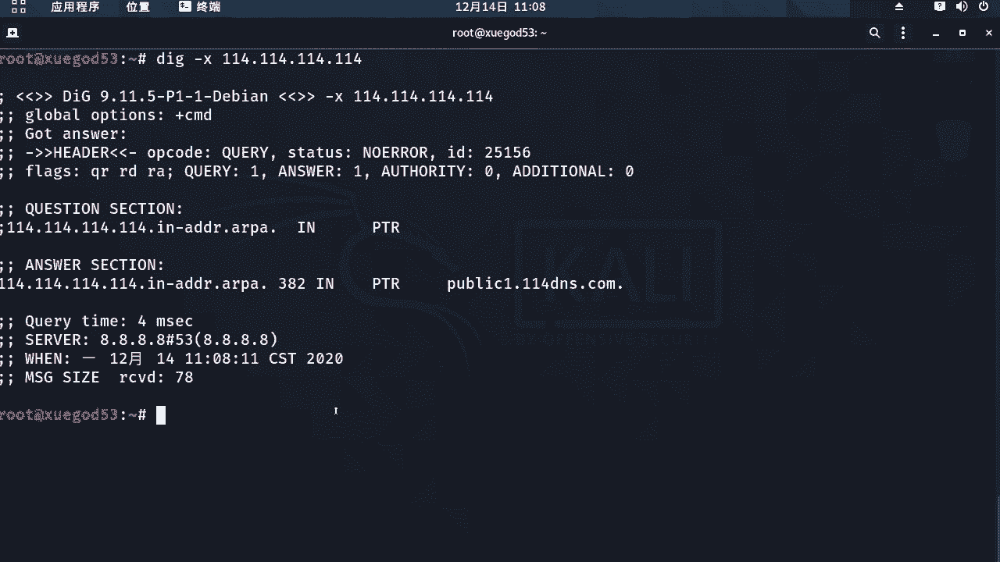

那么我们来验证一下吧，我来拼一下这个域名，看得到ip地址是多少啊，c4114 好吧，那么这个是没有问题呢，那么这是呢通过这个命令干x参数来反查，通过ip啊来查询到他的什么域名，那接下来呢。

我们还可以查询dns服务器的版的版本信息，那么查询这个版本信息呢有什么用啊，对查询版本系的目的呢，可以通过版本信息来查找，相关版本漏洞的利用方式好吧，那比如说那么我们来看一个例子啊。

我们通查询dns po对这个域名服务器啊，它的域名服务器是这个啊使用的bug的软件，版本信息啊，通过版本吸引，我们可以查询到对应的这个啊d服务器，它有什么漏洞啊，如果有漏洞，我们可以利用一下它是吧。

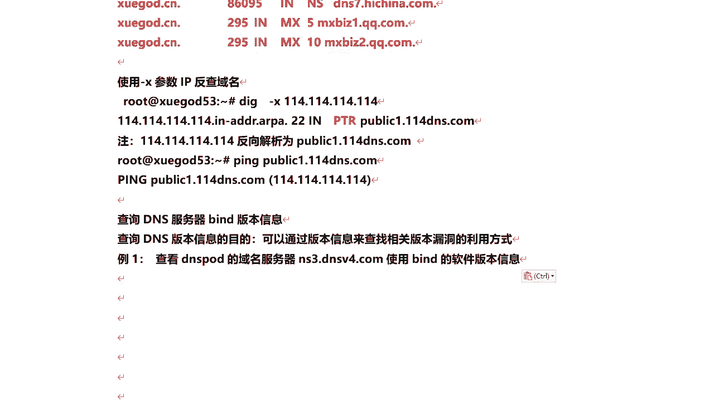

渗透进去啊，好我们看这里怎么去查询呢，啊可以这么查询啊，这个t s t啊，chase version点半后面加上and的符，可能是dns服务器的地址，那么这里t i t线代表的是记录类型啊。

文本型的tos代表是类级别，version呢代表是版本信息。

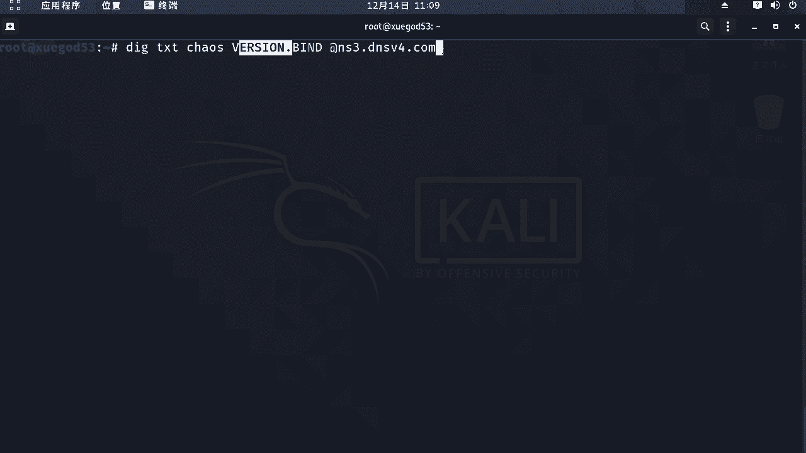

那么我们来查询一下，然后呢这里他得到一个记录啊，version点半的那版本是多少呢，t i t啊，文本类型，why carry me，your ip还在blog是吧，他提示你啊是吧，你为什么查询我哈。

你这ip已经被记录了，这是什么问题呢，可能有的他禁止查询，我不让你查询啊，或者你之前参与过将你的ip地址已经封了，是屏蔽了啊，都有可能说这个呢有的可能会能查询到，有的查询到对吧，这也很正常好吧。

那么这是关于它的版本信息查询，嗯好，那整个关于dns信息收集呢，对那么我们就学了几个命令啊，一个p命令n s look up，还有这个啊。

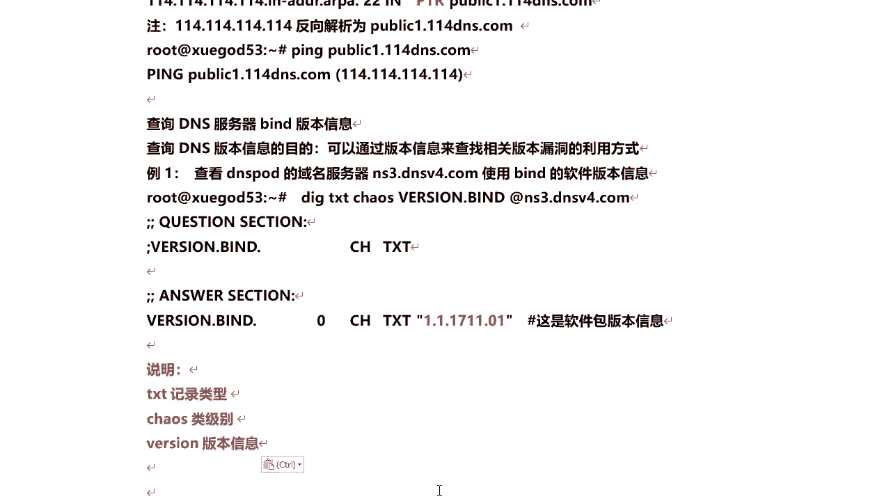