# 学不会我退出网安圈！中国红客技术正需要传人！全套666集还怕学不会？（网络安全／黑客技术） - P34：7.5-【被动信息收集系列】使用Maltego收集子域名信息 - 一个小小小白帽 - BV1Sy4y1D7qv

好下面呢我们来讲一下，使用mgo搜集子域名信息，那么might go呢，那么这个工具呢，重点呢是分析通过互联网访问的数据之间，的真实一个世界关系啊，其中包括足迹，互联网基础设施。

和收集有关拥有该网络的人员和组织的数据啊，那说白了它是一个很强大的一个社工工具啊，那么它主要通过呢使用os i n t，也是开源情报技术，通过查询护卫记录，社交网络dns记录。

还有不同的一个在线api来提取原数据和，搜索引擎来搜索这些数据之间的一个联系啊，那他呢其实通过主要原理啊，主要通过整个互联网，在互联网上去收集和查询啊这些数据，那么这个工具呢。

提供广泛的一个图形布局结构啊，允许对数据进行聚类啊，使关系的准确和及时啊，是一个很强大的一个社工工具啊，那么这里呢我们使用它呢来收集子域名信息，那么什么是子域名呢对吧，那么这里呢我们了解一下。

顶级域名是域名的最后一部分，比如说学get了点cn，那么这个呢是顶级域名啊，那么就是域名最后一个点之后的字母啊，那比如说在啊这个enzo。com，那么这个域名中，那么顶级域就是点com啊。

大小写呢它是相同的，也就是不区分大小写，那么常见的顶级域呢有两类啊，我们来看一下子，那么通用顶级类别的域名一共有六个，那么主要包括用于科研机构的点ac啊，还有工商金融企业的点com。

还有用教育机构的点e d o，还有政府部门来点g o v啊，还有点net，还有非盈利组织点o r g，这些都是通用的顶级域名，一共是六个，那么除了这个之外呢，还有国家及地区的领域。

比如点cn代表的是中国，点uk代表的是英国，还有地理顶级域名，一般是由各个国家或地区负责管理的，那么点gp是吧，代表的是什么，我想各位老司机啊都明白是吧，对日本则派啊，那么子域名对。

那么我们了解了顶级域名之后，那么子域名是什么子域名哎，那么凡是顶级域名前加前缀的，都属于该顶级域的子域名，那么而子域名根据计数的多少呢，可以分为二级子域名，三级四级以及更多级的，那么比如说举个例子啊。

那么学尬的点cn，那像这种对叫顶级名啊，许干点c，那么3w点学个二点c呢，那么这就二级域名，那么三级域名呢，比如说a。b点斜杠点cn 3级四级呢，以此类推一点b。c点雪糕点cn，这是四级域名啊。

点cn啊，这个大家能了解吧，好的，那么说到子域名，我们了解了，那么为什么要去挖掘子域名，挖掘子域名的重要性是什么是吧，我们这个需要了解啊，那么子域名呢是某个主域的二级名，或者是多级域名。

那么一般来讲在防御措施啊严密的情况下，你无法直接去拿下主域，通过主域名你拿不到它的漏洞，找不到路，渗透不进去，那怎么办呢，那么就可以采用迂回的战术对，来查询拿下它的子域名，然后呢无限靠近足浴，就说白了。

比如说3w学个c，那么这个主域啊，这个站点你找不到任何漏洞，渗透不进去了，那么你可以通过一些工具，比如说mate co来收集他相关的子域名，那么它的子域名对应的子弹，可能防御没有主战主域名那么严密啊。

那么如果你拿到了子弹的一个权限，那么通过子弹，那么你可以去诶怎么迂回战术吗，无限靠近主战，然后再拿下主战的权限，那比如说像这种是吧，唉3w点啊，叉叉叉点com这个主意不存在漏洞，而且防御很严密。

而二级名呢这个存在漏洞，并且防护呢确实比较松散，那么你就可以从他去取下手啊，然后呢进一步的去向主意靠近，拿下它的缺陷啊，那么对于这个子域名挖掘啊，啊如何去挖掘，那么这里有很多工具啊，我给大家介绍一下呢。

除了mate go之外呢，还有什么子域名挖掘机，对mate go好吧，唉还有通过什么搜索引擎可以去挖掘，比如在谷歌里输入set冒号qq。com，那么可以查询所有的关于qq。com的子域名。

还有第三方网站查询，通过自己的站点也可以查询到，还有证书透明度公开日志枚举，通过自己站点也可以查询到，还有这些站点都可以查询到，某个主义对应的子域名有哪些啊，对那么这里刚才说了，还有子域名挖掘机啊。

那么很多啊，这种嗯子域名收集的工具啊，那么原理呢它也是有的是通过什么爆破，他有个字典啊，通过字典呢一个一个去枚举啊，然后去探索发送请求，如果有响应，就证明这个子域名是存在的好。

那么下面呢我们使用might go来挖掘子域名啊，那么这个工具呢在开立式自带的啊，那首先呢需要注册一个账号，因为整个注册过程中呢需要进行什么人机验证，也就是验证码是谷歌的技术，所以说这个大家要注意啊。

那么mt gold呢它的官网呢是这个地址嗯，嗯首先呢我们到官网呢去注册一个账号啊，因为啊目前啊这个工具啊，你不登录，你是使用不了的，不能正常使用的，所以说同学们需要使用那个谷歌的邮箱。

或者是163的邮箱来进行注册，那么它呢官网注册的地址呢是这个地址啊，那么打开这个地址，那么就可以来进行注册，我们来访问一下他这个地址啊，来打开这个页面之后呢，啊填写你相关的这个first name。

last name，那么这可以随便填了啊，那么邮箱这个标随便填，你使用谷歌邮箱或163邮箱都可以，然后还有密码啊，那么这个邮箱就是你账号密码一定要注意啊，设置完了之后别忘了啊，别忘了。

然后点击注册按钮就可以了，那么注册之后呢，它会向你的邮箱啊发送一个邮件。

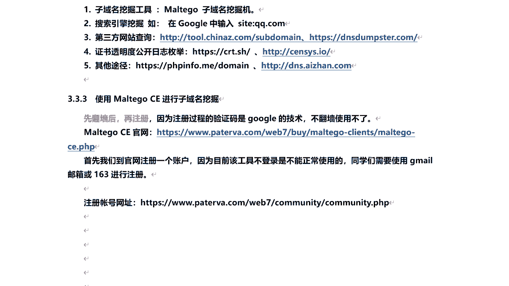

然后你需要激活一下的啊，激活之后就可以用了啊。

比如说发到邮箱了，有这么一个链接是吧，已经发售的邮箱了，然后呢比如说你用163邮箱注册的，那么你呢登录你的163邮箱。

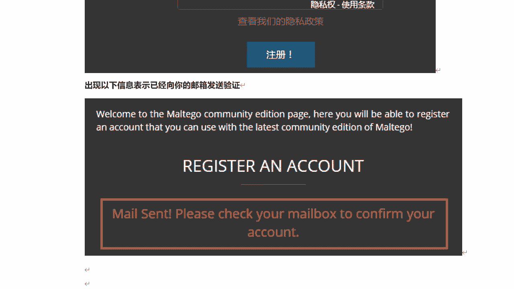

然后呢会收到这么一封邮件，让你点击这个链接去激活呢，你的mate girl账号激活之后哎就可以了。

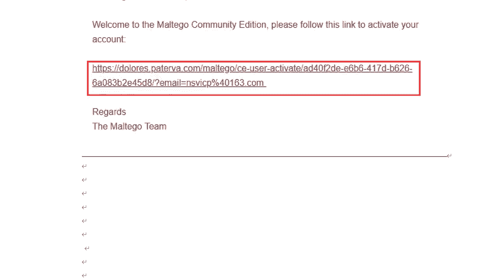

然后呢下面呢我们来到kelly里面打开这个工具啊，那么这个工具呢在哪里，在应用层里它属于信息收集的部分啊，那么在这里matter go。

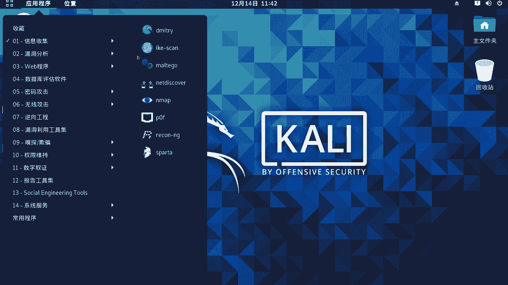

让我们稍等啊，好那么这里出现啊，打开一闪没了是吧，为什么呢啊因为是这样啊，那么因为处于安全因啊，那么现在就是新版本的一个圆啊，对他呢这个有些程序啊，有些工具啊，它不允许你在root用户下去运行啊。

打开那么这个问题怎么解决呢，我们进入终端好吧，那么这里我们来重新安装和配置下的，matt go就可以了，app install啊，然后呢m a l t e g o，我们使用root账号来重新安装啊。

配置下的就可以打开了，当然那么你可以进行创建一个普通用户，切换到普通用户之后呢，用普通用户来对运行这个matt go也是可以的，我稍微等一下，好的，安装完成之后呢，我们再来到应用程序信息收集啊。

来再打开它。

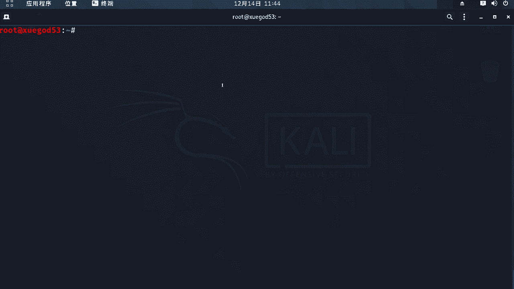

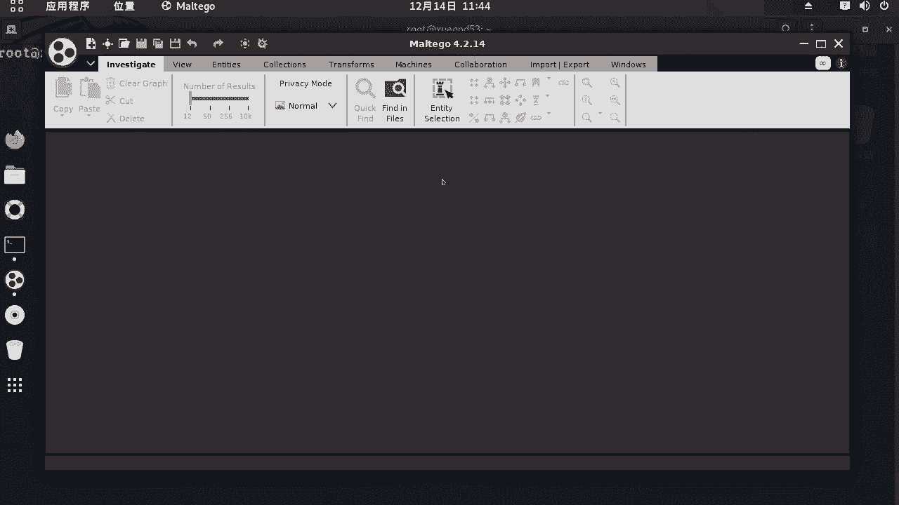

好那么现在呢就可以访问了是吧，然后呢这里头呢我们使用哪一个呢，我们来看啊，使用这个matt gic啊。

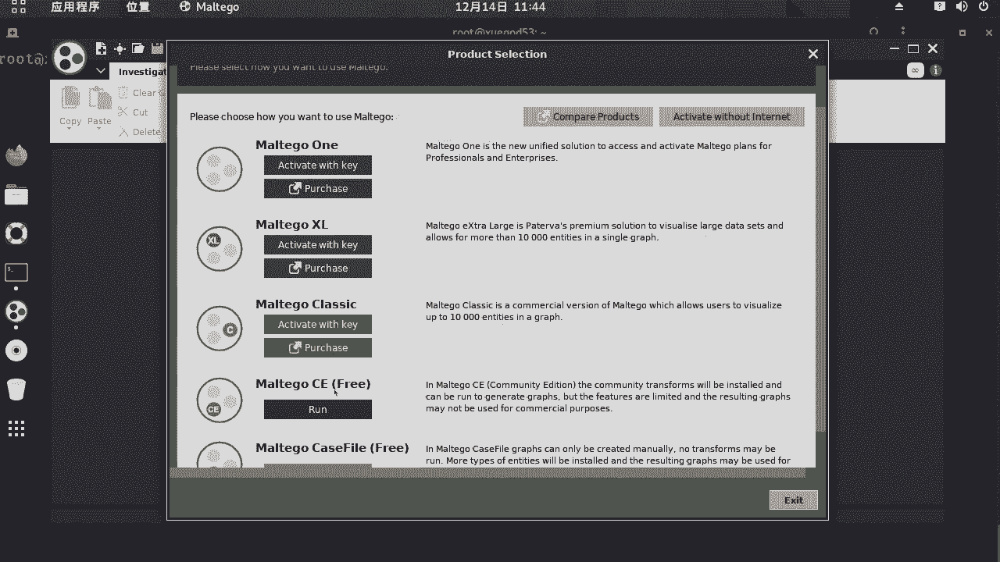

那么这是free免费版的，也就是社区版的，我们点击run。

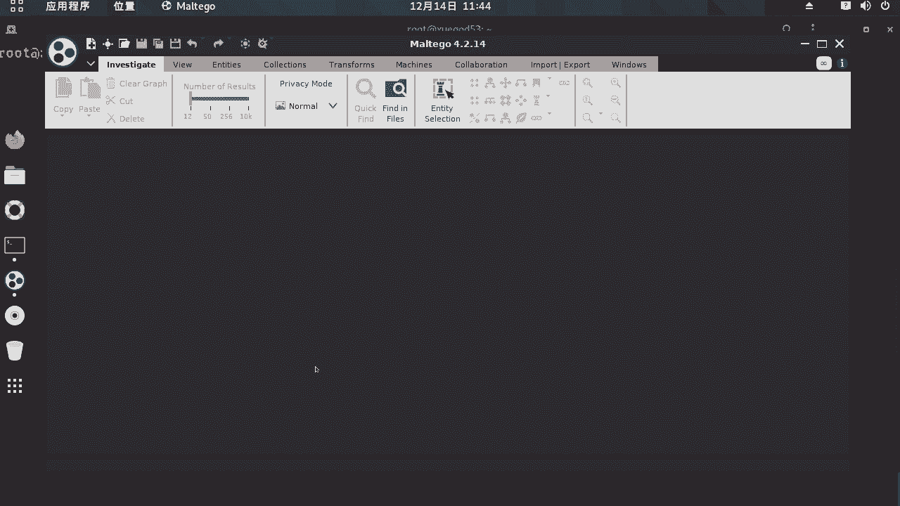

当然其他的有收费的啊，像其他的没有标明是free字样的。

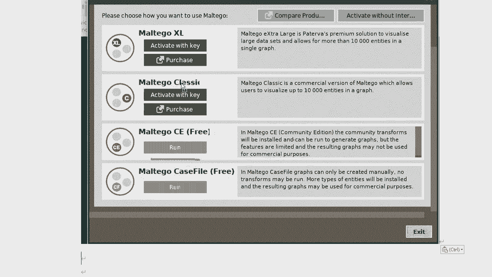

都是收费的好，那么到这一步呢，我们点击来接受啊，下一步，那么再让你输入账号进行登录，那么这个就是来输入刚刚我们注册的那个账号，就可以了，邮箱，密码验证码。

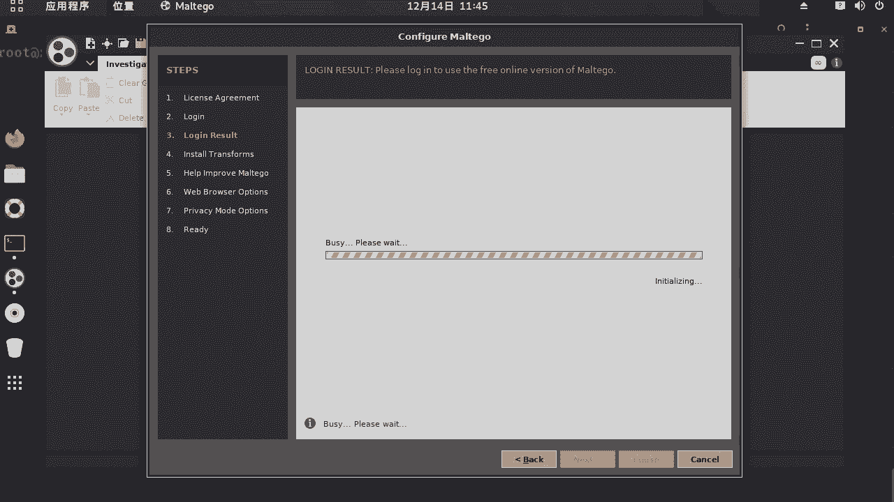

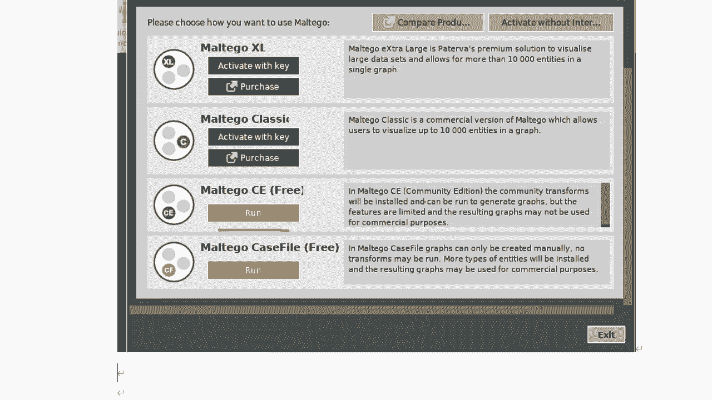

好笔记给大家整理一下了啊，好那么到这一步呢，验证你的账号密码是没有问题的，然后点击下一步就可以了，然后呢这一步呢开始啊安装一些插件。

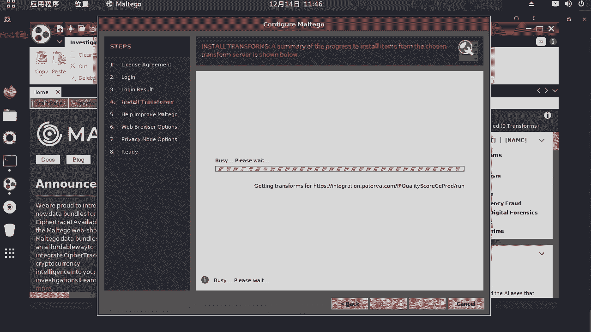

那么就社会他会下载啊，或更新呢一些必要的组件啊。

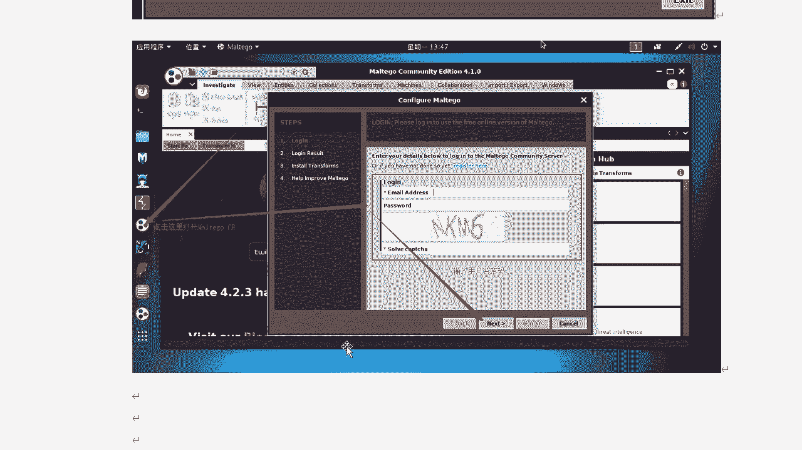

那么你的网啊要连外网要通，如果失败了。

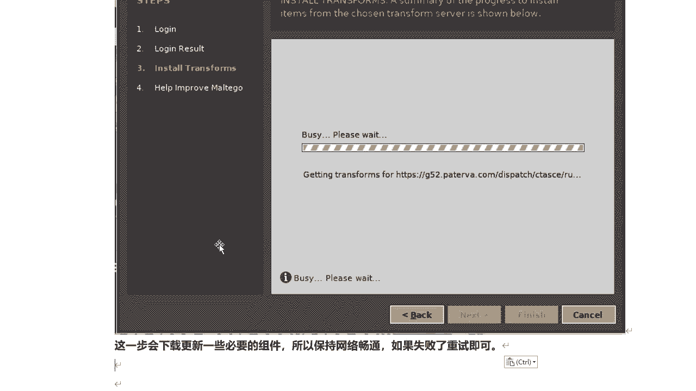

那么怎么办呢，从事就可以了啊，好那么它已经下载安装完了啊，complete，然后点击下一步，然后呢他自动去报告发送错误信息，那么这里我就默认啊不选了下一步啊，这得默认下一步下一步。

然后呢打开一个空的画布啊。

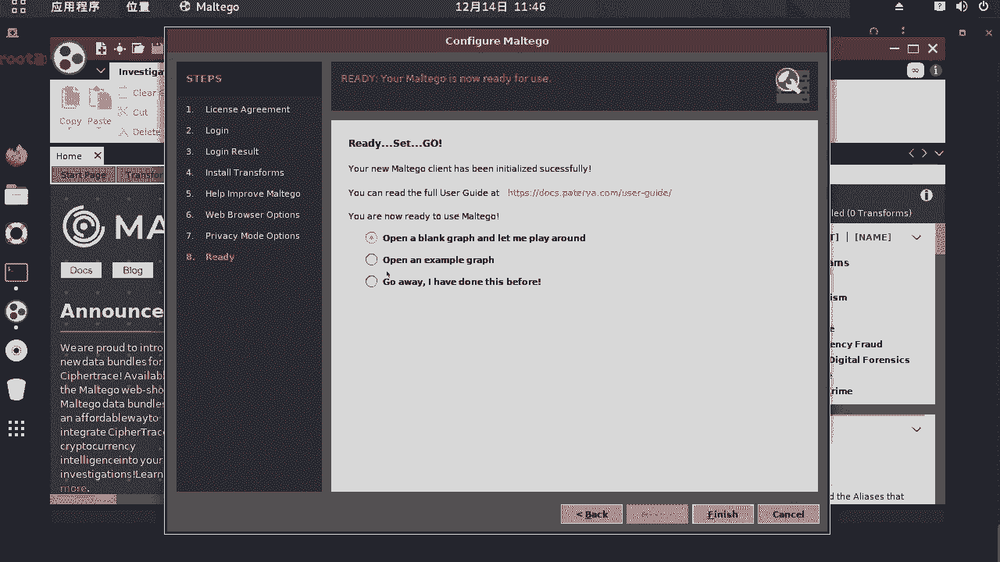

然后呢点击完成就可以了，啊你是否要想导入一些配置啊，那么这里剪辑yes，没有，ok没有影响啊，它自动会打开一个画布空白的，那么到现在为止，我们这个mate go啊啊就登录加载完了。

这些相关的一些组件也安装和更新完了对吧，那接下来我们看那么这个工具呢如何使用它呢，来收集子域名，好吧好的，那么这里呢我们来在左侧呢对来输入啊，输入din啊，那么域名对收官收集子域名相关的啊，一个组件啊。

在这里我们来看啊，t o m a n啊，那么我们看这里呢有收到两个是吧，那么有一个dns name和dma，那么子域名啊，这个dm就是域名的意思啊，怎么，然后我们按住鼠标左键，将它拖拽到这里就可以了啊。

拖拽到这里，比如说我要想收集某个域名的子域名，那么我们单击这个域名这里，对双击啊，然后呢比如说我想搜索啊，氪点qq。com，这是腾讯课堂的对吧，看看它下面有哪些字与名好吧，输入完成之后呢，按下回车啊。

回车之后我们来右键单击这里选择所有组件啊，点开它好吧，点开它之后呢，我们来选择子域名，那么我们选择哪一项呢，选择这样to dns name啊，哎然后单击，然后他就开始查询了啊，好的现在已经有结果了。

对那么你看这些关于q。q。com的指引与名呢，那都收集出来了啊，查询出来了，那么其中有话啊的这个都是test点克点q。home诶，这个子域名是干什么的，这个估计test测试的意思吗。

我们可以来打开看一眼啊，test。q。qq。com啊，课堂官方测试啊，正常是在外面，你看不到这个页面的是吧，感觉是很有意思啊，当然这个呢我们好的，那子一名呢查询出来之后呢。

我们还可以对选择我们想要查询的信息类型，比如说我们这里呢单机啊，单机来，这里啊好吧，to d n s name，比如查询它的域名服务器啊，dns name n s记录吗，那么除了这个之外呢。

可以查询到dns服务器之外呢，比如我某个二级啊子域名是吧，我还可以进行进一步的查询，然后比如说这个啊右键对吧，那我可以查询他的ip地址to ip啊，好的，那么我们来看啊。

那么它的ip地址是不是查询出来了，对这个二级指令对应的ip地址是这个，那么或者其他的呢，对方式是一样的，比如你还想查这一名其他相关信息，你点对应的得记住就可以了，比如他用他的ip地址。

好那么他俩都指向同一个ip，说明什么，他都在同一台服务器上，好好的，那么这个呢就是关于使用might go，然后呢去搜集子域名啊，那么这里要注意啊，那macbook它的功能很强大啊，很强大。

而且功能也非常丰富，那么这里呢不能完全的去介绍每一个功能啊，唉所以大家呢可以根据自己的需求呢。

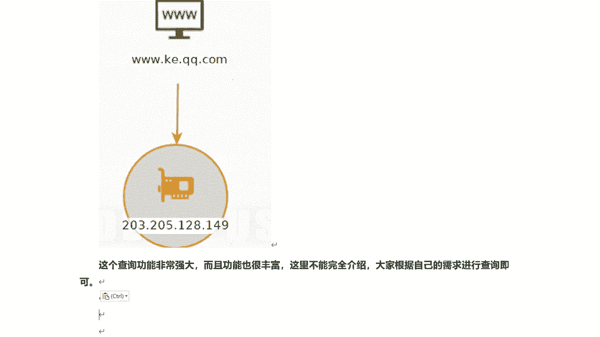