# 学不会我退出网安圈！中国红客技术正需要传人！全套666集还怕学不会？（网络安全／黑客技术） - P36：7.7-【被动信息收集系列】Shodan信息收集-shodan搜索技巧 - 一个小小小白帽 - BV1Sy4y1D7qv

接下来呢我们来看啊，那么搜到的搜索技巧啊，那么我们已经有他账号了，已经登录了是吧啊，我们看看它搜索啊，他知识啊有哪些啊，首先看第一个技巧，那么这也可能是大家比较最感兴趣的啊。

那么就通过收带来搜索webcam，还有网络摄像头设备啊，那么什么是网络摄像头啊，那么也就是说你的电脑上安装有摄像头啊，而且是联网的那种啊，那么特别是有一些监控设备，比如说我们一些公共设施啊。

或者是单位啊，公共场合啊对吧，有一些网络摄像头，那么通过手机app啊可以管理这种，他们都是联网的啊，那么在搜索框中直接输入welcome啊，或者是网络摄像头来进行搜索啊，都可以啊，那么这里也提醒大家。

只是为了给大家演示啊，搜索的结果啊，不要随便尝试去登录别人的一个网络设备啊，这样呢可能会带来一些不必要的麻烦，所以说呢大家一定一定要注意啊，那么我们来搜一下的啊，打开搜到啊，web com回车，当然啊。

那么这里可能啊能搜到一些啊，但是呢不一定呢有的打不开啊，有的不一定能打开啊，你看我们收到这些网络设备啊，这些都是相对于网络摄像头嘛，嗯我们来直接啊来访问，点击这个小箭头啊，看看能不能打开啊，有的能打开。

可能得需要验证啊，需要账号和密码，大家千万不要尝试去破解人家的账号密码，这样是不安全的啊，对你是不安全的，也可能会带来一些不必要的麻烦，哎那之前也收集过啊，那么可能现在好像找不到了啊，确实有啊。

这一般有的都是国外的比较多啊，国外的比较多，打开特别慢，来，hello world啊，这个有点搞笑啊，啊好困啊，来咱们去看看啊，打开一看这个啊是吧嗯这个ip啊，输入账号和密码，让你你才能看是吧。

对然后呢，这里咱不知道大号密码，那咱就看不了了啊，那只是给大家演示这个效果啊，了解一下就可以了好吧，同学们，这个呢你找不到也没有关系啊，但确实能找到，然后呢这个我们看左侧啊。

对这个我理解我们搜的搜的是网络摄像头，那么搜索其他的呢都是一样的，左侧的显示一共你收得到多少个结果啊，然后呢这是每个国家啊，这中国呢有多少个网络车头啊，1460个啊，那比如说我点击china。

那可以进一步查询啊，country cn得到这些都是国内的中国的网络摄像头，然后我们可以来试试看，中国能不能打开啊，这是中国的啊，嗯china对这个打开支持源码哈好吧，这个更搞笑啊，没关系啊。

咱们不纠结它啊，知道这种方式能搜索到这个网络摄像头，就可以了好吧，然后下面就是提供各种服务，多少个数量，是不是要是哪个组织提供的，ok阿帕奇的，还有vim link啊，好的，然后呢这个是中国内的啊。

国内的中国的啊，那全球化刚才是多少一斤，是七七千多个吧，还是多个7000多个，那么这是关于网络摄像头啊，welcome对搜索技巧之一啊，通过它呢可以搜索到所有联网的网络渗透，那比如说像之前啊。

哎那么搜索到一些结果来，之前我搜索到的啊比较有序的链接，像这些链接啊，现在应该是打不开了啊，我们可以试一下了啊，有些链有些链接啊，你就当时搜索到能打开啊，可能过一阵它就失效了，那可他可能不用了呗。

是不是诶，我们好，这个打不开了，失效了，失效就失效，咱也不纠结它好不好，然后再看看这个啊，试一下的啊，好的这个也打不开了啊，没关系啊没关系，然后呢还可以呢，大家还可以加上城市。

比如说那么中国呢我会收了对吧，那么我想搜索北京的网络摄像头啊，city冒号加上城市名称，北京空格，welcome啊，就可以了，那我或者我在后面加上city city by北京，直接来咱们用它啊。

好的这还真有一个啊，搜索到一个啊，来我们点击看能不能访问，这个好像是一个个人家的是吧，但打不开了对，那为什么打不开了呢，对你可能关了，是不是啊对那么这个呢它是它的一个缓存，能理解吧，唉他这个缓存啊。

好的ok啊，可以啊，这个是应该是给个人家的好，那咱们继续啊，继续这个不纠结了不纠结了啊，绝对不纠结了，还有之前这个这个还有一个啊，之前抓拍的啊，抓拍的这是一个图书馆啊，图书馆嗯好。

那除了搜索网络摄像头之外呢，其实我们利用手段，主要是来收集什么目标的信息是吧，属于利用第三方嘛，手段属于第三方，那么这种呢它不容易被发现，而比较安全好吧，那下面咱们来介绍第二个技巧。

就是通过来搜索指定的ip地址好吧，那通过ip地址我们能得到一个什么样的信息啊，那比如说啊我们得到3w血干的cn啊，学神这个网站的ip地址，然后呢，我们再通过搜到我们对这个ip啊来进行搜索，怎么搜呢。

咱们来night冒号后面跟着ip地址，然后回车，那这样我们才能得到呢关于这个目标服务器啊，对对这个ip地址所在服务器相关的一些信息啊，是不是啊，那么看左侧一共得了五个结果啊，那么它开放了有哪些服务对吧。

然后他的服务商是什么，阿里巴巴的是吧，然后这里边都有什么mysql，open ssh和ngx，是不是一目了然啊，但这样看着好像不够很清晰啊，那比如我们这个ip啊，我来打开，点击这个ip地址，我们进来啊。

看左侧左侧呢是在i s p啊，扶伤阿里巴巴的对吧，然后呢是中国杭州就不用说了啊，看右侧pose开放了哪些端口，正常来讲我们要想得到目标机开放的端口是吧，是通过a map去扫描对吧。

那么这里呢我们不通过map对吧，通过收藏直接可以搜索出来n map，它属于什么主动信息收集，直接呢对目标对吧，进行扫描，直接目标进行接触，不可不可避免的会留下一些痕迹，但是使用收纳呢不会是吧。

开放了2180811233306，那么每个端口对应的什么服务呢对吧，二幺呢f t b对吧，八零端口一般是a t p端口对吧，对n gx啊，是用的nux，这个外部中文件版本是1。6。2啊，可以啊。

八一端口181端口是啥啊，正常一看就蒙是吧，对，那么这里的把它真实的对，这个八幺多少真实是干什么的给暴露出来了啊，是什么open ssh ssh，这就不多说了啊，好那么123啊，那么这个呢是udp端口。

这个端口是干什么用的，是nt p服务是吧，还有3306mysql好的，那么这个呢我们得到这些端口是吧，哎这个对我们作用很大，因为我们可以知道他开放这些端口，每个端口对应的什么服务，这个服务什么版本。

那么这个版本的服务存不存在漏洞啊，有可能存在漏洞对吧，如果存在漏洞，我们是不是就可以利用这个漏洞是吧，对服务目标即进行什么渗透，拿到它的一个权限啊，啊而左侧呢它列出了关于这个嗯。

这个服务器相关的一些漏洞啊，一看啊这么多漏洞是不是感觉很兴奋，但是仔细去分析啊，注意，那么这个他爆出这些漏洞不一定是真实存在的，你也不一定能利用这个漏洞去渗透到目标记，然后理解对吧，你得需要去验证。

因为啊包括任何一款啊漏洞扫描工具，那么它都存在什么漏报或者是误报这种情况，所以说大家要注意啊，对对都得需要去验证啊，我们去验证一下它是否真实存在，是否能够复现啊，然后呢如果不存在经过验证了对吧。

那么这个漏洞他报的就不准，所以说呢大家要注意啊，那么这是第二个技巧，那么还有第三个技巧，我们来看通过手段呢还可以来进行什么搜索，指定的端口，搜索指定端口，那么也就是在搜索框中啊。

我们直接输入port端口的意思，冒号后面跟上具体的端口号就可以了啊，那么就可以搜索指定端口，那么我们可以尝试来一些常用端口来进行搜索，对呀常用的端口都有哪些端口啊，大家要注意啊，你们心里要知道。

而且要记住啊，那最常用最常用的端口是啥呀，八零端口是吧，那么如果我假如说我们在这里啊输入p，那输入八零端口诶，那我会得到一个什么样的结果，搜索结果是啥呀，嗯八零端口是吧，web服务嘛是吧。

h t t p对不是，i t p s t p s，43端口得到的结果是很多的，一共是这么多，结果个十百千万十万百7000多万是吧，那么每个国家有多少个是吧，对这个对应的数量啊，那么比如你想看日本的。

你可以点日本，想看中国的，想看点中国就可以了啊，这里要注意啊，那么我们受到的这些结果，那其实都是外部服务，我们可以点开看啊，大家注意，大家不要随便去点金啊，保不齐哪个就是一个钓鱼站。

点一点你中招了或者是病毒恶意网址，是不是啊，对那么我们知道它的用法就可以了好吧，然后右侧呢它看显示对应的信息啊，它的服务器是n g s还是阿帕奇的，对啊，他外部中间件是什么，这是阿帕奇的，对不对啊。

这个是这个的啊，这个不一定准啊，不一定准，因为这个它可以改的，可以改的，可以隐藏嗯，显示不精准，所以让他得到这么几个都是开放八零的啊，那么这个呢是一个新站点是吧，它一个是n启用ngx啊。

对默认的一个页面好呃，除了八零端口，其他单位一样，比如说那我来搜一下，所有开放3389端口的对吧，3389是吧，windows远程桌面是吧，对那得到的这些ip地址能做什么，那你可以远程连接它。

但是不知道单号密码可以暴力破解。

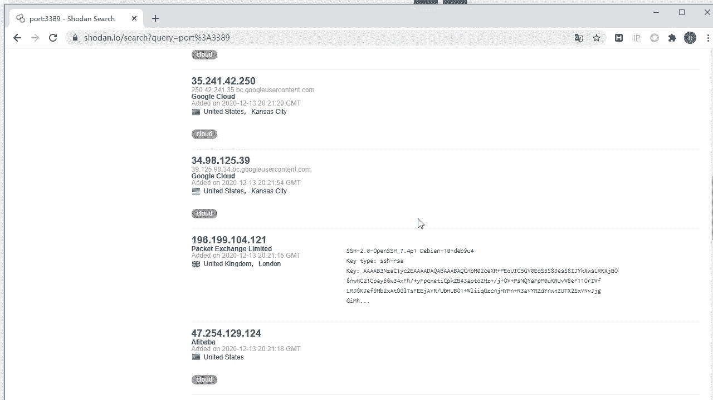

但是呢大家不要这么去做对，因为这些可能都是大部分都是国外的是吧。

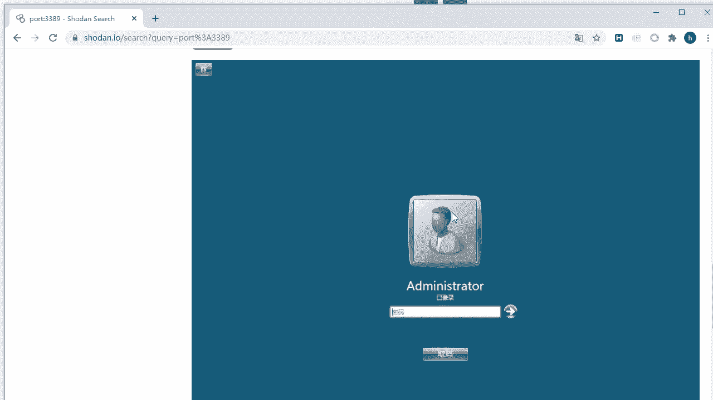

你要暴力破解，被人发现了是得要反抗你是吧，对对你不安全好吧。

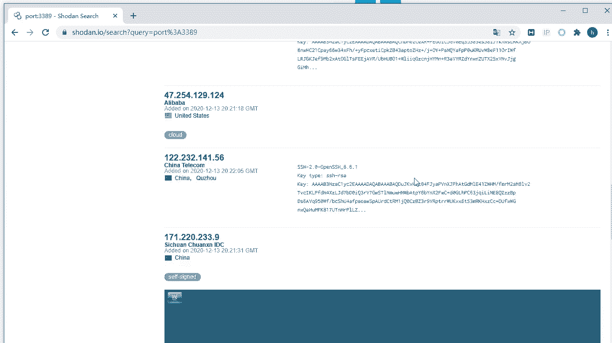

我们知道这种搜索方式就可以了啊，那另外呢另外啊，那么这个可以多可以多个结合在一起用啊。

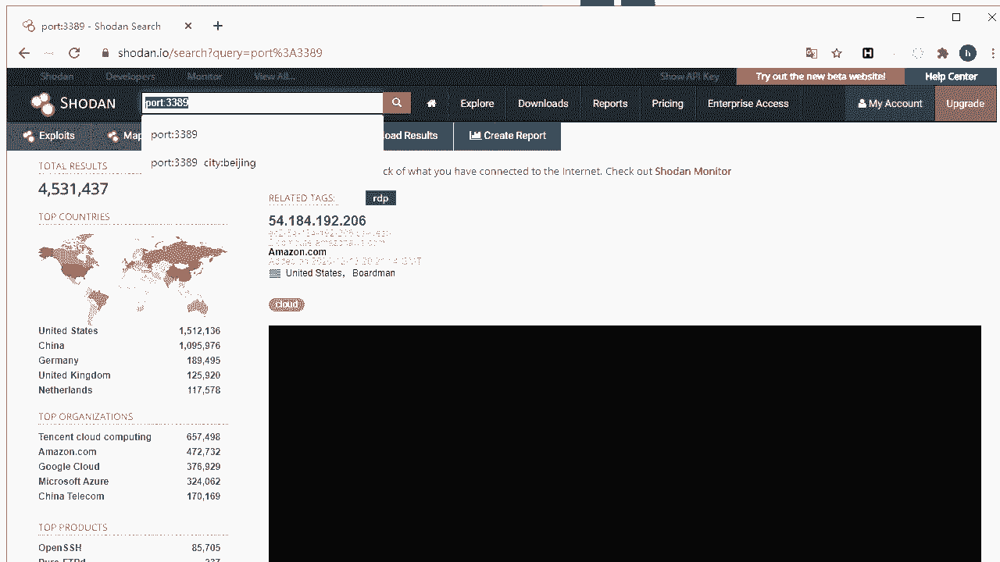

多个参数搜索技巧结合在一起，比如我指定ip和指定端口去搜，那么也就是在指定的服务器上去搜索，指定的端口，是不是也可以呀，对呀这些也没事，这也是没问题的啊，没问题的嗯，那还有一个比较常见的就是9200啊。

对这个端口是干什么的啊，大家知道吗，他是e l k日志分析相关的啊，那就我们来可以搜一下啊。

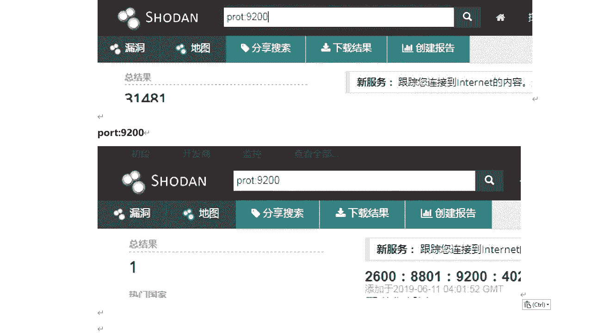

9200对这些征稿我们都需要了解一下的啊，他是干什么的，常用的啊。

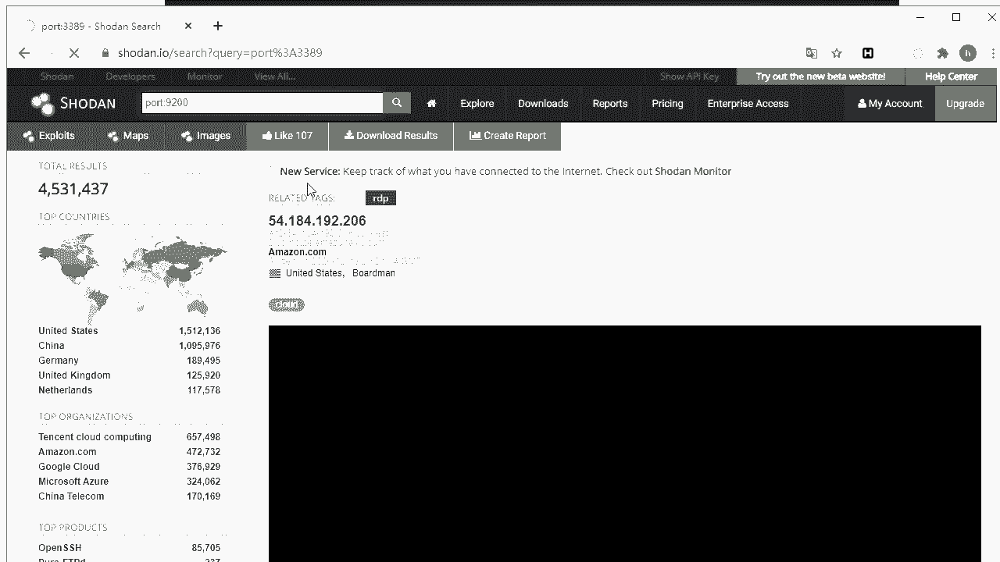

你看能不能得到结果啊，可以啊，然后呢我们来打开是哦，这个开放了这么多端口是吧，对呃我们说的是9200啊，但点i p进来之后可以查看更多啊，这么多很多都是高位端口啊，但是对应什么服务啊，这里没有是吧。

没有显示出来啊，没关系啊，我们点击这个端口看能得到一个什么结果呢，没有反应啊，这里没啥反应啊，ok然后呢这个我点开看啊，这是什么，这个初一面是吧，ok有很多他都仿不了的，啊这个呢，这个错过一面啊。

那么他呢这是一个19200啊，他是e l k啊，日志分析系统嗯，他这个可能是这个页面有点问题啊，好那么还有一个常用的端口，就是说3000大家知道是干什么用的吗，来三阶一般服务器监控平台对使用这个端口啊。

服务器监控平台，那我打开一看啊，这是一个get help啊，都跑到第四上面了。

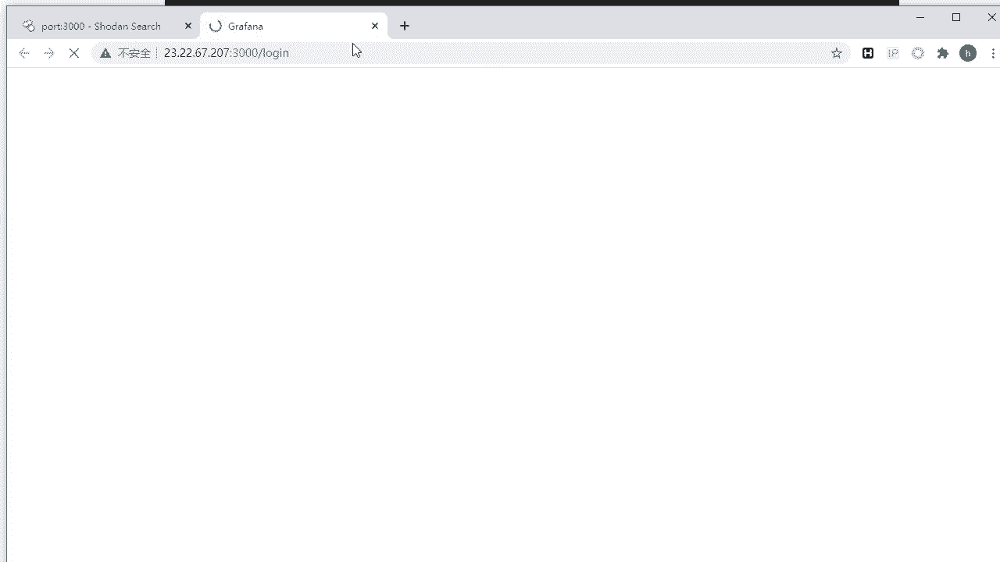

好好好，那么这个呢是需要你登录对那么这个是登录，但没有验证码，是不是啊，哎登录他的服务器监控平台，但是没有验证码嗯，那么你可以尝试暴力破解，但是他不建议大家佳佳这么去做啊。

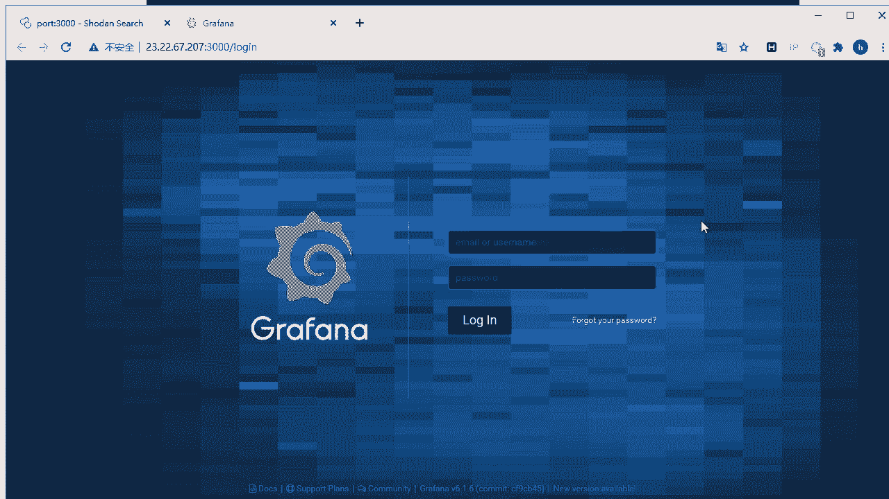

对在国外的嘛，你要是可以试一下的，但是不建议大家这么去做，ok好的，那么这个呢我们这是关于啊这个搜索技巧啊，指定端口啊，那下面一个呢，我们来可以指定具体的程序来进行搜索啊。

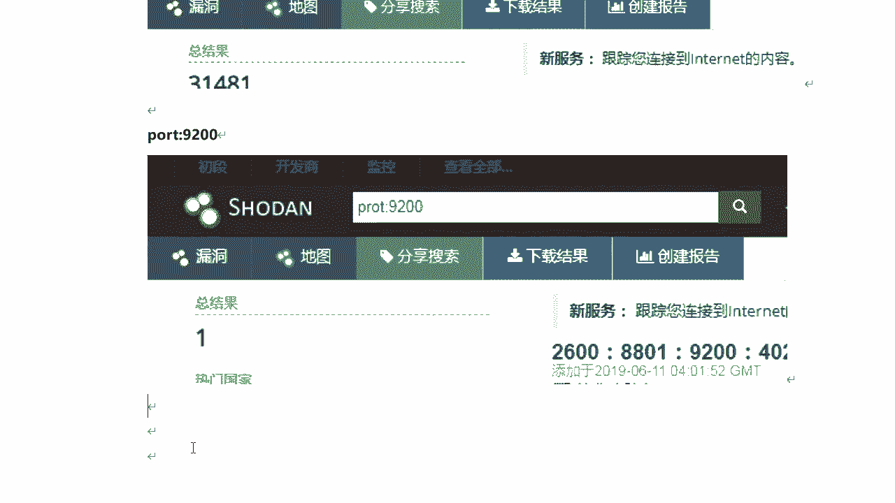

嗯前面咱们也演示过是吧，对搜到搜索具体的城市，那么在搜索栏中输入city幕后北京，那你想搜索其他城市，其他城市名称就可以了，就可以搜索出北京的一些联网设备，那么我们可以和port啊这个端口进行组合查询。

比如说输入cd冒号北京，然后空格port冒号八零，那么就可以搜索出所有到北京啊，所有北京开放80端口的设备啊，这也是可以的，那么这样的话更细化了。

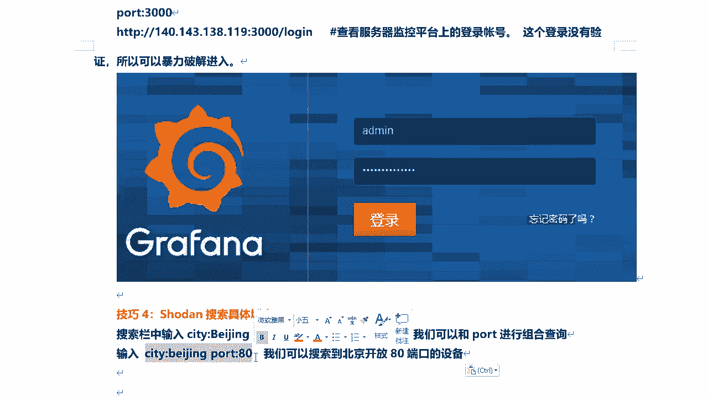

是不是啊，那么我们来搜一下啊，这个我就关了啊，好的，看这里，好那么这是北京的行，一共是多少个啊，个十百千万13万啊，还是不很多的，是来自nginx，这是刚刚创建的吗是吧，来打开这个看能不能访问啊。

哦隐私啊，注意啊，那么为什么会出现这个提示啊，因为它是h t t p s的是吧，对当然也有一种可能啊，对那么它也存在一定风险，所以大家不要随便去访问嗯，但是为了安全啊，那么你呢可以在虚拟机里面是吧。

去访问啊，这是一个登录界面设备管理平台啊，没有验证码，像这种没有验证码的都很危险，容易被爆破啊，容易被爆破啊，啊直接跑字典是吧，暴力破解就容易破解出来啊，那么这是关于这个城市啊。

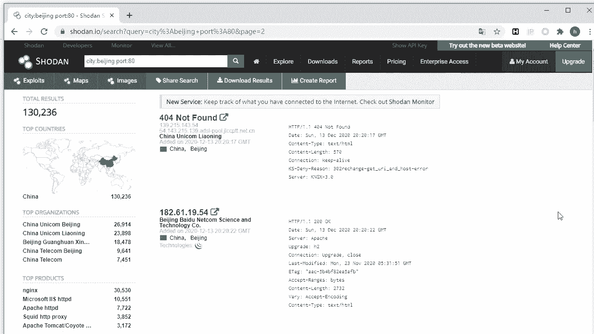

对和端口多个技巧关键词组合进行搜索，那么其他的都同理啊，都同理啊。

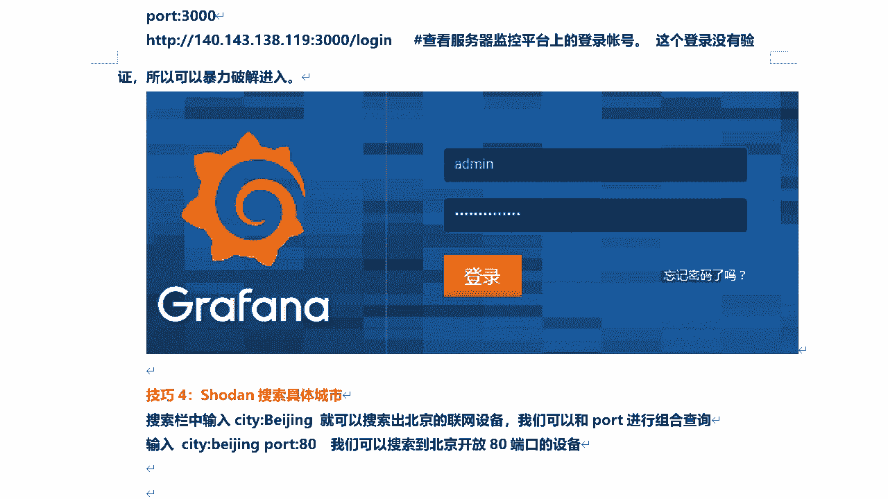

那么我笔记呢给大家整理到这里啊，那么这里呢我要再多说一下了，那比如说我看我们点击这里头左侧啊，左侧，叫你china beijing是吧，然后ngx，看到吗。

city曾是北京端口八零product产品n gx，这边是组合进行搜索，那其实对于so done来讲，那么它的搜索语法呀还有很多啊，那么大家可以去自己去整理一下他，你在百度或谷歌搜索搜到搜索语法。

那么能可以搜出很多很多相关的一些资料好吧，那么关于收到使用手段，搜索引擎来收集信息呢。

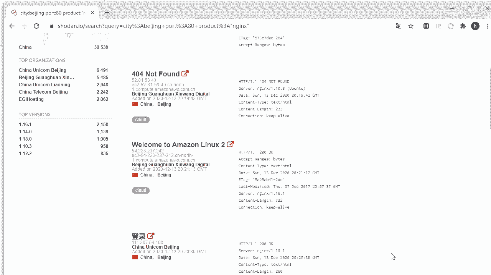