# 学不会我退出网安圈！中国红客技术正需要传人！全套666集还怕学不会？（网络安全／黑客技术） - P41：8.3-【主动信息收集系列】基于ping命令的探测-ARPING - 一个小小小白帽 - BV1Sy4y1D7qv

好那么接下来呢我们来看一下a r拼啊，那么a r拼这里是一个概念a r p啊，那么a arp协议啊，那么什么是a arp协议呢，a arp协议是地址解析协议啊，那么它的缩写啊，那么计算机呢。

它是通过arp协议将ip地址转换成mac地址好吧，那我们下面来看分析a a f a r b c，它的一个工作的一个原理啊，那么在局域网内啊，局域网，那么数据传输的目标地址是mac地址。

也网卡地址也叫物理地址好吧，那么也就是一个主机啊，要和另一个主机要进行直接通信的话，那必须要知道目标主机的一个mac地址，那么他们之间才能进行互相通信啊，那么但是呢计算机的使用者。

那比如我们只知道目标地址的什么，目标机器ip信息，那么很少有人会知道目标机啊，某台机器的mac地址是多少，我们只知道ip是吧，那么地址解析呢就是主机在发送数据之前啊，将目标ip地址转换成目标mac地址。

这么一个过程啊，那么简单的说arp协议，那么主要是负责将局域网内32位的ip地址，转换成对应的48位物理地址，这么一个过程啊，据网卡的什么mac地址对，那么它的才能保证什么通信的一个顺利的，一个进行啊。

下面呢我们来通过一张图啊，来了解一下a r p啊，他工作的原理，我们来看一下这张图啊，那么在这里呢两台机器啊，局域网内那么1。631。64好吧，那么1。63要给1。64要发送数据的话。

首先要知道它的什么mac地址啊，那么如果他不知道怎么办，那么他会向局域网内发送一个广播包，问谁知道是吧，1。64的mac地址是多少对吧，那么局域网内有很多机器对吧，那么都会收到这个数据包。

都会收到这个数据包是吧，那么但是其他机器呢发现他不是发给自己的，不是在问自己怎么办，都丢掉丢掉谁接收啊，1。64会接收这个数据包，然后呢它会响应啊，响一个数据包给谁，给1。63是吧，告诉1。63啊。

那么我的mark地址是多少啊，是这个带的mac地址再发给他，那么当1。63收到这个a r p应答包之后，对吧，得到了1。64的mac地址，那么此时他就给他发送了吗，发送数据啊。

他们之间就可以进行互相通信了，这个是整个a i p的一个工作原理啊，那么通过a r p呢对我们可以实现什么，可以实现查看局域网中的ip啊，是否有冲突啊。

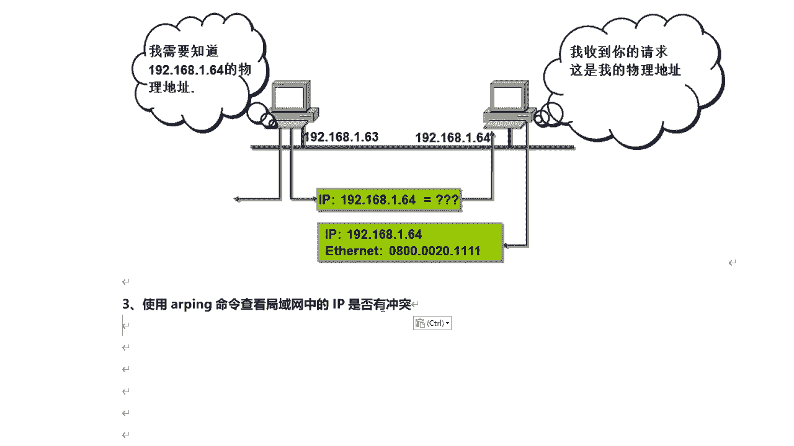

那比如我们可以这样诶，arp啊，然后呢我们来拼一下网关好不好，那平线网关呢通过这种方式，比如如果局域网内有人冒充网关的话，那么你通过这种方式就能得到几个两个啊，两个这块得到两个记录啊。

mac地址是不一样的，但是现在呢我们只拼出一个结果是吧，那么是正常的，没有人冒充网关啊，那么这个网关的mac地址是这个ip地址，是这个对吧，那么通过a r p呢也可能获取目标，记得一个什么对mac地址。

也就是说物理地址啊，大家要注意啊，那么使用a r p呢，一次只能拼一个对吧，那么如何使用a i p命令对吧，来筛选整个拼整个局域网内所有主机，那么通过这种方式呢，a i p a可以判断对吧。

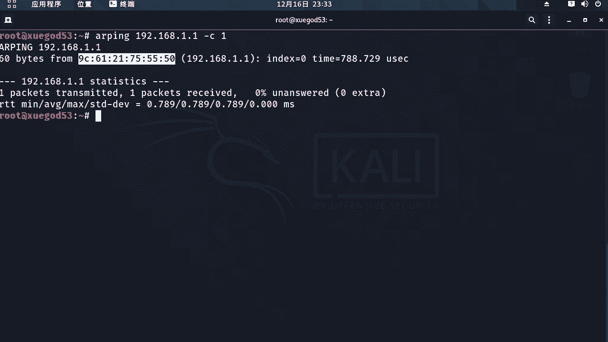

局域网内有哪些主机呢是存活的，那我们看一下的啊，那么接下来我们看对a arp命令啊，那么结果呢我们来进行一下筛选啊，比如说只取ip地址啊，我们来先给大家讲一下这个小技巧。

然后呢接下来要讲如何去进行利用ai拼对吧，来扫描整个局域网内，一个网段内的哪些主题呢是处于存活状态的，有批量扫描嗯，这里呢我们来看那么a i p啊。

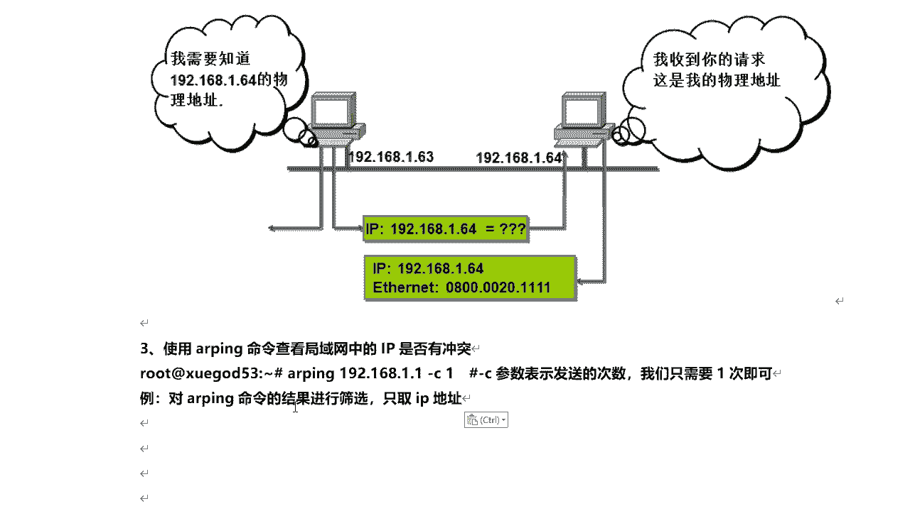

他得到的结果呢是什么样呢，我们来看是这样的对吧，我们去批评网关好吧，那么从这些信息中，我们如何去把这个ip地址啊给他筛选出来呢，这里我们需要利用到一个相关的一些工具了啊，我们来看怎么扎的结果呢。

我们来加一个竖线，那么这个在linux系统里面就是管道符好吧，那就相当于把它的结果啊输送给什么，传递给后面，后面呢我们通过一个group命令，那么筛选好吧，那么通过大了我们来筛啊，那比如i p地址对吧。

这个1。2168。1。1在哪行，在这一行，那么我们来选出一个唯一的一个关键词对吧，其他地方是没有的，那么这个batch from是吧，我们复制一下的来筛选一下它好，我们看得到一个什么样的结果好吧。

那不将这一行就筛出来了好吧，那么针对这一行的结果好吧，我们进一步来去筛i p好吧，那么这里呢我们需要利用到另外一个工具好吧，加一个管道符，把这个筛选这个结果呢在输送到后面的命令啊，传递给后命令。

这里我们通过cut啊，cut是截取啊截取，然后杠d用杠力呢，我去指定分隔符，那么注意啊，那么这里有个特点啊，那么这里每一个都有一个空格，这里都有个空格对吧，那么我们以空格作为分隔双引号空格来引上。

然后注意啊，那分割之后啊，我们取如何去取代它呢对吧，那么分割之后，那么左边这个相当于第一列，第二列，第三列，第四列，第五列对吧，那我用一个参数杠f啊，它是代表的什么列啊。

字段我们来看得到一个什么样的结果，诶直接就把它筛出来了好吧，那么对他来讲，那么我使用上面同样的方法cut对吧，再加一个管道符cut，那么此时我们以左括号作为分隔符对吧。

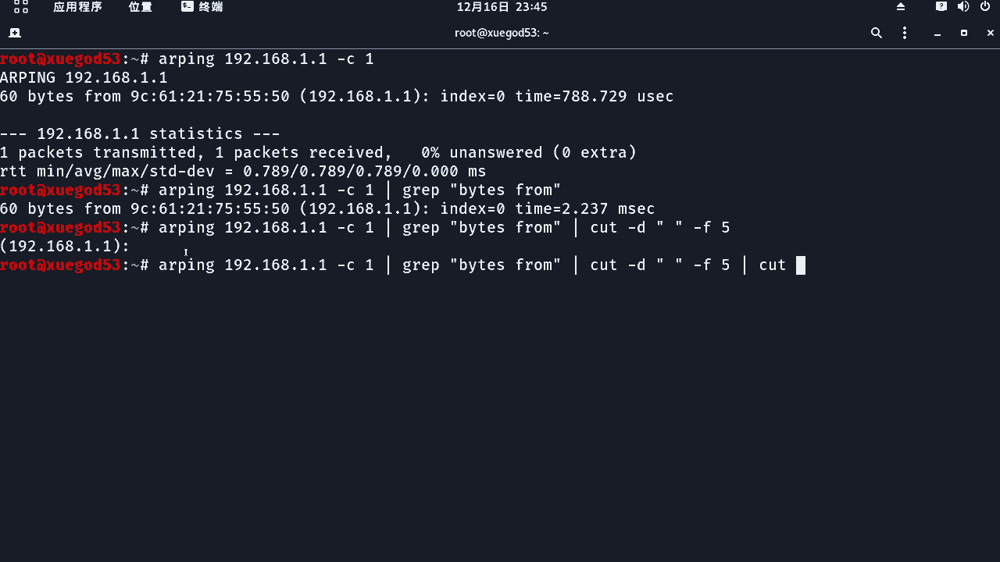

杠d好吧，然后呢哎左括号啊，那么这么分割之后呢，我们看左靠左边是不是第一列啊，但是呢他什么都没有是吧，那右边呢它其实相当于第二列，那么我们取ip地址应该取啥对，取第二列杠f2 哎就把它取出来了。

那只是后面呢还有一个右括号冒号是吧，那么如何把它去掉啊，那么我们接下来同样的原理好不好用，还用cut命令杠d，我们以右括号作为分隔符好吧，那么这么分割之后呢，我们看左边的ip地址就相当于第一列对吧。

右边是第二列，那么杠f一唉，这样的话就把ip地址筛选出来了啊，但是这里好像有点问题哈，对吧，然后我们来看啊，这是什么问题呢，杠d啊，然后来f2 cut杠d，我们这是以哦，这是我输入左括号了是吧。

对数错了啊，这里应该是右括号是吧，ok，那么这个ip地址就取出来了对吧好的，那么这样的话，我们接下来呢，我们来利用脚本实现了一个对整个一个网段啊，进行一个批量的一个对扫描啊。

然后呢把存活主机的ip地址给它直接输出出来，是利用这种方式啊就可以实现了，好吧哎那么因为a i p啊，它一次只能拼一个i p对吧，对一个i p定型了吗，解析，所以我们需要通过脚本来实现。

对网络的一个自动扫描啊，那你不可能是一个一个ip手动去扫，那比较费劲是吧，那这里呢我们来创建一个脚本的v i m a r p。

拼一点s h啊，写一个shell脚本啊，那这个脚本的代码呢，我直接就来复制进来。

好吧，那么这个脚本写完之后呢，要保证啊在任何一台机器啊都可以用，所以说呢这里呢有这个ip地址段啊，不能是固定的，得需要动态的去获取啊，下面呢我们来我给大家讲一下的啊，那么这个代码都是什么意思啊。

这脚本首先第一个判断啊，判断dollar井号是这个获取到的，是你传入的参数的个数啊，杠n e不等于一，如果你传入参数个数不等于一，那么它的执行这个提示，什么意思，那你也就是要求啊。

那么这个脚本只允许传入一个参数啊，如果你不传参数或者大于一个参数的话，他直接就退出了，不往下执行了好吧，然后接下来往下呢interface定义一个变量啊，dollar一啊。

dollar一呢就是将用户输入的参数啊，传递给这个interface变量对吧，dota一是第一个参数，它只接受一个参数，然后接下来呢又定义一个变量对吧，那么后面的把后面的结果啊付给这个变量。

后面的结果是什么，和刚刚我们讲的是不是筛选是一样的，只不过这里得到一个是什么样的结果的，if config这个命令后面跟上这个参数，那么大家想这个参数应该是什么对吧，他得到一个结果之后。

然后对这个结果来进行筛选，那其实啊这段脚本是获取本机ip地址的网站，比如说192。168。1，第2g啊，或者零点几对你的网段啊，你的网段，然后呢接下来对整个网络上进行ai拼好吧。

那么你这里此时他获取到的是啥ip地址的，前三各段清三段是吧，然后通过一个循环对，那么这个循环呢a d d r是个变量in，然后这块s e q又是变量，这个取值呢是从1~254，然后去执行这个循环。

a i p c发送一个数据包，然后呢前面的是网段，后面呢这是从一开始啊，比如说192。168。1。1，然后呢去拼啊，拼的过程呢就到这整个这个脚本对吧，最终的是得出一个什么ip，只输出一个ip地址啊。

从一开始啊，1。11。2，1。3~1。254啊，那么这样会通过循环，把所有在线存活主机的ip地址，都能给它怎么筛选出来啊，筛选出来，那么这里呢我们来看看它这个是怎么得出来的，是吧。

那我给大家演示一下了好吧，那这个脚本呢我们来先来保存一下的if config，那么我们直接这么去执行的话，它会得出这些结果好吧，那if config后面的部分对后面的部分呢啊，是哪部分呢。

来我们把这个脚本啊来粘贴到笔记里面，对这一部分应该是啥对吧，我们看这个是网卡的名称是吧，这是本地回环地址，这个对我们没有用啊，那其实我们可以这么去执行e t h0 对吧，哎得出这一段啊。

那么如果假如说你的网卡名称不是e t i h，零呢对吧，那么可以加133，其他名称，那么一样也是可以用的，那么它呢是作为一个参数啊，也是唯一的一个参数，还传递进来的就是interface对吧。

到了一啊好吧，那么也就这个脚本最终运行的时候，需要我们传递一个什么网卡名称啊，给这个脚本，然后呢他通过aa f config网卡名称得出这么一段，然后呢针对这一段结果呢，后面来进行一些筛选。

比如说来我们看这个地方，我们直接把它复制过来啊，不会他那最终得到一个什么样的唉这块，啊唉最终得到的是什么，192。168。1哦，是整个ip地址，整个在前面这三位对吧对这是网段，当然你如果不是一。

那你这块肯定得到，如果是零，这就是0168点或者192。1，68。15，那么就是幺五啊，那具体后面的ip地址是多少，后面呢然后呢进行拼接对吧，在这儿进行拼接，你得到这个网段了对吧，前三位。

后面这个平行addr呢是从一开始循环好吧，一直到254啊，最终呢这个输出就是一个存活主义的ip地址好，那么我们把这个脚本啊对输入完，然后保存一下的，然后接下来呢我们给它一个执行权限。

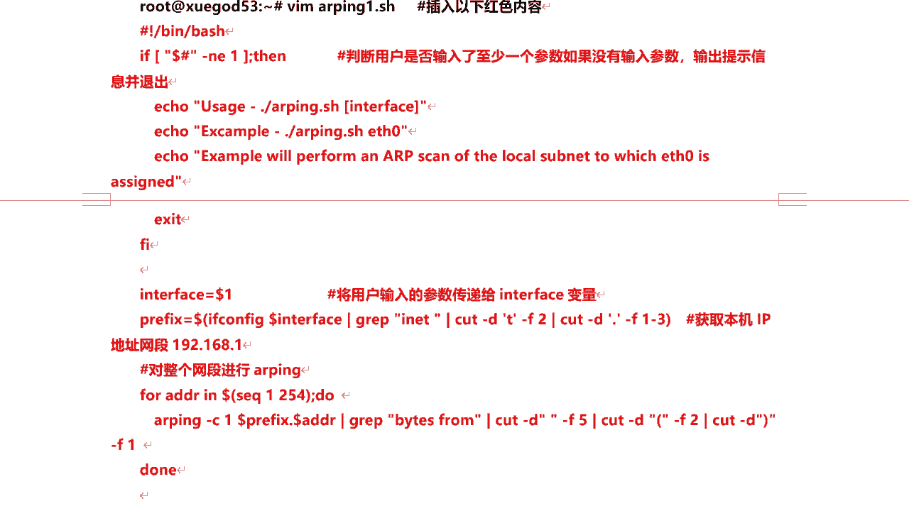

再加一个执行权限，我们来看一下啊，c h mode加x a r p加平行权限，然后呢下面我们来执行一下的啊，那么这个怎么去执行呢，我们来a2 a r p拼好吧，然后呢加上网卡的名称，如果你什么都不输入。

他会直接给出这个结果提示是吧。

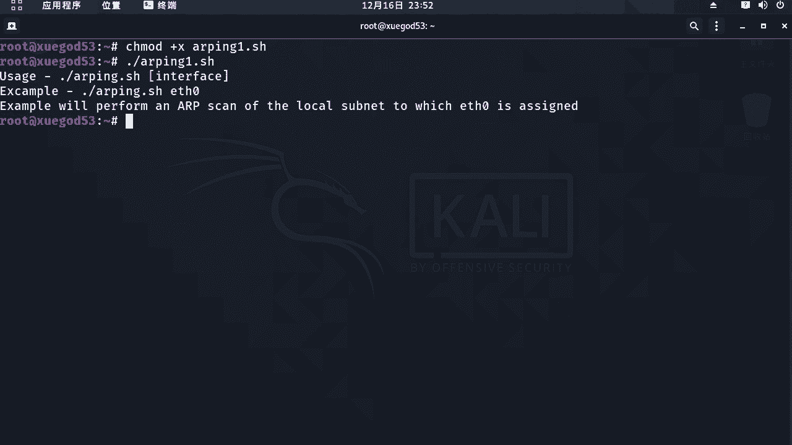

你没有输入参数啊，你输入的参数个数不等于一对吧。

好那你就必须得输入一个参数，而且只能输入一个参数，就跟上网卡的名称e t h0 ，那么它就开始进行整个循环扫描了，首先探索是一个网关存活的，还有1。2是吧，这两台主机是存活的。

他直接把存活主机的ip地址啊输出出来了，接着上12345，一直到254啊，我们等等，他会把所有局域网内在线存活的主机，ip地址都会输出出来，好那么由于这个整个周期时间比较长，那么这里呢咱就不等了好吧。

那其实利用这个脚本啊，我给他停一下的啊，停一下的，那我们还可以去检测出啊。

那么局域网内是否有ip地址冲突对吧，哎我们来给大家模拟一下了这个整个过程啊。

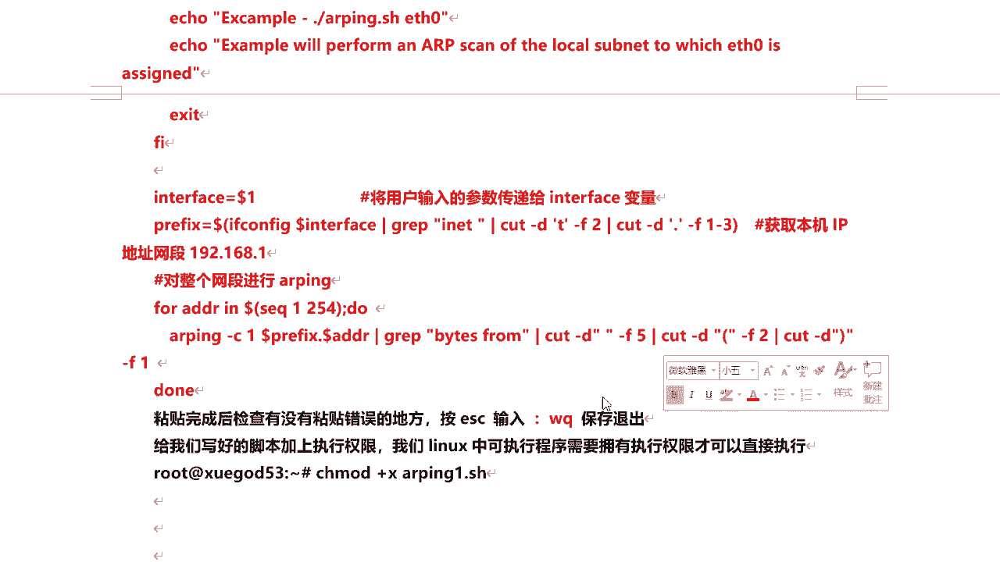

那么这里呢我们来可以去打开一个渗透s好。

那么我们来修改一下，这个是4s的ip地址啊，我们把它ip地址啊临时修改成网关的地址好吧。

那我来模拟一下它啊，模拟一下它if的那个e n s，33192。168。1。1好的，然后我们来看一下啊，那么它的ip地址好的，那么就变过来了好吧。

然后接下来我们来使用这个脚本，来在执行一下的啊，对去扫好，那么如果我们发现啊有两个ip地址是一样的，那么这就是网关一样的，就证明什么有ip地址冲突，或者是有人冒充猛关了对吧。

或者是如果其他的ip地址是一样的对吧，那就存在两台机器ip地址啊，冲突了啊，一样了好吧，或者就是就有a arp攻击了，就证明有a arp攻击了啊，如果假如说你不是刻意去改的话，那就是存在arp攻击好吧。

然后呢这次这个脚本可以实现什么自动化啊，批量扫描，这样还是比较方便的啊，那包括大家在日后啊，对那么可以学一下这个脚本，shell脚本对于我们进行一些探测扫描啊对吧，那么它可以更方便一些啊。

毕竟是自动的嘛。

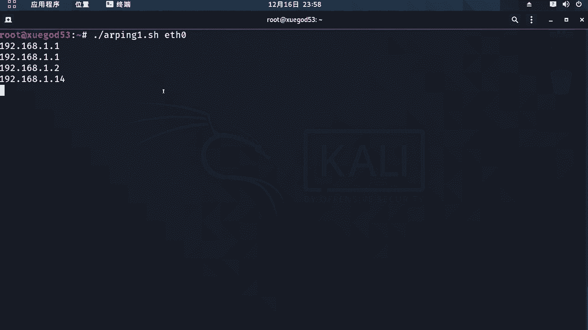

啊那么这里我就不等他扫完了啊，那么比较慢，咱们就给他停了啊，那么这是我们通过脚本来使用自动化，批量扫描啊，那除了ar拼啊，对这个命令之外，那么还有一个工具有net discover。

那么它呢可以进行被动方式的探测啊，局域网动存活的主机啊，那么net discover它是一个主动加被动的啊，arp侦查工具，它主要是通过arp响应包对吧，有arp响应包对arp数据包来进行探测的使。

用它呢这个工具可以在网络上扫描ip地址，检查在线主机或搜索为他们发送的arp请求，如果探测到有arp请求，就证明对吧，这台主机是存活的，但那它要分两种模式啊，主动模式和被动模式，那么注意。

那么就像主动信息收集和被动信息收集，是一样的，主动模式呢顾名思义就是主动的探测，发现网络内的一些主机，但是这种方式往往会引起网络，网络管理员的一个注意啊，特别是一些比较大型的一个局域网啊。

比如说有几百台机器，肯定也是有王者和管理员的，他每天呢再去检查整个局域网内是否有问题啊，主线对吧。

那么这里呢我用net this server来给大家演示，如何去主动探测主动模式啊，那么注意啊，主动模式来讲，他会主动向局域网内对吧，所有的主机发生什么a r p请求，如果收到应答了对吧。

那么他就会证明自己的主机是存活的，杠i指定他的网卡接口啊，网卡名称e t h0 好，杠r杠n呢是指定你的网段，你探测的这个网段一点，我是一点，他二四子网掩码好吧。

然后他就会主动向这个整个网段内的所有主机，去发送数据包对吧，a r b请求完了，我看那么探测是吧，这显然说这些主题是存活的对吧，这是发送数据包的数量，这个每个数据包大小啊，然后呢这是mac地址ip地址。

然后这个显示这个mac地址，什么这个厂商或者主机名称对吧，那么通过这个我可以判断出是吧，这个两个网关是吧，那么这个是vr是吧，这是虚拟机是吧，那么这个肯定是假的对，那么如果有a i p攻击是吧。

有人进行中间人攻击冒充网关的肯定，那么它哎它是用什么虚拟机来进行的啊，那么这个呢是真正的网关，ok好的，那么这是通过主动方式去探测啊，那么同时还有另外一种方式的话。

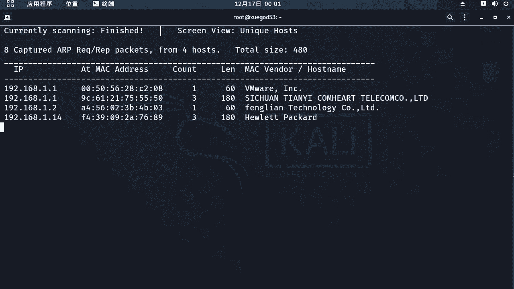

被动模式对那主动模式来讲，那么它的速度比较快啊。

他主动发送数据包，但是容易引起网络管理员的注意，那么被动模式呢这种方法更加隐蔽一些，但是速度会比较慢啊，网卡呢需要被设置为混杂模式，来申请网络内的ip数据包，来进行被动方式的提供探测。

那么什么是混杂模式，混杂模式呢是所有发送给本机，或流经本级的数据包呢，它都能探测到对混蛋模式啊，那么这种方式需要对吧，网络内设备发送a i p包，它才能探测到，就是说如果啊他就等的对吧。

如果网络内有其他主机发送a r p数据包啊，给本机或流经本机的话，它就能探测到它是存活的啊。

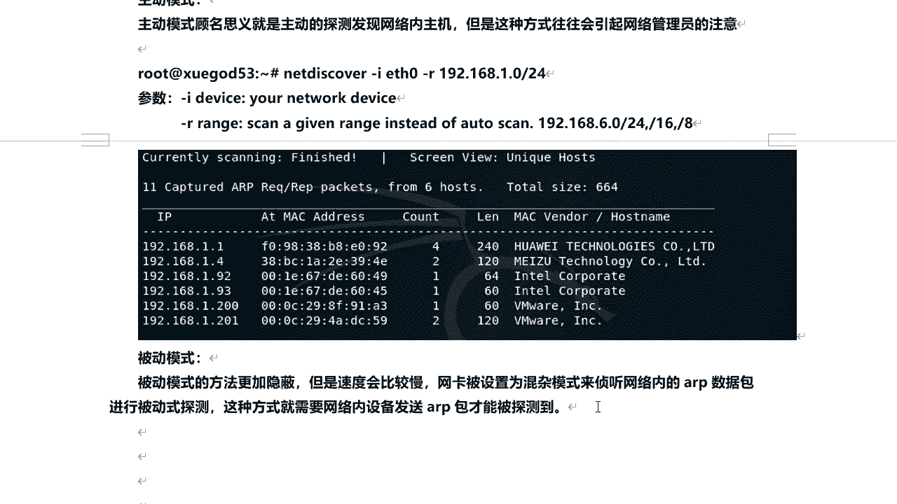

那么这里呢我们可以使用这个命令唉，后面两个去掉net discover杠p，对那么我们就等是吧，那目前呢还没探测出来是吧，要主动模式的话，现在已经出结果了，但是被动模式还没有，那么你就需要等啊对吧。

那么什么时候有a i p啊，数据包啊，发送给本机或留定本机啊，它就能探出头对吧，他现在还没有，所以说被动模式呢比较慢啊。

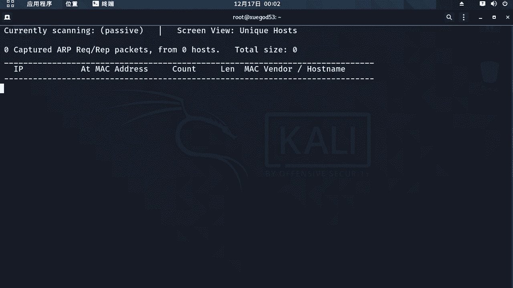

这个呢我们来了解一下啊，这个我就不等了啊。

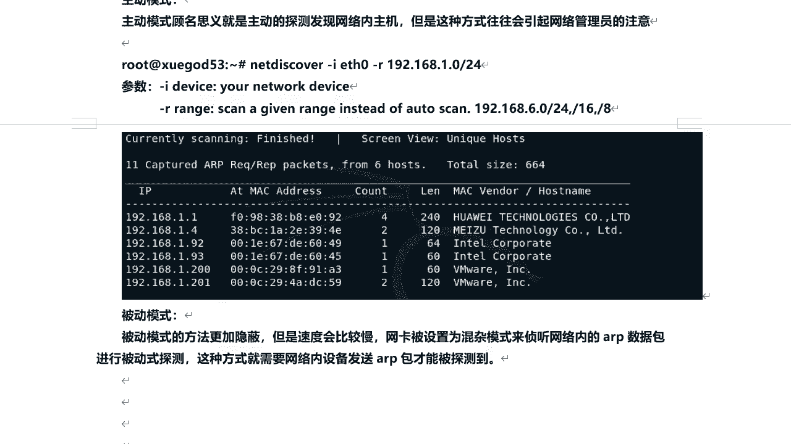

那需要得等正经得等一会儿好了，那么这次通过net discover好吧，那么探测局域网中那么存货的主机啊，那么其实他们都是基于什么n r p。

