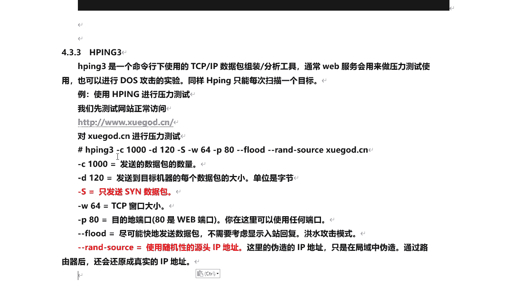
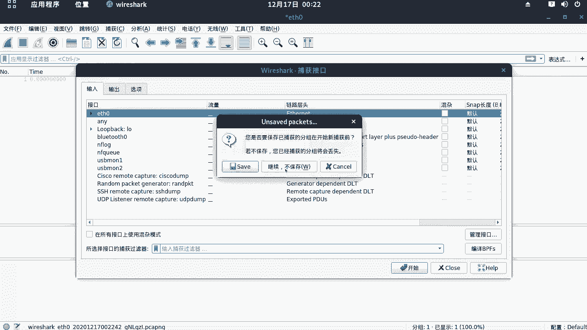
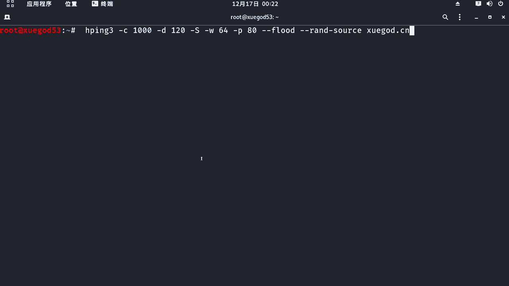
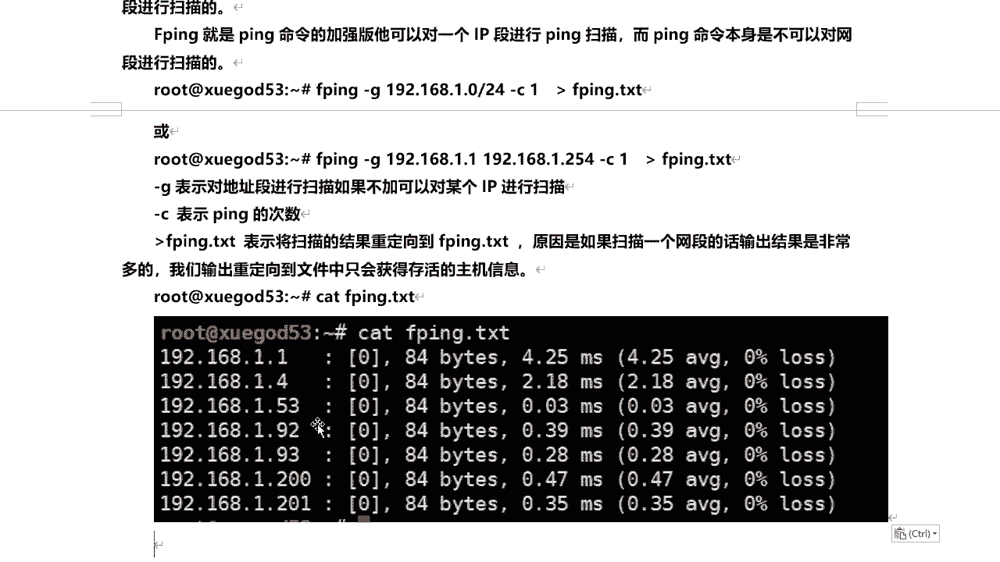

# 学不会我退出网安圈！中国红客技术正需要传人！全套666集还怕学不会？（网络安全／黑客技术） - P42：8.4-【主动信息收集系列】基于ping命令的探测-HPING-FPING - 一个小小小白帽 - BV1Sy4y1D7qv

好那下面呢我们来看hp 3 i g p3 这个命令，它是一个命令行下使用的一个tcp ip数据包，组装和分析工具，通常呢外部服务啊会用它来做什么压力测试，使用也可以进行到四攻击的实验。

同样的这个i t p31 致呢，也只能扫描一个目标啊，那么这里呢我们使用它来进行压力测试啊，我们来以学生的网站为例，好吧，那么客户大家大家不要去你们一起去找学生啊，好吧，千万要注意啊。

那么我们来先来打开这个站点啊，看一下它是否能正常打开，学到的c啊。

现在访问都没问题，可以正常打开啊，好的好。

下面呢我们使用这个命令来来hp 3好，那么后面这个参数都是什么意思呢，来我给大家解读一下的啊，那么这个杠c杠c呢指定我发送数据包的数量，一共多少个，1000个，杠d呢是每个数据包的大小啊，单位是字节。

就是发送到目标机器，每个数据包的大小，看看大s呢代表着你发送的是s y n数据包啊，s y n数据包是tcp 3次握手中第一次握手，建立连接请求对这个数据包，然后杠w呢是tcp窗口大小啊，64个字节。

那么它是用来控制流量的，那也是告诉目标机对吧，那我本机呀我最大能接受多大流量啊，一次这样p呢，指定端口外部端口有着目标的端口啊，那么八零是外部端口，那么当然你也可以指定为其他的任何端口。

都可以刚刚flow的啊，那么是尽可能快地发送数据包，不需要考虑是否回复啊，那就是洪水式的攻击，越快越好，杠杠resource啊，那么这是使用随机性的原ip地址啊，那么这里呢是伪造ip地址啊。

但是这里伪造是在局域网内伪造，一旦出网之后，出路由之后，它还会还原成真实的ip地址，后面跟的是啥，你要对压力测试目标站点的域名啊好吧，然后呢这是关于每个参数啊，它代表的含义好。

下面呢我们来执行一下它好吧。

在kly里面我们来执行一下它，看看效果啊。

在执行之前呢，我们来打开抓包软件啊，very萨克啊，这个工具我们来抓一下数据包啊，看看他的这个伪造云ip啊，对是否是真正的伪造啊，我们把这里混杂模式，现在是啊，混杂模式已经去掉了啊，好的，打开始对。

我们这个visuck后面咱们也会讲到来开始。

然后呢我们就可以抓到大量的一个数据包对吧，那么这是目标及有学神的ip地址，你看原ip地址是不是都不一样啊，对呀，那么它是伪造的，伪造的大量的s y n请求yn数据包对吧，win 64啊。

那么每个数据包大小是120字节，一共放到了1000个啊，瞬间发生1000个，那么我们再来访问一下学生网站。

我们来看看能不能打开啊，哎我单独打个窗口啊，学霸的c n，那么此时你再去访问他的话，就是打不开了，就非常慢好吧，那么我们来看看，简单看一下效果就可以了啊，这里命令呢我就给他停了，咱就不继续了啊。

不继续了，那么这是hp 3啊，一样它一次也是只能来拼一个什么一个ip地址，好，接下来我们来看另外一个命令，也是基于拼命令啊，衍生出来的叫f拼，通过它呢可以查看局域网中运行了哪些机器啊，好吧。

他这个lp呢是拼命令的一个家庭版，它可以对一个ip段进行拼扫好吧，它可以扫描一个网段啊，而拼命令本身呢是不可以对网段进行扫描的啊，好那么这里呢我们注意好的，我们首f p注意啊，他呢对单个ip可不可以啊。

拼啊也可以啊，比如说拼啊对吧，192。168。1。1可以吗，然后杠c发送一个数据包也是可以的啊，那我们得到这么一个结果，证明它是可以拼通的对吧，然后呢我们要想对一个网段对吧，进行扫描。

那么这里需要加一个参数叫杠g，他表示对地址段进行扫描啊，如果不加，是对单个ip来进行扫描啊，然后呢后面我们跟上这个网段，那么我的网段是一点，后面的24啊，子网掩码啊对吧，或者是你可以这么写也可以啊。

这里1。1对，然后呢到192。168。1。254，两种写法都可以啊，让c一指定发送一个数据包啊，然后呢我们可以把所有对存活的主机啊，保存到一个文本文件里面好吧，直接输出到文本文件，这个代号表示什么。

将扫描结果重定向到啊，也就是结果输出到这个文件里的啊，因为是如果你要扫描一个网段的话啊，输出结果是非常多的好吧，那么你要不输出到文件，那么我们查看是很不方便的，所以说我们这里呢输出重建的文件中。

只会获取到存活的主机器，这样对他会把所有存活的主机器，直接存到这个文件里面了，来我们执行一下了，好那么执行完成之后呢，我们来cat有这个文件好吧，那么得到这些存货主机在线的是吧，一共多少台呀，四台好吧。

这是网关，是物理机，那么这是kelly啊，那么163就是申通s好吧，通过它呢也可以获取啊，lp那下面呢我们gp命令啊讲了几个，那么具体啊，就是我们在正常使用的时候进行探测，信息收集的时候对吧。

那有很多命令都可以实现同样的功能，那么具体使用哪一个呢，还是看大家的习惯是吧。

