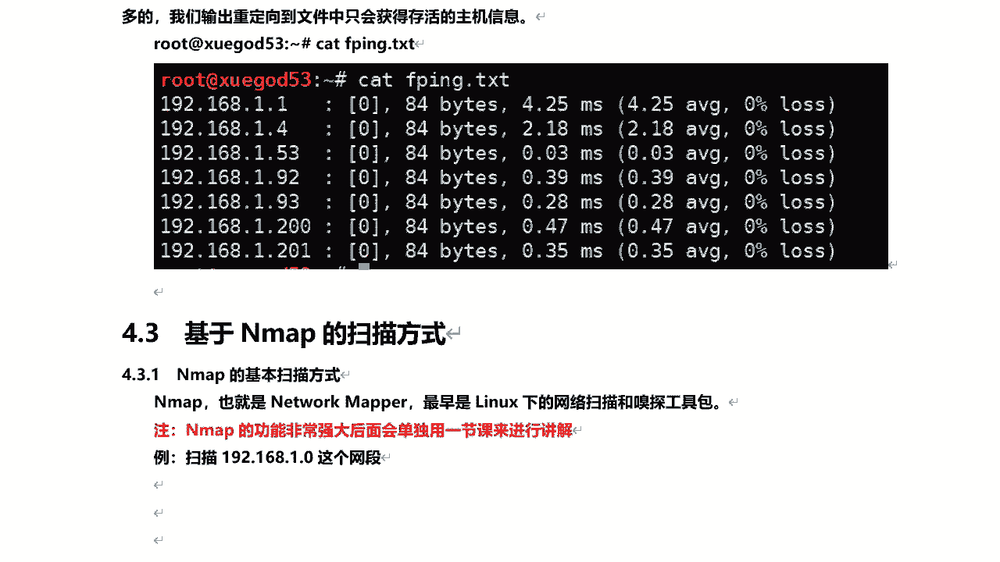
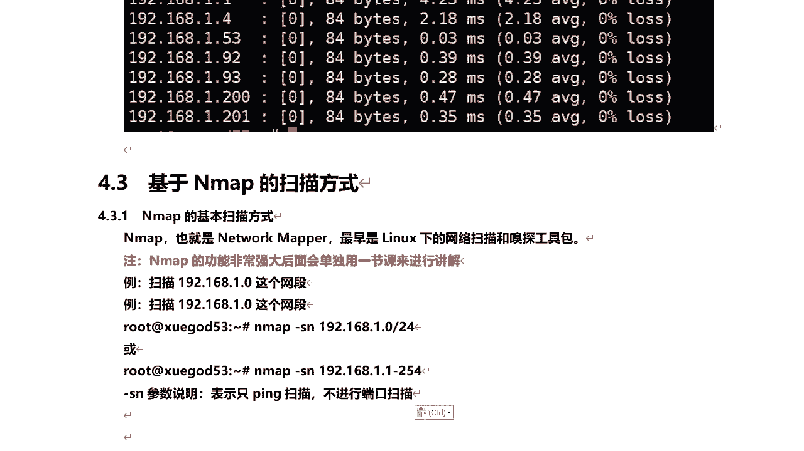
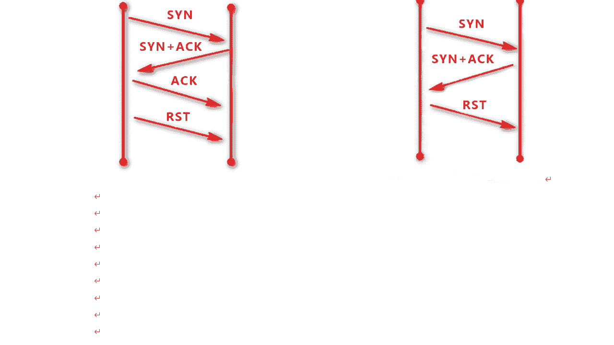
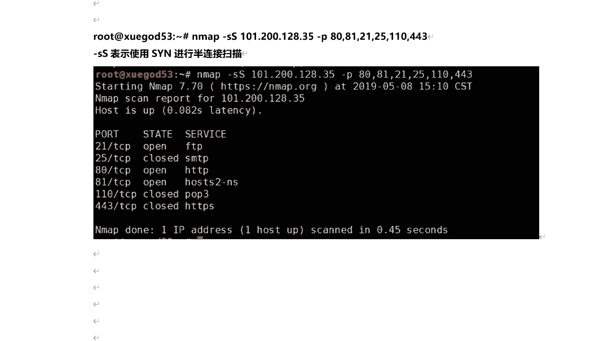
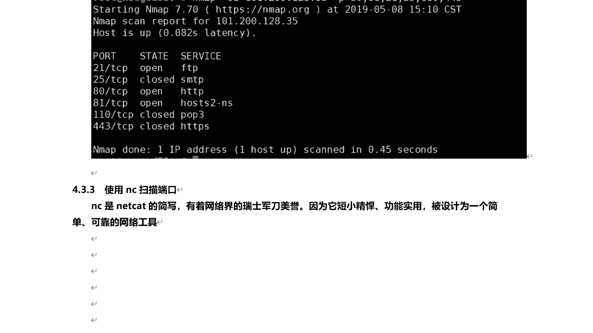
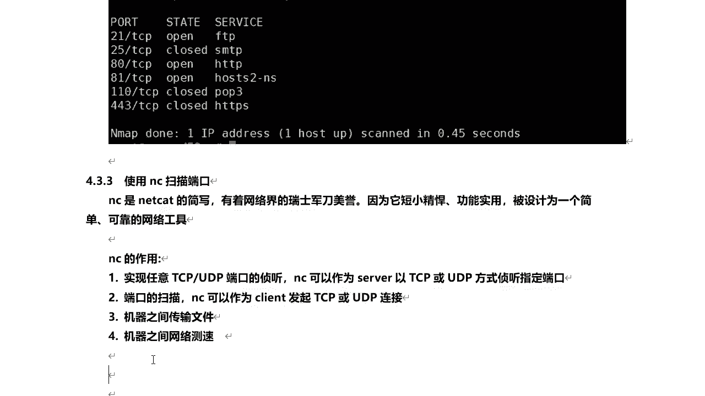
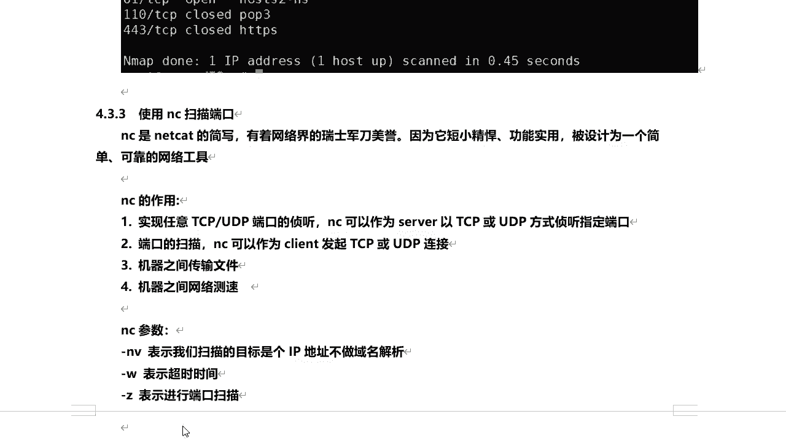
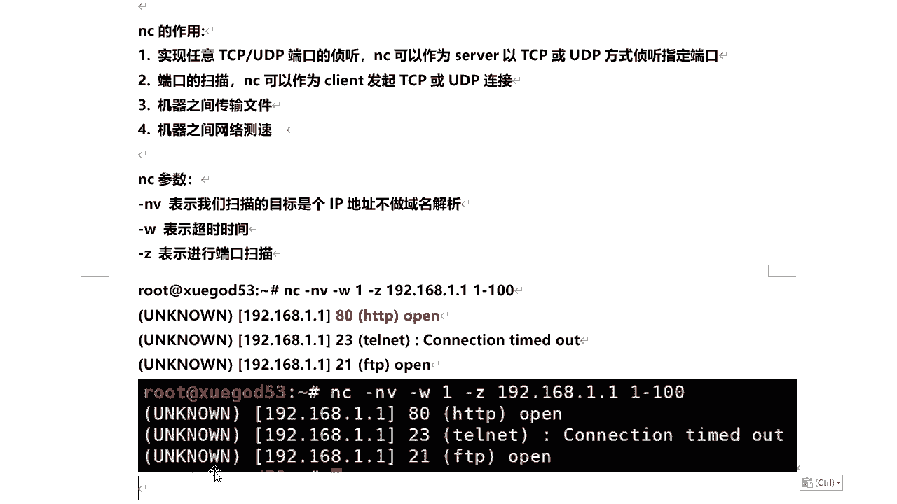
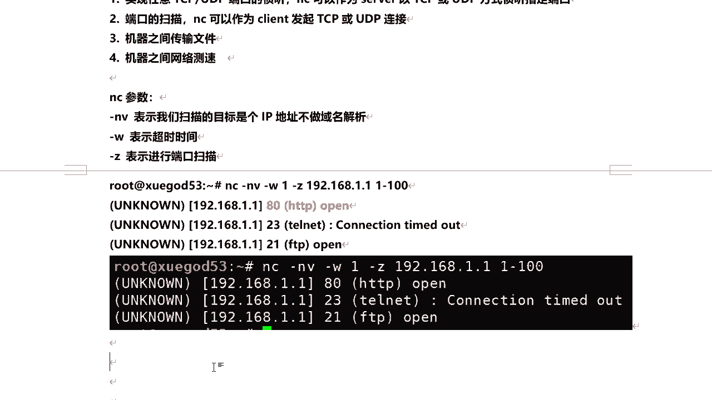

# 学不会我退出网安圈！中国红客技术正需要传人！全套666集还怕学不会？（网络安全／黑客技术） - P43：8.5-【主动信息收集系列】基于Nmap的扫描方式 - 一个小小小白帽 - BV1Sy4y1D7qv

好的，下面呢我们来看一下g n map的扫描方式啊，那么n map啊，那么它全称叫network map啊，最早的是linux下的一个网络扫描和嗅探工具包啊，它的功能非常强大。

后面呢咱们会利用单独的一节课，来去对它进行讲解好吧，那么下面我们来看，使用nmap来对整个网段来进行扫描，注意啊，那么按map它最出名的是什么端口扫描，但这里呢我们只来对它这扫描整个网段内。

存活的主机啊，只做拼扫不扫描端口啊，好我来使用一下它啊，n map好，然后注意加参数杠，小sn小s这一参数表示只拼少啊，只拼啊是现实现拼的功能不进行端口扫描，然后后面呢我们跟上这个网段，192168。

一点啊，一点，然后杠二四次网页码好，我们来扫一下的对，那么会得出啊，所有局域网内存活的主机对都会列出来了啊，那么这里包含本机啊，1。53kenny是不是对他的host is up，就是主机是存活的啊。

mark地址是多少啊，那么这里呢还有可以用另外一种方式，1。1杠25491唉，结果是一样的，好吧对两种方式啊，对那么这种也可以进行批量扫描啊，发现局域网内存或者主机，那么这个还是比较好用的啊。

是吧好的，那么这个呢我们学会了之后呢，我们下面来看另外一个啊。

这个的比较有意思了啊，使用nmap呢进行半连接扫描，那么什么是半连接扫描呢，这里需要我们了解什么tcp 3次握手啊，nmap扫描类型主要有，tcp的全链接扫描和半连接扫描。

其中呢最全链接扫描会在目标机留下记录啊，为什么全链接扫描对吧，相当于完成整个tcp的三次握手，像这种对吧，会在目标机有日志记录，而半连接呢它不会留下记录，为什么半连接呢，他只是完成了吗。

tcp 3次握手中的前两次，我们下面来看一下这张图啊，来了解一下tcp 3次握手嗯，删除我所，比如说这是a啊，这是b那么比如说a啊要与b建立连接，首先呢向b发送一个sn连接请求。

比如说我a要连接你b的22端口，好吧，对连接启动，那那当b啊收到这个请求之后，他的22端口是开放的是吧，好的，你连接我22段可以啊，没问题是吧，那我确认s弯a c k啊，确认对吧，可以连接。

但同时呢你是不是a也得开放一个端口啊，让我连接啊对吧好的，那么它发送一个sy加a c k请求，当a收到这个请求之后，这是第二次握手，这是第一次握手，那么a呢会打开一个高位端口，比如说三啊，221。

要是吧，这个端口好吧，那我也打开一个端口，让你连接可以吗，ok然后同时呢他回一个确认包，ok没问题对吧，唉你可以连接我，那么这是第三次握手对吧，三次握手完事之后呢，他们之间都彼此确认了好吧。

那么就可以开始进行数据传输了，此时rs ok对吧，从这那么这是三次握手啊，那么这个全链接扫描呢也是通过这种方式是吧，第一次第二次，第三次，然后重置好吧，确认目标机的一个端口是开放的啊，那么同时要注意啊。

那么这里如果目标端口对吧，如果是关闭的，他就不会回这个包了是吧，对这个第二次握手就没有了，那能理解吧，好的，那么半连接呢，所谓半连接，它只是完成了t c b3 次握手的前两次好吧，同样道理啊。

那么比如说a l b对吧，与b的某个端口，这里比如说是啊，23端口来建立连接好吧，打比方啊，它发生了一个连接请求，我要连接你的二三端口好吧，b说到这个请求之后，23323端口如果是开放的话。

那么它会回一个s弯加a c k好吧，就是ok你可以连接对吧，同时呢你也要打开一个端口，让我连接对吧，那么当a收到这个请求之后，就证明这个端口已经是开放的了对吧，那就不需要再放送了吗。

对另外一个a c k就不确认了，好直接就断开了，好吧对，那么这是半连接啊，那么全链接和半链接这个大家要理解啊，那么也就是tcp的三次握手，大家理解了，那么这个全链接和半链接就没有问题了。

那下面呢我们来通过按map，来实现这个半连接扫描，好吧好，那么这里利用一个参数杠小s大s它表示什么，半连接扫描，后面跟上目标机的ip或者域名都可以啊，杠p指定你要扫描哪些端口对吧。

那8081212510443啊，那我回车对就得到了，那么他会给出你要扫描这些端口的状态，open呢还close是吧，哎然后目标主义呢是存活的up，ok那么这是半连接扫描嗯。

除了这个n map之外啊，对可以扫描端口，那么还有一个工具，那么也可以进行什么端口扫描，比如说nc啊，那么什么是nc啊。

n c呢，它全称叫net cat，他他说写啊，他是有网络界的瑞士军刀的美誉，因为它的短小精悍，功能比较实用啊，它被设计为一个简单可靠的一个网络工具啊，那么nc的作用呢很多对。

那么它其中有什么对，他可以去侦听对实现任tcp udp端口的真听，也可以作为seo端，对以tcp或udp的方式真听指定端口，然后对吧，其他的机器呢就可以去连接啊，连接它这个端口监听的端口。

然后还可以进行什么端口的扫描，它可以作为客户端发起tcb或者是ud p连接，还可以进行什么机器之间进行传输文件呢，还可以什么进行网络测试啊等等啊，其中呢我们这里呢需要用它的这几个参数，他参数很多啊。

呃其中呢这个杠n v表示呢我们扫描的目标啊，是个i p地址啊，他不做一名解析杠w的表示超时时间，当z呢表示进行了吗，端口扫描好吧，那么下面呢我们利用这个工具来扫描一下。

我们对某段或者是一个ip地址范围都可以啊，nc杠n v杠w啊，然后呢一好吧，然后呢杠z看这指定是什么，对进行端口扫描好吧，对这个一呢是超时时间啊，杠w超时时间一秒钟对，如果就是一秒之内超过一秒。

他还没有反应的话对吧，没有响应的话，咱就不探测了，直接放弃了，192。168。1，点幺不到100这个ip范围内的对吧，好的，啊啊我们看啊对这个是来住了腰点腰啊，我们来探测这个网关啊，1~100，端口啊。

1~100有哪之间啊，有哪些端口是开放的好吧，那么可以探测出来是八零端口和22端口，是开放的，那么这是使用的吗，n c e来进行了吗，端口扫描啊，这个也比较简单啊。

啊那现在n map也好啊，nc也好。

都可能实现吗，端口扫描，那具体用哪个呢，那其实他们主要是能实现同一个目的啊，得到一个同样的结果的话。

