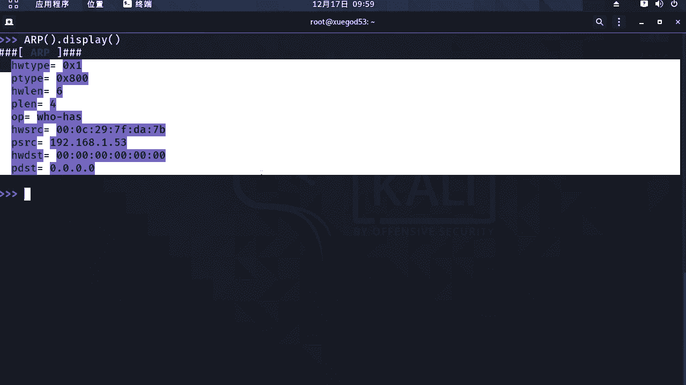

# 学不会我退出网安圈！中国红客技术正需要传人！全套666集还怕学不会？（网络安全／黑客技术） - P44：8.6-【主动信息收集系列】实战1-使用scapy定制数据包进行高级扫描 - 一个小小小白帽 - BV1Sy4y1D7qv

好下面呢我们讲一下，使用sky定制数据包进行高级扫描，那么我们先来看一下什么是sky啊，sky是一个可以让用户啊发送申请和解析，并伪装网络报文的一个python程序，那么这些功能可以用于制作侦测。

扫描和攻击网络这个工具啊，那么这个工具呢可谓是很强大啊，那么下面呢我们用使用cp来定制一下，a arp协议啊，那么对a arp协议呢，相对来讲是它是二层链路层的西医对吧。

它比较简单一些啊，我们先到kelly来启动我们的sky啊，ky自带打开终端，好直接输入s c a p y sky来稍等，我们来进入一下的啊，好的，然后呢这块显示啊，它版本2。4啊，呃这是它的官方地址啊。

既然是python写的，那么也就是说这个工具我们在windows下面，只要有python环境一样也可以用啊，我们看加载的时候它有些错误的一些提示啊，这些不影响我们正常使用就可以啊。

我们看到一个比较熟悉的提示符对吧，python啊，三个大于号，好的，来到这里之后呢，我们先来看一下的对arp协议啊，那么针对a i p，那么它的数据包格式是什么样的。

那么在这里呢kaby它提供了一个函数，我们通过这个函数呢，还可以去查看这个a r t数据包啊，它的格式大写的a r p括号点display对。

来查看a r b函数的用法，也就是它数据包的格式啊，a r p冒号括号啊，display好，那么我会这里会显示啊，对这个整个所有这些都是a r p啊，数据包里的格式。

那每一项代表的是什么意思是吧，那么我大概给大家来讲一下了好吗，那么这里咱不做深入研究啊，那么主主要的主要的资料，我们需要了解一下的啊，那么这里h tab 0 x10 x代表16进制一啊。

那么这里标识是硬件的类型，也就是标识链路层协议好吧，那p tab 0 s8000 零16进制是吧，那么这代表的是协议类型啊，那么这协议领主要标识网络层协议啊，网络世界好吧。

hw lan 66代表是六个字节对六个字节，一个字节是八位，八位二进制位，164468 48对吧，这里标识硬件地址长度也是mark地址的长度啊，p站呢四四个字节，这标识协议地址长度也就ip地址的长度啊。

四个字节对吧，48342342位二进制位op啊，那么这个代表的是什么呢，代表的操作代码，那它标识是a r p数据包的类型啊，那一代表的请求包，二代表的是响应包，然后hw这代表原mac地址。

这是原ip地址，那么这个呢谁发出的a i r p请求，这都是默认啊，对是这台机器的ip和mac地址啊带的，然后呢这里是目标的mac地址啊，目标mac地址呢你不知道对吧，你发送arp请求的目的。

是要获取这个目标ip的mac地址，那么这里要注意p d s t是向谁发送查询请求，这里是目标ip，那么也就是说这个arp啊，数据包里面，对我们所要关注的就是这个p d s t。

你要给谁发送arp请求好吧，那么下面呢我们来定义项网关，192。168。1。1，来发送一个a arp请求的数据包，那么这个呢我们如何使用sky对吧，去发送呢啊那么这里需要用到一个函数对吧，sr 1。

它的作用呢，包含了发送数据包和接收数据包的功能对，那么它可以发送任何数据包，那么这里呢我要定制一个a r p数据包，那么我们就需要只需要把指定目标ip就可以了。

好那么下面呢我们来发送一下s21 ，括号a r p是吧，然后呢这里呢这个p d s t这是目标ip地址，你向谁发送a arp请求，1921681。1好吧，这就可以了，其他默认啊，然后回车。

你会收到一个是吧，receive啊，一个包得到一个硬拿啊，那么是arp数据包，这里我们看那么这里的原mac地址，原ip地址变了是吧，原ip地址是网关1。1，证明这个是网关给我们的a i p应答包啊。

那么这是得到了他的mac地址啊，后面这是他的一些填充数据啊，发送给谁的目标ip变了，变成1。53了是吧，一请求一应答，我们得到的一个应答包好的，那么其实用这种方式啊，sky那么进行扫描，那么这种功能。

用那个a r p是不是也可以实现同样的功能，得到目标ip的一个mark地址，只不过这种扫描方式更高级了一些。

好吧，那么下面呢我们接着往下来啊，往下来嗯，这里呢你如果想退出sky的话啊，直接excel括号就可以了啊，括号给了，下面我们使用sky来定制一个拼包啊，那么key啊，它的功能是非常强大的啊。

那么我们前面啊，只是简单的介绍了a r p的探测方式，那么下面呢我们来简单讲一下i p，i c a m p的方式，那么拼包它主要是i s m p协议，是不是，那么这里呢我要注意一点啊。

那么我们来查看一下啊，这两条命令对吧，可以直接看到我们的数据包格式啊，这里需要用到什么对i s m p这个数据包对吧。

我们先来看一下这个数据包的格式啊，i c m p同样它提供了这个函数啊，display，这个数据包呢很简单啊，那么这里只有什么五个字段是吧对吧，那么这个五段分别代表什么意思啊。

第一个tab啊代表它是什么类型啊，它主要是区分数据包的类型，那么request默认它是请求包啊，情包，然后呢如果是响应包呢，就是replay啊，然后第二个code是代码啊。

然后take some校验盒啊，它主要是实验数据包完整性的一个校验，那么你就是在拼哪一个目标的时候，它会携带的一些参数啊，对比如说数据包对吧，像目标保证数据包，当它响应回来之后，收到响应之后。

它会叫艳对吧，这个数据包是否完整啊，然后是否被篡改过id哎那么这里的标识id啊，它主要用来标志不同的拼进程啊，s e q，第几个拼包，那要注意一点，那你要pc啊，这里没有指定是不是你的目标ip啊对吧。

没有指令，那么所以说除了我们要定制一个拼包对吧，那怎么办，还需要另外一个协议，就是ip对我们看这个数据包，ip数据包它的格式啊，那么这里呢我们看啊。

都把它放到笔记里给大家来说一下了啊，关于这个拼包啊啊，嗯我们从第一个开始给大家简单说一下了啊，哎那么第一个version 4啊，版本啊，四代表i p v4 ，如果是六呢，代表i p v6 啊。

这是首部长度，然后呢在服务就是总的长度吧，对那么这个注意啊，那么这个首部长度，那么就相当于头部长度啊，头部ip数据包，头部长度它主要是来区分ip头部和数据包啊，那么接收方会根据这个长度的字段啊。

知道从哪里开始解封装啊，啊然后呢这个t o s啊，服务服务质量技术，主要用来实现什么流量标记的啊，然后呢这个line总长度，那么就是这个数据包啊，它的总长度是多少，i d等于一啊。

标尺主要用来标志分片的进程的flag flash啊，这个呢主要是标志位啊，那么这里的标志就是说你这个后续的啊，就是说怎么说呢，这里有个m mf啊，mf字段就是多位用于告知啊，接收方是否还有分片零。

表示没有一呢表示有啊，那么df啊表示不要分片为告知途径，设备不要进行分片啊，那么也就是我们在整个数据传输的过程中啊，那么它一般默认最大允许单片的话，也就1500字节，如果超过这个呢，它会自动去分辨啊。

分成几遍去传输，然后到达接收方之后，然后就重新进行组装，组装好flag flag呢，那么这里代表什么偏移分片偏移标志啊，主要是用来告知接收方，每个分片距离ip头部的一个位置啊。

这样才能实现有序的重新进行组装啊，那么这里呢更深的咱们就不讲了，主要简单给大家提一下，如果大家想详细了解关于这个数据包对吧，每个版本一项对吧，这个t c b a b协议啊，对那种。

回头大家可以自己去采取相关的一些资料啊，好吧，然后t t l值，那么这个就是生存时间，那最大的是255，它主要用来什么标志路径的长短，防止环路啊，那么也就是说，数据包在整个网络上进行传输的过程。

每经过一个网络设备，它会自动减一啊，然后呢如果减到零了，还没有到达目的端的话对吧，那么它会自动就丢失了，丢掉了，只要防止在互联网上怎么形成环路，无限的进行了嘛，对发送啊循环，然后这个是传输控制协议。

对主要是标志上层协议啊，然后呢，check sum是首部校验和校验数据的一个完整性啊，重要的是这里啊s r c代表的是原地址，d s t呢代表是目的地址啊，那其实我们在使用这个ip数据包的时候对吧。

主要是啊这个d s t啊，那么我们要发送一个拼搏，那么大家考虑一个问题，那么这里头我们如何去来形成一个拼包呢是吧，那所以说那么ip来生成拼包的什么目标ip啊，和原ip。

而i c p这个数据包来生成拼搏的类型，所以说呢我们使用ip和i s a p这两个函数，来可以生成拼包来进行探测，那么整个思路呢大概是这样的啊，呃首先呢修改ip包的对吧，d s t这个参数。

那么也就是我们要拼的目的地址，然后拼接上s m p的一个数据包类型啊，那它属于什么类型呢对吧，然后呢再使用sr一这个函数进行发送数据包，并接收数据包啊，那么这个呢对。

就是我们生成拼包整个一个思路和过程啊，比如说呢我要拼网关是吧，那你首先得发生一个request请求对吧，如果网关在线，它是处于活跃状态的话，那么他会回复一个replay对吧，响应一个数据包。

那么就接收到了啊，那证明他是能拼通的，那下面呢我们来使用ip函数和i c i p函数。

来定制一个拼包好啊，那么这里呢sr一啊发送对吧，然后整个数据包呢是使用ip指定dt目标ip地址，然后斜杠i c m p，注意啊，i c m p为什么是空的呢，因为这个数据包默认啊。

默认它的请求类型就是什么对request。

其他的不需要设置啊，然后呢我们这里的time out指定是超时时间啊，呃这里呢我们会得到一个硬拿包，硬件包呢首先看啊ip这个函数，那么这里的原ip地址网关的对吧，目标ip地址是1。53。

那么证明这是网关发送回来的replay，硬拿包看i s m p这个数据包里面类型，replay是响应包，没有问题，证明网关呢是可以正常拼通的。

好吧对，那么通过这个呢，我们能够对整个拼的过程啊，对分析的更透彻啊，了解的更深刻一些，那么这是关于拼对吧，对拼包使用sky来定制拼包嗯，下面呢接下来我们使用skey来定制一下。

tcp协议的s y n请求好吧，那么什么是s y n请求啊对啊，那么大家又想起了tcp 3次握手中的第一次握手，对吧，对建立连接请求sy请求，我们来看一下这张图啊，那么这张图里呢，首先啊对那么左侧啊。

比如说左侧要与服务端建立连接，能发送一个s弯连接请求，当服务端呢介绍这个请求，这个端口处于开放状态对吧，那么会告诉ok你可以连接回一个a4 k确认，同时呢它也加一个x y是什么意思。

就是你也要打开一个端口是吧，也得让我连接啊，对不对，好的，那么这个a呢收到请求之后，好可以没问题，又回一个sk群众包三次握手啊，那么我们注意啊，嗯其实这里的啊使用sky定制s y。

tcp协议的s y n请求，就相当于是把半连接扫描啊，为什么这么说呢，下面我们来看一下的啊，我们同样来使用tcp这个函数哎，来查看一下tcp数据包啊。

它的一个格式，tcp变display，好那么这是关于tcp数据包一个格式，我们把它复制到笔记里面。

好吧，我给大家来解读一下的啊，嗯在这里其实它这个参数很多呀，我们注意啊，不需要每一个都去了解啊，嗯标红的部分对是重点，我们必须要知道的s port代表是tcb的原端口啊，d炮的表示tcp的目的端口。

那么也就是说你去探测目标及某个端口对吧，是否是开放的还是关闭的对吧，那么这里呢我们使用d炮的去指定低保的啊，然后呢这个flag flash是标志域标志位啊，那么这里主要是指定啊，就是我们发送的数据包啊。

是什么数据包啊，对啊是s y n的对啊，s啊大s代表s y n来，还有ur g啊，a c k啊，p s h r a t对吧，f n对，那么其他这些都代表着什么含义是吧，那么大家可以去具体的看一下tcp。

ip协议相关的一些网络知识就可以了，剩下的窗口大小交银盒这些对吧，那么交窗口大小呢，主要是代表就是告诉目标对吧，对我呢对最大能接受多大的流量，它是进行吗，流量控制的好吧。

那下面呢我们就来定制一个s i n请求好吧。

使用key啊，还嗯这里呢s21 发售是吧，ip啊这个函数指定你目标的ip地址啊，然后呢和tcb函数来进行拼接，flash代表的是发送数据包类型，s大写的s s y n数据包，depot 80端口。

那么也是目的是说我来探测网关，它的八零端口是否是开放的好吧，如果是开放的，你就能得到一个应答对吧，根据的响应包，我们能看到它是开放它关闭的啊，那么现在大家想一个问题啊，你向目标端口发送一个s弯请求。

如果端口是开放的对吧，那么他接收到这个请求之后对吧，他说他会同意你连接对吧，同时向你发送一个a c k确认包和什么s y n，就是s y n加a c k对吧，这代表的是啥，端口是开放的。

如果这个端口是关闭的，他会回确认吗，不会直接断开r s t了是吧，好的，那么这里我们来看一下结果对，那么这次得到一个响应包，那么这个响应包呢，它的原ip呢是1。1网关的对吧，那么目标地址是1。

53kelly，这就是网关给我们回的包啊，mikelly呃，这里我们主要看tcp啊，数据包这里啊，flag标志位是sa c代表的是什么，s y n加a c k对吧，这个能理解啊是吧。

那么代表啥收到这个响应包了，就证明目标端口是开放的，比如说，那么如果我们来探测一个不存在的端口啊。

比如说200，啊200的话，那么这里我同样对吧，得到一个显示包，那么这里呢flag变了，变成r a r a r代表啥r s t啊，重置断开了，证明这个端口是吧，关闭的啊，关闭的就是或者是不存在的啊。

所以说根据这个响应状态，能判断出目标端口是关闭还是开放对吧，好的，那么这个呢是使用4k配啊，定制tcp协议的s y n啊，数据包啊，然后呢笔记给大家整理到这里啊，啊因为注意啊，那么这种方式啊。

我们刚才说了，它属于半连接扫描对啊，连小朋友，那么在他这种扫描方式啊对吧，是更隐秘啊，更不容易被发现啊。

