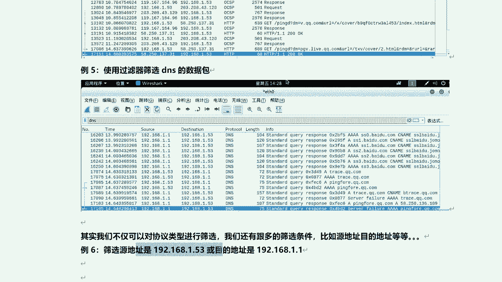

# 学不会我退出网安圈！中国红客技术正需要传人！全套666集还怕学不会？（网络安全／黑客技术） - P48：9.3-【WireShark抓包系列】WireShark的过滤器使用 - 一个小小小白帽 - BV1Sy4y1D7qv

下面呢我们来看一下visuck的过滤器的使用，那么我们来开启混杂模式啊，那么再次捕获，在所有接口上使用混杂模式，就可以直接进行抓包了啊，那么我们来看啊。

现在好像是已经开启了混搭模式啊，混搭模式我们来看一下的啊，我们先停一下的捕获选项，这里呢打上对勾呢，就是开启混搭模式了，然后呢我们来点击开始哎。

然后继续不保存，重新来开始抓包啊，那么现在呢还没有任何数据包，是不是，那么我们稍微等一会儿，它就会产生大量的数据包啊，那么整个局域网内啊，所有流经本机啊，本网卡或发送给本机的数据包呢，他都会抓取到。

因为现在我们开启的是什么，是混搭模式，现在已经来了，那比如说我在物理机啊，我去访问一下百度啊，那么它也会产生一些数据包，好那我们稍微等等啊，让他多抓一下数据包。

那么一会儿呢我们来进行过滤一下的，啊稍等一会儿啊，嗯这书包好像很小，正常打开之后啊，这个数据包啊用瞬间啊会增加很多很多啊，那么还是我这个机器啊，现在他没有对外产生大量的数据包啊，那我就多打开几个站点啊。

我们来看看啊，我说我在kelly kelly里面，我呢在这里呢打开浏览器去访问，这样更直接一些，啊这是百度是吧，好的，然后呢新闻好的可以了啊。

诶这个是萨卡，在这呢在这呢是吧，嗯现在已经产生大量的数据包了啊，然后呢我们来给我看啊，对或者说我们再来产生一些数据包啊，比如说我在终端啊，我在这个终端我去拼一下啊，听一下百度，嗯呃拼线网关，好的。

然后呢我们把它关掉，然后停止抓包啊，那么也就是张正常，我们抓到了很多很多类型的数据包对吧，那么我们怎么能才能找到我们所对应的啊，数据包类型啊对啊，比如说你想要看哪一种类型的数据包。

那么我们如何能快速的去找到它，对吧好，那么这里呢我们可以使用什么过滤器啊，那我们来看这里应用显示过滤器啊，那么在这里呢我们可以去筛选啊，筛选我们想要的数据包好吧，那么怎么去筛选呢，我们来看。

首先呢我们使用过滤器来筛选一下，tcp协议的数据包啊，那么tcp协议啊，这个协议也是非常非常重要的一个协议啊，那么tcp 3次握手。

四次挥手是吧，那么咱们后面呢咱们都会讲到啊，啊比如说那么这里呢我直接可以输入tcp，然后回车，那么就会把所有的tcp啊都筛选出来，这里都是啊，那么这里对啊，那么这里呢不区分大小写，不区分大小写啊。

对那最好呢还是用小写比较好一些对吧，嗯这里我给大家讲一个小技巧啊，那么我们筛选出来都是t cp c，那么tcp数据包呢有很多种类型，比如说s y n呢，s y加a c k呀是吧。

还有a c k数据包对吧，r i t f i n等等不同类型的啊，就是flex不同标志位的数据包，这里呢我们还可以进一步的去筛选，比如说tcp。flag对吧，这是标志位点，比如说我就想筛选。

我们看这已经列出来了对吧，你想筛选哪种呢，比如说筛选a c k好吧，那么等号等号等于等于一啊，然后回车，那么这里呢你sin，所以说是关于a c k的，当然sn加c也会塞选出来，就有ak数据包的标志的。

都筛选出来了，是这样是吧，那么比如说那我想筛选f i n的是吧，那我把它改成fn回车是吧，那所有都是关于fn数据包的，对可以，这么去塞啊，还有s y n，那么也就是tcb啊，三次握手中第一次。

好那么这里既然没有啊，有出来了，慢点啊慢点，这些都是关于s y n数据包了，好吧，这个呢小技巧呢大家呢掌握一下的啊，当然他的搜索方式有很多啊，大家可以自己去来体会一下的啊。

然后呢下面我们使用过滤器啊，来筛选一下的a r p的数据包啊，那么这里呢我们只需要在这个过滤器里边啊，直接输入a r p回车就可以了，那么就可以把所有的ip数据包协议类型啊，都筛选出来了啊。

然后呢u d p呢，哎那就直接输入ud p就可以了嗯udp协议啊，那么它属于传输层的，是不是啊，但是我们发现这里呢有什么oc q d是吧。

还有dns对，就没有u d p是不是哎为什么呢，对啊，为什么会出现这些协议啊，大家想一个这这么个问题啊，为啥会出现这些协议啊，对啊。

明明我筛选啊，输入写呃，输的是udp对吧，那么sin是ud p报文，但为什么输入u d p之后会出现那么多歧义啊，原因就是o s q以及dns s，还dns s都是基于udp的传输层之上的信息。

基于它的好吧，那么也就是这些都是使用的什么u d p协议啊。

呃ud p协议啊，对那么传说有两个洗tcp和udp，tcp协议主要是可靠传输，三次握手，那么u d p呢不需要对吧，那么相对于传输数据来讲，那么u d p性能更快一些，但是呢它不可靠是吧，也容易丢包。

那么这里给大家扩展一下的啊，那么客户端啊，像dns服务器查询域名对吧，那一般啊返回的内容都不超过512之间，用udp传输即可，他不经过呢三次握手，这样的dns服务器的负载更低啊，响应的更快，从理论上说。

那么客户端呢，那么也可以指定向dns服务查询使用tcp，但是大家要注意一点，tcp协议的话，它需要经过三次握手，那么dns查询tcp的话，那么它是不会相对更慢一些对吧。

那么在事实上很多dns服务器进行配置的时候，仅支持吗u d p查询包啊，所以说呢这里大家要注意一下了啊，然后呢我们下面呢来看哈另外一个协议，比如说我们来c选项h t t p，对自己输入htp就可以了啊。

那么这里呢我们就来筛选出这么多啊是吧，都是tp相关的，还有了吗，dn s对，那么这里三选秀都是关于dns域名解析是吧，查询啊，那么比如当你去访问百度，对访问一个域名的时候，浏览器打开一个网站的时候。

它就会发生dns查询dn c e，那么域名解析嘛，通过域名去查询到域名解析服务器里，去查询它对应的ip，然后找到他服务器打开这个站点嘛，叫dns解析，那其实啊，我们啊不仅仅可以通过这些协议名称啊。

进行筛选啊，那么还有很多其他的筛选方式啊，比如说通过原地址对吧。

ip地址来进行筛选啊，那么这里呢我们来举个例子啊，比如说筛选啊，原地址是192。168。1。53目，目的地址是1。1的对，那么这样的数据包，那么如何去筛选呢对吧，那么我们看整个这个抓包啊。

这个过程number左边是序号对吧，那么这个time呢它是时间对时间，source呢是原ip地址，这是目标ip地址，然后这协议类型，这是数据包的长度，那么这是关于它的一个整个的描述啊，描述好吧。

那么我们如果想根据原地ip地址去筛选，或者是目标ip地址去筛选对吧，那么怎么去筛选呢，这里呢我们可以在这里通过输入啊，i p。s r c下划线host，这是原ip地址，那么比如说我想塞啊。

原ip地址是1。53的两个等号啊，注意啊，空格两个等号空格，然后192。168。1。53，然后回车，这样就会把所有原ip地址是1。53的，都都筛出来了，那么这是什么意思啊，那原ip是1。53。

就是我们本机kelly对吧，ip c一点五三向外发送的数据包啊，都给删选出来了，好吧呃，那么按照这个要求是说，你看啊原地址是幺点数三。

或目的地址是1。1的，那么这里呢是组合，那比如说或，那么这里我们使用all傲视或者的意思啊，目标目的ip地址，ip。d s t下划线对它有提示啊，这里有提示对，然后呢两个等号啊，192。168。1。

1啊，好那么这么我们筛选筛选项的啊，好的，那么这里呢就会把所有原ip地址是1。53的，筛出来的吧，对但是目标地址呢，这个对应的不一定是1。1的啊，或者是目标地址是1。1，在我们看啊，这里有没有1。1啊。

这很多啊都是用本机1。53发出数据包啊，这里好像没有网关力量是吧，对诶诶诶好像真没有啊，是吧啊，我刚才明明p网关了，应该是有啊，但是我们没看到，是不是对啊，我们注意啊，这里呢我这么塞下的啊，这么塞下。

目标地址是网关的，ok啊这么说有啊，有只是我们没看到而已，我把那刚才那个再放进去啊，这两个条件这么塞眼，是直板，这是目标地址，目的地址是网关的筛出来的啊，但是原地址是啥，咱不管。

但是这两个条件放在一起呢，就是什么意思啊，只要是原地址是1。53，或者目标地址是1。1的，都给筛出来了，好吧，这是or或者的意思啊，那么只要有一边成立对吧，满足一边它都筛出来了。

那比如说那么如果我把这or改一下吧，改成and那它是什么意思呢，and哎这结果就更精确了啊，是吧啊，不是更精确了更少了，那么就是说原地址是1。53，并且目标地址是1。5的，是and的。

all呢是只要有一半是1。53对吧，或者1。1对，它都能筛出来，这就是说通过ip地址啊来塞啊。

原地址和目的地址啊，这个大家能理解吗。

那么这里呢我再给大家来稍微扩展一下啊，那么还有一种搜索方式，通过ip地址啊，不是i1 p。a d d r啊，等于等于192。168。1。53。

这个是什么意思呢，就是说ip地址它不分原ip地址和目的ip地址对，无论是圆还是目的ip地址，只要是1。53的，他都能猜出来，你看到吗，1。531。53对，就是这意思啊，当然它的筛选啊。

还有很多很多种方式啊啊啊还有这么多方式，那么有一些啊不是很常用啊，那么一些常用的就那些咱们掌握就可以了好吧，那么至于其他的大家可以自己去体会啊，自己去尝试试一下吧。

