# 学不会我退出网安圈！中国红客技术正需要传人！全套666集还怕学不会？（网络安全／黑客技术） - P4：1.3-网络安全基础-白帽守则（下） - 一个小小小白帽 - BV1Sy4y1D7qv

这是我们拿到一个服务器必须要做的一件事啊，防止它，ip地址是每次启动啊，他都不一样啊，所以这一块呢大家要知道，那么在这里头呢就要知道呢，我们就要知道啊，网卡的配置文件。

这个就是linux中非常重要的文件和目录，这个重要的文件和目录呢我就会啊，到时候给大家抽一奖，拿出来去专门讲这个东西啊，就是你被别人入侵了，别人搞你了，那我如何去检测啊，或者我们通过监控都监测什么。

就要监控这些重点的文件和目录啊，看有没有防篡改了，可以写个脚本在后台执行啊，如果发现这些文件的md 5码发生变化了，马上发个邮件通知给你，或者给你钉钉告警，短信告警，微信报警啊都可以。

所以这一块儿啊也要知道，那么网卡重要的配置文件在哪呢，他在我们etc下的，在我们这个system configure里啊，有一个network the script啊，然后呢，e n s33 。

这个是网卡的配置文件啊，那么这个东西有什么意思呢，哎有意思就在于呢，这你一定要一定要学会区分啊，如果是物理服务器，啊如果是物理服务器，那比如说你是戴尔品牌，这里头它就不叫e n n33 。

它的网卡一般是em 1，em 2 em 3 em 4，如果你是云主机，啊比如说你用的是一个阿里云，一般的是什么呢，eh 0，啊b d h0 ，所以大家在这里头呢会遇到一些问题好。

那么这时候呢我们它是一个配置文件对吧，我们需要编辑它，所以这里头涉及到了vi和vm的一些知识，这个东西叫做什么呢，这个东西叫做文本编辑器，啊这个在后边呢我会给大家讲啊，一点点讲手把手的去讲文本编辑器。

那么如果没有的话，in导杠y vm好，那么大家就跟着我来装一下啊，我们在装完系统以后要装哪些工具好吧。

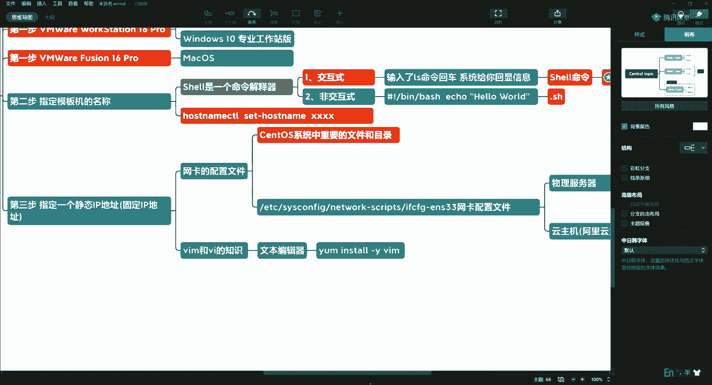

好像因此导杠y啊，vm tl r z s z啊，we get c u r l，unzip回车。

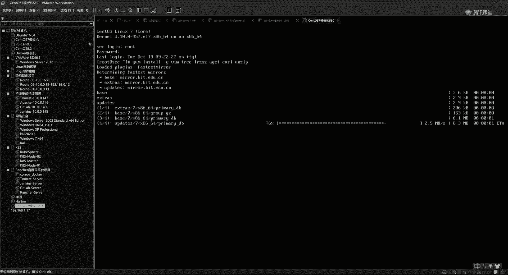

t r e l r z s z b bc u l cj。

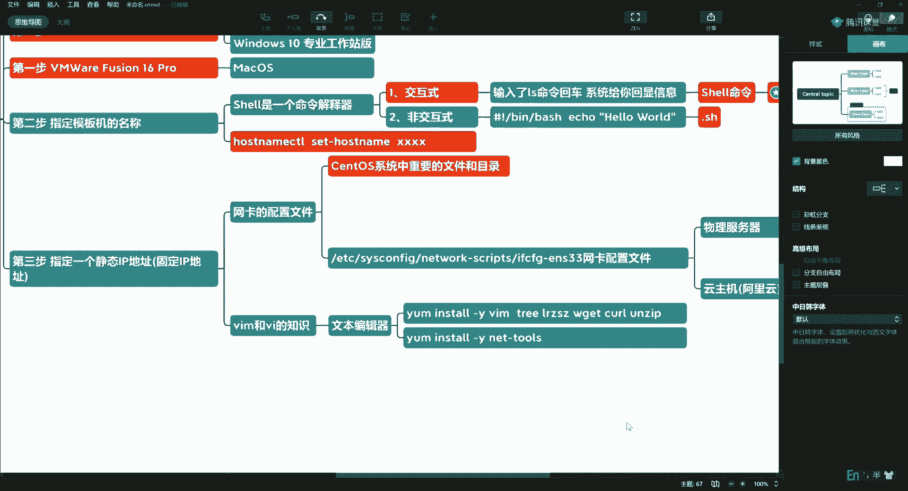

好不用改原文件啊，他说要不要改一下原文件还没到这呢啊，还没到，那那么我们给大家的这个渗透和s7 ，1810呢，它使用的就是我们国内的呃大学的人啊，所以一般的话就是阿里云或清华园啊，或中科大的学。

所以呢我们这里我给大家这个镜像，你也可以不用改，如果改就改这些圆啊，好还有一个啊，还有一个就是我们到后边呢，要通过网络啊去做一些事，比如说我们比如说有的同学喜欢用森头s6 。

比如说里头有一个if configure啊，来查看ip地址对吧，那么在渗透s7 如果没有呢，需要装一个net tools，对吧你看这个网速还可以是吧，所以这块呢大家呢。

可以去注意是这个b i t e d u啊，点cn就是中科大的原因是吧啊，所以这个东西呢一般的啊给大家这个圆啊，你们不配也行，如果你因人而异是吧，南北方差异，有的时候呢对于阿里云啊。

对于清华园啊访问不是那么快，您就近的找一个访问你最快的一个圆，我们在配置好的配置，所以这个呢就给大家说到这儿啊。

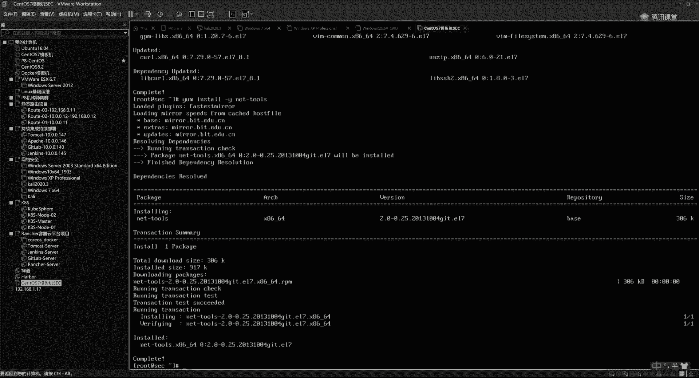

然后的话呢我们这些必要的工具装完了对吧，装完了以后呢，我们就要改它啊。

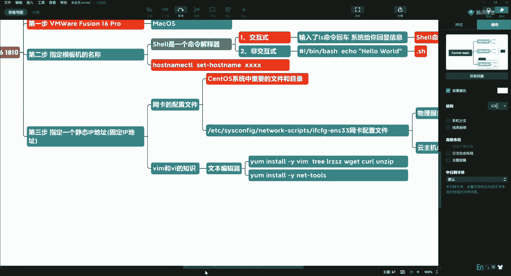

我们就要改它好，那怎么办呢，v i m e t c啊，然后这时候呢你n t a b键呢它可以自动补全，对吧，我们输一些关键字keyword，然后呢你按tab键会自动补全，所以这个对于零基础的这种小白啊。

这些同学们啊，或者这块你不大熟悉的，那你可以这么去操作，虚拟机刚才说了，那么一般是e n s33 啊，或者是e n s192 啊，你就记住虚拟机啊。

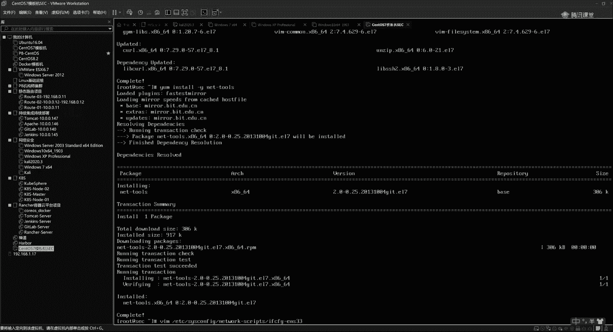

你进去找的时候，你能够看得到的啊，e n s33 或e n s192 ，好然后的话呢我们改一下这个ip地址啊。

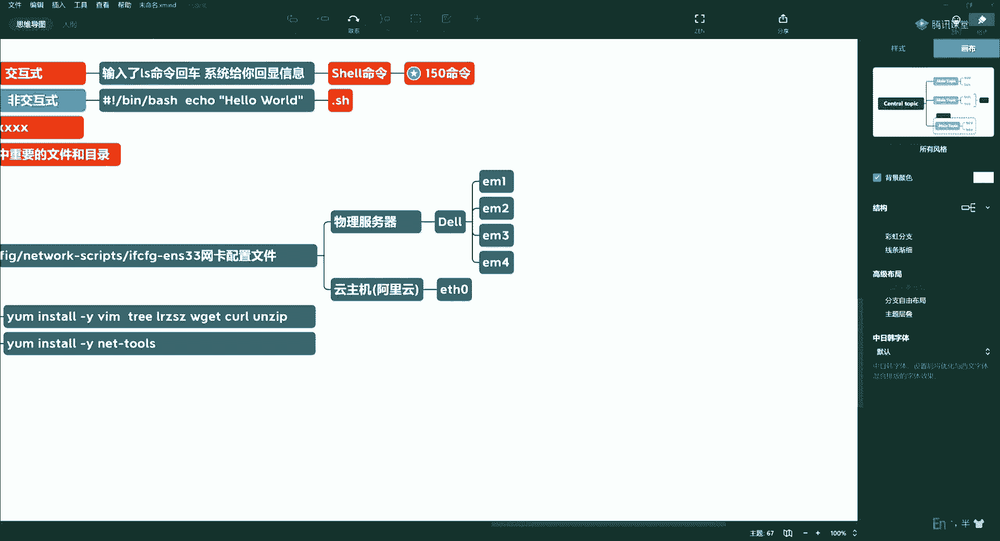

改一下ip地址，128好，那你怎么改呢，注意啊，这有一个dh cp啊，那么在这个v i v i m里头呢，你按一下字母i我们就能变成insert，这个东西叫插入模式，也叫做编辑模式啊。

然后呢按你的键盘上的这个这个这个键啊，叫按的这个键，它能快速的到这个行为啊，按home键这个光标能快速的当行首，所以这块呢我们把你这里的叫bot ptical political呢，就是协议的意思啊。

我们板载的一个协议，那是什么意思呢，就是你如果设置成自动的ip地址分配的，那他就是走d h c p协议，那如果我想想固固定的啊，有两种方式，这里头你可以写个sd，static。

或者呢啊你把这一行整个删掉也可以，好吧啊，这是两个，然后呢在封装模板机的时候，这里头有一个u u i d这一行啊，把它删掉啊，把它删掉，不要uu id好，这里头写上i p a d d r啊。

然后幺零点点128，啊这个就是我们的ip地址，然后呢我们的子网掩码啊，一般的话呢都是属于c类地址，就是它的源码都是25525525点，这个到后边我们讲网络的时候，我会给大家讲这个子网掩码啊。

所以这块呢大家知道就行了，那么网关你记住，如果你改过啊，这个网关在哪去查看啊，在哪去查看，注意这个网关是在你这编辑，这里头有个虚拟网络编辑器，虚拟网络编辑器这里头有个更改配置啊，选中net 8啊。

选中net 8，这里头有一个net设置看啊，在这里在这个net设置里头，这里头有一个网关ip，你这里头是多少，你写多少啊，你那里头可能是192的，那如果是192段的呢，为了平时大家去训练，不和你192。

比如你路由器段子相混淆，那么我们可以在这里的选更改设置啊，更改设置以后，选中这个net 8，这里头这个子网ip，比如它是192168的，你可以改成一零点的啊，你可以改成一零点的啊，我们国内的路由器。

一般都是192168的比较多啊，华为的是1921683点多少啊，国外的比如说网站啊，一般都是一零点点多少啊，改完了以后点确定就行了啊，这个东西在改的时候一定是关机状态下改啊，虚拟机关机状态下。

我这是为了给大家演示方便，所以我就不关机了，好那么1721617220啊，都是这些地址，但是呢有时候吧，比如说你要是做二级网络的时候，他也是17216的啊，你也会跟他重复，所以你用幺零段的。

一般是私人使用的段啊，这个东西90%不会出现这种重复，像192172这样的网站，都会容易出现这种重复的网站，好吧，这个掩码的话呢也不一定非得是固定啊，不一定非得是255点点零点啊，那你这样的话呢。

你的主机位那就太多了啊，你到时候寻址的时候也慢对吧，你这个子网源码你可以对吧，唉可以去使用的，可以会借位的啊，到时候我再给大家讲好吧，这样的话呢，那你这里头能放到你的这个主机是吧，0~255是不是。

好这块呢我就不白活了啊，几个数啊，i ip地址，子网掩码，get away，然后呢，dns，dns呢我们一般的是什么呢，我们一般的写你的网关就行，一般写你的网关就行，当然你可以写124。8是吧。

你也可以写114114啊，或者是阿里云的233。5。5。5，233。5，这个这个点6。6。6啊，对吧，哎这些东西都可以啊，或者8。8。8，那么改完了以后呢，保存，保存呢可以按esc键啊。

然后快速的按下大写的z就是ec z z进行保存，是保存以后我们重启一下这个网络服务，然后再执行ipa，会有你这个固定的地址，然后再听百度，啊大家都上网对吧，那同学说我想谷歌也能平衡怎么办啊。

就在etc下的profile里头啊，把你这个代理的http和代理的h t t p s地址，指定你本地的1271点点0。1，或者是你本地192的地址，然后1080对吧，代理出去就能在这里做虚拟系统。

直接访问谷歌啊，这个我们讲到网络的时候也会给大家去讲好，那么这些操作都操作完了啊，然后呢我们需要关闭一些服务。

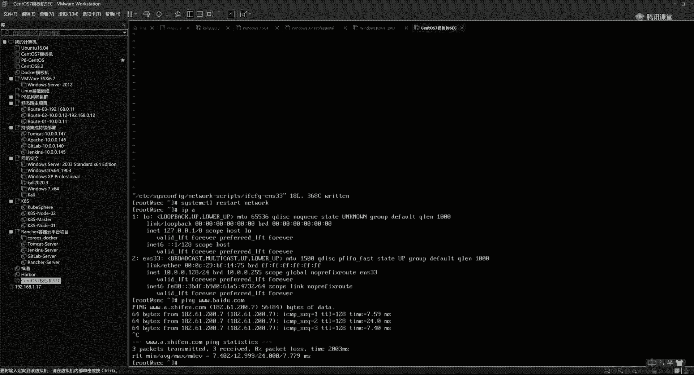

改完了是吧，好重启下，冲击网络，然后呢我们还需要干一件什么事儿呢，啊，我们先把防火墙关了，同时呢得设计成，开机啊，不会自动启动是吧，哎我们就先做到这儿啊，然后把它封装成模板机就可以了。

那么比如说后边需要用到docker了啊，或者说我们需要更换的，ym元里头的rap源是吧，比如说我们还有这个呃去更换这些base员啊，你根据你自己的需要，如果有必要的话，那么你就需要在这里做去处理啊。

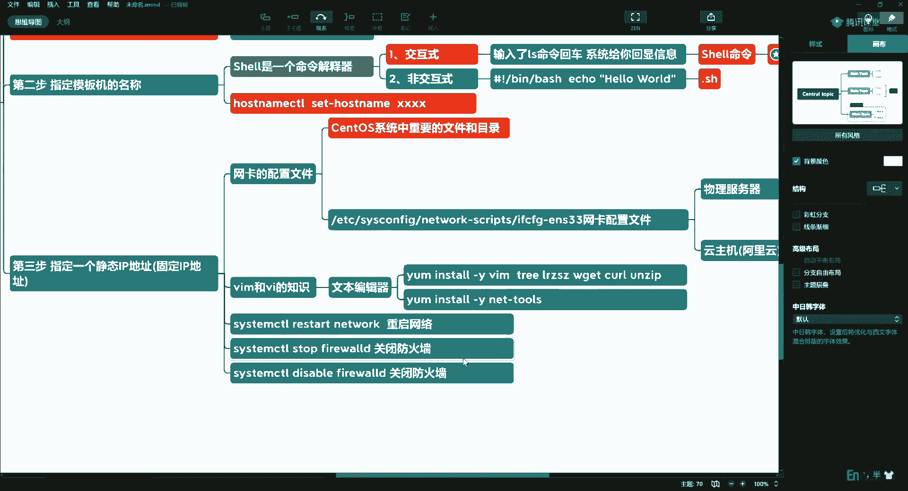

这里头有同学问啊，说复制模板机的mac地址会相同吗，不会相同啊，不会相同，为什么不会相同呢，唉你需要把这个uu id啊给它删除掉，啊那么他是靠这个u u i d来那什么的。

我们如果把这个ui d去掉了以后呢，他给你分配的mac地址就是不相同的啊，这块大家要注意，然后呢每次你去克隆完了以后，你在这这里边啊，根据你的需要改一下它的固定ip地址就可以了，好保存退出啊，保存退出。

然后的话呢我们就可以关机啊，比如说我在虚拟机这我直接关闭客户机。

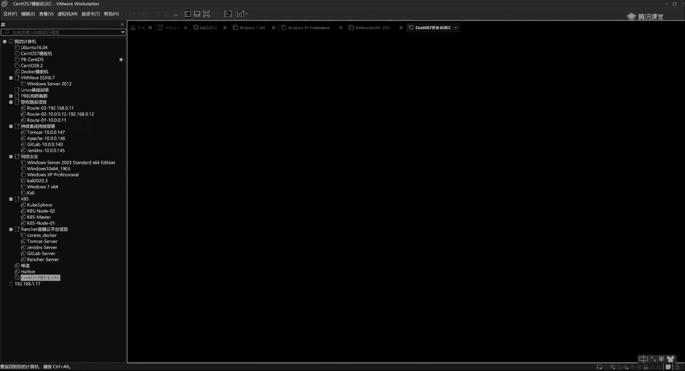

好关闭完了以后呢，把这个模板机呢放在我们这个分组里啊，然后右键这个模板机进行快照啊，拍摄快照，然后写2020，1013，21。49啊，这个描述，安装系统并做基本配置，啊然后点拍摄快照。

好那这样的这个模板机我们就做好了啊，这个模板机以后就不要动，比如说我要在这修改，我就在这个模板机里修改，比如说我想用一台新的怎么办，那直接在这里头点管理，点克隆，我们直接可以克隆一个虚拟机。

然后在选择克隆的时候，选择链接克隆，好那你看啊，你这台模板机就快速的克隆出了一台。

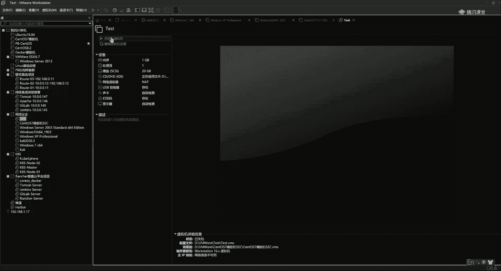

比如你有十台，那你也是这样去快速的去克隆，114是不是谷歌的幺四，不是啊，8。8。8。8是谷歌的，好这样的话呢我们就克隆完了，然后呢你需要做的是呢，到你这个网卡的配置文件里头啊。

你只需要把这个128改一下，比如说我把这个128改成129啊，把二八改成二九，那么大家在使用的时候一定要注意这个ip地址，相对来说让它是连续的啊，这样的话呢你将来也好访问，比如说你写个shell脚本啊。

将来也可以呃快速的去扫啊，所以这儿有各种各样的呃，使用的一些注意的细节啊，好这台129就可以用了，啊那么大家以后在操作的时候不要操作模板机，就是你要干什么，你克隆一台机器，这台机器如果你搞死了。

搞坏了啊，你再次再克隆就可以了，好吧啊，然后呢嗯这个就是我们刚才给大家说的啊，关于cl s7 模板机的一些封装，那么如果你去封装这个co s6 的模板机，但相对来说比较复杂啊。

有可能会出现mac地址相同的这种情况，那怎么优化呢，到时候我们再会给大家，下一节再会给大家讲，所以这一讲呢由于时间原因呢，我们就先说到这儿啊，先说到这儿。

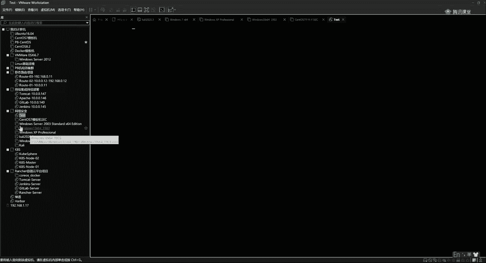

晚上呢我会把这个模板机，你如果懒得做的同学，我把这模板机我都给你打包上传，打包上传，那么如果你下载完了这个模板机，你怎么用，注意看啊，注意看怎么用，就这有个文件啊，这个文件，这里说这里有a打开啊。

它导出了以后就是像这样的ova ova格式的啊，你点打开就行了好吧，然后他就能够把这个虚拟机，从我这边迁移到你那里了啊。

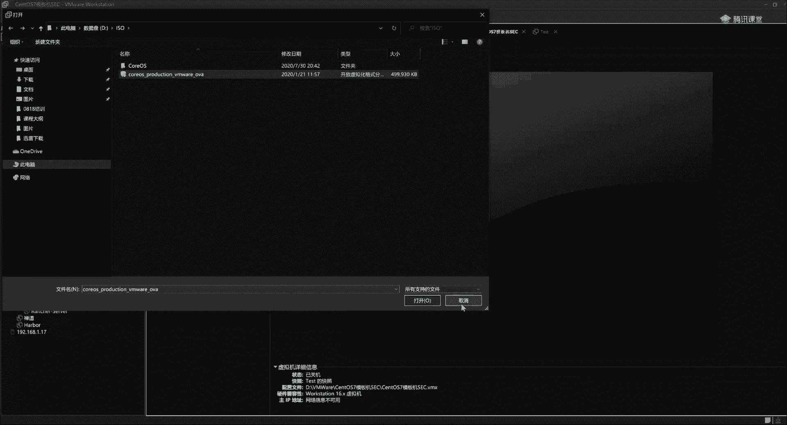

然后这里头我们我给大家的这个，可，c7 的模板机，用名root密码，用户名密码好吧，如果呢您下来我们官方给的这个模板机，那你就用这个就行了，哎呀，紧赶慢赶是吧，在我们这个下课之前把这个说完了啊。

把这个说完了，剩下的大家有什么问题呢，你可以来问啊，然后今天我们画的这个导图，回头我会发到我们微信群里啊，就大家去这个群里直接下载就行了，然后关于这些个镜像啊，关于这些个镜像我会给大家上传到百度网盘。

回头大家呢也到微信群的，百度网盘去下载就行了，♪ 被岁月打磨 ♪，♪ 是不是一个人的生活比两个人更加活泼 ♪，♪ 我喜欢 ♪，♪ 30岁女人特有的温柔 ♪，♪ 我知道 ♪，寂寞的野兽，这一脚没听明白的。

你说相对来说还是比较近，那么最后呢再回顾一下啊，回顾一下这十几天，希望大家能认真的去遵守啊，任凭再三选择，谢谢大家来听课，呃呃暗夜着迷行，没问题啊，♪ 34 ♪，吉他的天空版，♪ 我不我不要这么亮 ♪。

♪ 每每在我多爱你 ♪，♪ 会察觉到我根本寂寂寞难忘 ♪，♪ 即使千多百个深夜曾在梦境内 ♪，♪ 我有吻过你 ♪，♪ 这毕竟并不存在 ♪，♪ 人生天生开始少和世无声挣扎 ♪，有个情感到底没有加群的啊。

去找班主任，或者我给你们拉群，其二复活炸弹，后果炸弹能写很多的版本，♪ 你我各有角色范围 ♪，♪ 就算在寂寞梦内超出好友关系 ♪。

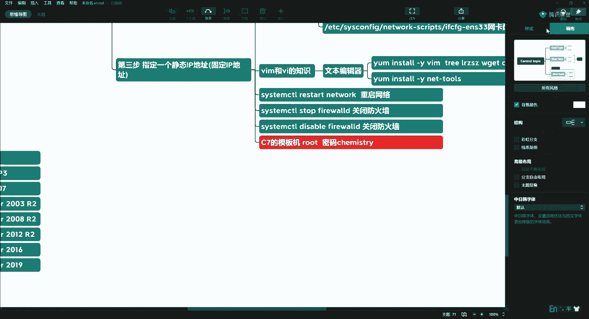

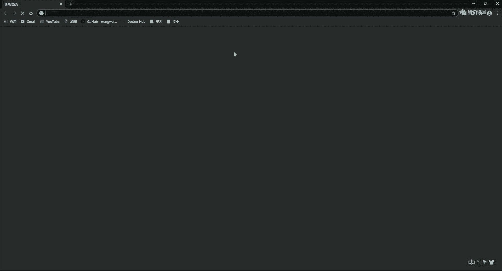

♪ 为啥因为爱你的理想溺无谓要你一首 ♪，♪ 各种问题共我道别 ♪，♪ 大别让空虚使我越轨 ♪。

♪ 啊啊啊啊啊啊 ♪，♪ 可 ♪，♪ 不可不要这么样 ♪，♪ 徘徊在莫甘娜 ♪，♪ 你会擦觉到我更懂这般苦难忘 ♪，♪ 即使千多百个深夜曾在梦境内 ♪，♪ 我有吻过你 ♪。

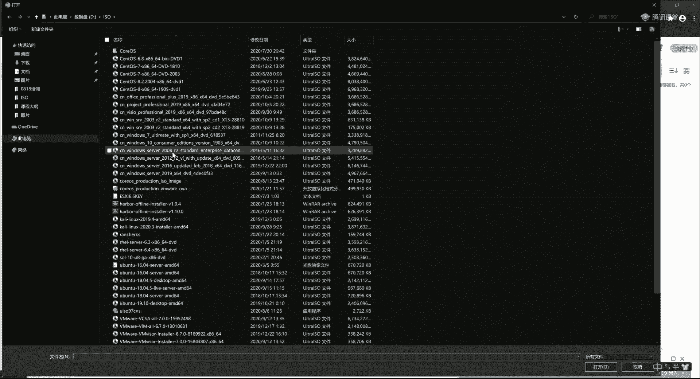

♪ 这不经定存在 ♪，♪ 人生这声开始消和逝 ♪。

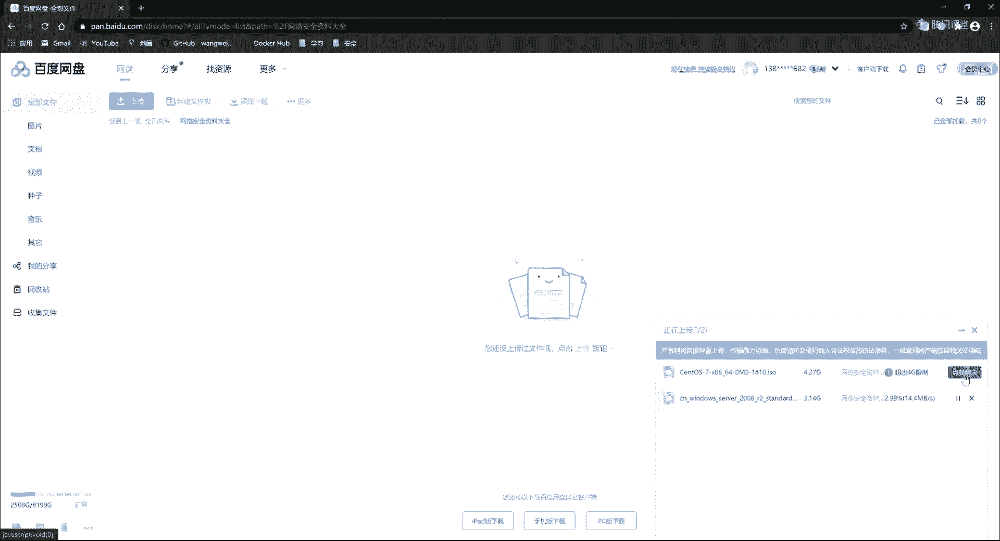

♪ 无声挣扎 ♪，♪ 有个情人无底是我多么的想她 ♪。

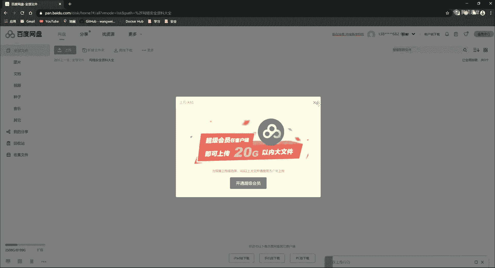

♪ 但我偏偏只得梦中偷窥 ♪，♪ 其实每次见你我也着迷 ♪，♪ 无奈你我各有角色范 ♪，♪ 就算在寂寞梦内超出好友关系 ♪，♪ 为谁不爱我 ♪，♪ 你心里着迷 ♪，♪ 无谓 ♪。

♪ 要你惹上各种问题 ♪，♪ 共我道别吧 ♪，♪ 别让空虚使我越轨 ♪。

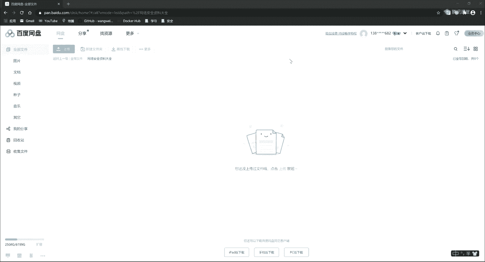

♪ 其实每次见你我也着迷人无奈 ♪，♪ 你我各有角色范围 ♪。

♪ 就算在正茫茫来冲击好友关系哦 ♪，♪ 为着心爱的你心里着迷 ♪，♪ 无谓要你认输 ♪，♪ 各种问题共我道别吧 ♪，♪ 别让空虚把我摧毁 ♪。

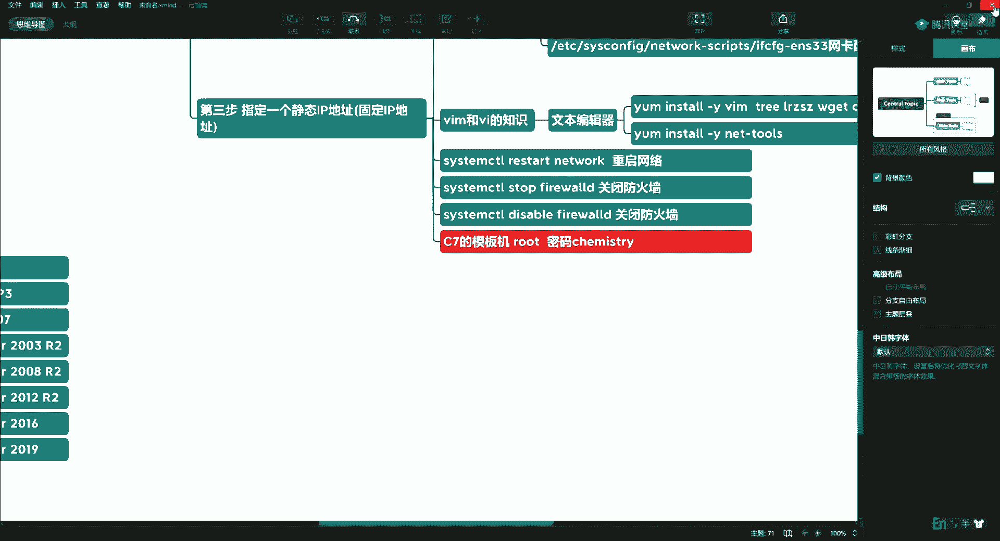

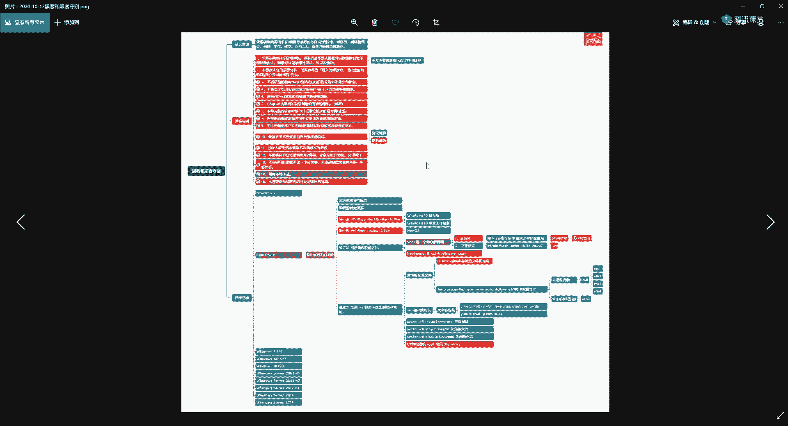

乘客您好，列车请注意乘车，车往右开，对我回家了，给大家传哈，然后下课了看一下，早点休息，然后这个资料已经发到群里了。

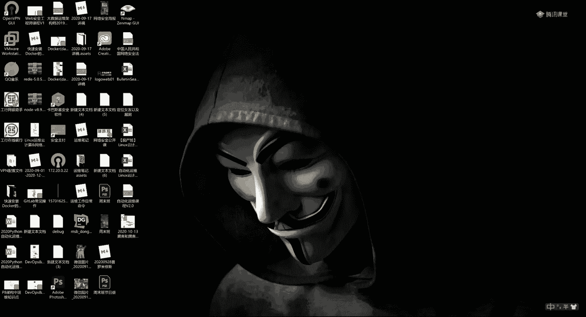