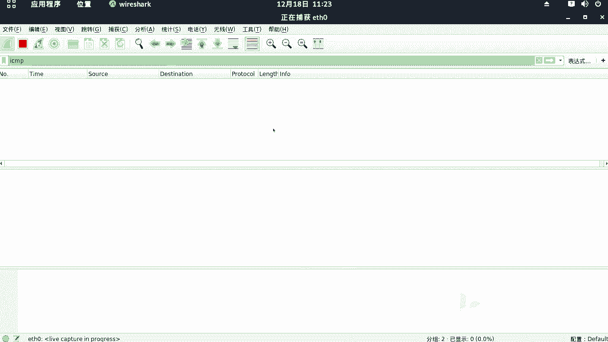
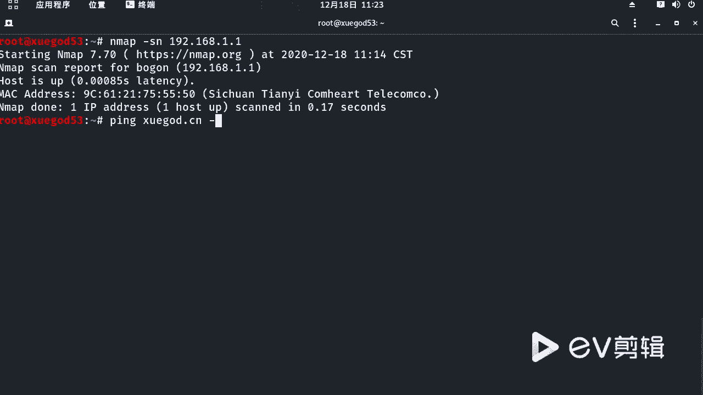
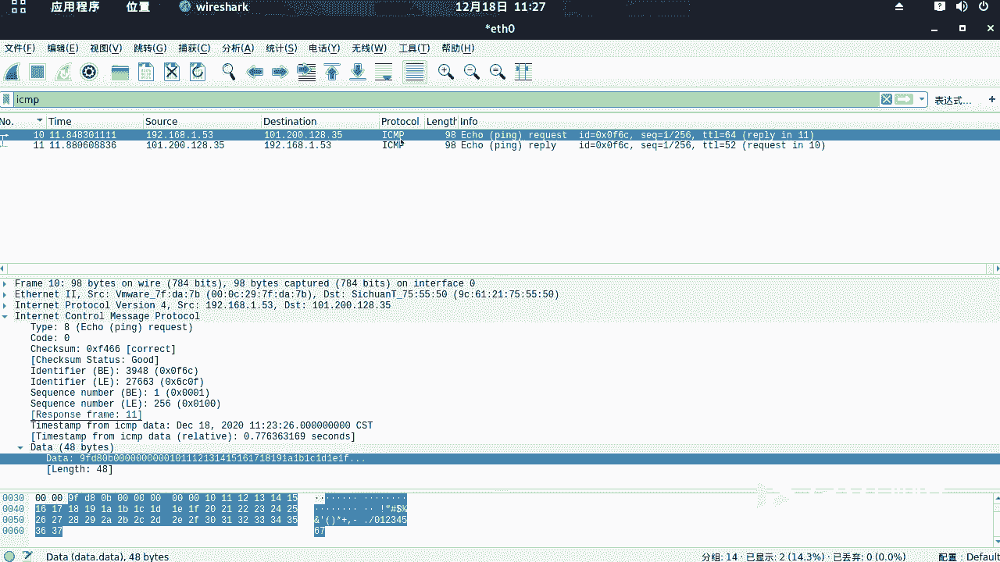

# 学不会我退出网安圈！中国红客技术正需要传人！全套666集还怕学不会？（网络安全／黑客技术） - P50：9.5-【WireShark抓包系列】常用协议分析-ICMP协议 - 一个小小小白帽 - BV1Sy4y1D7qv

好那我们下面来看一下常用协议啊，i c p协议啊，我们来分析这个数据包好，那么我们把之前的书包啊都清掉好吧，然后呢这里我们输入i c m p i开始抓包，我们来抓取s m p协议的啊，好的不保存好吧。

呃那么如何去产生一个s m p协议的数据包呢，对吧，说拼一个是不是就可以了，诶那我们来打开中断。

我们来拼一下的学尬的点cn啊。

只发送一个数据包啊，好的，然后回到这里它就产生了对这个拼包，我们来停止啊，那么这个只有两个数据包哈，一去一回也是一个请求，一个响应是吧，很清晰啊很清晰，然后呢，下面呢我们来分析一下这个数据包好不好来。

那么我们这里把这笔记给大家整理了，如何产生一个拼包啊对吧，就是sap协议的数据包两条，那么第一个呢是请求包啊，啊那么我们一点点来分析一下的啊，嗯这个原ip地址1。53发起的请求。

它呢请求像什么学个点cn，它自动解析为ip地址了啊，发送一个a啊，a那个拼请求就拼啊，拼那个学霸的cn i c m协议，然后这个请求包类型呢是request请求类型对吧，然后呢t s t l值是64啊。

然后呢这是他的一个序号啊序号，而我们看下面好吧，那么下面呢i c m p啊，在这儿呢是吧，它是基于对它的上层协议是吗，i p协议对吧，对据ip协议的，然后呢这是练这是链路层，然后呢这是物理层好吧。

然后我们点开主要看这里啊，这里那么这个啊注意他那个据ip企业ip地址，注意ip层，那么这里呢有一个原ip地址，s r c一点53d i t目标ip地址对吧，一这是学神的ip地址啊，好的。

下面呢看往下看这个数据包好吧，i s m p数据包tab 8啊，这个值啊八代表的是什么请求类型，对数据包类型八代表请求包平行包好吧，那么这里呢我们来看对应的啊，我看这个响应包里边对吧，零一个八一个零啊。

零代表的是什么，代表是想用包就回复包，对八代表请求零代表响应啊，然后我们接着看啊，还是请求包，那么这里呢take some啊，这是校验盒，它主要是用来实现数据包完整性校验的，好吧对。

然后再往下我们来这个是校验状态，对good没有问题是吧，然后呢下面这个id值注意啊，这四个字段，这四个字段在你请求包和响应包中，他们四个是一样的，不变的，我们来看啊，对你看其他都变，就这四个不变。

第四个是不变的，对你请求什么样回来还是什么样的啊，然后注意看这里request frame 10，对吧对那么这里呢response from 11啊，什么意思啊，啊这个数据好像颠倒了啊。

是不是颠倒了对颠倒了，那你说这一针啊，对告诉你啊，那个响应在11帧啊，这告诉你请求在十帧，他俩是对应的好吧，然后呢我们再往下来看，那么对于针对这个请求颁了奖，下面有个data data啊。

这是什么请求的数据啊，数据填充的数据填充的数据啊，然后呢这一点呢也有填充的数据，那么这个sap协议的数据包还是比较简单的啊，对主要是一去一回啊，对request replay，但是注意啊。

那么这里的这个状态，太八和零代表的什么意思啊，要记住八代表请求零代表响应啊，我们把这个整个这个过程给大家整理一下呢，啊然后呢这里要注意，那么每个都是什么意思啊，给大家标示出来了啊，那么它整个工作过程啊。

就相当于本机啊，发送一个i c m p的对request请求包，那么接收方如果目标机是存活的，能拼通对吧，那么它会返回一个replay啊，包含了接收到的数据拷贝和一些其他的指令啊。

那么也就是说啊数据拷贝什么意思，那就是你在发送请求包的时候，这个数据线通是什么样的，那么它响应回来的数据还是什么样的啊。

