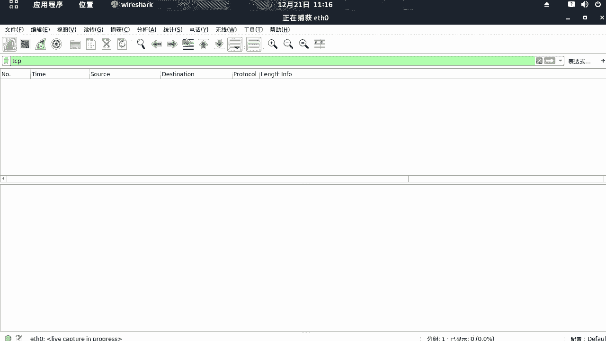
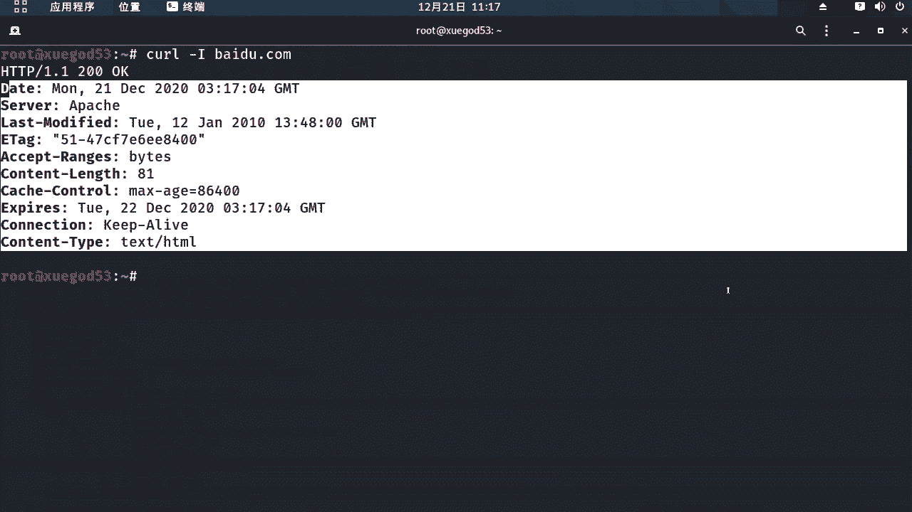

# 学不会我退出网安圈！中国红客技术正需要传人！全套666集还怕学不会？（网络安全／黑客技术） - P52：9.7-【WireShark抓包系列】常用协议分析-HTTP协议 - 一个小小小白帽 - BV1Sy4y1D7qv

好下面呢我们来讲一下常用协议分析啊，http协议啊，那么这里呢我们还是筛选啊，ttp，因为h t p它是tcp的上层协议啊，所以说我们过滤tcp的数据包呢，它呢也会包含htp协议的数据包。

好我们来这里来设置一下的啊，suck好，重新抓一下包啊，好那么这里呢我们来打开一个终端啊。

唉通过什么方式啊，可以来抓取到tp协议一样呢，其实有很多种方式啊，那比如你通过一个浏览器访问域名也可以啊，那么这里呢我们通过这个k命令杠大i大i好，百度点com啊来抓取一下的好吧。

那么这里它返回的是嗯百度的头部信息啊。

那么这里呢我们做完之后把那个visa停一下的啊，避免它产生过多的数据包啊，对我们的数据包分析啊产生干扰啊，我来说一下的课啊，是什么意思啊，它是一个在命令行下啊工作的文件传输工具啊。

那么这里呢我们用它来发送htp请求啊，这样的话就会产生一个tp协议的数据包，这个杠大i啊，这是杠大i它是表示啊仅返回头部信息啊。

然后我们来看一下这个看visuck唉，那这里呢我们就抓到了tcp 3次握手。

还有四次挥手这么一个过程啊，然后呢其中的这个和这个啊好吧，对这第四个和第六个数据包啊，那么这个呢就是一个htp的数据包啊，那么我们分析整个过程啊，首先呢我们发送了一个s b的high的请求啊。

head请求，这好吧，来看这里啊，然后呢呃发生这个请求之后，服务端啊收到我们请求之后，返回了一个s e q啊，a c k进行确认，对a c k进行确认，然后确认完成之后呢，服务端将hp的头部信息对。

这是百度返回给1。53的，对返回的他头部企业返回给客户端，那么状态码是200啊，ok表示页面是正常的，然后呢，客户端收到服务端返回的头部信息之后呢，向服务端发送了一个a c k进行确认对吧，告诉他。

那么我已经收到你的信息了，好吧，发送完成之后呢，客户端就会发生一个f i n a c k，就说我没有数据对吧，需要接受了，我已经接受完了，那么需要请求请求来进行关闭链接。

那么进入了四次挥手断开连接的状态啊，那么这个是整个一个嗯数据建立连接，数据传输，还有关闭连接这么一个过程啊，然后呢在这里呢我们再通过这个数据包啊，这是kelly请求百度对吧，返回头部信息，我们右键。

那么可以通过追踪流，htp流，也可以看到整个这么一个过程好吧，然后开发了head的请求请求百度的头部信息，那么下面呢就是百度返回来的，对返回开立的头部信息啊，这一个过程请求响应。

那么这个呢就是一个htp协议，好吧，我们通过这种方式呢可以很清晰的来看到啊。