# 学不会我退出网安圈！中国红客技术正需要传人！全套666集还怕学不会？（网络安全／黑客技术） - P55：10.2-【漏洞扫描工具系列】NMAP语法及示例 - 一个小小小白帽 - BV1Sy4y1D7qv

好，下面呢我们来看一下nmap的语法，及相关的一些事例啊，那么给大家讲一下，nm的一些高级扫描方式和基本扫描方式啊，我们常用的，那么它的语法结构其实很简单啊，n map后面跟着扫描类型啊。

各种不同的扫描类型，它对应不同的参数，还有一些其他相关一些参数就可以了，那么这里呢比如说，那么我们使用按map来扫描一台服务器啊，注意啊，那么你可以自己按map。

后面跟上服务器的域名或者ip地址就可以了，默认情况下n map会扫描啊，1000个最有可能开放的tcp端口，那么也就是默认你不指定端口的话，它只扫描1000个常用的嗯。

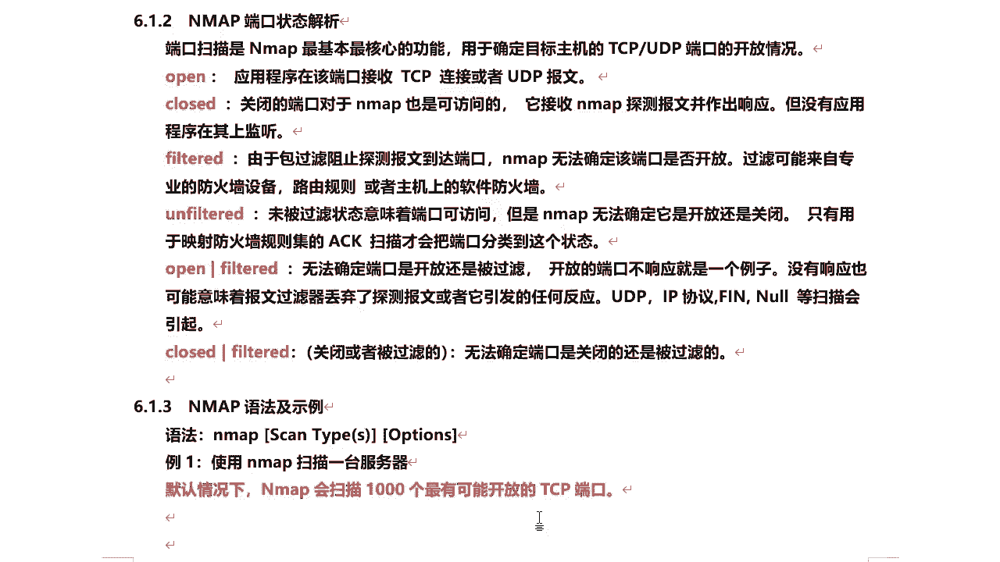

那么它不是扫描所有端口，那我们来举个例子啊，来打开telly啊，终端，nm l n map啊，我们扫描一下我们的渗透s，1921681。63好吧，直接跟ip，那么它会扫描这台机器的啊，最一最常用的啊。

1000个最有可能开放的tcp端口，那么这里检测出几个四个端口开放的吧，22 8011和3306啊，这几个端口。

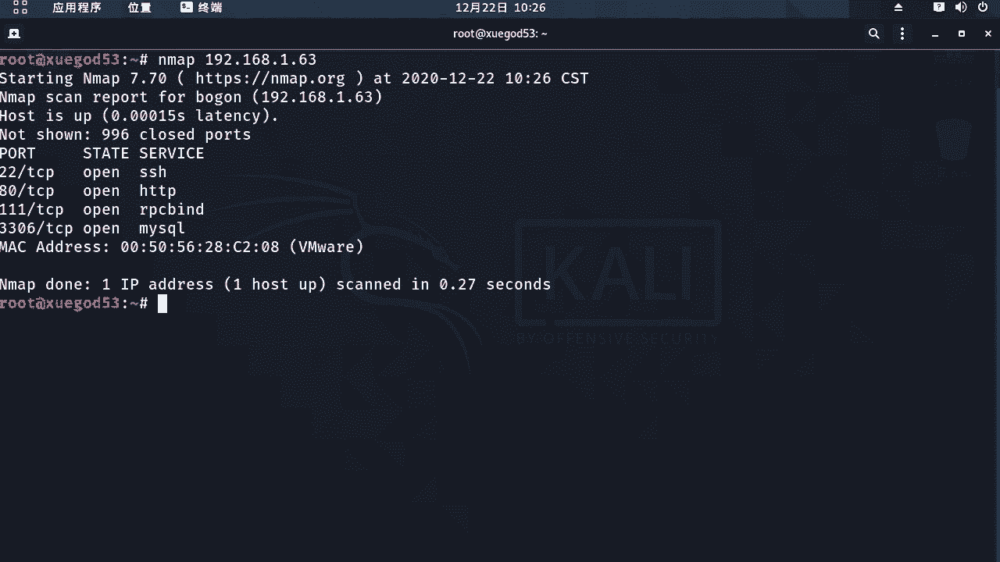

那么这个比较简单哈，好的，那么一般来讲我们常规的是吧，首先这么扫一下的啊，但是呢话说回来，如果假如说你要想不漏下啊，任何一个端口，那怎么办，那么可以进行全端口扫描，这个咱们后面会给大家讲一下的啊。

然后呢我们比如说来接着再看第二个例子，比如扫描一台机器啊，来查看啊，它打开的端口及详细信息啊，那么这个详细信息需要用到一个参数啊，杠v杠小v，这个杠小v呢表示显示冗余的信息，也就是在整个扫描的过程中啊。

它会显示扫描的一些细节，从而呢让用户了解当前的扫描状态好。

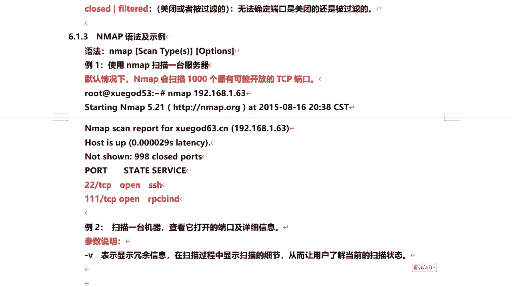

那么我们来也是基于这个啊，1。63啊。

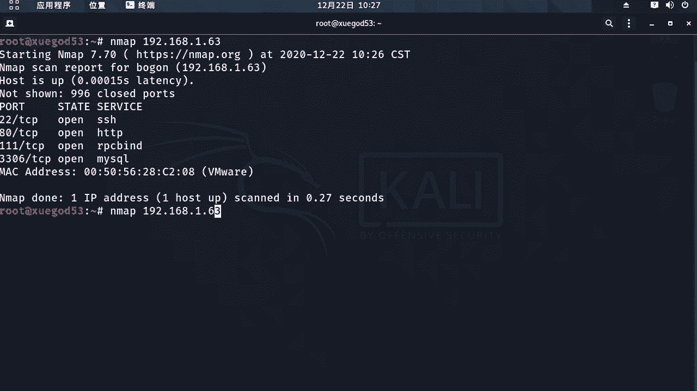

我们加一个参数，杠小v看看不用这个参数有什么区别，是不是比它显示更详细了，它整个显示的扫描过程对都显示出来了，最后呢他一次啊发现啊端口开放的，开放的开放的，最后呢确认状态，host is up。

目标主机是存活的对吧，然后开放了一些端口，mac地址是多少，而且wb检测出来是虚拟机啊，啊这是杠小v啊，这个参数这个比较好理解啊，那么刚刚我说了是吧，嗯默认的你不指定端口，它只扫描1000个。

最有可能开放的啊tcp端口，那么为了呢假如说有的服务器啊，可能把一些常用的端口啊改成高位端口，那么你通过正常扫描方式扫描不出来怎么办，那么这里我们可以进行全端口扫描来指定。

那么端口呢最大65535啊对吧。

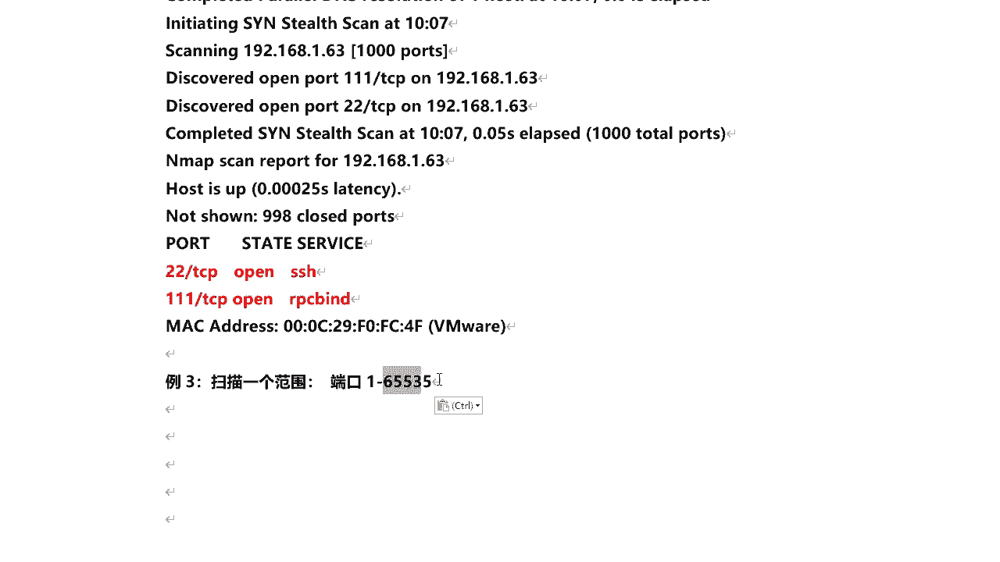

那么这里呢我们来nmap啊，杠p一到65535啊，对从1~65上，我全端口扫描，杠p呢是指定端口，后面那个咱目标主义的ip或者是域名都可以，那么全端口扫描呢相对可能会慢一些啊。

那么这里呢我们来得到结果和前面是一样的，你就证明啊呃也就是1。63，它也就是开放了这些端口，没有其他的端口开放的了。

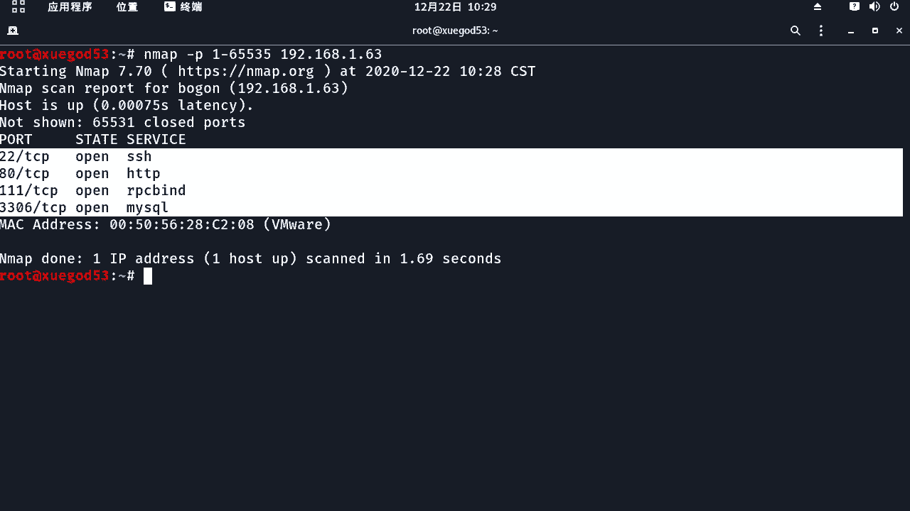

如果有其他高位端口开放，它通过这种方式肯定能扫出来，但是你常规的搜不出来，你不指定端口的话啊，啊那么也就是在生产环境下啊，注意为了安全，我们只需要开启正在提供服务的端口就可以了，那么其他没有用的。

或者没有提供任何服务的端口通通都关闭掉，防止被黑客利用，所以说这个切记啊，要要切，那么关闭不需要开的服务对啊，那怎么就是有些服务你不需要对吧，你这生产环境，你服务器包括你的项目用造，那需要关闭啊对啊。

那怎么能关闭，比如说来给大家讲个小技巧，那关闭不需要开的服务有几种方法呀，有两种方法，第一个呢首先第一个你认识这个服务，你认识这个，我直接可以将它关闭掉对吧，那么比如像这个啊，刚刚我们扫描到了是吧。

这个111端口是吧，是这个符r p c版的，那么你可以直接通过这个命令对吧，sc条stop r b c bd直接可以关掉了，这是你认识，那么如果你不认识呢，对啊，你认识你知道这个服务是干什么的对吧。

我我确实不需要它哎，那么直接关闭掉就可以了，那么如果你不认识这个服务怎么办，那么那你就考虑一个问题了，那么这个服务是不是黑客啊，对啊，被黑了啊，那么这个服务到底是干什么的，有没有用啊，你也不知道对吧。

那怎么办，那需要排查，那比如说啊我们来看第二个情景嗯，查看啊，你不认识这个服务，那么查看呢哪个进程使用了这个端口啊，并找出进程的路径，然后呢把它扣掉，删除文件，那比如说我们以22端口为例啊。

当然22端口是s h啊，这个我们都知道，我们只是假设以它为例，那么整个操作的思路是什么样的，我们通过这个nmap扫描出来的这个端口对吧。

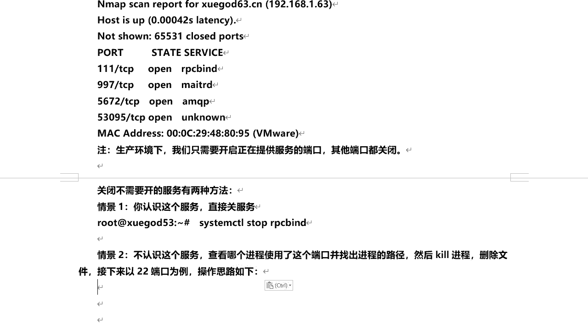

在这个服务不认识那么好，那么我可以通过这个端口啊，s l s l s s o o f对吧，那么通过这个命令，我们来看一下在22端口是吧，那么注意啊，那么这个是22是针对目标机linux是吧。

那我们到可以到linux里面去看一下啊，当然在这里也可以啊，我们的ky也开启了这个22端口啊，s h服务，那么它对应的pad进程id是2085，那么根据这个进程id啊，那么我们可以查看到啊。

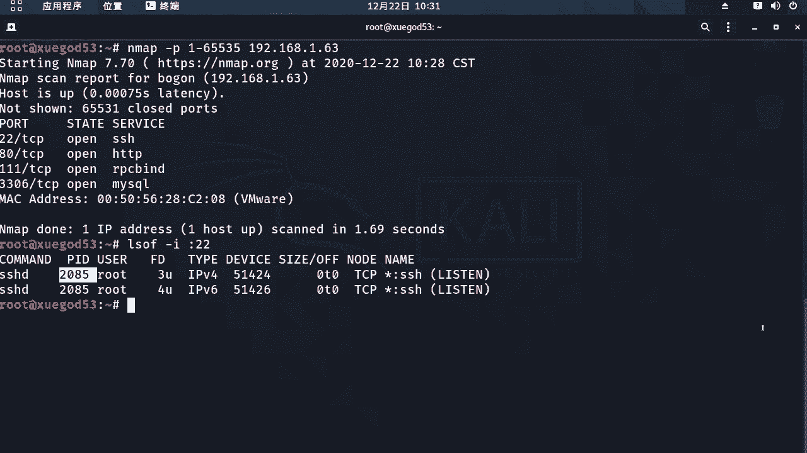

查看一下，那么是哪个进程文件啊，在运行的是吧，哪个文件在运行的运行这个进程呢，我们通过p s a u s，2085对吧，来筛选的进程id，那我们来看啊，那么它运行是哪个文件啊。

这个文件user s b s h d是吧，那么也就是说找出这个进程的路径了，那么这个文件你是否认识对吧啊，假设如果没有看到这个命令啊，如果你通过这种方式计算id，没有找到这个路径具体的执行路径。

那么说明什么问题，这个木马进程啊，它可以在bs端啊直接执行啊，不需要去写文件啊，或者是这里您可以通过which啊，which，那比如说那我们这里头，比如说w h i c h v i m对吧。

那么它运行的是这个，那么我通过位置来查看一下，它到达到达在哪里啊，在这里是吧，通过这种方式你也可以来查看到啊，那么注意，那么如果你常看到这个文件啊，确实你不认识啊，也不是你创建的对吧，以前没有。

那么你判断它就是黑格，就是木马怎么办，直接可以将这个进程给他q掉对吧，q杠九，然后2085扣掉之后呢，将这个文件直接删除掉就可以了啊，当然我这个不能扣掉啊，呃开利的s h h啊，那么整体这个思路呢。

大家啊你去了解就可以了，好吧对，那么主要这个通过这种方式呢，这种思路可以找出黑客监听的后门，端口和木马存放的路径啊，好吧，希望大家呢能够了解啊，学会啊，那下面呢我们接着再往下看啊。

使用nmap扫描一台机器啊，查看呢此服务器开放的端口号和操作系统类型，那么注意，那么这里我们要检测它的操作系统类型是，那么操作系统类型的检测器是在n map，它有个数据库啊，各种类型操作系统。

它有个数据库相关那些啊，因为每不同类型的操作系统啊，它针对的信息是不一样的，当你去扫描探测目标以，它会和这个本地的mp数据库去比对对吧，那么如果比对上了，就证明他是这种类型的操作系统啊。

但是存在一个问题啊，就是有的他可能拆的是不能完全百分之百去判，断确定它是什么类型的，只能是大概是什么类型的好吧，但有的检测还是比较准的啊，但不是所有的都能检测出来好，那么我们来看一下啊。

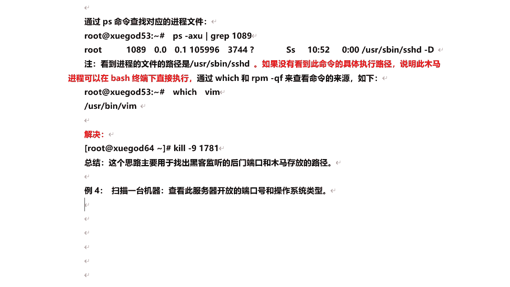

那么如何去检测呢，比如说那么我们来检测一下学神啊，n map好吧，杠小s大s这个呢是半连接扫描对吧，那么这种方式就是它是基于tcp，三次握手中的前两次是吧，然后呢去扫描目标机。

这样呢不会在目标机下上留下，任何的记录和日志是吧，然后杠大o对，刚大物呢是这个参数，意思检测目标系统的操作系统类型啊，然后后面跟上域名这个ip也可以啊，好的那么这里呢我们来得到一个结果，好吧。

看啊嗯这个呢学神啊，开放了哪些端口啊，它有哪些端口，那么看各种状态啊，open的是吧，还有过滤的，那么这种过滤的就可能是被防火墙是吧，过滤了啊，后面的设备类型，那么它在这注意啊。

那么它可能存在嗯这几种是吧，哎然后running运行在哪，linux，其实我们通过这个反馈系一样，可以猜测肯定是linux系统，但是呢具体是什么类型的啊，泪流系统什么内核的对吧，他也给了几种情况。

没有具体的说啊，是吧嗯那么也其实啊有很多啊，有的系统他能给的明确具体的是什么系统，什么版本的，对吧嗯有呢他只是给出大概这些信息，但是也能给我们一个方向，是不是好。

那么这是关于imap的操作系统版本的检测啊。

好那么把笔记呢给大家整理一下了，那么这里又学一个参数杠大o啊，显示出操作系统的类型，每一种操作系统都有一个指纹啊，都有指纹，这个指纹其实说白了，它是各种通过各种探测技术探测目标机。

根据返回结果和他本地的mp数据库里边对吧，相关类型的一些操作系统进行对比比对，然后最后给你一个结果，判断它是什么类型的，或者是大概是什么类型的，然后杠小s这是半开扫描啊，好那么抽到半开扫描啊。

这里呢我们来再来回顾一下的好吧，那么tcp同步扫描啊，也就tp s y n，那么因为啊不必全部打开一个tcp连接，所以这项技术通常称为半开扫描，那么不必打开对吧，全部打开一个tcp连接。

也就只完成其中的两次tcp 3次握手吗，完成前两次你可以发出一个tcp同步包，s弯对吧，然后呢等待回应，如果对方回应一个s y n a c k响应包，那么就表示目标端口啊。

哎正在开放的正在呢处于监听状态，如果返回一个r s t啊，数据包断开了，那么就表示目标端口没有监听程序啊，那么如果收到一个s y s k包，原主机就会马上发出一个r t v将数据包断开。

而不是回一个a c k对吧，那么这个呢是第二次握手包，是不是对，直接断开，你收到它就证明目标端口是开放的，直接断开就可以了啊，和目标主机的一个连接，这实际上是由我们的操作系统内核自动完成的。

那么他呢现实时也是就说白了n map，它的机制对你通过杠小s大s半开什么，他这种机制收到第二次握手包时候，自动就断开了，好吧呃不需要你这么去参与啊，这张图呢就是说第一个第一张图啊。

啊第一步第一次握手对吧，半开扫描整个的原理啊，原理那么第一次啊，第一步就是发送一个s弯连接请求啊，第四波手，然后呢目标端口入开放的啦，返回a c k好，然后呢介绍这个第二次50包x y a c k之后。

就已经知道目标端口是开放的，那么下面呢直接就断开了好吧，断开这是端口开放，如果端口是关闭的呢，啊第一步呢也是发生s班啊好吧，如果端口是关闭的，他直接返回返回r s t对吧。

那么如果你直接搜到一个r s t，就证明目标端口是关闭的啊，这就是它的原理啊，那下面呢我们可以测试下自己的电脑啊，刚刚我们来测试学神是吧，哎。

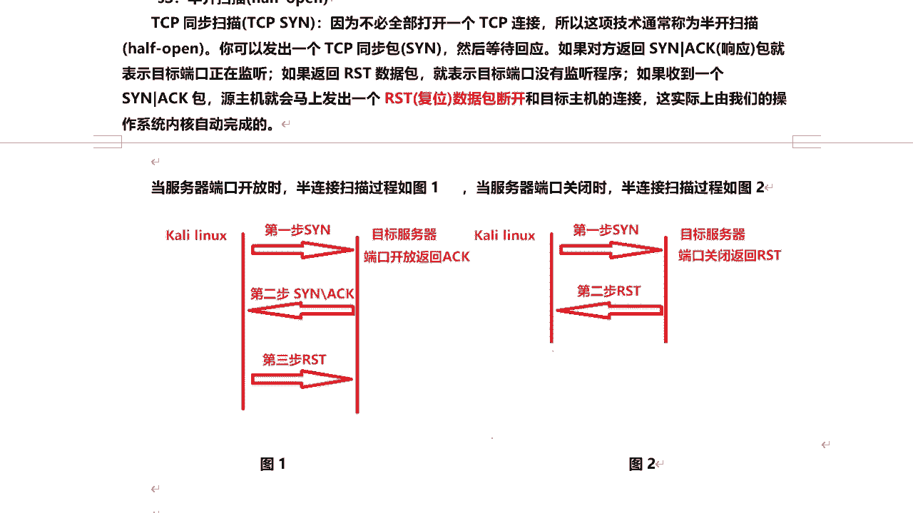

分map啊，杠小s大s杠大o192。168。1。63。

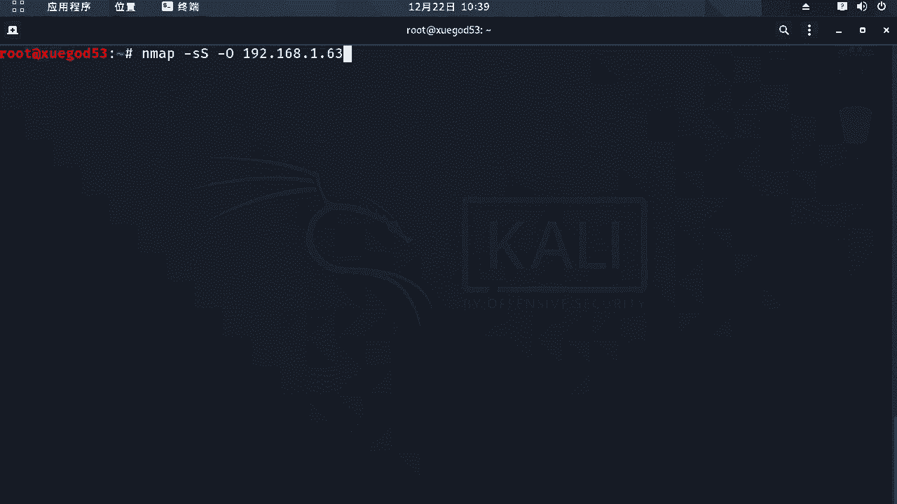

好那么这里呢我们来看看它的结果啊，嗯running运行在linux 3点x或四点差啊，内核是吧，然后os那么这个呢猜的还比应该上一个啊，学生的那个能准确一些是吧，对他直接给你不告诉你了吗。

linux内核是三点几或四点几的嗯，呃操作系统详细的信息对吧，details linux 3。2~4。9得直接啊，ok这还也还是可以的啊，最起最起码能给我们一个方向一个方向，然后至于其他的嘛。

那么我们可以同样方式啊，对换一下ip地址就可以了啊，那么windows linux它都可以进行探测的啊，这是刚达欧好，那么下面呢我们来看，那么通过n map，那么还可以进行扫描整个网段内啊，对进行存活。

主机发现在主机发现基础，他们可以使用一个网段中，所有机器是什么类型的操作系统，那么要注意，那么肯定这个这个网段啊，那么这个主机肯定是存活的，它才能检测出来。

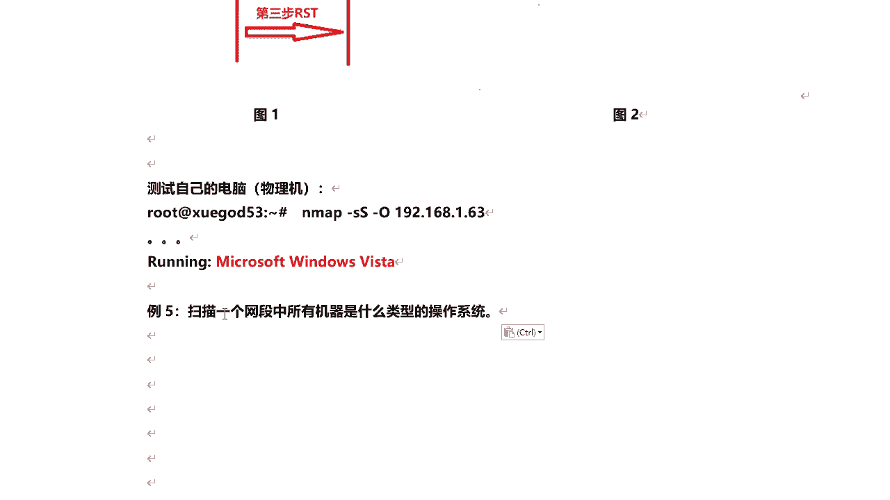

否则的话它也检测不出来对吧，那么扫描一个网段好的，那么怎么去找啊，n map对吧，杠小s大s杠大o是吧，然后后面要注意，那么你呢网站，那么你要写上啊，168。幺点啊，那我使用的是这个网段对吧。

然后呢杠24啊，好的，然后呢，我们直接回车，稍等啊。

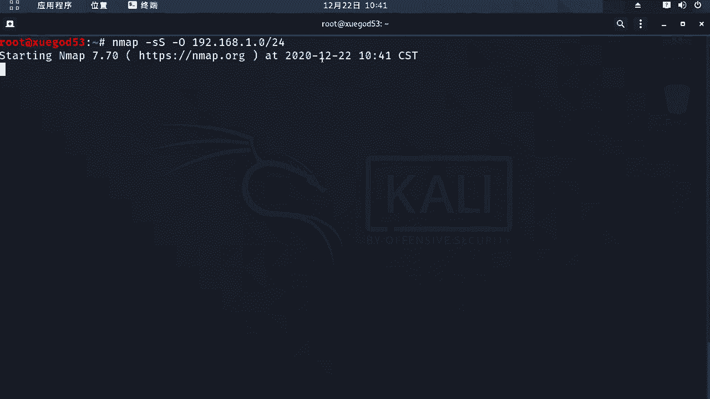

好嗯那么整个网段就出来了哈，相关信息啊，好的，那么首先看第一个网关哈，网关路由器，那么它检测是linux系统，在网关linux对大家都知道哈，然后下一个1。2对，那么它返回了这么多信息，这是什么意思啊。

对啊，那么也就是这些啊，那么他在操作系统啊类型探测的时候啊，那么也就是说他进行了这些操作好吧，然后返回的相关一些数据给你列出来了好吧，那么也就他呢无法确定啊，这个目标对吧。

相关的一些它是什么类型的操作系统，但是他把中间啊在探测的过程，这些指纹打印出来了，探测过程中使用的一些方法，所使发生的参数和它和它返回的一些数据对吧，都给你打印出来的，那其实每一个都代表不同的含义。

那这里呢我就不给大家一一去啊，解释了啊，大家可以课后自己去参考相关资料，去了解一下的啊，然后呢这个1。54啊，那么这个呢是windows xp sp 2或p3 啊，那么这个还是比较准确的啊。

windows系统嗯，这是学霸1。63啊是吧，上面是xp，然后呢就1。53，那么这个就是本机本机也扫出来是吧，那么ky它也属于linux，是基于deband嘛，嗯这是将内网啊对吧，你整个网段内。

存活主机的操作系统类型呢都扫出来了，ok那么这是关于这个，那么它呢也很强大是吧，下面呢我们来看查找一些有特点的啊，好吧，一些有特点的ip地址中啊，那么就开启八零端口的服务器，啊那比如说我我来看啊。

那么内网啊，我就我整个网段内或者内网中对吧，那么一些机器哪些机器开放了八零端口，八零端口最利的时候外部服务对吧。

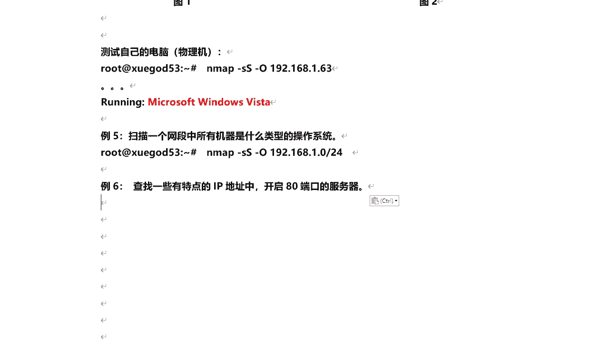

那么如果开辟开启了八零端口的话，那么我可以利用这个八零端口来去扫描它，诶这个外部有什么漏洞啊是吧，哎利用的漏洞是不是能拿到什么权限呢，杠n map杠小v显示详细的整个扫描过程的信息，杠p指定端口啊。

我只扫描8080就可以了，然后呢192。168。一点，比如说我只什么样一部分啊，比如说62~67对吧，他为什么1。6219631直到1。67啊。

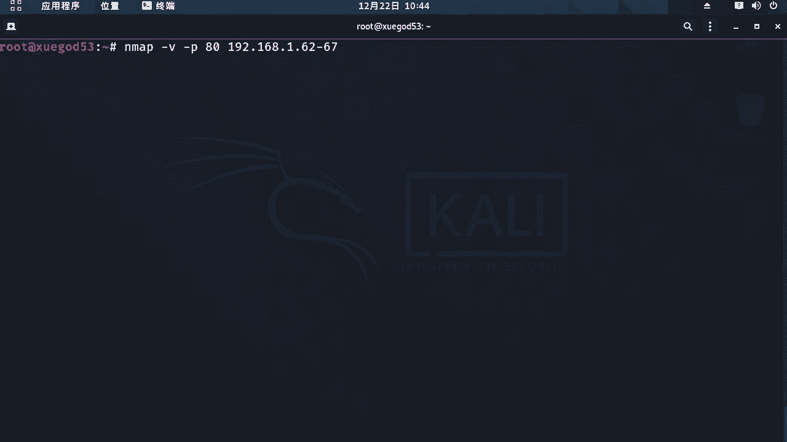

这几个ip地址呃，那么首先它过程是吧，判断这些主机哪些主机是存活的对吧，那它不是存活的，那他肯定也少不到对，那么这里得出一个结果来我们看啊，最终他发现啊1。63是存活的对，发现他了up好吧。

然后呢开放到八零诺手是否开放的open，打开的mac地址是这个好吧，ok然后呢他把这个read data files from，那么也就是说相关的检测需要的一些信息对吧，对比信息是从这里读出来的好的。

那么它呢这是关于啊扫描特定的端口啊，呃下面呢我们来看另外一个问题啊，就是说啊你如何的去隐藏的扫描，就隐蔽的去扫描，不被对方发现，是因为你频繁扫描呢，目标会被屏蔽或者是锁定ip。

呃比如说这里啊我们举个例子啊，就是就比如说咱们你要对批量的目标进行扫描，对吧，那么你可以来实现一个随机啊对吧，针对这些主机，目标主机啊肯定是多个啊进行随机扫描，然后呢对目标主机的顺序呢随机划分。

而不是针对一个啊使劲的少啊，导致了被屏蔽了是吧，容易被屏蔽，还有另外一个参数就是scada延时扫描，那么单位是秒，那么它可以调整探针之间一个延迟，就是调整延迟的话，就相当于放慢速度了是吧。

那么这样的话不容易被屏蔽啊，是这个意思啊，比如说我们先来看一下随机扫描嗯，随机扫描的话我们来看啊，比如说我们接通过这个战争来实现。

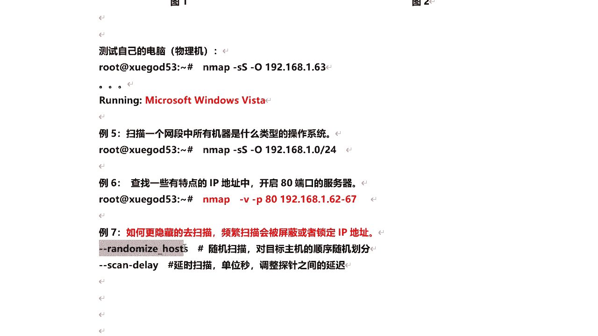

对多台主机的随机扫描，看这个干杯刚刚rensize host啊，那么这里我要扫描几台主机啊，62~6980端口，那么这样随机呢，就是每次啊它扫描的顺序都不一样，那么这是626566是吧。

那我再扫描一次呢，他肯定顺序就变了啊，这个随机所谓的随机就是这么个随机是吧。

唉还有这个呢延时少明，那么延时扫描呢对，那么他就是说你扫描完这台主机啊，它中间啊停留对吧的延时啊，就是间隔停多长时间来进行下载，下一台主机的扫描，那么这样呢它的扫描速度啊。

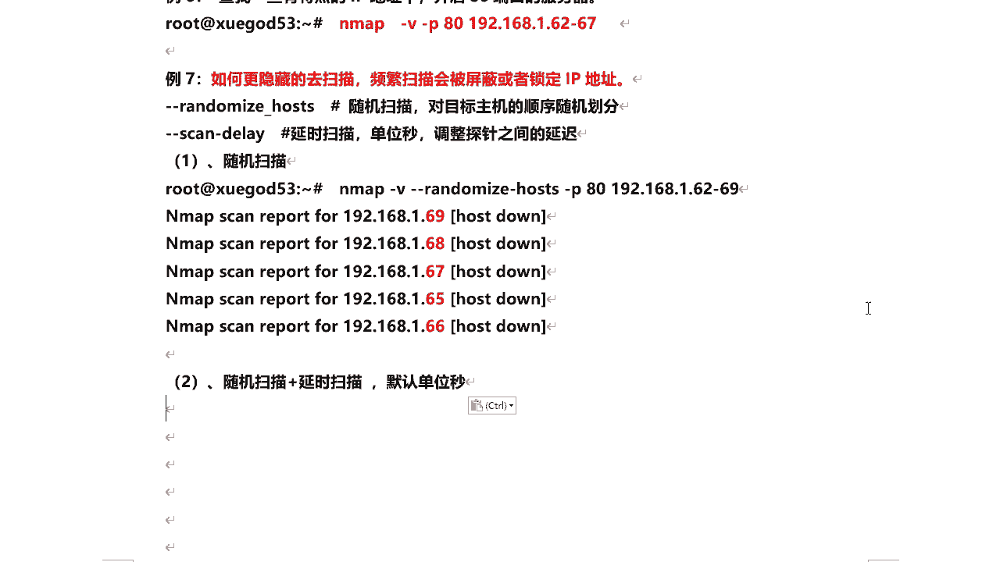

肯定是没有我们上面啊刚刚那么扫描快啊，这里呢我们来演示一下，随机扫描加延时扫描3000ms，也就是说每台主机扫描之间间隔三秒钟，要扫描完这台间隔三秒再扫描下一台，这样的话我们看速度明显的变慢了对吧。

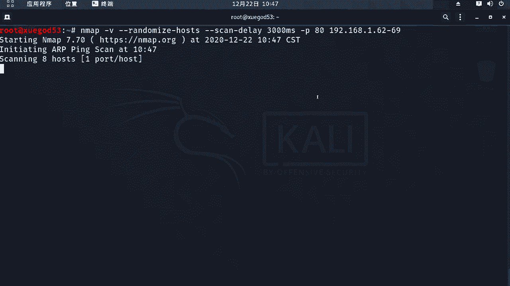

唉我们稍等啊，对出来了啊，好的，可以速度变慢了，但是呢相对来讲这样会相对更安全一些，对于如果目标主机有一定防御的话啊，你扫描太快，容易被封ip吗，这样会更安全一些啊，好的，这是实机扫描加延时扫描。

另外有一个啊，比如说我呢像如果黑客啊，那像在互联网上去寻找n map，寻找存货的主机，那他不可能一台一台去找对吧，那么这里还可以使用通配符指定ip地址啊，那么所谓的通配符对吧。

那么这里可能涉及到多台主机，对不对，那么其实我们这里就可以利用什么，哎那个随机扫描加延时扫描啊，那比如说我们来扫啊，像这个，这种情况啊，nmap杠v啊，随机扫描延时扫描30ms啊，杠p80 端口一点星。

那么这个星代表啥，是从1~254，对不对好，那么我们举个简单的例子啊，我们把后边就不就不写了啊。

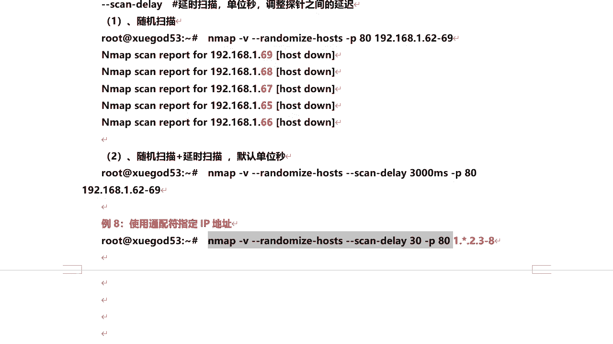

不用后面的就是说我们来扫一下了，192。一六八点一点星啊，那么这意味着什么，那么是不是说明我们整个的网段ip啊，这个新型代表从1~254，那这么去扫的话，可能会扫描我整个网段内是吧。

存货的主机它都会找出来对吧，那正在什么255台主机，那么这个他通12345啊，一个一个手，那可能会相对慢一点，而且我们还加了延时，是不是，那么换个角度，如果你扫描是一九二点168点星，点星呢是吧。

什么意思啊，那么它扫描多少台主机啊，应该是254x254对吧，很多啊，那得证明得需要点时间啊，是不是啊，他说一点几1。1~1。254~2。1，2。254啊，这么举手性能代表任意是吧。

但是啊任意在这里ip地址最大就254对吧，最小就一样是吧啊，或者是零啊零嗯，那么它呢这里头要来呃，已经完成了3。9%。

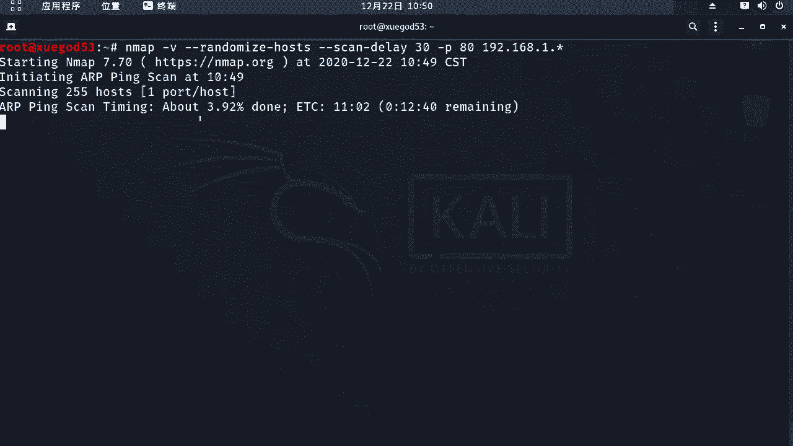

28完事啊，看你回车看一下啊，32。94啊，比较慢，还剩两分多钟，两分25秒，31秒，时间怎么越来越长了，这完成度啊，发现了零台主机完成了嗯，这个啊我来看啊，啊49。8了是吧，嗯前面显示有点问题啊。

我说时间怎么越来越长是吧，对腰点腥啊，这个希望大家要理解啊，得理解，那么假如你要扫描星点星点星点星意味着什么，全部的这样不允许你去扫是不可能的啊，这即使允许去扫是吧，那么这种情况星点星点星。

那你得扫多长时间呢，是即使允许你去扫全球的ip地址，是不是你得少多少斤啊，你得扫几年几个月啊，哈是吧，这个问题吧，咱想想很可怕啊，可怕这还没完事呢，对我们稍微等等，他这样比较慢，他一个一个去探测。

而且延时对我不加，延时能快一点，是不是啊，既然等到这儿了，我们再稍微等一下他啊，啊81了是吧，嗯手机延时就是扫描完一台主机后，按间隔多长时间再扫描完下一台，哎这样的话呢你要不设置的话。

它扫描这台机子扫描下载速度很快啊，对就容易被网络关联发现或者被屏蔽啊，嗯稍微等一下的，应该快完事了，42秒，96。867秒好吧，搞安全啊对那么他需要有个耐心啊，其实做任何事情都是啊嗯，应该快成功了。

好的ok啊，好的出来了啊，那么他这种方式啊，我们来看啊，检测出来了啊，哪些主机啊啊1。96或者down，就是这台主机是不是存活的是吧，up是存活的，有哪些主机存活的呢，往下看啊，往下看。

这些都是当当当当当是吧，嗯都给你列出来了啊，呃我看啊，还没完事啊是吧，对他先把你这些就是不是存货主义历史了，接下来呢，扫描舞台主机，那么也就是现在有舞台主机是存活的对吧，扫描这个舞台存活主机的端口啊。

什么端口啊，八零端口是不是因为我们指定的八零端口吗，好那么这里咱们就不等了啊，好的，那么这是关于他这个通配符是吧，哎那么大家会用就可以了啊，但是你看想要点星是吧，好的一般情况下啊不要这么去用是啊。

唉但是呢你你要想这么用也没问题哈，好的ok那么这个呢就是关于咱们的n map好吧，这个常规使用方法嗯，语法及示例啊。

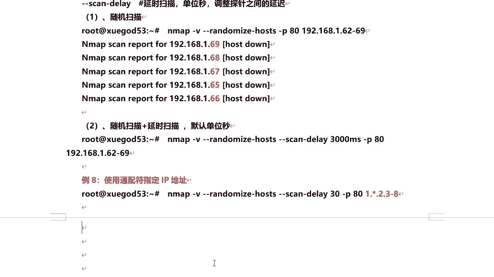