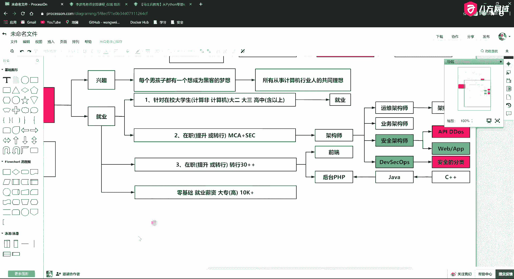
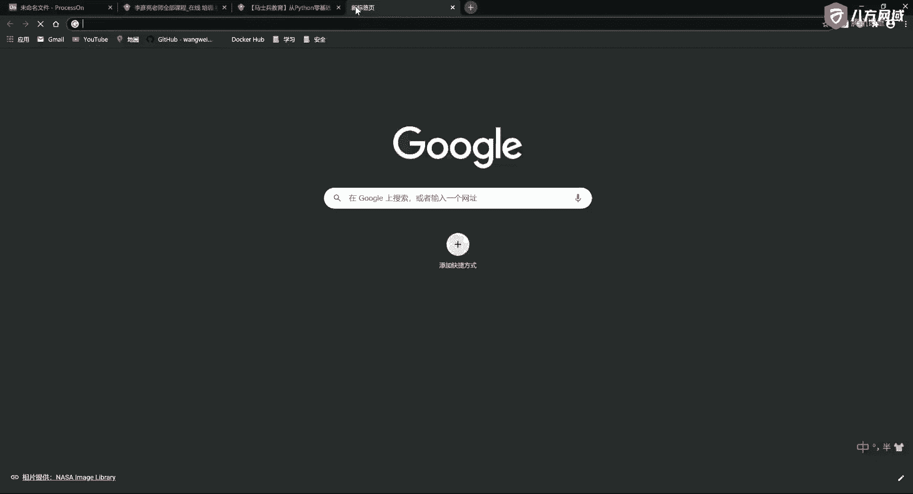
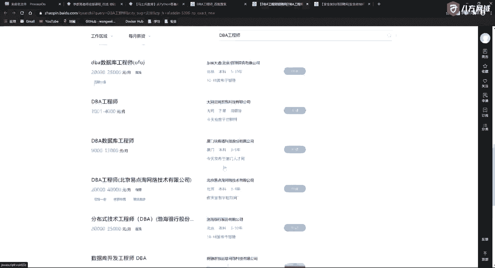

# 学不会我退出网安圈！中国红客技术正需要传人！全套666集还怕学不会？（网络安全／黑客技术） - P5：2.1-网络安全基础-安全工程师行业发展与就业趋势 - 一个小小小白帽 - BV1Sy4y1D7qv

那么这一讲呢刚才我们说了啊，我们讲行业发展和经济趋势啊，这是我们第一个今天第一个主题，也就是上半场的主题对吧，那如果你要不睡觉呢，你要不困难，我们可能这个超时啊，这压糖压一会儿，我们好多说一说啊。

第二个呢就是要介绍我们安全行业，大家将来在工作和生活中要面临的一个问题，就是我们在结局啊，结局，那么我们会遇到这种网站的攻击和防御的方式，我们先说这个再说这个好吧，这是我们今天的这个这个主题哈。

那么以后我们的上课方式呢，可能上来以后呢，我们会做一个前情提要啊，就跟大家看美剧一样，我首先呢可能会用十分钟左右的时间呢，把上一讲的内容呢给你串讲一下啊，就是帮重点给你串一下。

这样的话呢防止你好长时间不听课对吧，哎或者你你你你你你你中间隔了好多课，你不知道我在讲啥，所以说呢我会在上一讲，我会用十到15分钟的时间给你回顾一下，然后呢给你进行一个答疑啊，这是我们以后的课程安排。

然后中间呢我们就讲正课对吧，哎最后课程的结尾呢如果特别重要，我们给大家布置一些作业，好吧啊，那我们先说说这个课程的，发，这个，这个这个这个安全行业的发展和就业趋势啊，就是说你将来学完了，你能干啥是吧。

唉这一块儿首先呢第一波人呢刚才我们说了啊，就是为了兴趣而学啊，兴趣而学，那么这部分中我们也说了，说兴趣是你最好的老师啊，这有这样的一拨人是纯兴趣而来的，啊这东西呢你不能否定它，因为每个男孩子在内心中。

他都有一个想搞邪恶的一个想法，啊这个你不能否认，啊那有的人说，那那那女孩子就不能有有这个梦想的，一样可以有啊，所以这个这个梦想呢可能是所有从事计算机，所有从事计算机行业哈人的共同梦想，啊有啊。

男女不限啊，也有女黑客啊，男女不限，所以这一部分呢就是纯为兴趣而来的，昨天源码版黑屏，是不是你搞的，这个真心不是我搞的，昨天我在家呀哈源码，然后甩给安全感吧，这他们要想甩其实也能甩啊，都能甩给我们是吧。

咱们想让他们黑屏，想让谁黑就能黑啊，这都不是事儿，只要在我们网站里全网段扫描啊就可以了，咱不说这个了啊，不说一说，这东西比较沉重，是不是第二个呢，这波呢就是升职加薪的啊，也就是就业。

比如说呢这个这个课程呢它适合什么啊，什么样的人，我们说一说啊，你呢好找准自己的定位，第一波呢我们能适应什么呢，第一波呢就是针对于在校大学生，好在校大学生计算机和非计算机都行，没有专业的要求。

当然计算机的最好啊，对于这拨人啊，说比如说什么大二大三的，哎来学习要找工作的啊，这拨人，那你来看学我们这门课没问题啊，如果那你有的人说，那这个学历有啥要求啊，啊高中，含以上就都可以。

但是这个东西不像大数据啊，大数据你非得弄一个21985的，你不是21985的，你都不好意思跟人打招呼，而且还得是研究生以上学历啊才行，那有同学说，那我是本科，那你本科呢你肯定跟人家比起来呢。

你先天优势不足啊，中专哈，中中专是不是等同于高中学历啊，这个我也不知道啊，这个东西这咱也没念过呀，你们自己百度1下啊，总而言之，言而总之呢，学历不是阻碍你学习安全的这个门槛啊，就是我教过的学生啊。

学历最低的就是高二，就是高中都没念完啊，所以说他的学历应该就算初中啊，你高二就不念了是吧，上课呢老师问他，老老为啥老不写作业，他把老师给骂了啊，然后呢后来也不怎么着了，这个被学校开除了，开除了。

完了以后呢，家长觉得这个东西这个你不能危害社会啊，整天在家里玩王者荣耀，这也不好啊是吧，哎后来呢就辗转啊学了这个学科，一开始也老是觉得自己学不会啊，嗯没什么，后来我也是跟他们这么说，他经常问我老师。

我学完了能挣多少钱，我还是那句话，我说兴趣是你最好的老师啊，我教给你这些东西，你都要能学好，一般的12k以上没问题，这是纯安全领域啊，那如果呢你能把我们的这个课程给你的，这些大礼包，你都学完了啊。

你学历又挺好，又有一些工作经验，那升职加薪抱起白富美，那是坦坦的，没问题的，我们有很多的学生25k32 gk，15 六新的，这里都有很多，就光一个dba，然后云计算呢这里头也有不少高薪的。

所以说啊总结总结一句话吧，就你玩好了都牛逼啊，这是在校的几个在校的啊，第二个呢，这种人他需要解决的问题其实很简单啊，他就是为了找工作，对于这些人呢，你不要跟他说什么升职加薪，暴取白富美这事儿。

你你你你你甭跟他扯啊，跟他半毛钱关系没有对吧，那老话怎么讲呢对吧，那现代女性呢对对对对对对，这些男生啊，他其实是有要求的啊，你看这些现代女性她是怎么要求的呢，这个让这个20岁的男人滚蛋滚蛋啊。

你看你这刚毕业20郎当岁，这正好是一个屌丝男士，刚踏入社会的，这个这个这个这个这个这个这个起步阶段啊，你这时候你就让他有车有房，父母双亡，这做不到啊对吧，这肯定臣妾做不到，这你就不用说啊。

所以呢他们这些上海名媛呢还是怎么的，都喊着说让这些20岁的男人滚蛋滚蛋是吧，唉要把这个30岁的男人腰杆搞断啊，要把50岁的男人财产霸占啊，就他们这这都有口号吗啊，所以他们内部培训起来。

你看这些名媛内部培训里，他是把男人划分出各种党的啊，对不对，你看对吧，唉20岁的男人滚蛋滚蛋，30岁的男人腰杆搞断啊，40岁的男人搞得妻离子散，50岁的男人财产霸占啊，你说这说的还挺有道理的啊。

好第二个呢就是针对于这种在职的啊，就大家在职在职呢，您要么就提升，要么呢您就转行，啊提升或转行，那什么样的人做提升，什么样的人做转行啊，这里头呢我也说一句啊，我们就是m c a加上我们sec。

这两个在一起才是最好，那么sm ca里头的课程我帮你分析一下下啊，我帮你分析一下下，因为有的同学也搞不清楚啊，这听课可能他也不得方法，他也没听明白，对吧，好关于架构师这个事儿。

大家一直觉得这个事很很神奇啊，这个这个职业很神秘，有同学说他是干嘛的，这个架构师的层次我们就可以理解出好多好，第一个呢你比如说做运维的运维架构师，啊运维架构师，那么他们负责什么呢，他负责。

比如说你这个集群出来以后，他把这些机器这些资源给你搞清楚哈，所以运维架构师呢他要他要做一件事呢，就是他要把你的架构逻辑图画出来，啊架构逻辑图，他干这个事儿，也就是说你的机器资源是长啥样的啊。

比如说是负载均衡啊，对吧，哎还是其他的东西啊，所以说他是干这件事的，这就是运维架构师，那么运维开发不分家嘛，你光有运维也不行，还有一些是开发人员，开发人员，那么这个层次呢就是什么呢。

就是你的业务架构实业务，所以这个架构师你去分的话呢，它还可以去做这么多啊，那么它的业务层次呢，那就是你的业务架构，每一层是该干啥的啊，什么业务中台什么的，在这写一堆，他是干这个的，还可以有什么呢。

还可以有，诶啊，就是比如说我们这个还可以有安全架构师哈，所以这个呢大家呢并不用这个，这个这个这个害怕啊，担心有的说我报了m c a了，我是前渣的吗，来学你，这不是，实际上你在这个基础上你又会了这个东西。

你可以走安全架构师这个这个路数啊，这个方向对吧，哎你要是这些东西都会了哇，那你牛逼大了，那你就是全栈架构了啊，就是这个东西，首先你得从开发里头作为一个全站对吧，唉然后你再会有这些东西，我举个例子啊。

他说这个东西跟我们开发一点毛关系没有，那你是错了，那只能说明你在开发这个过程中，你肯定不是一个站得非常高的一个角度，那么你举个例子，你这个业务架构师他费劲巴拉的对，把你这个什么百万级。

千万级高并发的这个网站刚弄好对吧，比如说现在问题就来了，你的接口啊，举个例子啊，你就是个电商对吧，好，你这个网站如果被攻击了，你这个api ddos，你是怎么设计的，对吧，唉你遇到这个问题，你怎么解。

决，完犊子了，是不是好好，那这是说你api的问题，那第二个问题，有的说这这这这有点大对吧啊，ok那就是你的web网站对不对，或者还有你的app，那现在我们做开发，往往不是单门的去做一个端啊。

你pc端你要有，那么你移动端你也要有，对不对，所以那如果你这个东西，比如说我们双11的那个淘宝，那么你单位时间内访问你网站的次数，非常多的时候啊，你这q ps非常高的时候，对不对。

是不是也就相当于地道的和洪水攻击啊，那这个东西你是如何去解决的啊，我还要把正常的业务过滤出来，我还要把一些友商，一些捣乱的人这些攻击啊，我还要排除掉对吧，还能保证我的业务正常运行运转。

这个东西就是这部分人要去做的人，好那么通常你还在懂一点点测试，对不对，所以这些东西呢，那你如果都把它画下来，实际上这些东西不就是前面运维加业务，我们说运维开发不分家嘛，对不对。

那么再往后这不就是dio吗，对吧，你再来个测试，这不就是dewolves吗，就这个这个运维开发一体化的这个概念吗，你再加上这个东西，它不就是，我们所说的，哎他不就是这个吗，对吧好，那么这个架构师呢。

这个是我们在我们这个这个mca架构师里头，学习的一些东西啊，那么到现在为止呢，就是我们一直在divers里头，再加上我们同学今天问的这个问题，实际上这个东西的范围就可以变得很宽泛了，啊。

这里头就涉及到了我们安全的分类，对吧哎我一会儿呢给大家说说这个安全的分类，咱们在这先打个伏笔，抛个引子哈，回头呢咱们要介绍这个东西，是不是哎这个就是第二个啊，第二类大家有需要的啊。

说第一个针对于在校大学生的对吧，第二个针对于在职的人员啊，在职人员刚才说了，一个是他走架构师路线或者走开发路线的啊，做这种这种有有提升的这种要求，这种需求，那么还有一部分人呢他是什么样呢，他是这样的啊。

我也给您介绍一下哈，好还有一部分人呢，比如说您是从事这个前端呀，或者到后台开发工作的，那么第三个呢他也是在职啊，他不想提升的，他想转行的，哎比如说呢这样的人也有啊，比如说那您学完这个课程。

比如说您是做前端的，啊您是做前端的啊，前端的这个框架来回来去变呀，也比较苦逼是吧，哎那我我想从前端转到安全，可不可以，可以没问题啊，那么还有一些呢是做后台开发的啊，就早期的这个c r u d啊。

你要说想往架构深圳去发展吧，走大数据路线吧，觉得自己学历也不行，能力也差点意思的这种啊，那没关系，您别自暴自弃，您不用上这门或者抽自己大嘴巴子，没关系啊，也别着急，上火的一天到晚的，是不是啊。

哎那有这个课程以后，您可以到这个课程里头来啊，做后台开发的，比如说呢他是做p2 p的，那以前呢我们在开发语言里头也有鄙视链啊，也有鄙视链，对不对啊，那你看他们有一个鄙视链，大概是这样的。

我简单跟你说是吧啊，对吧，这是做java的，做c加加，哎c加加的，比如做java的，java的，比如做p2 p啊，p2 p觉得p2 p是世界上最好的语言对吧，哎他是这么一个路数，就是你通过后台的这个。

你如果你觉得你c r u d没啥意思了啊，然后向上走空间也很小了啊，你现在已经遇到了一个中年危机了，说30多岁了，我现在这个这个这个马上就被腰杆搞断了啊，这个这个这个年龄段了怎么办啊。

那么一般在30~30，30~32或者33吧，或者说你最少你不是一个组长的话，这时候你的职业生涯可能就很难受了，那么如果你作为传统的开发人员，你在这个年龄段啊，到后边就不好说了啊，真心不好说。

那么怎么办呢，对吧唉有些人就要转行，就要转管理了，好，所以呢这个东西呢，它面临了一个程序员都要面临的，一个年龄的这么一个危机，对不对，所以这个东西呢如果说，30加啊，我们不能说30+30加。

万一有的时节的31 二呢，30加加是吧，哎你到这个岁数了，那么如果你也转不了管理啊，唯一在这个i t行业对于年龄比较吃香的，那就是安全方向，那么安全方向呢这个东西呢咱们怎么去说呢。

就是他跟你老老老中医一样啊，跟你这个老中医一样，就是你的工作年限啊，你的项目经验越丰富，你越值钱，所以不会出现到35岁直接干掉你这种情况，不会的啊，不会的，我今天呢这个面试的时候。

这个我们公司啊我发了一个这个面试，这个这个这个岗位啊，我跟你说，现在真的发现这个疫情啊，有些人真的很难，今天收了很多30多岁还有40岁大哥啊，做运维还要做测试的这些简历啊，我一看。

那简历里头真的连linux的l l大写都不知道啊，所以呢我觉得这些人呢，他肯定也面临着转行之痛啊，他要学安全，那百分之百能找到工作了，真的啊，但是他学这个测试，这个这个这个今天看这几个岁数都偏大啊。

然后一聊啊，你说玻璃球子，他说城门楼子，你说城门楼子，他说胯骨轴子，你说胯骨轴子，他说红布球子啊，那反正就是你跟他一聊肯定是不行啊，唉呀所以这块儿的压力也比较大啊，这是这样的这样的几个行业啊。

那么这个就业呢他大概是什么样的一个情况啊，咱们实话实说啊，我也不蒙你，我也不骗你，不吹不黑啊，那么只要你是大专以上学历，零基础好就业薪资，那我们不能说您工作好几年了，我给您说个四五十万的。

五六十万的是吧，说那玩意儿到时候就容易产生误导啊，咱们就说零基础啊，就业薪资大专以上对吧，还有高中的，当然也有高中的啊，反正你学我们的课就安全而讲，你拿个12k以上是没问题的啊，咱保守点说吧对吧。

10k加，这是对于零基础的啊，那有的时候我我觉得这个对这个东西不大了解。

不大了解没关系啊。

有一个世界上有个东西叫百度嘛对吧，唉唉唉唉对对对，唉唉唉，这个自打手被狗咬了以后，不是很灵活，不敢使劲啊，这所以老是容易会引起一些，这个这个这个这个操作啊，那么我们可以看一看啊，咱们也不吹也不黑。

你看这个百度上告诉你，这个安全架构师，能够大概的薪资范围是是怎么样的，那么刚才说的这一块云安全架构师，就是一会儿我要在细分这块给大家介绍，咱们先找一个你熟的，就字节跳动吧，你看本科工作经验不限。

4万~71000个月，啊是吧，4万~71000个月，这是真事儿，对不对，这个是字节吗，大家都是信誓旦旦的说的这个大厂吗，这就是所谓的大厂，啊中信银行是吧，哎应用安全架构师的哈，齐黑翼什么玩意儿。

这360啊，字节好，自己3~6对吧，金山啊大概是怎么样的，小米iot的lt其中也是一块对吧，电科云的，京东数科的，你看那么我们通呃这个这个这个这个腾讯的啊，你看是吧，华东云计算的啊，这也给的这么少。

没人去啊，什么免疫什么用，有的你看3~5万啊，拉钩的拉钩网的对吧，哎这我就不一个个的去给大家去找了哈，简单的就跟大家去说一说，你看就这些个是不是这些个啊，所以也就告诉大家是什么呢，这个2+2=4。

1+3也等于四，你如果非常想去字节，然后呢，你这个算法又不咋地啊，你干不过人家是不是啊，那你就别跟他们丫死磕对吧，他们都是211985，什么是这个这个这个这个这个专本硕博连读，三清博士都是这玩意儿。

你跟他死磕干啥，你就是去了，你干得过他们吗，你熬得过他们，是不是他当头了，你还是小弟，对不对，鸭都死了，你还是小弟，那就不行了，所以说呢你换一条赛道啊，没准呢，柳暗花明就又一村了啊，一村一村又一村了。

那你换一个赛道，这个赛道里头没有多少人会，以前国家没立法之前不让你讲啊，老师360会搬到天津吗，行业内有消息吗，我问一下啊，问一下啊，然后呢这东西你不就可以对吧，曲线救国，弯道超车嘛。

所以这也有很多的机会，你看这些东西也算是不错的企业，广州的重庆的对吧啊，这每日优先的，你看每日优先，这企业也都还行啊对吧，所以你先你做一个后端开发工程师，他也就前面这个数啊，25左右啊，混的好一点。

陆陆续续多一点，你看这是安全架构师的啊，这一个，然后我再给你搜一个，我再给你搜一个，对吧哎这也3~5年，你看也这也还可以，对不对啊，你要嫌少，你就找个高一点的，这也都两三万一个月好看，3~4万。

对不对啊。

