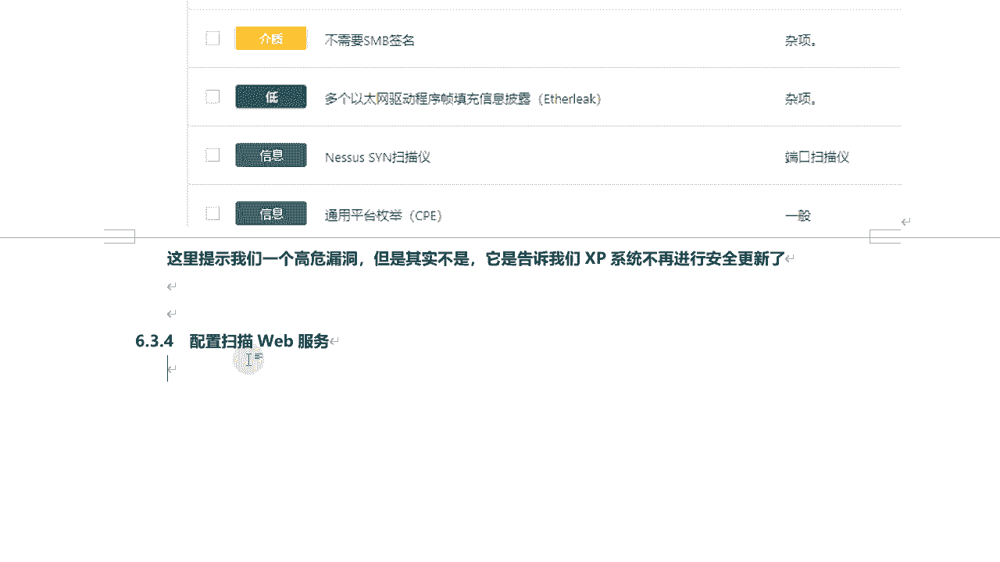
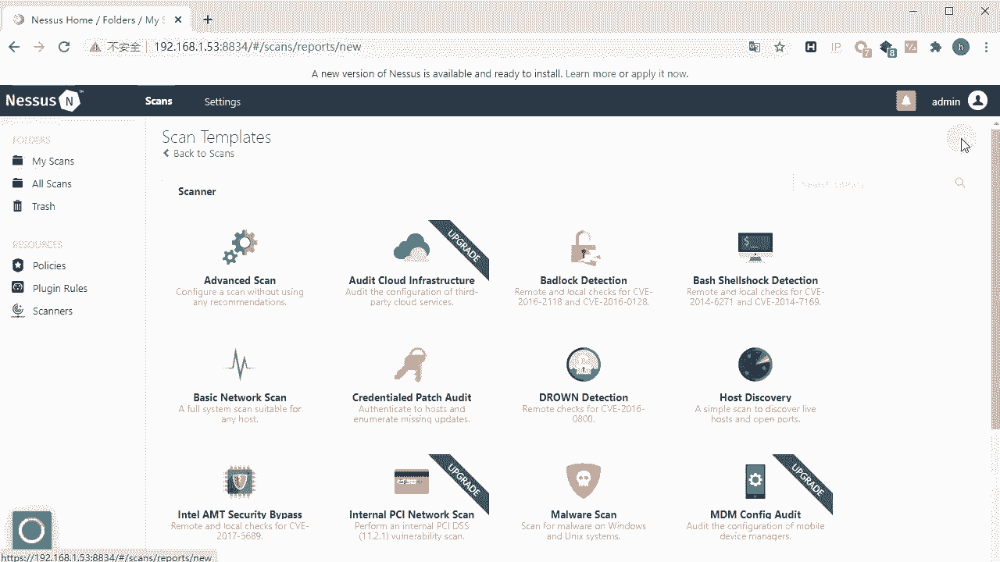
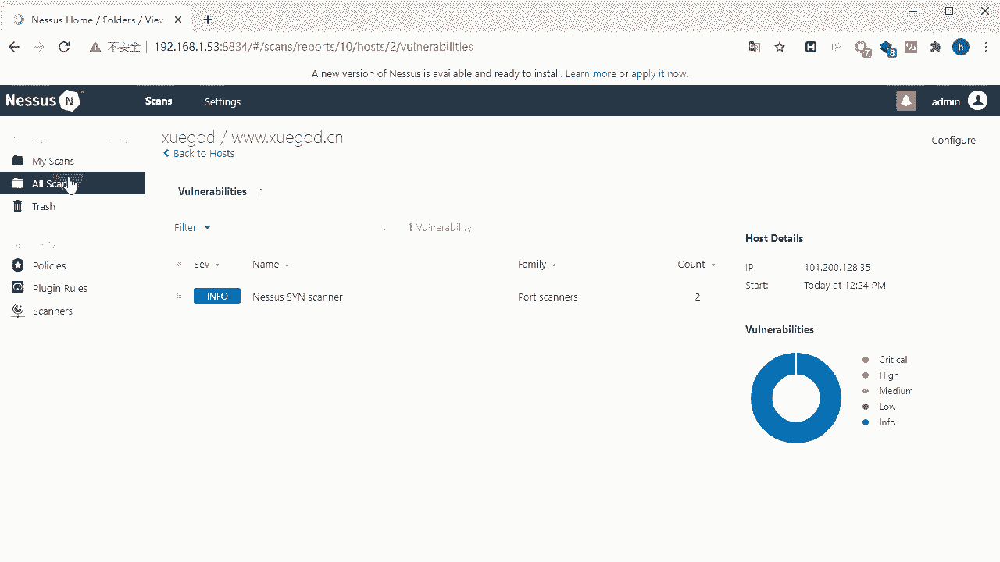

# 学不会我退出网安圈！中国红客技术正需要传人！全套666集还怕学不会？（网络安全／黑客技术） - P60：10.7-【漏洞扫描工具系列】配置扫描Web服务 - 一个小小小白帽 - BV1Sy4y1D7qv

好下面呢我们来讲一下使用nasa啊，配置扫描外部服务啊，那么由于扫描网站啊。

我们来看新建一个扫描任务new scar。

然后呢，这个扫描模板呢我们选择最后一个web application test啊。

点击它，然后这里呢我们来给扫描我起个名称，学尬的啊，然后设置一下什么目标，3w学干了点cn，然后第二个是计划任务扫描，然后这个扫描结果发生的某一箱，这里我们就不设置了，然后接着换下主机发现。

那么这里默认呢是常规端口扫描啊，那一般啊我们都会选择全端口扫描，1~65535啊就可以了，然后呢接下来看这一项设置，这一项是默认呢是快速的扫描所有的外部漏洞，然后第一个扫描已知的外部漏洞。

然后呢第三个呢也是扫描所有的外部漏洞，和第二个的方式不一样啊，那么你选择哪个呢都可以啊，那么你可以在实际的情况，你可以去针对同一个站点啊，可以设置不同的选项，你看看最终什么结果有什么差别。

那么这里可以选择自定义，选择自定义的话，这里头我们看这个普通啊通用设置，这里头主要是针对什么的精确性来进行设置的，第一个呢是覆盖常规的一些正常进度啊，那么如果选中他呢，这里有个选两个选项。

一个是第一个是避免潜在的错误警报，就说避免误报对吧，那么可能存在误报的，他就不会在报告中体现出来啊，也不会在什么结果中体现出来，第二个选项呢它是显示潜在的误报啊，那么也就是即使它可能是误报。

它也会显示出来，这里呢咱不选，最后呢这一项呢是执行彻底的测试啊，那么这种测试方式呢可能会破坏啊，目标网络或影响的整个的扫描的速度啊，那么这是这个设置，然后看web applications。

那么这里呢注意，那么第一项这个是用户代理啊，那么也就是说这里的所显示的信息啊，呃主要是一个特殊的字符串啊，用来标识客户端，那操作系统的操作系统以及版本，还有cpu的类型啊。

浏览器啊以及版本还有浏览器的渲染引擎啊，浏览器的语言还有插件等等啊，那么这个一般来讲这就是目标服务器，如果有防火墙防御机制的话，它通过这里去分析你的来源，对是否是通过呃一些扫描工具啊去探测。

然后对你进行一些屏蔽或者封锁，那么这里呢就可以去修改啊，对可以去修改，任意去修改，那么可以伪造是吧对，那么避免呢就是呃被目标防火墙探测出来啊，你是通过某个工具nas或者amap对吧。

这个扫描工具去访问目标网络的，然后呢这个是网络爬虫，这个爬虫呢又称为网络蜘蛛啊，那么比如像百度啊去爬虫的网站呢，他们通过什么蜘蛛去爬取的，它可以去自动抓取网站的信息或者是脚本啊，那么通过这个网络爬虫呢。

nasa可以获取到网页中的各种数据啊，那么第一个选项是指定爬行的第一个页面，从哪个页面开始进行爬行，第二个呢是指定在爬行的过程，那么指定不扫描的一面，就是不爬取的一面，那么比如说有些页面你去爬取到。

可可能会影响整个后面的一个扫描啊，比如说存在一个用户登录啊，退出对吧，那么这个功能如果去扫描到，可能会退出登录，那后面就扫描不了了啊，然后这一项呢是指定爬行的最大页数，那默认呢是1000页啊。

那么一个网站可能存在很多网页对吧，那么你可以指定啊爬取多少个一面，然后这是爬行的深度，爬行的深度，那么也就是这个一个网页，打开首页之后往里点对吧，通过首页点进去进入下一页，这是一个层级。

那再重再网点两个层级，再往点三个层级，那么这里设定最大的深度就是层级的意思啊，默认是六，当然如果你想爬取所有的，你可以把它设置大一点也是可以的啊，然后呢这个是跟随动态生成页面，那干脆动态生成一面。

那么也就是那个网站它也可能是动态页面，那么比同一个页面，那么你通过不同的链接，不同的参数传递过来，它最终的爬取的信息是不一样的，那么它可以跟随这个动态参数生成页码，去了去爬取啊。

然后呢这是关于一些测试方法好吧，是否启用是吧，那么如果启用了，下面有这些选项啊，那么首先来看第一个啊，那么第一个是关于啊，web application测试的htp登录失败啊，那么什么意思呢。

如果hp登录失败了，终止外部应用程序测试，那么也就是说有些站点啊，那么你需要登录之后，你才能进行后续的扫描好吧，那么如果登录失败呢，后面的什么中指啊，然后第二个选这个选项呢，是尝试所有的htp方法啊。

那么nas默认只使用get方法进行扫描，当然还有post方法，那么如果你想使用所有的，可以把它选中这里啊，然后呢这个选项呢是尝试htp参数污染，参数污染的也就是在通过get方式传参的时候。

那么可能存在什么同名的对参数名称一样的啊，这种方式属于参数污染，然后这个选项呢是测试嵌入式的外部服务器啊，这么再往下看呢，这个是测试好吧，是测试每个form表单对吧。

那form表单每一就是每个form表单，一次测试多个参数，那么这个form表单，那么就是一个网站可能存在有提交留言啊，或者发布文章啊，发布信息啊，提交相关的信息啊，这种表单，那么这里有四个选项。

第一个选项呢是呃测试随机成对的参数，那么随机呢是通过nasa本身有一定机制啊，它会给你去随机生成器的参数，然后进行提交，然后呢这是测试所有成对的参数，那么启用这种方式之后呢，它的测试速度会变慢。

因为呢他测试的呃所有程度的参数比较多嘛，所以速度会变慢，但是效率会提高啊，那么测试的结果呢会更精准一些好吧，然后呢这个这个选项呢是测试随机组合的，三个或多个参数，使用这种方式呢测试会更慢。

但是呢测试会更彻底一些啊，那么你尝试各种测试，可能情况对吧，各种可能的情况，可能的参数对吧，你测试的越多，那么当然测试精度更准确啊，然后最后一个啊，最后一个呢是测试参数的所有组合，那么这种测试方法呢。

会将攻击字符串与有效的输入变量的，所有可能组合都进行测试好吧，当然那么在实际测试过程中呢，你可以去根据不同的选项对吧，然后对比结果哪种方式更好一些啊，然后呢这个我们来看。

这个是找到每个web页的第一个漏洞之后，继续进行扫描，那么如果你不选中对啊，那么找到这个页面，如果找到一个漏洞了，后续就不进行扫描了，如果你选中了呢对吧，找到一个漏洞之后还会继续进行扫描。

那么也就一个外部页面啊，有的时候可能不可能对吧，可能会存在多个漏洞对吧，那么你要想把它所有漏洞都扫出来呢，最好把它选中啊，那么这里有三个选项啊，这找到任意外部服务器，一个漏洞后则停止扫描啊。

这个呢第二个呢是每个参数发现一个漏洞后，则停止扫描啊，然后呢最后一个是查找所有漏洞，无论是否找到漏洞，都要继续进行全面扫描，哪个更好一些啊，当然最后一个更好一些好吧。

然后我们再往下看这个ui l for remote file对吧，这个选项呢是指定远程文件包含的url，那么也就是说，如果目标机存在远程文件包含漏洞，那么你可以指定，那么这个远程文件包含的ur。

那么肯定是黑客指定的，包含某个指定的文件，这里可能可能是一个一句话木马呀，或者是对吧，写入在目标机写入文件啊等等，写入木马等等相关的一些程序文件啊，然后最后一项就是设置实施外部应用程序，测试的总时间。

单位呢是分钟，默认是五分钟啊，那么也就是说如果你整个测试时间超过五分钟，还没有完事儿，它自动停止了好那么这是关于这个外部应用啊，测试相关的一些参数设置，然后这块还有一个可以单手，那么凭证。

那么为了这个http，那么这个就是什么意思呢，有的啊，外务应用，那么需要设置什么呃，登录啊，你只有登录之后呢才能进行商用，比如说d v w把机，你知道登录之后才能进行的rtr的页面，所有的漏洞进行扫描。

不登录你扫描不了，那么这里可以去进行一些设置啊，那前提呢你得知道对吧，目标站点的他这个账号和密码默认啊，注意默认这里它的登录方式通过是通过表单啊，这种方式去登录的好吧。

那么有表单tp login form啊，输入账号和密码，那么这种方式也是最常用的一种方式啊，那么用户名是什么，密码是什么，那登录页面是什么对吧，然后登录提交页面，提交到哪个页面啊，那它相关的一些参数啊。

然后呢你提交之后对对这个数据对吧，进行处理的好吧，然后呢你登录成功之后，它匹配的是什么参数，就是什么，登录成功之后，他通过什么去标识这个页面，有什么唯一的标识，能够证明你登录验证成功了对吧。

这里呢可以去设置一下了，还有登录的方法，那一般来讲登录的默认都是post的方法好吧，那么当然那肯定还有其他一些相关的一些方法，包括这一项这项是指定认证尝试与实际延迟，那这样可以有效的避免啊。

触发强制的一些锁定机制啊，那比如目标记它呢有就是你增登录失败了是吧，他有登录失败几次了对吧，他自动给你封，给你封了，封ap的，通过这种方式可以有效去避免对吧，触发这种强制的锁定机制啊。

然后呢这个这选项呢什么意思，这个如果从一个外部服务器上接收到了30x，这种重定向代码，nasa将会跟随这种外部服务器的链接啊，那么有的时候有重定向吗，重新按的什么意思，就是你登录成功之后。

它会跳转到某个页面或者失败了，它会跳转到某个页面对吧，登录页面它会跟随这个链接，然后进行测试啊，然后这个选项呢，然后如果选中了，它是反向进行正则表达式匹配啊，然后这个呢是呃对于一个给定的正则表达式。

nas会搜索htp响应的头header部分啊，而不是搜索响应内容来确定认证状态啊，那么像有的有的啊，那么呃登录验证，那它只返回是吧，嗯header部分没有body内容部分啊，那么这里呢如果你选中的话。

它是吧，它是根据这个呃搜索header header id小镜头对，根据它呢来进行判断，你这个验证是否成功了，登录呢是否成功了，确定你这个认证状态啊，然后最后一个是忽略大小写匹配啊。

默认情况下正则表达式搜索啊，对大小写是敏感的啊，那么你选中了可以忽略啊，大小写好吧，那么这是关于一个外部任务的一个相关设置，每个参数的含义，那么这里呢我们就都默认好吧，然后呢直接就确定点击save啊。

然后这里选择啊，因为这里我们选择它没有设置是吧，我把它去掉啊，这里嗯学神不需要设置认证登录，我们回过来点击save保存，然后呢点击扫描唉，然后呢就开始扫描了，然后呢我们稍等一会儿再出扫描结果了啊。

然后呢这里呢笔记呢给大家整理一下了，呃学生的网站呢，那么它是不存在漏洞的啊。

那么大家回头可以去扫一下的，好不好，我们来看看结果结束没有啊。

正在扫描是吧，那现在除了两个都info啊，那像这种一般来讲都是不是漏洞啊，不是漏洞嗯，也不会对这个某站造成威胁，嗯我看他扫描出两个端口是开放的对吧，二幺端口和八零端口是open open状态。

这是正常的啊，没有问题的啊，然后看到他身上还是正在扫描，我们回过来，好咱们结果啊，正在运行，好那么整个这个扫描方法啊，设置方法还有各各个参数呃，什么含义啊，已经给大家讲了啊。

那这里呢就不等着它扫描结束了好吧。

那么学生网站呢它也不不存在漏洞啊，呃最后呢我们来做个总结啊啊，然后呢这节课呢主要给大家讲了关于啊。

n map的一些高级的使用技巧，然后呢，接下来使用dnmap分布式集群，执行大量的扫描任务，最后呢我们来讲一下漏洞扫描工具，nas的安装配置，还有对windows主机和外部应用程序网站的一些嗯。

扫描好吧。

