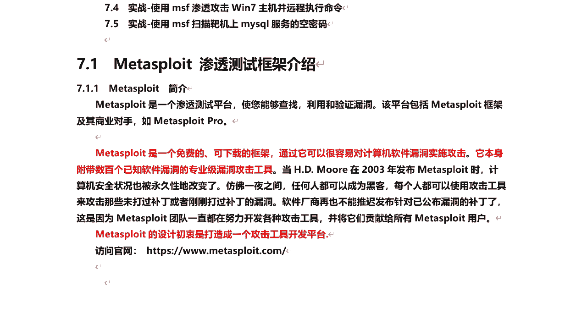
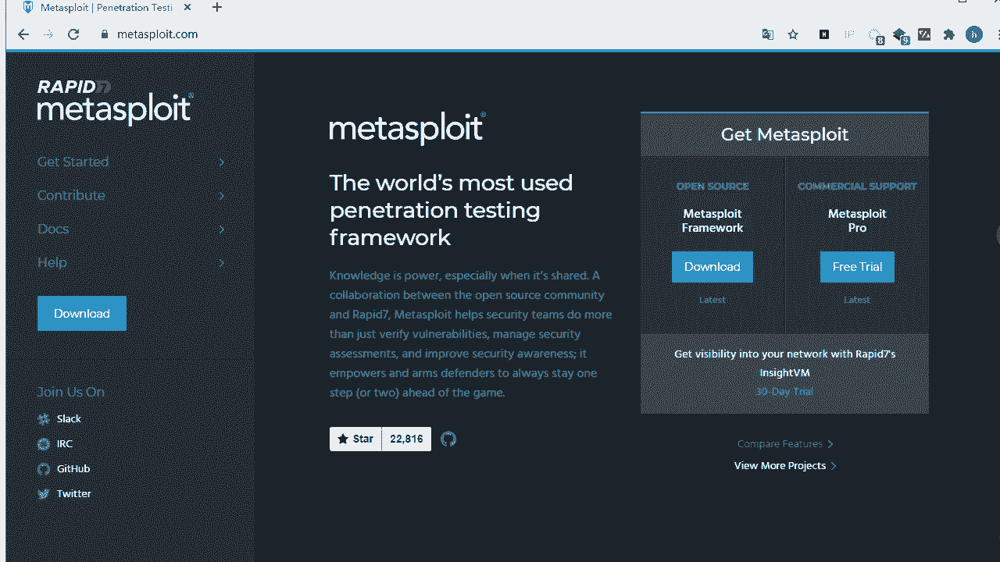
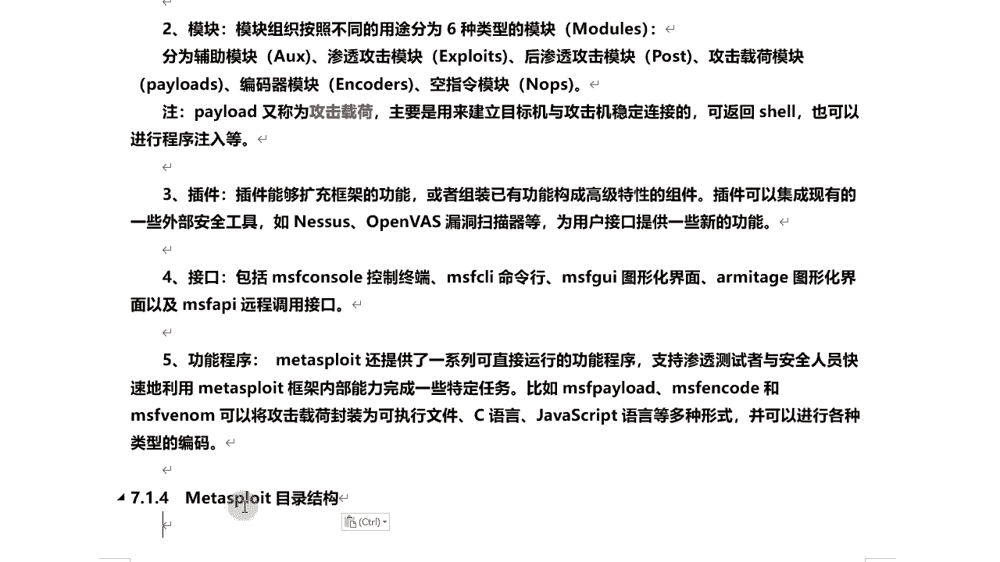
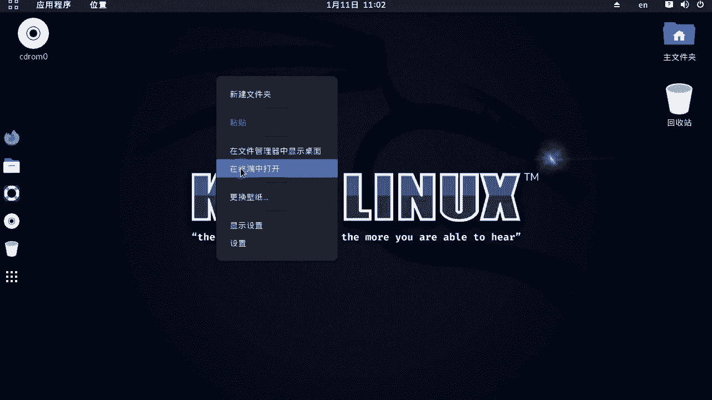
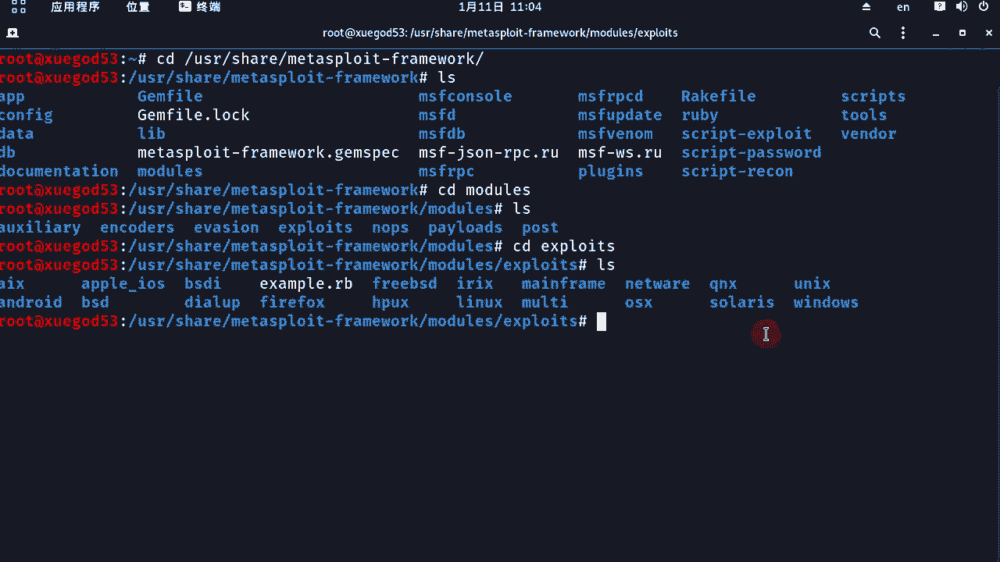
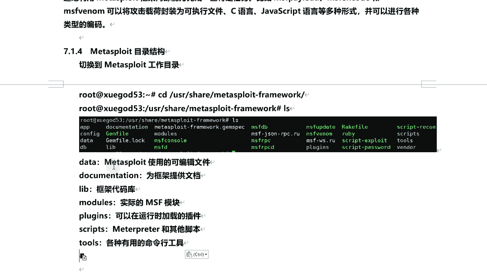

# 学不会我退出网安圈！中国红客技术正需要传人！全套666集还怕学不会？（网络安全／黑客技术） - P61：11.1-【Metasploit渗透】Metasploit 渗透测试框架介绍 - 一个小小小白帽 - BV1Sy4y1D7qv

大家好，我是讲师root，那么今天给大家分享一下第七章啊，mate supply的渗透测试框架的基本使用啊，首先呢我们来了解一下mate这个渗透测试框架。

然后接下来呢我们来搭建的靶机mate lable 2 linux啊，然后呢我们来介绍一下mei ly基本的使用方法，接下来呢实战使用msf渗透攻击win 7主机，并远程执行命令，最后呢我们来一个实战。

使用msf扫描把机箱mysql服务的空密码好，那么我们经过前面几章的学习啊，那么已经了解了一些信息收集的方式啊，从今天开始我们来开始实战好吧，那么今天呢学的框架是mate suppli。

matt slide，它是一个渗透测试平台啊，使你能够查找利用和验证漏洞，那么这个平台呢包括两个版本啊，一个是商业版，还有它的一个社区版，开机自带的是社区版免费的啊。

那么商业版的是mate supply的pro啊，专业版收费的，那一般企业用的都是收费版本的，因为收费版本的功能比较强大一些对，那么我们开立的自带呢是免费的啊。

那matters lider是一个免费的可下载的框架，那么通过它可以很容易对计算机软件漏洞，实施攻击，那么它本身呢是附带数百个已知软件漏洞的，专业级漏洞攻击工具啊，那么这个框架是由hd摩尔。

在2003年发布的啊，那么一开始那是一开始使用的是p元去开发的，然后呢后来用那个ruby语言重构了，那现在呢这个框架呢自由rabbit 7啊来维护啊，因为hd摩尔呢现在是加入了rabbit 7的公司。

现在有专门的一个团队去维护这个框架啊，那么每个人呢都可以使用这个攻击工具来攻击，那些未达过补丁，对未打过补丁或者刚刚打过补丁的漏洞啊，那么这样的软件厂商再也不能推迟发布，针对已公布漏洞的补丁呢。

因为这个团队一直在努力开发各种攻击工具，并将它们贡献给所有mate用户，因为是这样啊，那么每出来一个新的漏洞，那么这个团队呢，就会针对这个漏洞去研发一些攻击工具啊，模块，然后集成到这个框架里面。

然后呢更新出来，那所以说呢这个仿佛一夜之间，任何人都可以成为黑客，那么也就是使用这个工具，对很容易地对一些漏洞进行攻击和利用啊，那么matter slide这个框架它的设计初衷啊。

是要打造一个攻击工具开发平台，那么它本身是开源的，那么也就是说如果你有一定的卢比原基础，那么在这个基础上你可以进行什么二次开发啊，下面呢我们来看一下它的官网啊，它的官网呢是3w点，mad split。

com。

那么我们来打开这个网站啊，看一眼就是这个站点啊，那么都是英文的啊，那么也就是说这个呢它整个啊，呃这个matters li它也提供了windows下的版本，在windows下也可以自己安装，也可以使用啊。

那么在这里可以去下载它的手机版和商业版，那么当然这个商业版是收费的啊，然后呢我们点击一下这个compare fast，我们看看它整体的一个版本啊。

相关有什么区别，呃这个商业版pro啊，那么它可以免费试用14天啊，你就当咱们对这个框架学的差不多了，那么你想体验一下专业版本的它的功能啊，那么可以免费试用啊，两个礼拜。

然后下面我们看这里头关于他这个两个版本啊，一个收费版免费版的功能对比好啊，我们把它翻译过来啊，来翻译成中文，好那么专业版呢这是打对勾的，它具有被具备这些功能，唉啊然后呢免费版相对功能少一些啊。

那比如说像这些网导入网络数据扫描啊，网络发现呢对吧，这些基本开发啊，用于离散任务，通过远程a api集成这些专业版有的功能，但是免费版没有的啊，就开启自带的啊，社区版是没有的，然后呢还有一些自动化功能。

这些社区版不带的没有的，就是简单的网页界面，那么也就是说专业版它可以通过网页啊，镜面去管理，还有聪明的利用自动凭证暴力破解对吧，暴力破解，还有基准渗透测试报告，然后他可以去做渗透测试报告，还有标准的嗯。

标准基准的审核向导，还有自动自定义工作流程的任务链等等啊，再往下看，还有这个浸润嗯，这个呢主要是来自专业版，有这些功能啊，这小号这次呃设计版有这些功能啊，看这里动态有效载荷，可逃避领先的防病毒解决方案。

这是免杀功能啊，那matters supply专业版的免杀功能是很强大的啊，对那么它设计版自带的也已经免杀功能，比如后面咱们讲的啊，呃客户端渗透生成的木马后门，那么经过编码器呢，它也有一定的免杀。

但是他的免杀能力呢没有专业版去强强啊，这个呢到后期大家可以去下载一下这个专业版，免费试用，体验一下它的免杀功能，另外专业版还提供了ovp，top 10大漏洞的外部应用程序测试好吧。

针对web的一些测试啊，对top 10漏洞也是可以的，还有选择高级命令堂和外部镜面，这个可以的，也是专业版，功能还是很强大的啊，那么像这个数据版可以免费下载，这个呢可以试用14天。

那么这是关于两个版本的一个对比啊，我们这块呢需要了解一下的啊，然后呢我把这个来整理到这里啊，真的对，那么我们常用的版本是framework这个版本的开源的，那么拥有的功能呢。

足够满足我们现在的开发和学习啊，商业版的可以免费体验14天，那么同学们学习的差不多了以后呢，再去体验商业版本，主要是体验商业版本的一个报告功能很强大，还有外部界面管理，那么开立自带的那都是啥。

它都是命令行的好吧，那当然它有对应的一个图形化，到后面咱们会讲到下面呢，我们来了解一下他这个框架的一个啊结构啊，通过一张图呢，我们来理解mate split渗透知识框架的一个结构，好，那么我们来看这里。

首先呢这是基础库文件啊，r ex啊，还有framework call framework worker base，那么这几个都是什么意思呢，我们下面来逐个给大家讲解一下，首先来看啊这个r e x啊。

而是整个框架所依赖的最基础的一些组件，那比如说包装的网络特别字啊，网络应用协议，客户端与服务端实验，还有日字子系统渗透攻击支持历程等等，那么比如说postgresql以及mysql数据库支持等等。

但在ie s它是相当于最底底层的啊，framework可靠，那么这个库呢负责实现所有与各类各种类型的，上层模块及插件的交互一些接口啊，那么上层模块呢主要是r e x好吧。

framework base这么对库扩展了framework call啊，提供更加简单的一些包装历程，那主要用于支持用户接口与功能程序，调用框架本身功能及框架集成一些模块，那么也就是说啊。

那么free work base它是主要对外提供一些ai接口，供用户去调用的啊，好接下来我们来看，那么这个基于他framework base，那么有六大模块啊，那么这个六大模块呢。

也需要我们去了解和掌握的，也是我们经常会使用到的啊，其中几个是我们经常会用到的，比如第一个exploit，这个呢是渗透攻击模块，也叫漏洞利用模块a u x那么称为辅助模块。

那么第一个主要是进行漏洞利用的啊，那么a ox的辅助模块，主要进行信息收集和扫描的啊，post后渗透攻击模块，那么也就是说经过exploit漏洞，利用模块拿到目标机的权限之后。

我们利用post后摄像头工具模块，进行接下来的一些渗透，还有plose对，那么配load就称为攻击载荷，主要是用来建立目标机与攻击机之间，稳定连接的，它可以返回一个连接sl啊，那么更确切的说。

这个payload是在对吧，expolite模块对目标机漏洞利用成功之后，在目标机真正执行的代码，pyload对真正在目标及执行代码，那么也就是后门，它相当于后门或者是木马啊。

然后encoder编码器模块，那编码器模块呢主要是针对payload进行编码的，起到一定免杀的作用啊，no p空指令模块，空指令模块呢它也是为payload服务的。

主要是提高这个payload什么稳定性啊，那么这是六大模块，那么除了这六大模块之外呢，那么还提供了一些插件对，那么也就是说有一些插件，那么可以就是这个插件主要是针对一些呃，比如说nas open vs。

然后通过matt split，那么它有些命令可以对这些它进行操作啊，比如说创建一些扫描任务啊，扫描报告啊等等啊，开启和停止扫描啊任务，那么就是它通过一些外部的一些安全工具，通过插件的形式集成到了。

matters blight的这个渗透测试，渗透测试框架里面啊，那么主要原因啊，利用这个插件它集成进来了，扫描完，那么直接呢针对这些扫描结果，我们可以利用mad split进行为漏洞验证啊。

除了这些之外呢，还提供了一些扩展的脚本，那么也就是说呃，除了matter本身自带的一些模块之外，那么我们还可以从外部去集成一些脚本进来，对吧，激情的mate spli里面，然后呢利用mate对吧。

去执行的脚本对目标进行渗透攻击，那比如有的漏洞对吧，那么这个matt pot没有对应的模块，来对它进行渗透，那么我们可以来集成一些对吧，比如扩展脚本集成进来来进行利用啊，另外呢它还提供了一些对外的对吧。

去访问这个框架的一些接口，比如说通过命令行mym sf conso，这个也是我们经常会用到的一个命令，通过它呢去访问matt split进入这个框架，然后呢接着去使用。

那接下来几个这个是相当于就是图形化的啊，有几个命令现在已经不常用了，已经废弃掉了，另外呢还提供了有一些功能程序，比如说msf venom，这个呢功能命令呢主要是用来生成什么，在进行客户端渗透的时候。

生成后门木马程序的啊，然后这个payload和encode都是为这个对吧，为这个木马服务的好吧，那payload是攻击载荷，真正要在目标机需要执行的代码对吧，那么encode编码器对它进行了进行编码。

起到一定免杀作用，那么这个venom相当于他俩的一个结合体，这个在后面咱们都会讲到啊，然后呢这是关于它整个的一个框架的结构，然后呢我们把这个笔记给大家整理到这里，好那就是关于它的一些基础啊。

每个功能模块好吧，这个结构的作用啊，比如说ie x femcall frameworker base，还有六大模块啊，payload攻击载荷插件接口功能程序啊，那么这块让大家了解一下就可以了，好。

那么接下来呢我们来了解一下mate light，这个目录结构啊，那么这个框架在哪里呢。

好我们来到kelly打开终端。

最高调的u s20 mate lo对might preframework，那么简称是msf，好不好，进入到这个框架的目录，那么这是关于这个框架的所有的文件啊，那么这里呢我们简单了解一下。

一些比较主要的相关的一些目录啊，那比如像data data呢，这是matter light使用的一些可编辑的文件啊，那么同时呢它还提供了相关的一些呃文档，那么在document里面啊。

然后在这个这个这个文件夹里面好吧，那么还有一个lab l i b，这是框架的一些代码库啊，嗯还有一个模块，这个非常非常的重要啊，这个models对，那么这里面存储的关于这个所有这个框架的。

所有的模块都在这个目录下面啊，嗯一会呢我给大家看一下它啊，那么同时呢它还有一些插件在这个目录下面，那可以在运行时加载的一些插件啊，那么同时呢这个scripts对。

那么这个呢是matter preter的和其他一些脚本啊，在这里面还有truth，各种有用的一些命令行工具啊，那下面我们进入模块这个目录啊，我们看一眼，记住到这里呢，我们可以看到这几个文件夹。

那么就是刚刚我们讲到的六大模块啊，辅助模块，编码器模块渗透攻击模块，攻击力模块攻击载荷后渗透攻击范，那么发现还有另外一个对e v a s i o n，那么这个我们有给大家说。

那么这个呢也是其中的一个模块，但是呢他这不是最主要的，这个模块呢主要是用来生成后门和木马的啊，啊然后呢这个分类啊，是按这里是按分类创建的文件夹，比如说我们来查看一下的关于渗透攻击模块。

这里头都有哪些模块呢，我们可以进入到这个目录下面，然后这里有很多类别，分这么多类，比如说windows unix os x是吧，还有什么这个fire firefox啊，安卓的，还有ios的。

都有ios的，那比如我们看windows下面都有哪些模块啊。

再进入到这个目录里面又分这么多模块好吧，那比如说windows下面针对的呃nfs好吧，我们看进入这个目录，那么这个下面就是具体的模块代码了，那么点r b那是ruby圆。

那么这个框架呢是用ruby圆写的好吧，那么这是关于整个的一个目录结构啊，我们了解一下就可以啊。

