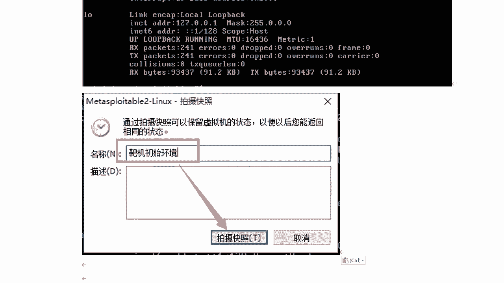

# 学不会我退出网安圈！中国红客技术正需要传人！全套666集还怕学不会？（网络安全／黑客技术） - P62：11.2-【Metasploit渗透】Metasploitable2-Linux 靶机系统介绍 - 一个小小小白帽 - BV1Sy4y1D7qv

好下面呢我们来讲一下呢，mata loyable 2啊，这个靶机的大剑啊，那么mate splay包二，那么这个虚拟机系统呢是一个特别制作的啊，无帮图操作系统，那么也是基于debian核心。

我们的开立也是基于deband的，那么它两个核心是一样的，那也是基本命令也是基本一样的，那这个本身的设计作为安全工具，测试和演示常见的一些漏洞工具，那么这个版本二已经可以下载了。

那并且比上一个版本包含更多，可利用的一些安全漏洞，那么这个版本的虚拟机啊，兼容v面，还有visual boss和其他的虚拟平台，都可以去安装和搭建好，那下面呢我们来带着大家去搭建一下这个靶机。

那这个靶机呢大家也非常简单啊，他这个是一个压缩包，直接解压之后呢，用v面打开就可以了啊，那么下面我们来解压一下这个来把记在这里，我们直接解压到当前文件夹，好那么解压完之后能够打开这个文件夹啊。

那么里边有这些都是v m虚拟机文件，有个启动，有v m x好，那么我们来打开我们的虚拟机，好点击这个主页啊，这里打开虚拟机，然后呢去选择一下的我们刚刚解压的那个目录，matt bloyer。

二选择点vmx文件双击，然后就可以打开这个虚拟机啊，对它的安装就完成了啊，到这一步呢，不要着急开启这个虚拟机，那首先来看这里网络适配器啊，默认是net模式啊，它有两个网卡，第二个不需要管，看第一个。

那么如果你的虚拟机啊，其他虚拟使用都是啊桥接模式的话，那么你这里要改成桥接，如果都使用net，这里就不用改了，好吧，根据你自己实际情况去调整，其他的默认就可以了，比如内存的处理器啊，硬盘啊默认就可以了。

我这里呢kelly的使用是调节模式。

我得改成桥接，改完之后呢，直接点击开启虚拟机就可以了。

然后点一我已复制，稍等它就启动起来了啊，我们稍等等，那么它的整个安装过程啊还是比较简单，解压用v m直接打开就可以了，好的我们来整个安装的步骤啊，给大家整理到这里啊，按照这个过程去操作就可以了。

那需要注意的就是这个网络连接这块啊，呃如果你的一个是net模式，默认这块就不需要操作了。

不需要改了啊，好那么这个虚拟啊对把自己启动起来了。

那么它提示你啊，注意大家注意看这里login wage什么意思啊，这是默认的账号和密码，msf admmsf adm，这个他告诉你账号密码是多少了，通过大家开始下面让你去登录，那我们来登录一下的。

使用这个普通用户啊，密码m s f a d m i n，注意啊，这里密码linux系统密码输入的时候是不显示的，你正常输入就可以了，然后回车，那么登录成功了，还有一点要注意的，那么就是说啊。

当你去登录到这个靶机里面之后，你的鼠标正常是挪不出来的，那么需要怎么办呢，按下ctrl加alt键，因为在这里他已经提示你了，哎我们来看啊，在这里已经提示了，当你鼠标点击对吧，这个靶机获取鼠标焦点之后呢。

在左下方左下方他告诉你好吧，有啊，请按ctrl加alt两个键同时按鼠标就挪出来了啊，这点大家要注意，那么这里呢我们登录的是普通用户好吧，那么如果假设你进行一些配置啊修改呀，那可能需要管理员账号。

那么得需要什么速度啊，比较麻烦怎么办呢，那么他有没有root账号呢，有那么它的密码是多少呢，我也不知道对吧，但是我们可以去设置一下的，包括呢大家在安装，比如开立系统啊，新版本2020版本的kly。

在你安装的时候呢，需要设定一个账号，普通账号和密码登录进去之后，那么你是运行很多命令，提示命令找不到，为什么需要管理员权限好，那么其实在这里，这个靶机设定root账号的密码。

和正常2020版本kelly试试方式都是一样的啊，那么这里呢给大家讲一下吧，那这里呢我们通过s u d o速度password root，通过这个命令呢，我们来设置一下超级管理员root的密码。

那么回车让你输入这个密码是谁的密码啊，普通用户msf admin密码，那么它的密码是多少，m s f adm，那么这里是新密码，这是谁的密码啊，root账号的密码123456，简单一点就好啊。

不需要起的太复杂太复杂，你忘记了就比较麻烦了，它提示呢已经修改成功了好吧，那下面呢我们来切换到root账号，s u d u杠i直接就可以切换到root账号啊，那么这里我们可以看到前面的这块。

已经变成root了对吧，那么这个变成井号，现在已经记住了，对进入到root账号下面了，好那么到目前为止，那么这个板机就可以正常的使用了啊。

那么有的同学会问啊，那么需不需要设定一下ip地址啊，那么这里我要说一下他ip地址呢，你如果你不设定的也没有问题，它不影响正常的使用，好吧对，然后呢，那么要设置怎么去设置呢，我给大家讲一下方法。

但是呢这个ip地址不是必须要设置的啊。

那其实我们if和fig查看一下，当前已经获取到ip地址了，1。8是吧，对你正常可以用了，那么它的设置ip地址的方式和kelly是一样的啊，那么我们打开它的网卡配置文件。

etc下面network interface啊，然后呢这里注意啊，默认了它是dh cp，那么也是动态分配的ip，我们把它改成静态的，然后接下来设定它ip啊，a d d r e s s呃，这个注意啊。

我这是桥接模式，那么这个ip地址怎么设置，要根据你实际物理机的网段去设置，那么我物理机的网段是192。16，8。一点这个段了，那么我就把它设成1。180，注意啊，这个ip不要和物理机一样的啊。

这属于基础常识，我就不多说了，然后接下来呢这叫指网页码啊，255。255。255点，然后网关gateway，网关的注意啊，调节模式和物理机网关是一样的，1。1啊，然后设置完成之后呢，按下e s c啊。

别忘了重启网卡，然后是你新设的ip地址上生效，networking restart，好重启成功之后呢，if config查看一下ip地址，看看是否已经变了，ok这样我们看这里1。180啊。

已经修改成功了啊。

那么这个呢是关于这个靶机，到目前为止所有的配置都ok了，对那ip地址我说了啊，不是必须要设置的，那么这个整个靶场呢设置完成之后呢，别忘了啊，做一个快照好吧对。

那么如何做快点啊，点击虚拟机啊，这个虚拟机啊，然后快照拍摄快照起个名称啊就可以了，对做个备份呢，万一呢以后你在渗透测试过程中啊，把这个八场是吧，嗯搞坏了啊，你有备份呢可以恢复一下就可以了。

不用了再重新去搭建了，虽然这个搭建过程还是比较简单的，但是呢有快照还是比较方便啊，能够快速的恢复，节省一些时间啊，然后呢注意啊。

做快照的时候最好是啥先关机再去做快照啊，因为呢你如果你开的开机做快照呢，这样比较占空间好吧，点击这里关闭客户机，然后呢再去做快照就可以了。

