# 学不会我退出网安圈！中国红客技术正需要传人！全套666集还怕学不会？（网络安全／黑客技术） - P63：11.3-【Metasploit渗透】Metasploit基本使用方法-1 - 一个小小小白帽 - BV1Sy4y1D7qv

好下面呢我们来讲一下的，mate supply的基本使用方法，那么有关于他的一些基本命令啊，那么常用命令给大家讲解一下的，那matters lider这个程序。

它需要使用postgresql这个数据库啊，那么什么是postgreen srcle数据库，那么这个数据库啊，是一个特性非常齐全的一个自由软件的对象啊，那么他全程点关系数据库管理系统诶。

o r d b m s，那么是以加州大学计算机开发的啊，这个4。2版本为基础的对象，关系数据库管理系统，那么说到关系数据库管理系统啊，那么还有一个对应的mysql，这个也是关系型数据库管理系统好吧。

然后呢关于这个数据库呢，它的官网地址呢是这个，那么大家可以打开看一眼这个啊，我大概打开看一下吧，好我们稍微等一下啊，好那么这个英文的意思是什么，是世界上最高级的啊，开源的关型数据库管理系统啊。

说的好像很强大啊好吧，那么它的最新版本是2020 11月12号，这是他的这个最新版本啊，那么这个数据到底有多强大对啊，那么它和我们前面刚刚说的mysql它有什么关系啊，有什么区别好吧。

那我给大家来简单介绍一下的啊，呃关于这里呢我们来看一下啊，再给它放在这里，这个截图啊，postgresql和mysql数据库的应用场景的区别，那么主要是从应用场景上来。

我们来看一下这两个数据库有什么区别，嗯从应用场景来说啊，postgresql更加适合严格的一些企业应用场景，比如说金融啊，电信呢e r p，还有c i m这些系统开发使用这个数据库。

而mysql呢更加适合业务逻辑相对简单，数据可靠性要求较低的互联网场景，那么也就是说，我们常见的一些企业网站的开发啊，用my sql的比较多啊，那像这种金融，电信e r p都用到了这种数据库啊。

postgreen circle嗯，好的，那么我们在使用mate support这个渗透之框架之前。

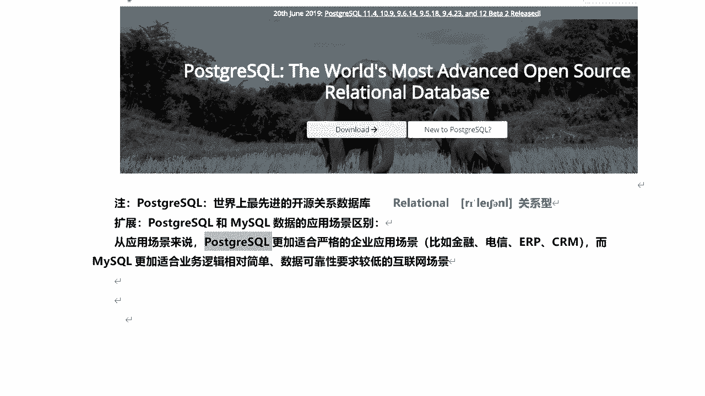

我们得需要先启动一下这个数据库，因为我们在进行渗透测试的时候。

那么那扫描报告啊对吧，结果啊都需要存储到这个数据库里面啊，我们通过这个命令system ctrl start postgresql，来启动一下这个数据库，默认了它是关闭的，要开启一下了。

然后呢最好给它设置成开机自启动，system c t r enable 1 a b l e，post gra，好那么当数据库启动完成之后呢，接下来我们就可以来进入啊，访问我们的matt pot这个框架。

而启动方式啊两种，那么一种方式呢。

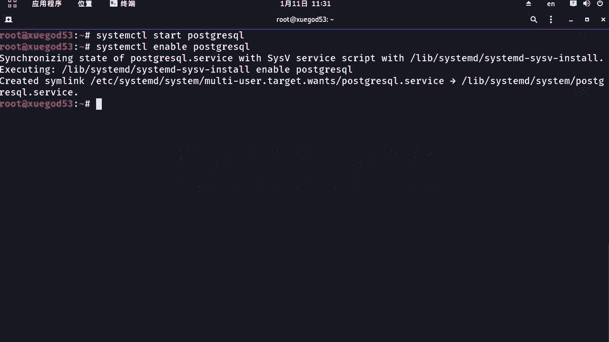

可以通过我们的一个在在这里啊，去来它的图标啊。

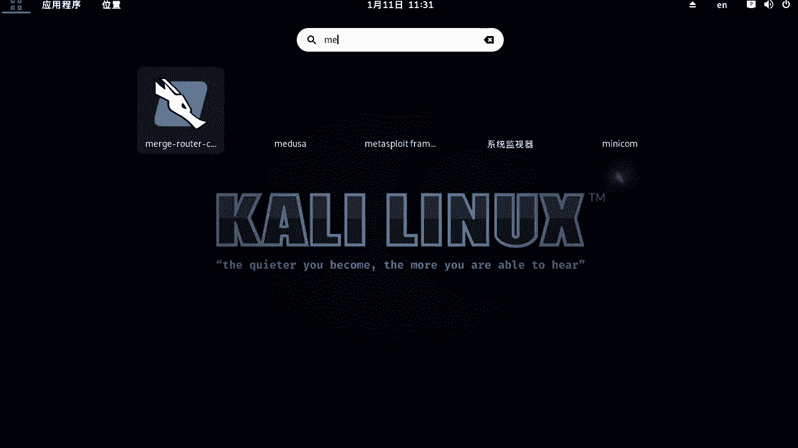

mata lo直接点击它来进入这个框架，或者是直接通过命令行，输入msf conso这个命令来启动，那么第一次启动的时候呢，相对慢一些啊，我们稍微等他一会儿，那我们会经常使用这个命令啊。

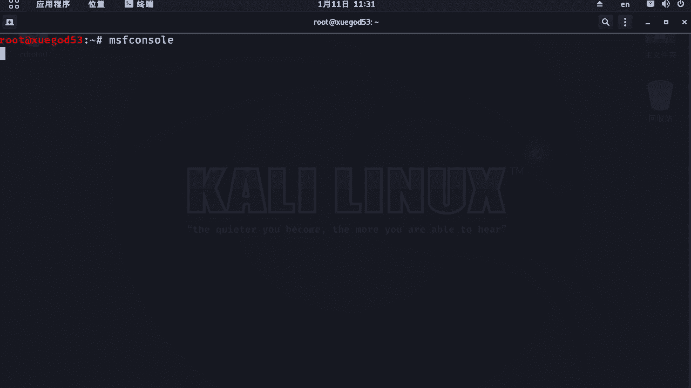

来记住这个框架，这个呢大家要记住啊，这个命令好，那笔记呢给大家整理一下呢，这是启动我们的postgresql数据库，然后呢设置开机自启动啊，那么你如果你不设置开机自启动，每次启动都需要手动的去开启。

比较麻烦啊，好。

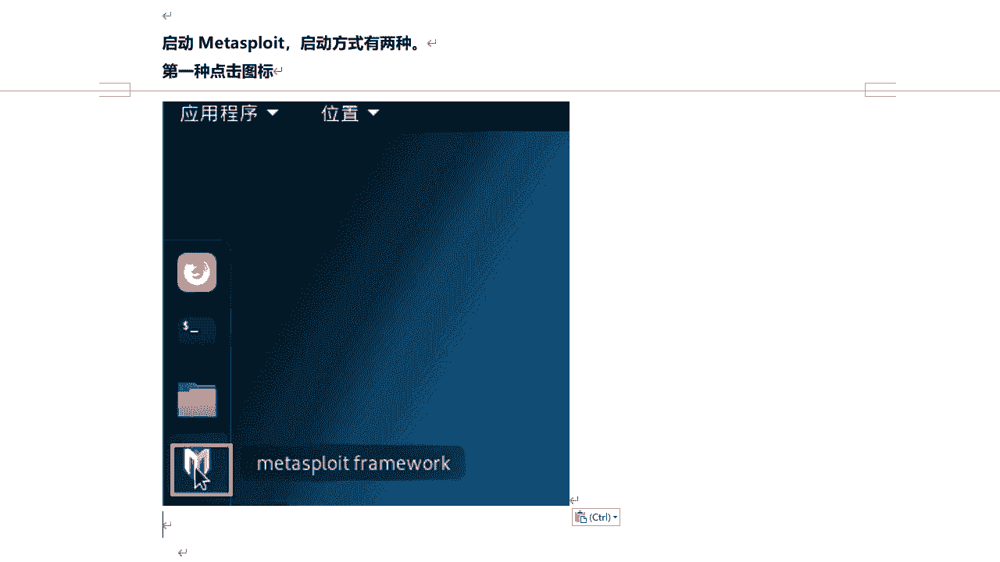

我们稍微等他一下，因为第一次启动啊，它会初始化一些应用程序啊，相对慢一些，好我们看这里啊，那么它报数了是吧，no database sport啊，那么也就是说这里是什么意思呢，就是没有数据库的配置文件。

好吧，呃产生这个原因呢，就是说在第一次使用的时候，我们需要初始化数据库啊，我们先来退出啊，如果出现这个提示啊，怎么办呢，m s f d b i n i t啊，初始化一下，它会自动生成配置文件。

对已经创建了这个啊，已经有对创建了，然后执行完这条命令之后呢，我们再次启动这个框架就不会报错了，msf扣走，好那么进入这个框架之后呢，我们来看这里啊，那么它显示了这个框架的版本啊。

然后呢一共有多少个渗透攻击模块啊，多少个辅助模块，还有325个后渗透攻击模块，541个payload，44个编码器模块，十个控制力模块，还有两个这个evasion啊，那么这是生成后门木马的好。

然后呢这个提示主播变成msf 5啊，如果看到这个题输出，就证明你已经成功进入这个框架了啊。

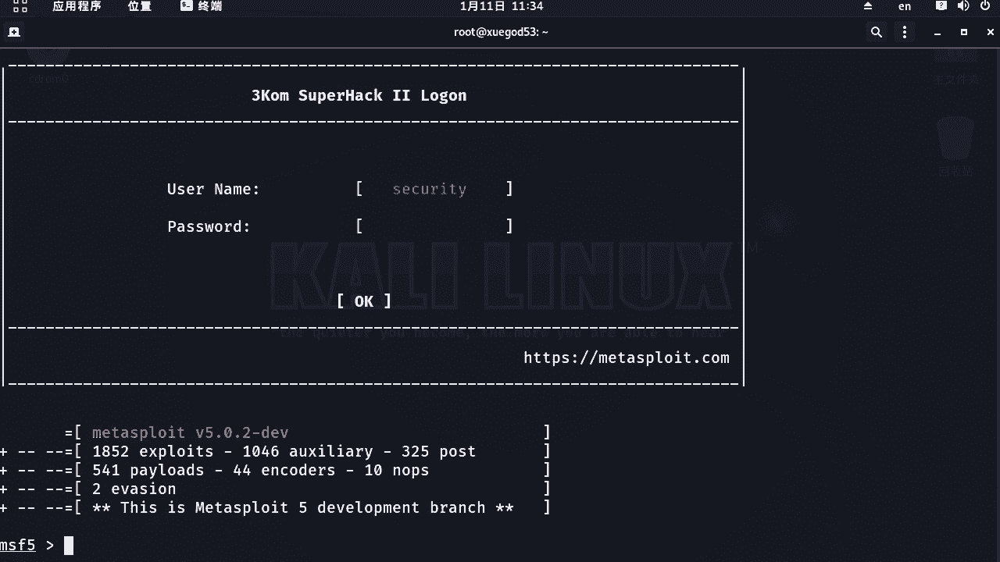

好的，然后呢我们来把笔记呢给大家整理一下啊。

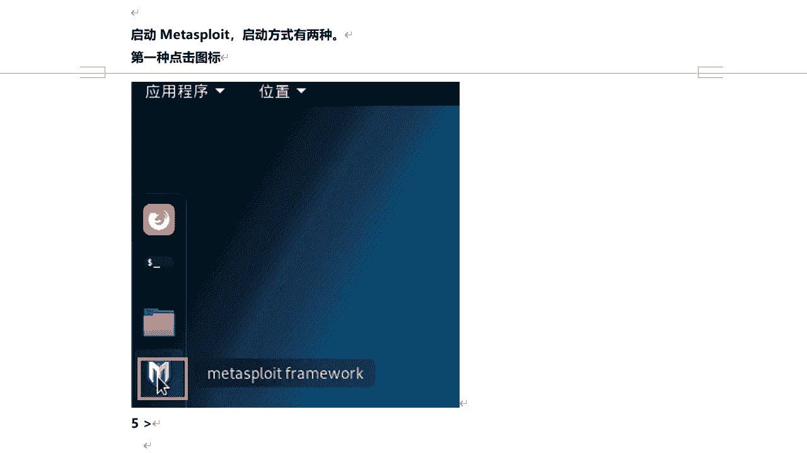

如何去进入这个框架啊。

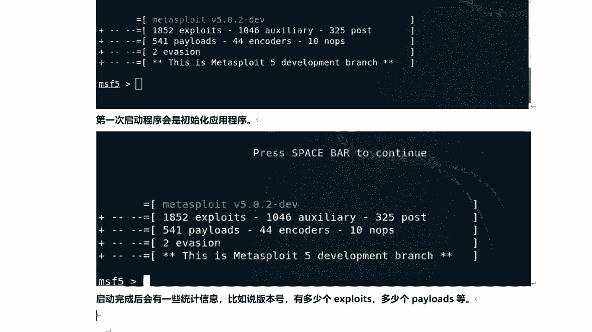

好接下来呢我们就开始来使用这个框架好，那么我们通过一个简单的命令help，那么我可以查看在这个框架里面，可以支持哪些功能啊，有哪些命令呢可以使用呢，我们来看一下它这么多命令啊，首先看第一个啊。

第一个是核心命令唉，那么这里有可以很多命令都是比较常用的，那么一会儿给大家介绍一下的，好吧对，那banner cd color好吧，那不是所有命令都必须用到的啊，有一些经常会用到，有一些不是很常用的。

那么第二个呢是模块命令啊，包括这些，包括这些啊，那比如说像这里的jobs和ko会经常会用到，然后呢这是支援脚本命令啊，然后再往下看这一块呢是数据库后端命令，那么比如说像这里的db export导出对吧。

导入导出扫描报告，导入啊，包扫描报告等等，还有这个这是凭证后端命令，这个是开发人员命令啊，那么这个开发人员命令啊，那么也就是说你可以去通过这些命令啊，编辑它的模块的代码啊，去修改。

当然对于我们一些初学者，那么不建议你去修改啊，那么你要想修改，那必须得具备一定的开发能力，因为他的这个模块是用ruby语言去写的好吧，那么这是关于他的几个啊。

比较常见的一些命令啊，模块，好那么这个呢给大家来整理的这里啊，那么有前三个核心命令，模块命令和后台任务命令，那么这里有一些命令是我们会经常用到的，后面的这些呢不是很常用啊。

下面呢我们来讲解一下我们常用的命令，那比如说第一个核心命令中有一个connect，那么这个命令呢主要是connect，英文翻译过来是连接的意思，这个命令呢主要是用来连接远程主机啊，一般用于内网渗透。

比如常见的命令是connect，192。168。1。180，那么这个意思就是连接到1。1，这个主机的八零端口好吧，那么这个呢1。1是ip啊，ip地址八零呢是端口号好，那么下面我们可以去查看啊。

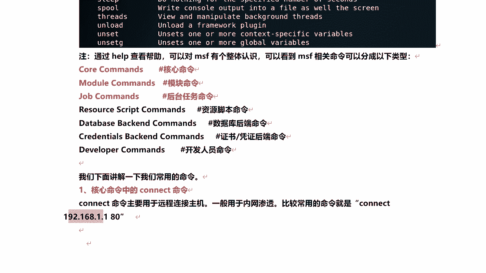

关于connect命令相关的一些参数，这里呢我们直接在这个提示符下，输入c o n e c t这个命令回车，它会显示呢，这个关于这个命令有哪些参数可以使用啊，那么这次参数名称后面呢。

是关于这个参数的一个描述啊，那都是英文的啊，当然你可以去翻译一下了，好吧，唉就知道什么意思了啊，呃下面我们举个例子啊，比如说我们使用这个命令啊，去连接到学校点cn的八零端口，那么这个呢也是可以的啊。

然后回车，那么它提示你呢，已经连接到了学霸的cn的八零端口，连接成功了，然后这里呢连接上了我们有什么用啊，对啊可以进行什么操作啊，可以通过get斜杠，那么也就是说提交一个get请求。

通过这种方式可以查看服务器的版本号，看这里n ex一点6。2好吧，获取的目标服务器外部中间件，它使用的是n g s它的版本啊，或许这个版本之后呢，你可以根据这个版本呢对。

然后查找看看有没有相关的一些漏洞啊，主要是这个目的，然后当你执行完成之后呢，又回到这个地图，这里有一个有一点要注意啊，大家千万不要在这个里面啊，这个提出下面去运行，它会出错的，要先连接到对吧。

只先执行一下这个命令，提示这个连接成功之后，然后就去执行这个好吧，这点大家要注意啊。

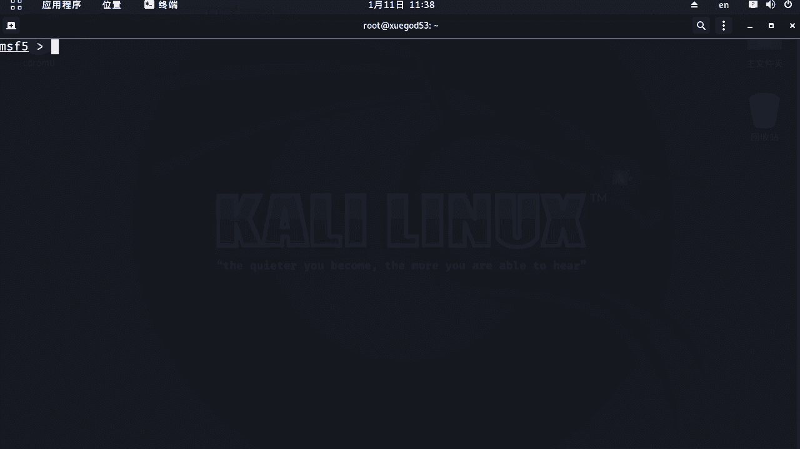

那么这个也是容易出现问题，很多同学啊容易出现问题的地方好，那么我把这个来给大家整理到这儿，那我们来看一个命令啊，so啊so的使用方法，那关于这个show命令啊，他这个用的很多啊。

也会经常去用到这个命令的有效参数呢，主要是有这些啊，so all啊，那么这so all什么意思，显示所有的模块都会列出来啊，这也要慎用，因为所有的模块呢很多，那么如果你使用soul呢，它会很慢啊。

那么加载这些模块需要一定时间，so encoder显示所有的编码器模块，显示所有的控制力模块，还有渗透攻击模块pay load对吧，辅助模块，post模块等等啊，那么这里呢我们来show一下的啊。

比如说so呃exploits啊。

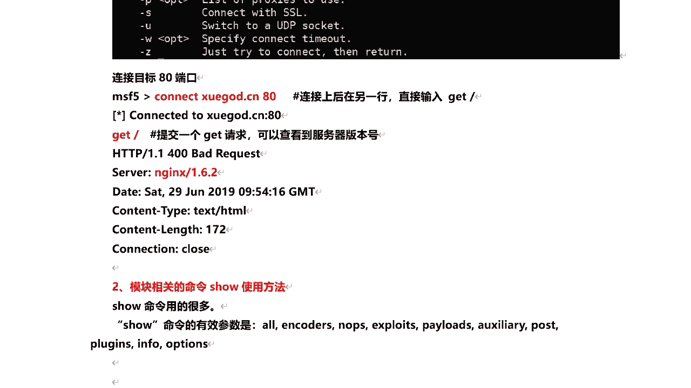

注意后面有个s啊，因为你要把所有的渗透攻击模块都显示出来，嗯这里呢呃这个我的kd是2019。1l2 ，有一共有1800多个渗透攻击模块，所以说当你瘦的时候呢，它加载这些模块呢很慢啊，需要一定时间。

这里呢我们稍微等一下的啊，因为这个命令呢也是最多的。

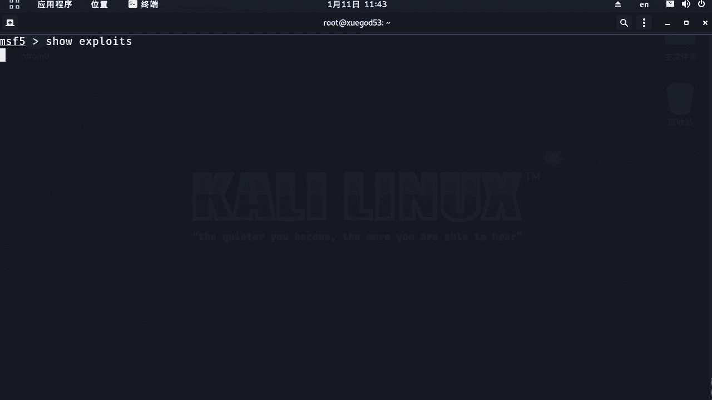

那么你去加载它呢比较耗时啊。

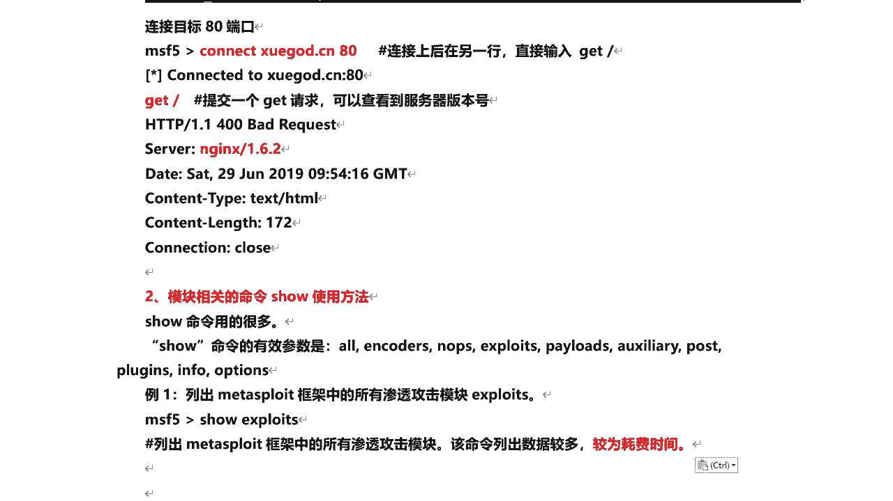

当然大家呢知道它怎么用啊，有这种用法就可以了啊，那么你去如果你电脑比较慢的话，对你要执行的话要谨慎啊，那么需要等一会儿，好那么已经加载出来了哈，那么他会把所有的exploit模块都加载出来啊。

一共有这么多，好吧好的，那么这是关于兽命令啊，大家会使用知道它的用法就可以了啊，那么当然还可以，so please，对，这是加载所有的攻击载荷模块啊，那么这里呢我就不执行了啊。

因为它太慢了好吧，同学们，ok那么注意啊，那么这里使用show命令，那执行很慢，那么怎么办，对啊，有什么方法呀，那比如说我们要去查找一个，关于某个漏洞的模块，那你又通过受命令去把它所有都列出来。

一个一个去查找，那相当慢了是吧，有没有更好的方式啊，当然有，那么我们这里来看另外一个命令啊，设置设置的是搜索对吧，那么当咱们使用msf consol的时候，你会用到各种漏洞模块，各种插件等等。

所以说这个设置啊这个命令就很重要，那也会经常用到，那比如说你拿到一个漏洞的编号对吧，通过search去查找关于这个漏洞，有没有对应的模块啊，那是非常方便的啊。

那么这里呢可以通过search杠去查看这个命令，相关的一些帮助信息。

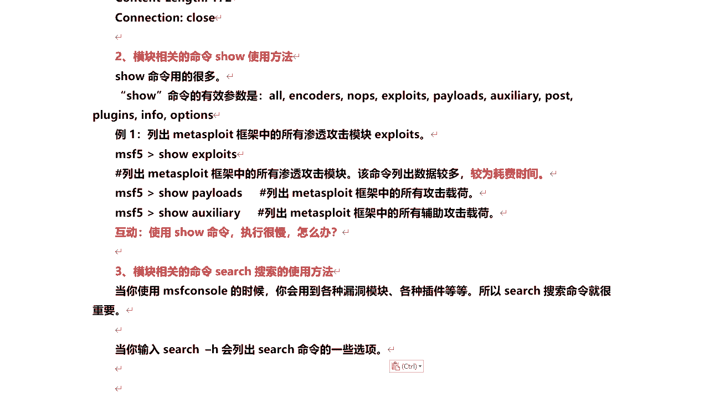

它可以使用哪些参数对吧，可以配合哪些参数去使用呢，有这些啊，然后呢主要是哪些关键词可以通过这些啊，不是都啊常用的，有几个比较常用的啊，比如说像这种tab啊，他给他是吧，还有port呀。

platform patch name比较常用，还有一些这些什么作者呀，这些都不是很常用啊啊rank等级啊，嗯这个等级呢一般情况下我在使用的时候，一般都是说这些设置，后面跟上漏洞编号就可以了。

如果通过这种方式搜索，如果得到结果比较多呢，那么再结合一下其他的一些关键词，配合在一起使用就更方便了啊，好，那下面呢咱们来一个一个给大家去讲一下的啊。

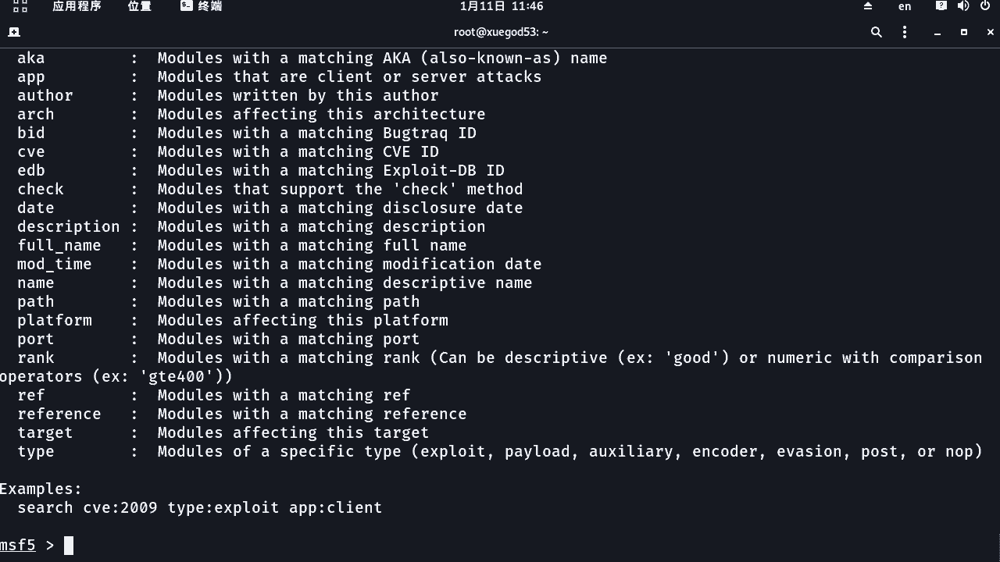

比较常用的好吧，那么这里最简单的方式就是设置后面跟什么，跟关键字啊，这种方式呢是最常用的好，那么这里呢来啊。

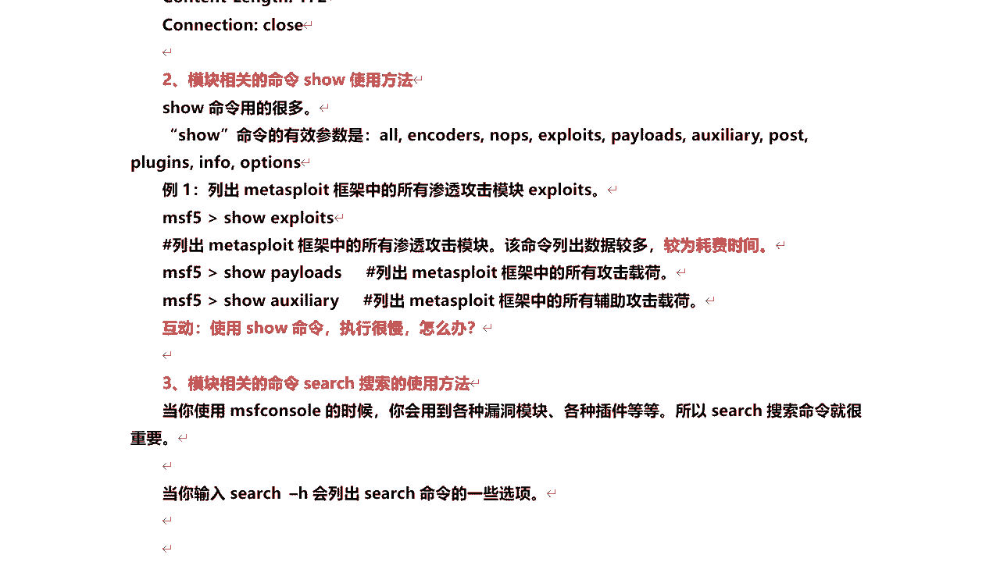

比如说我们要搜索mysql相关的啊模块，那么这里呢设置空格跟上mysql对吧。

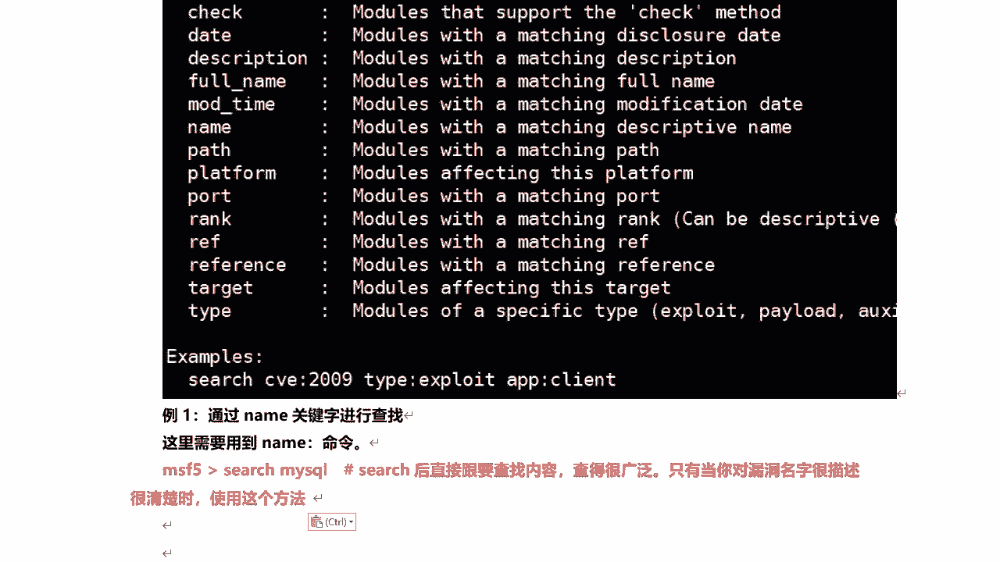

这种方式也是最简单最直接的，我们来看一下唉。

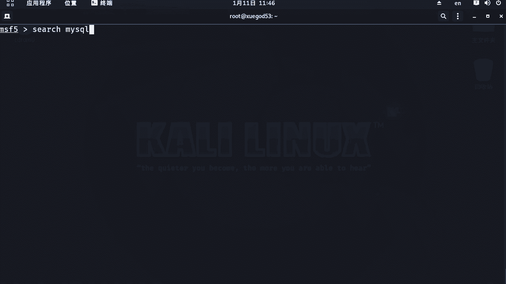

那么这些模块呢都是关于mysql的好吧，得到这些结果啊，然后呢下面我们来看，比如说呢我们拿到了一个漏洞的编号，比如说比较对典型的一个漏洞，比如ms 08067。

我们来查一下关于在mate supply这个框架里面，有没有关于这个漏洞的模块。

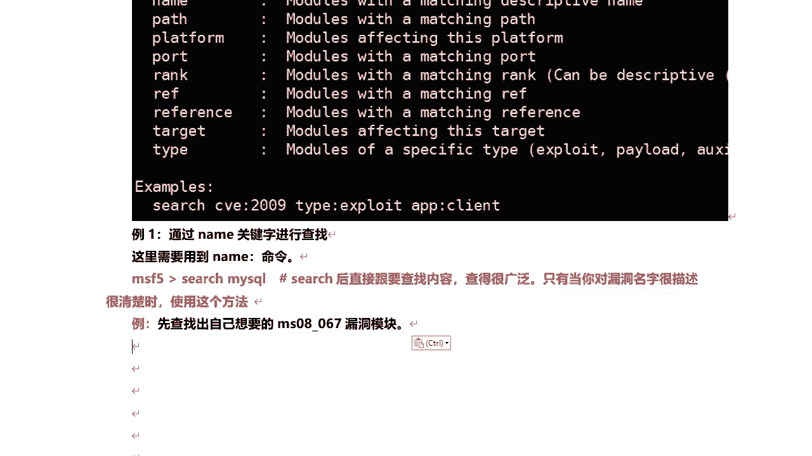

那我们可以怎么去搜啊，设施ms 08对吧，杠067好，那么直接就找到了只有一个，而且是漏洞利用模块exploit好吧，然后呢这是关于这个漏，这是前面name关于这个模块的名称。

这是关于这个漏洞的发布日期，他等级还有check description啊，但是关于这个模块的描述啊，注意关灯，这个每一个都是具体什么意思啊，一会儿呢我给大家详细的去讲一下了好吧。

然后呢同时这里还可以通过name关键字。

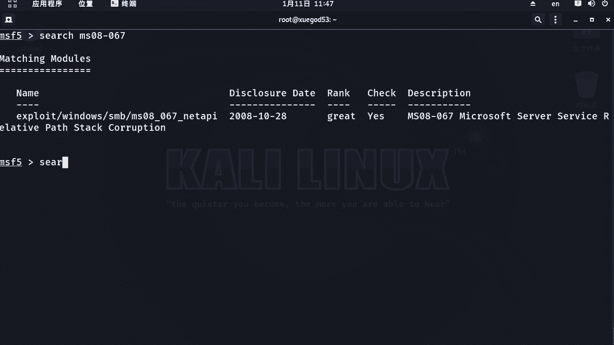

比如mysql哎这么去搜是吧，那么会搜索到所有关于这个模块名称里面，还有mysql关键字的啊，相关的模块啊，好，那么下面呢我们来把相关的一些这个参数啊，给大家详细的去啊，讲一下的啊。

嗯这里name就是模块的名称，然后呢这是关于漏洞的披露日期啊，rank是等级啊，有些排名啊，tag的检查，也就是这个模块是否支持在漏洞利用之前，就渗透攻击之前，对目标机去检查是否存在这个漏洞是否支持啊。

然后呢这是description关于这个模块的一个描述，好吧对，那么这个模块具体是做什么的啊，description描述，那每个漏洞利用模块啊，唉那么它对目标系统对用模块，基于他们对目标系统潜在影响。

都被标记了一个rank字段，用户呢可以基于rank，对漏洞利用模块进行搜索分类以及排序啊，那么这个rank是什么意思啊，那么这个rank按照可靠性啊，我们从高到低来排列啊，主要分这几个。

好那么这里我要说一下的啊，那么等级越高代表的是什么，那一般来讲我们再去寻找某个漏洞相关的模块，利用的时候，都比较喜欢选择这个级别比较高的啊，为什么，比如说这个excellent是等级最高的。

这个漏洞利用程序啊，绝对不会使目标服务器崩溃啊，比如像sql注入啊，命令执行啊，远程文件包含本地文件包含等等，除非有特殊情况，比如典型的内存破坏利用程序，不可以被评为该级别，那么也就是这个等级越高。

说明这个漏洞使用这个模块，对目标服务器不会造成什么，不会使目标服务器崩溃，你相对于比较好的利用对吧，也是它不会对目标服务器造成破坏，那这种模块呢会被培训机，为什么对级别是相对高一些。

那么现在great呢，这个漏洞利用存有一个默认的目标系统，并且呢可以自动检测适当的目标系统，或者是在目标服务的版本检查之后，可以返回一个特定的返回地址，嗯其实我们可以这么理解，等级越高。

那么相对于利用呢越容易利用一些，也不会对目标服务器造使目标服务器崩溃，对目标服务器造成什么一个严重的影响，那么级别越低哎，那比如说像这个级别最低的这个漏洞，利用程序不稳定或者是难以利用得不好利用，对。

如果一个模块，只有在用户特别配置该模块的时候才会被用到，否则该模块不会被使用到，那么那么可以评为该等级啊，那么也就是说啊，就是说级别越低越难利用，级别越高越好利用好吧，那么可以这么理解。

那么说以后我们再选择使用模块的时候，那么这个等级rank呢可以作为一个参考好，那我们了解了这关于模块每个参数对吧，这个都是什么意思的情况下呢，接下来呢我们来看另外一种搜索方式，也是通过路径来进行查找啊。

那么什么情况下会使用这种方式去查找呢，比如说有时候啊我们只记得模块的路径啊，忘记了模块的名称，那么我们可以使用ph冒号好吧，后面改成关键字啊这种方式来进行搜索查找，那么这个命令在查找该路径下的所有模块。

那比如说我们要嗯，找mysql路径下的所有mysql的利用模块，那么我我们这里呢可以通过这种方式啊。

search p t h mysql去查找好吧。

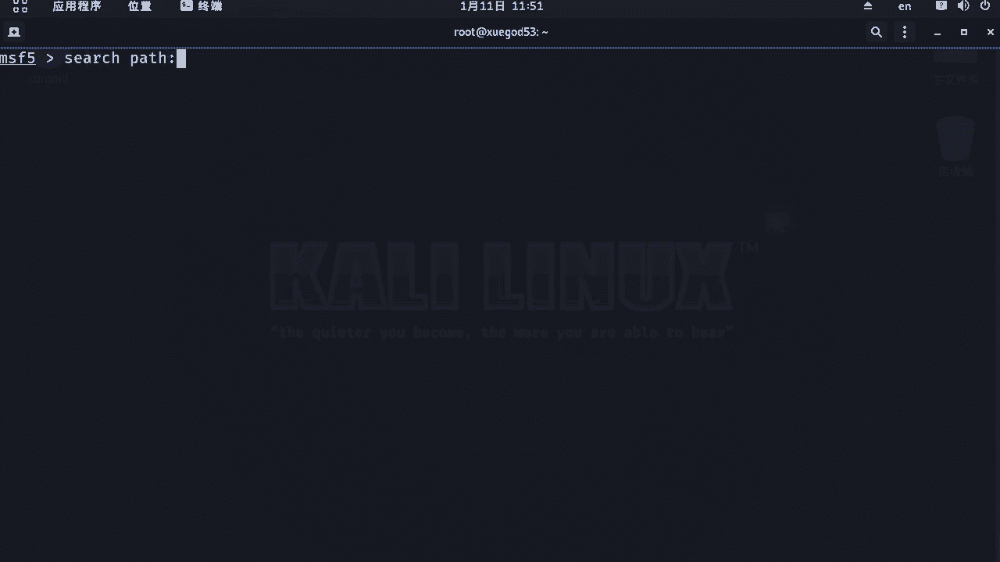

这种方式啊，那么还可以来通过另外一种模式方式啊，比如说platform去缩小查找范围，platform呢是什么平台的意思，那么它的主要作用呢，来我们是这样来看一下啊。

这个力图它可以列出啊影响此平台的模块，那比如说我想搜索关于windows下面的模块，或者linux下模块，还有mysql相关的模块是都可以的，那么也就是比较好的漏洞，有时候呢我们会搜索到大量的文化。

那么可以使用platform这个命令呢，来缩小查询范围，那所查询的这个结果会列出rank等级比较高的。

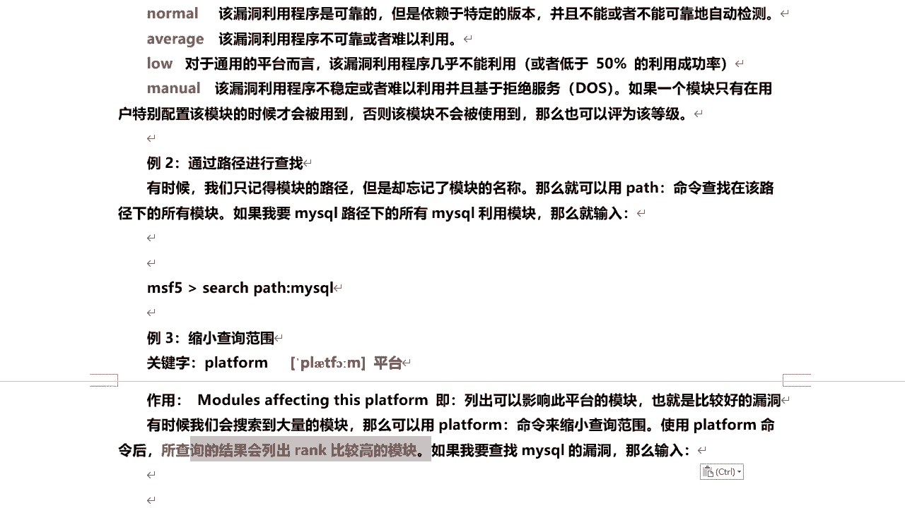

好吧，那比如说我们要查找mysql，那么我们可以通过这种方式来进行查找，search platform my circle是吧，那么我们看啊通过这种方式查找结果，比之前直接mysql查出结果更少了。

但是这里呢等级相对更高一些，是不是，或者说呢我想来高传导，关于windows下面所有相关的模块对吧，那会列出关于windows平台下面的模块好吧，有这些，那么这个就相当于多一些了啊，现在很多了，那么好。

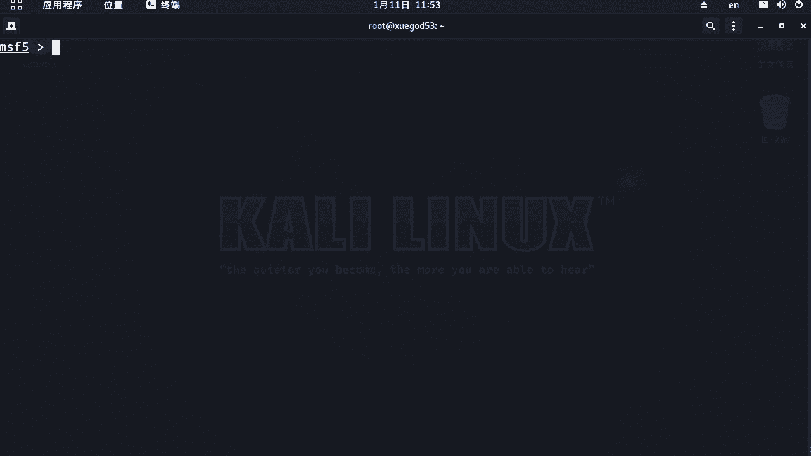

那不同的关键字，那么得出的这个结果范围啊，那么肯定是有差别的啊，那么通过这种方式呢更精准一些。

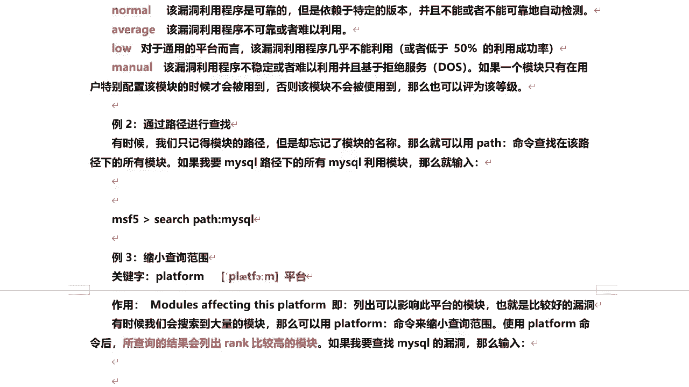

litter form啊，另外呢还有一种，比如说我只想查找漏洞，利用模块，或者是我只想查找呃辅助模块，那么这里呢可以通过另外一个关键字，type tab是什么类型的意思，那么这可以搜索特定类型的模块。

比如说expolite payload，accelery，encoder，evision post，或者是no p对吧。

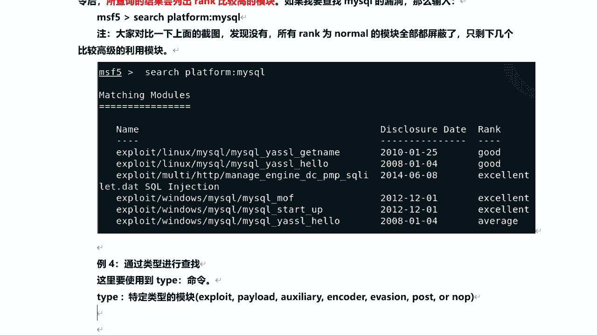

note控制零模块，那么比如说我们要查找渗透攻击模块，设置type is blood，注意这里呢会把所有的漏洞力模块都列出来，那么和我们使用so exploits得结果是一样的，那这里我就不执行了好吧。

因为它加载的比较多，比较慢啊，大家呢会使用就可以啊。

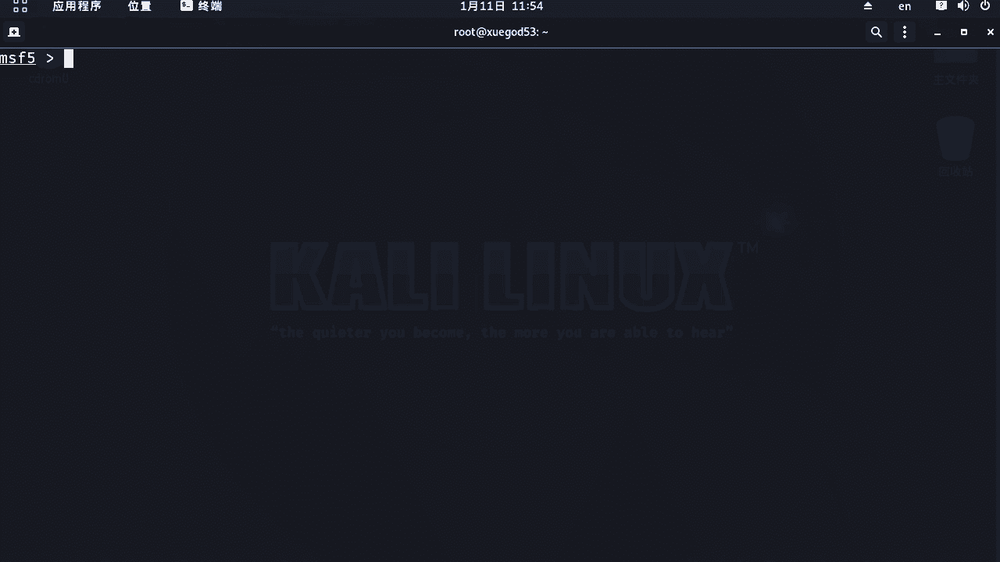

是通过类型来进行查找嗯，学习了以上的几种查找方式呢，那么很多时候我们需要使用联合查找对，把上面的一些参数自行的去搭配使用，比如说像这种方式，我们去查找关于mysql的利用漏洞，利用模块啊。

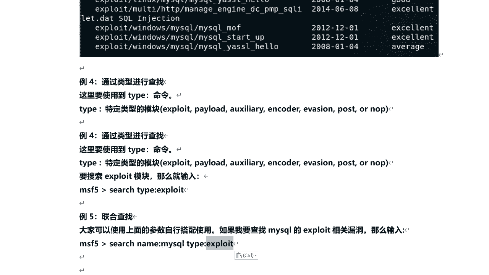

那么来搜索一下的啊，我们看会得到一个什么样的结果，好吧，那么查找到的歌都是关于mysql的，exploit开头的漏洞利用模块啊，好那你想查找关于他mysql的辅助模块呢。

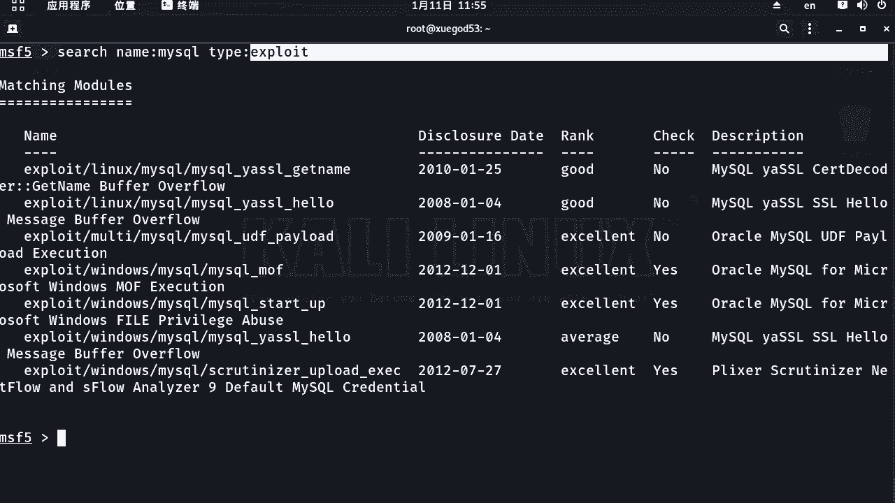

你就把它改成authy就可以了，是不是对，那么这种联合查找方式啊，能够更精准一些好，接下来呢我们看另外一种搜索方式，就是根据cv e来搜索的相关模块，那么这里说的一个名词啊，c v e。

那么什么是c v e啊，对啊我相信有的同学可能已经听过啊，那么cv呢它是公共漏洞和暴露，那么它就好像一个字典表为广泛认同的信息，安全漏洞，或者已经暴露出来的一些漏洞，给出一个公共的名称。

那那么就相当于把一些新出来漏洞啊，它起个名称，大家呢都使用这个名称对吧，如果有cv e名称，你就可以快速的在任何其他的cv e兼容的，数据库中找到相应的一些修补啊信息，来解决安全问题。

对他就相当于给一个漏洞器公共名称，大家都使用这个名称是吧，嗯接下来我们来看啊，有一个比较哎著名的漏洞啊，比如2017年github上公开了一个cv e，20178464，2017年，这个是漏洞。

编号8464好，那么这个漏洞啊啊利用模块啊，利用这个模块，它是在win 1664位的啊，build 14393上版本上测试有效呃，我相信有的同学可能会接触过啊，啊预言过这个漏洞。

那么它主要是通过u盘进行传播的好吧，那么通过执行这个模块呢，叫生成大量的点l n k文件啊，那么对应盘符是从d到z呃，要加载的dll文件，后门文件dl，那么将所有样本的文件拷贝到u盘里面。

那么如果你的电脑卡到插入u盘，那么它就会自动的在电脑上去执行呃，他这个文件是这样的，那么也就是说，你如果发现u盘里的存在大量的这样文件对吧，那么有可能是中毒了啊，那我的之前那么很久的使用u盘的时候。

出现过这种情况，我也遇到过对吧，如果大家遇到过了是吧，你要小心了，中毒了哦，那比如说呢这里我们来查找关于这个漏洞对吧，cv e20178464 啊，它是远程命令执行漏洞。

那么在mate support里面有没有对应的模块呢。

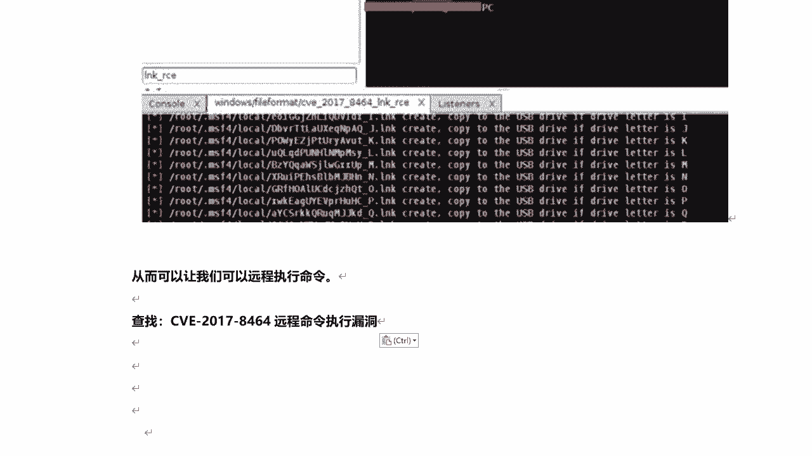

我们可以通过这种方式来查找一下的，search是吧，然后c v e c v e杠2017，然后呢杠8464好吧，关于他的漏洞利用模块还没有来，有两个好吧，查得到了，那么这是漏洞利用模块。

那么你就可以利用它来对标基进行攻击，而且它的等级是最高的，比较好的啊，嗯接下来呢我们来查找啊，比如说我们到了关于啊2018年的对吧，cb漏洞关于linux的啊，可以通过这种方式组合联合查到啊。

这里还真有对吧，2018年发布的一个lo，他等级是great也是比较高的，关于linux这个漏洞啊，那么你可以对这个模块它怎么去利用啊，好吧，那关于你可以去查到关于它的模块相关信息，那后面咱们会讲到啊。

去利用下这个漏洞啊，注意啊。

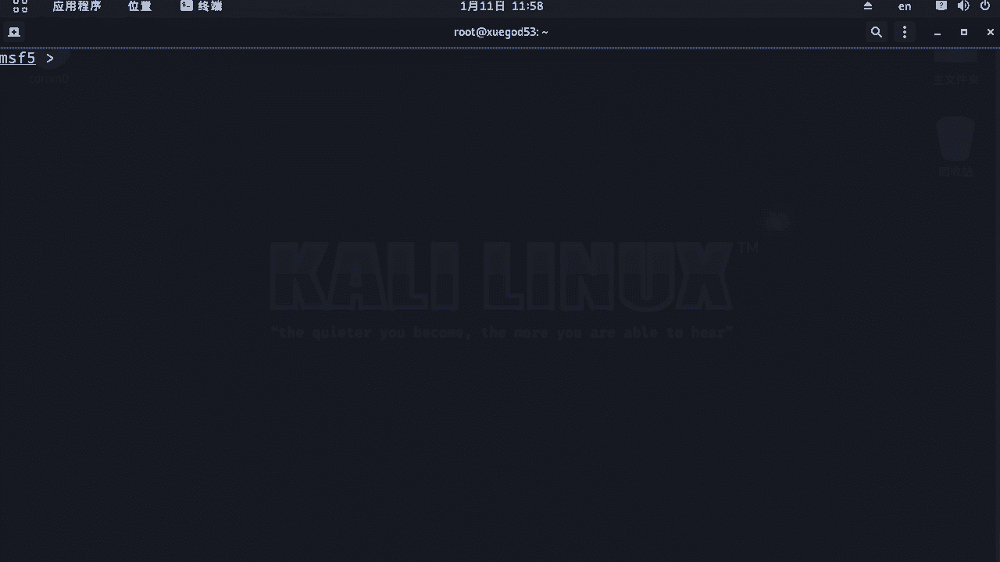

那么这里任何一个漏洞的利用，它都是基于一定条件和一定系统的好吧，特定系统满足特定条件，你才能去利用啊，利用这种联合查找的方式啊。

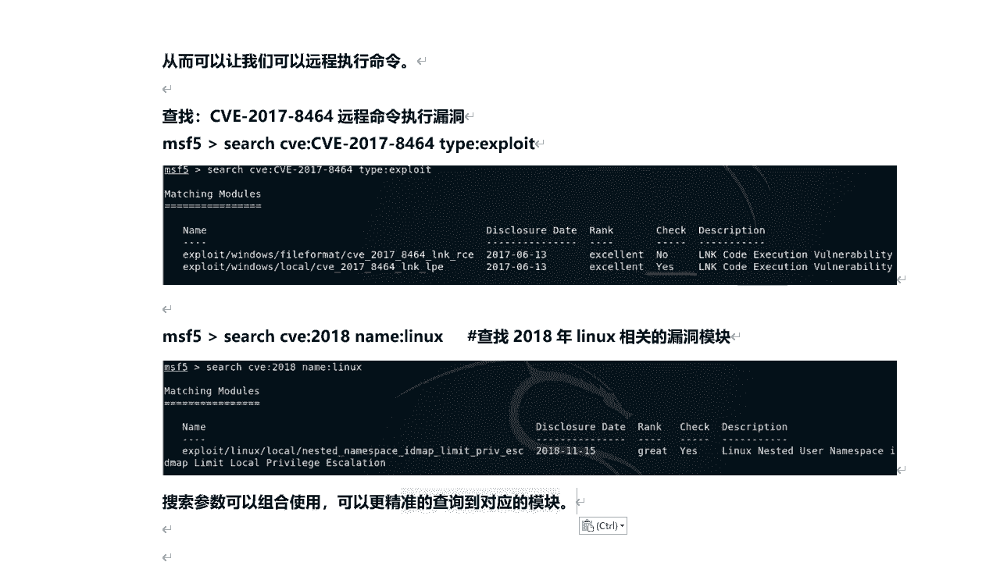