# 学不会我退出网安圈！中国红客技术正需要传人！全套666集还怕学不会？（网络安全／黑客技术） - P66：11.6-【Metasploit渗透】实战-使用msf扫描靶机上mysql服务的空密码 - 一个小小小白帽 - BV1Sy4y1D7qv

好那么接下来呢我们来看另外一个实战啊，使用msf扫描把机上的mysql服务的空密码啊，好那么这里呢我们来启动一台mate splable 2 linux，就是我们搭建好的那台靶机啊。

网络模式呢我这里是求解，ip地址呢是1。180，好，那我们来通过一张图啊来看，这是我们的攻击机啊，kelly对学霸的五三，那么这是靶机1。180，然后呢我们对他呢直接进行扫描。

它的能买四个服务的空密码啊，那么首先呢我们来登录一下我们的呃把机啊，这个把机账号密码是root 123456，我们设定好的啊，好好那关于这个账号root账号密码如何设置，前面咱们讲过是不是。

那么我们可以查看一下ip地址，来确认一下的目标，当然是在central测试过程中啊。

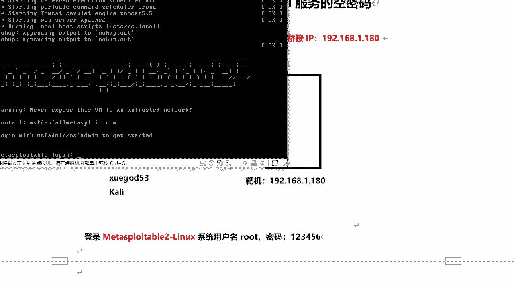

那你不可能直接进入目标集，对不对，那么你可以通过什么信息收集去扫啊，root 123456好，ip杠a好，那么它的ip地址呢，我们在这里来看一下它它是多少呢，1。180啊，这里是吧，好的没有问题啊。

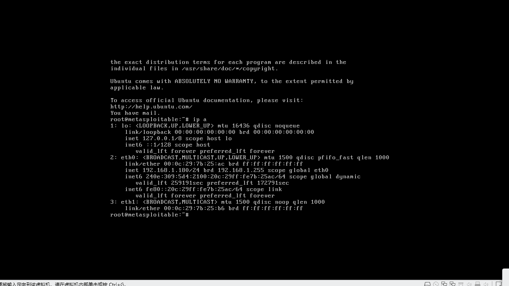

没有问题好，我们回到我们的k里。

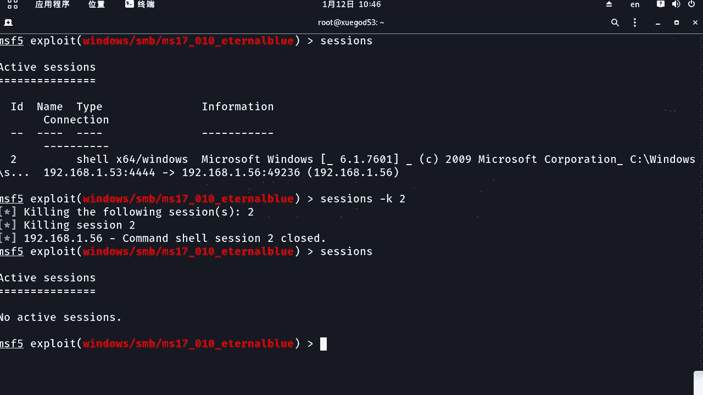

注意啊，那这里你去扫描目标机mysql服务的空密码，大家想一个问题啊，那么正常来讲，我们的数据库mysql都会设置密码的，对不对对，那么主要是这个为了检测啊。

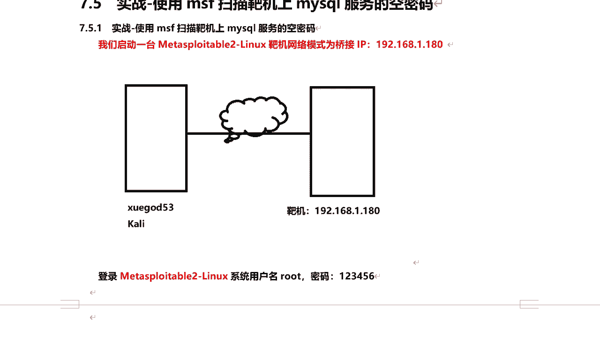

他这个你渗透测试这台机器，mysql是否存在空密码啊，如果是空密码相对来讲是不安全的，也存在一定风险的好吧，那我们登录ky开始来搜索这个模块啊。

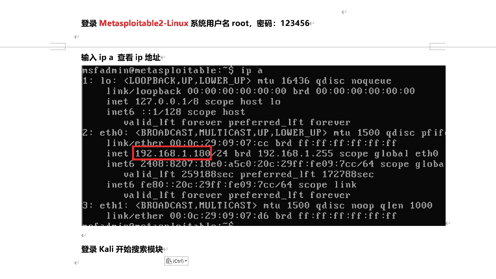

在我们的这个mad split里面，我们来退出这个啊，嗯mysql服务空密码，那么这个模块相关的关于买circle的，那么肯定跟登陆有关，下划线log in啊，那么它只有一个好吧。

而且是辅助模块authy，那注意啊，辅助模块的作用是进行新收集和扫描的，那么我们来加载一下这个模块，use。

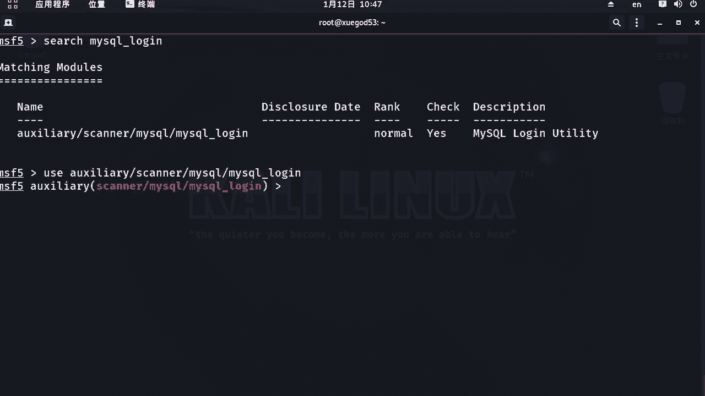

加载完成之后呢，我们来查看一下相关参数好吧，那么这个参数的相对比较多一些啊，比较多一些，那么首先第一个blank passwords啊，空密码啊，默认值是false，什么意思啊。

那么就是默认force默认就是不检测空密码，那么你如果要想检测空密码的话，怎么办，需要把它设置成了吗，true要注意啊，set blank b l n k下面password对吧，true设置完成之后。

我们来查看一下的好吧，ok这是第一个，那么还有一个就是说，我们需要设置目标机的ip地址呢，our ho，唉那我们的目标机ip是多少啊，1921681。180，这个根据你实际的ip地址去设置你的ip目标。

jip不一定和我的一样啊，你的是多少，设置成多少就可以了，然后so options好吧，那么目标记的ip是ok了，那么大家先想一个问题，到目前为止是不是这个所有参数，相关参数都设置完了呢对吧。

然后呢还需要设置什么其他一些参数吗，那比如说我们检测什么。

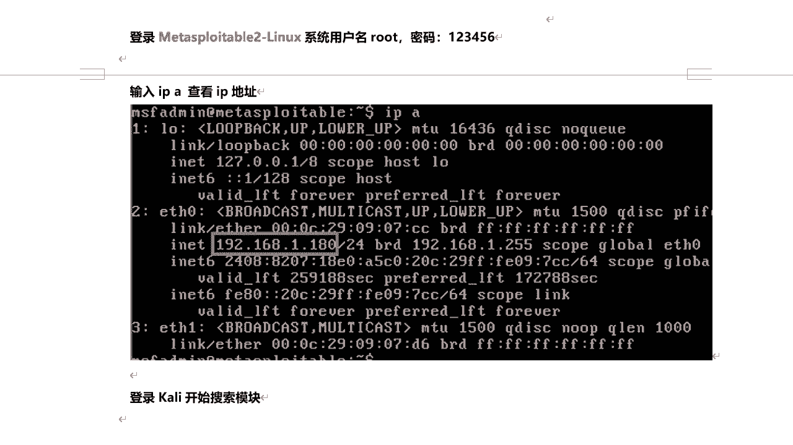

检测root账号的空密码。

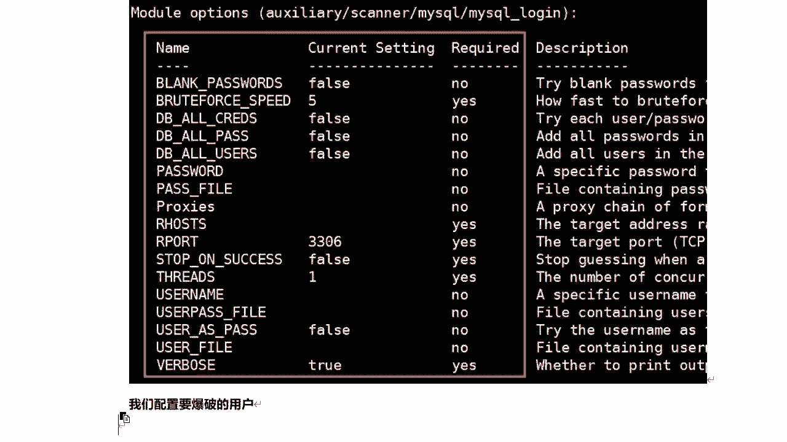

是不是啊，那是不是需要设置下用户名了好吧，那么这里呢有一个参数username是吧，set username，root需要指定一下的，对我们有很有针对性的去检测root账号的库密码，要注意啊。

那么这个设置完了之后呢，我们就可以来执行来运行这个模块，is polite对，很快出结果了，注意啊，那么在这结果如果出现加号，就证明什么已经检测出来了，1。1803306mysql端口对吧。

然后呢放的remote mysql，它的版本号检测出来了，那么这里success成功什么意思啊，成功检测出来它的用户名是入的，后面是空的，因为它密码是空的。

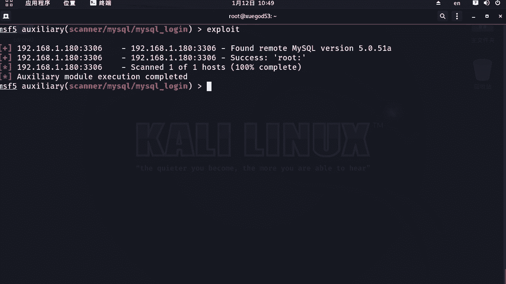

那么也就成功检测出来了它的空密码啊，存在空密码啊，然后接下来呢我们使用一个命令啊。

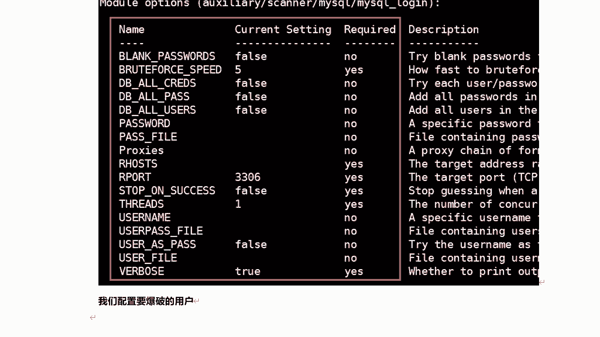

那么这个是什么后端凭证命令criss啊，来列出数据库中的所有的平局啊，那么也就是说。

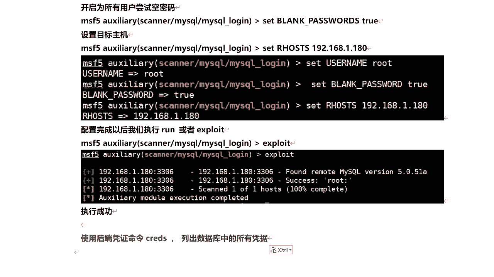

那么如果这个数据库里面啊，如果还有其他的一些账号，那么我们都会把它列出来，同时把这个信息存储在哪里，存储到我们的matt rt渗透测试框架，利用的数据库postgresql，这个数据库里面。

c r e d s，好那么这里的只有一个blank password啊，账号root，然后服务是端口3306服务器，tcp mysql ip地址1。180好吧，主机是1。180，这个我们就ok了啊。

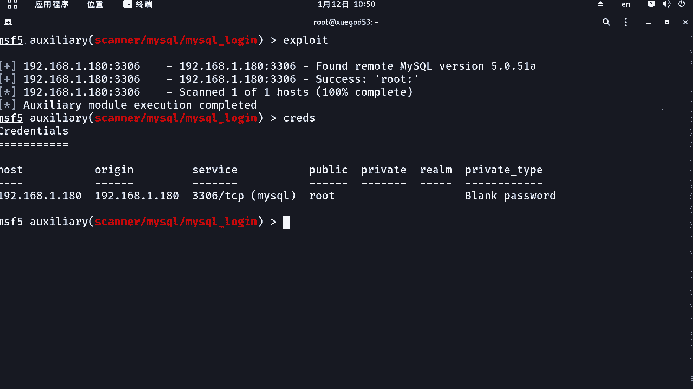

执行成功了对吧，检测mysql服务的空密码啊，那么接下来呢我们看另外一个问题啊，就是说我们在使用matter split对目标进行漏洞，利用渗透成功之后，比如说我们渗透了很多的很多的目标。

那么这些扫描结果都会存储到哪里呢，在一个数据库里的port gresql里面，对我们可以将扫描的结果导出mate split，然后呢同时导入到另外一台的mate split中，比如说我在这个开利啊。

做渗透利用对吧，扫描完成之后呢，我想把它结果导出来，然后呢发生过另外一个伙伴对，然后呢它导入到他的kd里面，mate play中，那么这里就需要用到数据库的后端命令嗯，那么也是比较常用的啊。

这里有四个db connect连接到现有的数据库，db disconnect，断开与当前数据库的连接好，这个是db export导出包含数据库内容的文件，以导出数据库存储的一个扫描结果。

db import导入扫描结果文件，那么注意啊，这个文件类型将被自动的检测好，那首先呢我们来看如何将前面扫描mysql，数据库的空密码信息来导出呢，对那么这里我们需要使用什么d b s p。

那么导出呢这里涉及到一个问题啊，就导出什么文件啊是吧，db export e s p o r t，杠h我们可以查看它的帮助信息，那么大家怎么使用啊，杠f指定文件的格式，那么它就是哪些文件格式呢。

这是两个，一个是xml，一个是pw dump啊，这个呢不是很常用，那么xml比较常用，那么也就是很多扫描工具，包括nas open mars也好啊，还有n map，他们的扫描结果都支持导出为xml格式。

那么这里呢我们使用这种格式啊，d b下划线export，然后杠f指定文件格式xml，那么导出到哪里，我导出到root家目录下面啊，b a k。tm，好那么已经完成导成功导出了啊。

那么我们可以看ios看一眼，这里会多一个文件好吧，这个已经成功导出了嗯，这里呢呃为了演示啊，那么我想将它导入到另外一台开机里面的，matters ploy中，但是我只开一台这里，那我先退出。

唉然后呢将这个数据库呢对清空一下的好吧对。

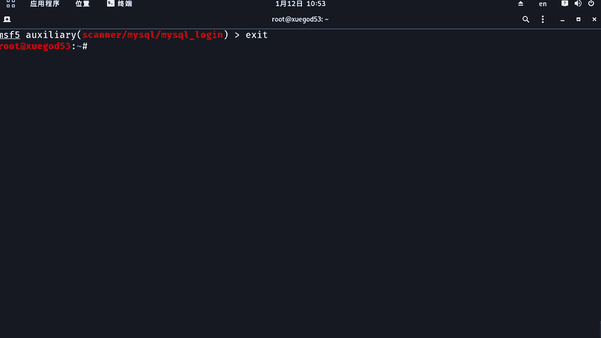

那么然后呢再导入好吧，那么将结果导入到另外一台mate supply中，因为这里呢我就不再开一台了，对因为现在我只开一台好吧，我直接重置数据库，将数据库清空，然后呢。

重新来把这个刚刚的结果呢再导入进来啊。

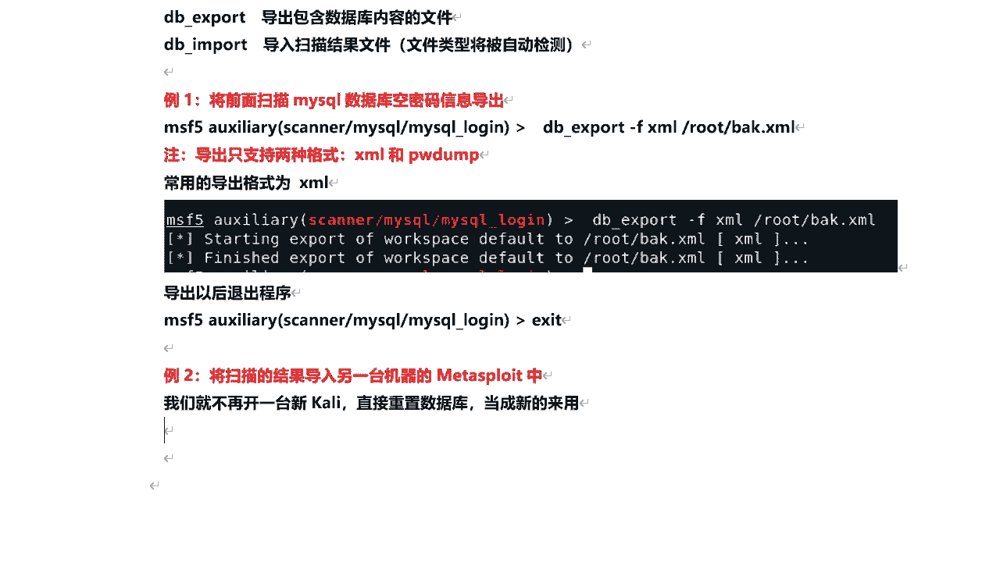

我们就可以来看到结果了好吧，那我怎么去重置数据库呢，msf d b remain，重新初始化，好稍等啊，好那初始化完成之后呢，我们来进入msf csol，进入这个框架，好接着后呢。

我们通过host命令来看一下目前这个数据库啊，里面是空的，什么都没有好吧，然后呢我们这里的host是主机的意思，那么就是你来渗透目标机，是不是渗透有哪些墨迹，通过这个命令。

可以把所有的目标机都相关细节都列出来，当前是空的，因为我们刚刚重置了是吧，通过import导入，那么导入哪个呢，root刚刚我们导出的那个文件xml好，导入成功之后呢，我们再通过post来看看。

好已经有记录了，为什么是两台啊，因为之前我们对win 7啊，利用永恒之蓝渗透是1。56，它的记录也在这里，还有我们的靶机mysql对空密码扫描对吧。

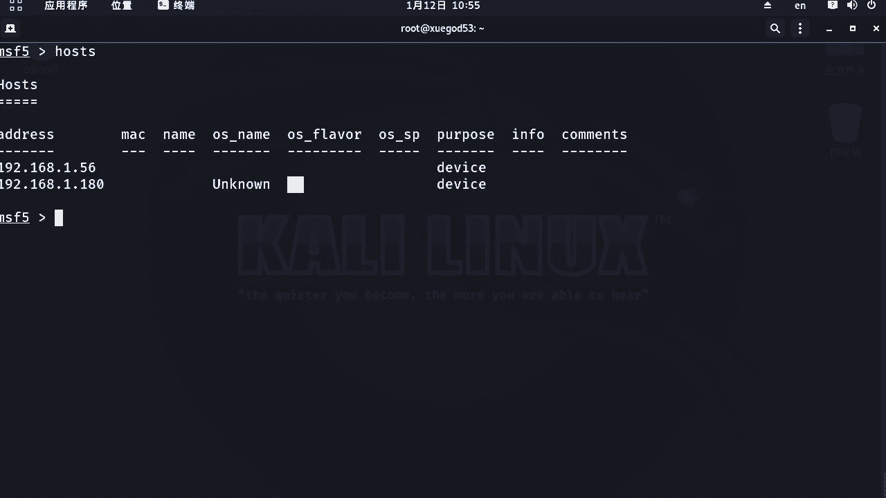

两条记录说明已经导入成功了好吧，那么这个呢就是导出扫描结果和导入啊，扫描结果哦，那么说这里呢我们再给大家扩展一下的，关于在这个host的命令啊。

那比如说我们这里啊，曾经啊对这个另mate light的框架啊进行很多扫描啊，扫描了很多目标主机，比如几十个几百个啊，甚至多了上千个啊，那关于host这个命令的使用方法呢，杠杆去我们查看一下的。

有很多相关的参数，你可以通过这个杠a呢往里去添加主机，也可以去删除某条主机或者是杠c，去自定义显示哪些相关的信息，那么这个season collins列的意思。

你这个是写address mark name，os name os对吧等等，这个你可以指定显示特定的列，那么这里可以使用显示哪些系列这系列啊，显示这些好吧，那比如说呢我们这里选自定义选择地址好吧。

然后操作系统啊，ok我们来设定一下啊，使用这个参数host杠c，比如选a d d r e s s name os name，或者我再再加一个啊，这个是这个是这列是什么意思，显示是漏洞的数量好。

那么我们看它就显示这几列，我们指定的好吧，那主机地址两台主机操作系统呢，这是未知的啊，漏洞数量，这里显示一什么意思啊，这个win 7有一个漏洞是吧，永恒之蓝对吧好。

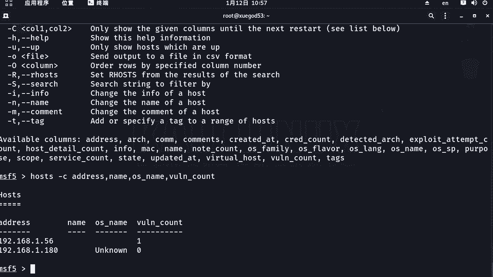

那么这是这个参数的使用方法嗯，杠c指定显示哪些信息啊，这些都可以自定义的啊，那么同时呢这里还可以去删除指定的主机啊。

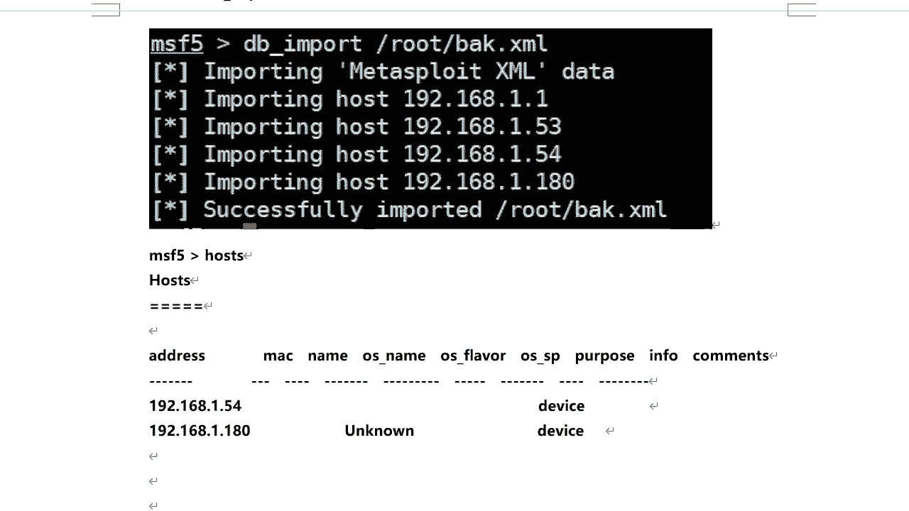

删除指定主通过什么参数呢，这里头我们刚刚看了是吧，通过来杠去啊，杠h更d更d，后面跟上目标机的一个i p地址啊，那么这里的比如说，那么我们想删除这个1。1。180，我把它想删除掉对吧。

那么怎么删host gd 1921681。180啊，这样呢就可以将它删除掉了，好吧对，然后呢注意啊，那么这样删除掉后，你再去查看它的结果呢就没有了，哎比如说我们来看啊，执行一下的删除掉了。

然后呢host的看1。180已经没有了，好吧对，那么这是删除啊。

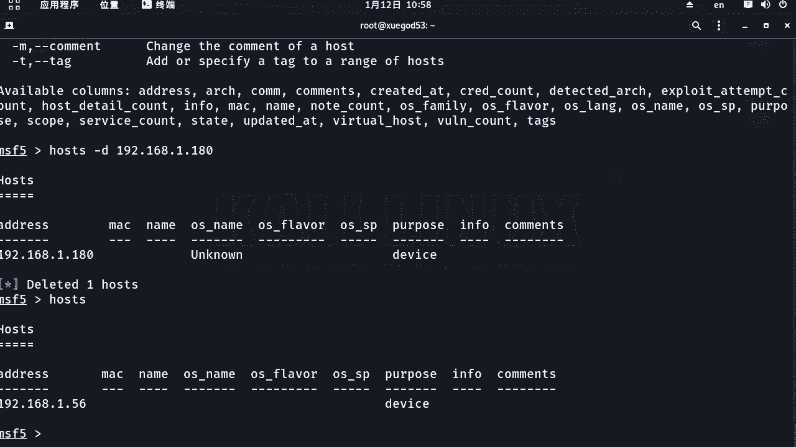

指定的一个主机啊，然后呢接下来我们看啊，呃这个matters lider，刚刚我们是从一台机器的mx 4 pro中去导出，扫描机构，然后呢再导入到另外一台机器的mate 4中，除此之外呢。

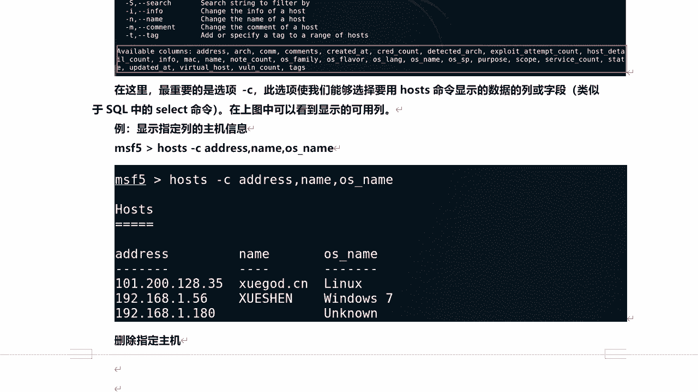

我们还可以把其他工具的扫描结果，导入到matter spli中，比如说nmap扫描结构导入到mate splice数据库中，对吧，那么这里呢我们先执行一个扫描来，再打开一个终端，n map杠大a啊。

全面扫描扫描谁大学没扫描，雪干了点cn啊，然后将它扫描，结果刚o是输出杠大x输出文件的格式tml，能不能搜到。

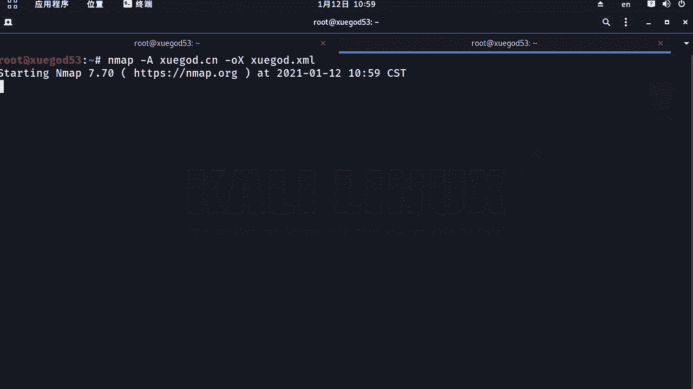

嗯这个全面杠大业全面扫描相当于慢一点啊，对因为前面我们讲过这个命令的使用方式。

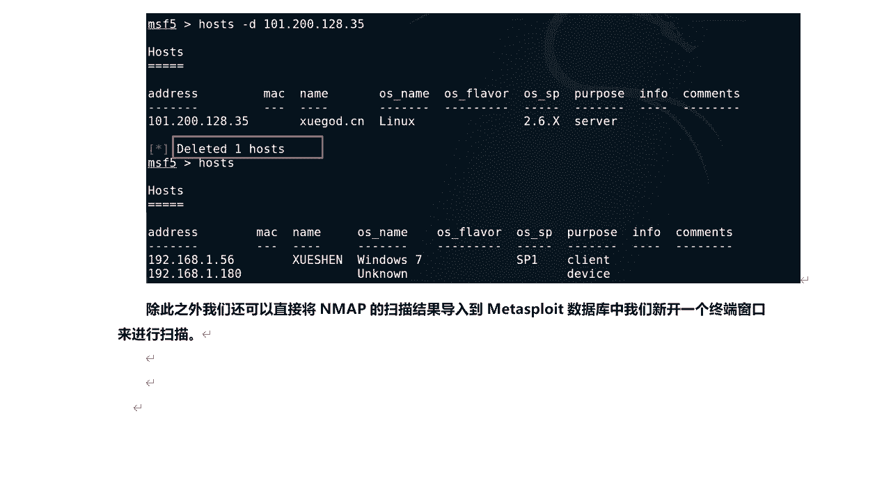

好笔记呢给大家整理到这里啊，就是正常我们之前使用imap，是不是没有后面的部分直接执行，前面他把小明结果直接显示出来了对吧，正常我们做渗透测试的时候，都会将它的扫描结果，导入到输出一个文件里面啊。

那么这个xml是经常使用的这种文件格式啊。

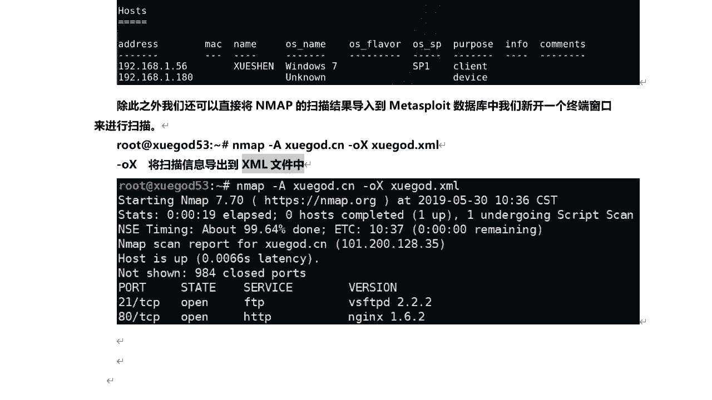

好那么已经扫描完了哈，扫描完了，然后呢这整个的扫描结果啊，然后呢，我们来看一下它根目录下面是否有这个文件呢，学了点xml好，回到我们的matter中，我们将这个什么结果呢导入，好导入成功之后呢。

我们的host来看一下这一块多一个ip主机是吧，是学霸的学神的ip地址啊，linux版本啊，server注意啊，刚刚我们使用ni得到了什么结果很多啊，开放了哪些端口，都有什么服务。

但是这里呢通过这个命令，查看的是什么主机相关信息，那么具体那些扫描结果如何去查看对啊，查看我们数据库中主机都开放了哪些服务呢，这里我们通过另外一个命令s e v i c e s service。

这样的话我们就可以查看到了对吧，那么这个主机开放了哪些端口，对应什么协议，每个端口对应什么服务，对吧，他有他的状态，还有每个服务对应的版本号详细信息啊。

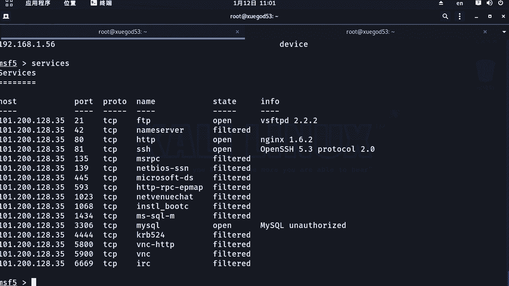

就显示出来了，好吧，这个大家学会了吗，对如何去查看这个扫描结果啊，好那么当你这里头如果啊大家看啊。

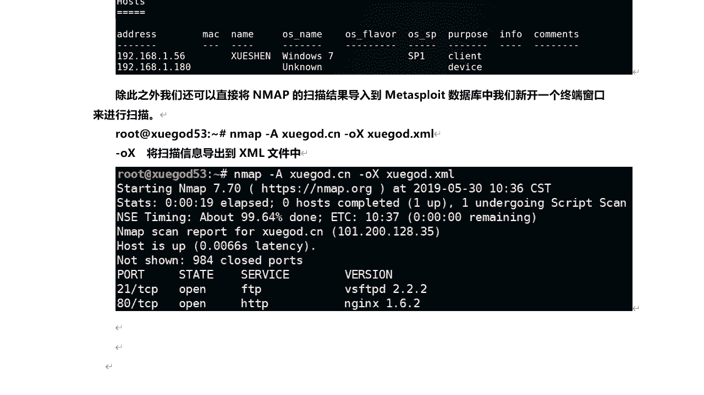

通过service命令。

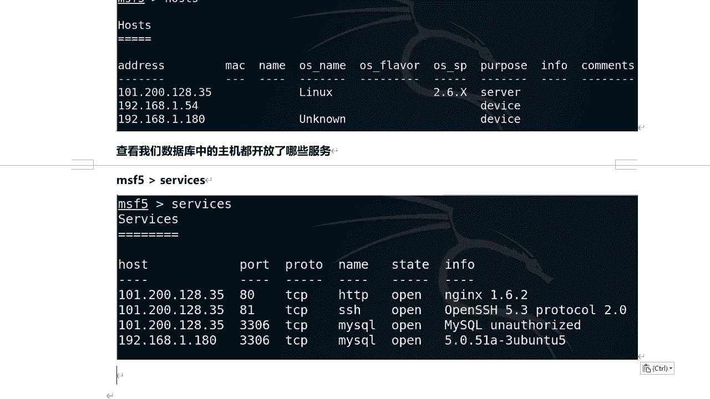

那么它是把所有都列在一起了，很多主机混在一起去显示的，对吧啊，当然我们这里180删除了没有了，比如说嗯我就想看这台主机学神的啊，它的开放了哪些服务啊对吧，它的服务开放端口及对应的服务。

可以通过什么s e r v i s service，杠杠r后面指定它的ip地址，好吧对查看只查看他的好吧对，那其他的资金就过滤掉了，不显示啊，那么这是这个命令嗯，这里呢还要给大家说一下啊。

那么无论是host也好，还是service也好，比如说举个例子，s e r v i c e s杠h我们看，那么这里比如说呃这里有一个参数叫杠i，是的哦，好它有一个搜索刚大s设置搜索功能。

这个搜索功能很强大啊，那么到底有多强大呢，比如说啊呃我想啊查找所有这些扫描结构中，那么开放啊，八零端口的啊，或者3306端口的啊，怎么说啊，s一对i c e s杠大s比如说3306。

他就把这个匹配出来了，好吧，那么或者是啥，那我通过这一个啊，这个多少，比如说有嗯嗯买四口是吧，他匹配哪个关键字啊，这个是吧，或者是呢我来搜一下这个open，你看所有open状态的都搜出来。

那么也就是通过这个参数啊，搜索它是匹配任何字段的模糊匹配，对输入很方便，那包括这个host命令，它也存在这个参数啊，杠大s搜索都可以和service是是一样的。

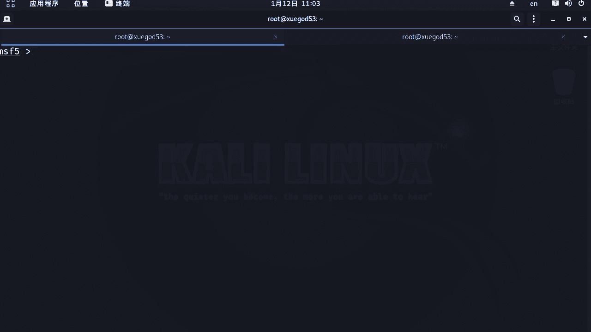

好吧，ok那么这个呢大家要学会去使用啊，学会去使用这个命令啊，然后除了他之外呢，这里头嗯其他的我就先不给大家说了，下面呢我给大家总结一下的啊，将我们matt spot常用的一些命令。

它的相关的翻译我给大家翻译一下的，也就是说我们进入这个框架之后，通过hmon才看到的所有相关命令好不好，那我给大家翻译过来好看嗯，嗯这里所有标红的啊，标红的就是常用的好吧。

哎那么这些省大家去翻译的sence，sence back info options是吧，search use，这些都是常用的，常用的，大家需要记住啊，记住导出导入啊好吧，prize啊，那么这里还有一个。

大家列出数据库中的所有漏洞，v u l n s什么意思啊，那么也就是说你通过mate supply对那么去渗透啊，攻击你检测出来所有目标及相关的这些漏洞。

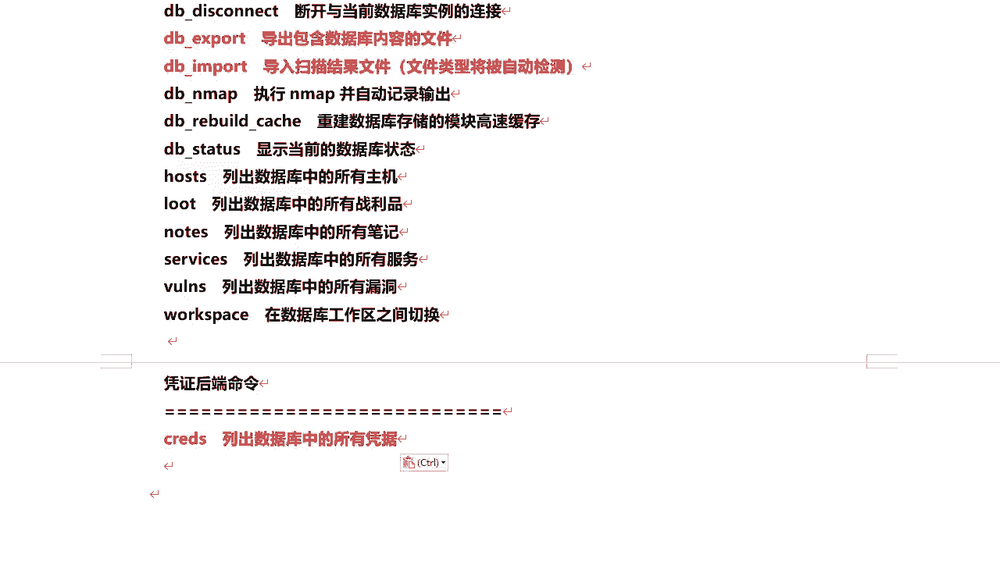

你通过它的对都可以列出来，你看长1。56m417 杠010，这个记住就显示出来了好吧，如果有其他都会显示出来。

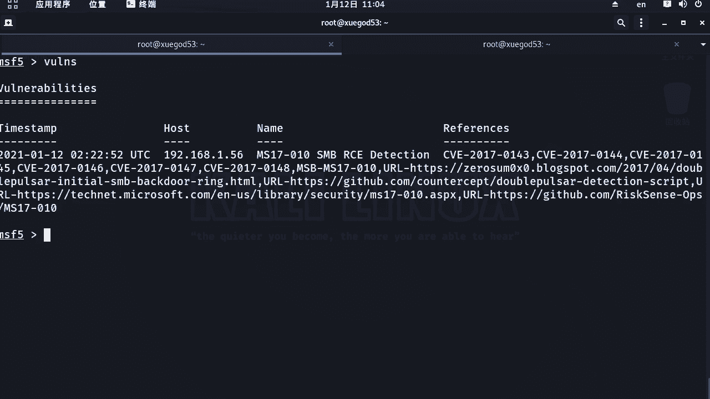

都会列出来，好的，那么我们来做个总结好，那么今天的课程呢主要给大家讲了哈，matt pride渗透测试框架，它的介绍好吧，它的架构啊，目录结构啊的版本对比啊，然后呢再接先来带大家搭建了mate 2啊。

这个靶机系统啊，他是g是吧，迪拜和新的欧邦图啊，定制的这么一个巴基，还有matters fly基本使用方法，常用的一些命令搜索方式，这些都很重要，好吧，大家一定要多加练习，另外呢接下来有实战啊。

使用msf渗透攻击win 7主机并远程执行命令，这里利用的是win 7的永恒之蓝，m417 ，杠0110，今天只是暂时的利用这个模块，让大家体验一下的对吧，拿到如何去对面搏击渗透利用啊。

那关于永恒之蓝漏洞，这个利用的后面会详细的去讲啊，最后呢我们通过一个实战使用msf扫描靶机，也就是mate 2像买四个符的空密码好。

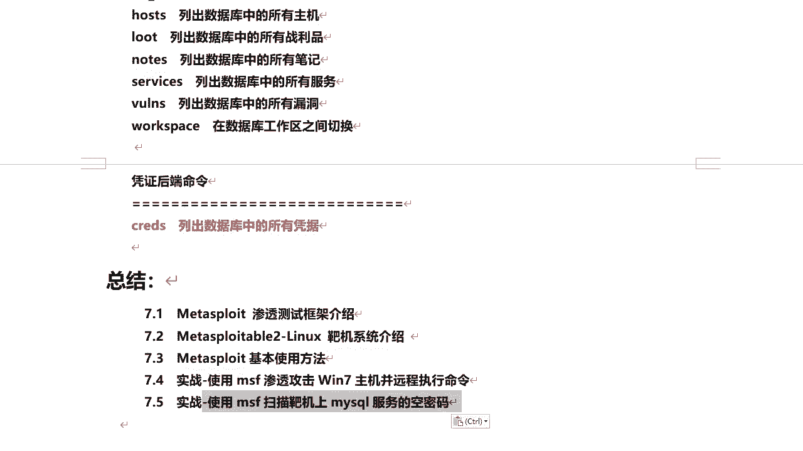