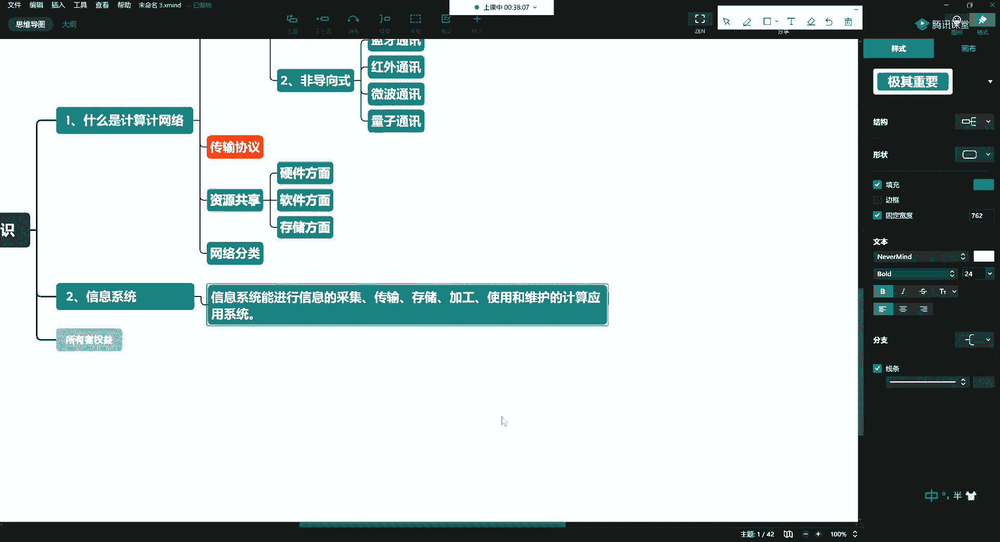
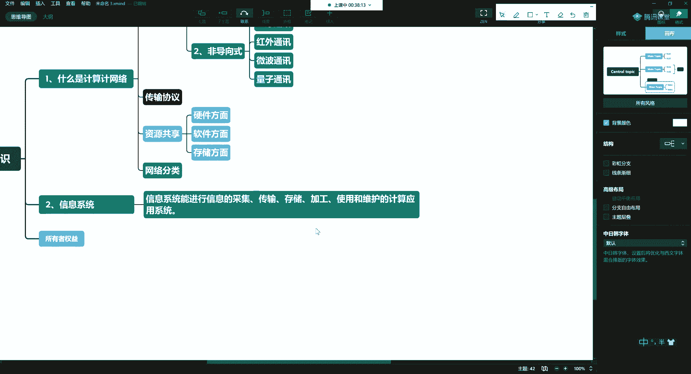
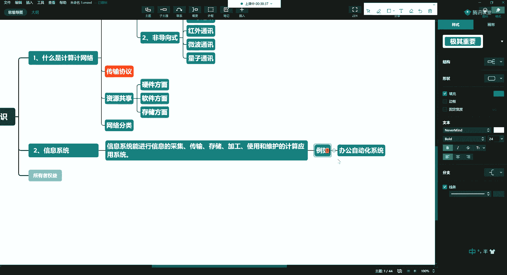
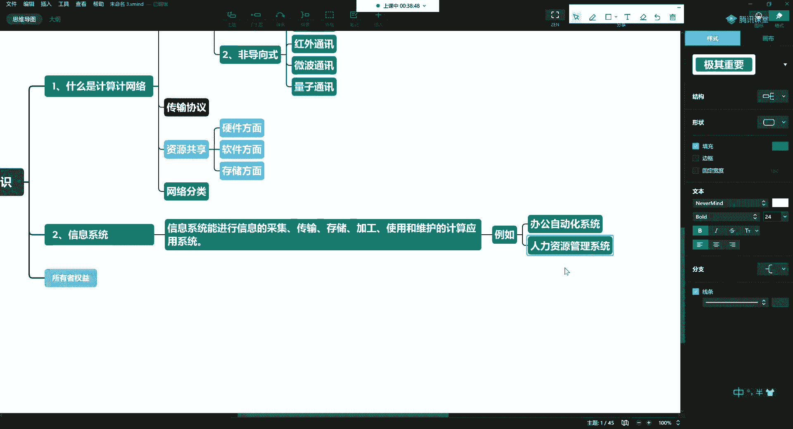
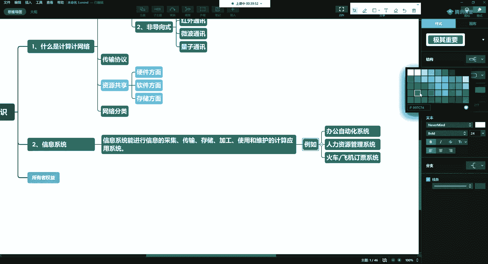
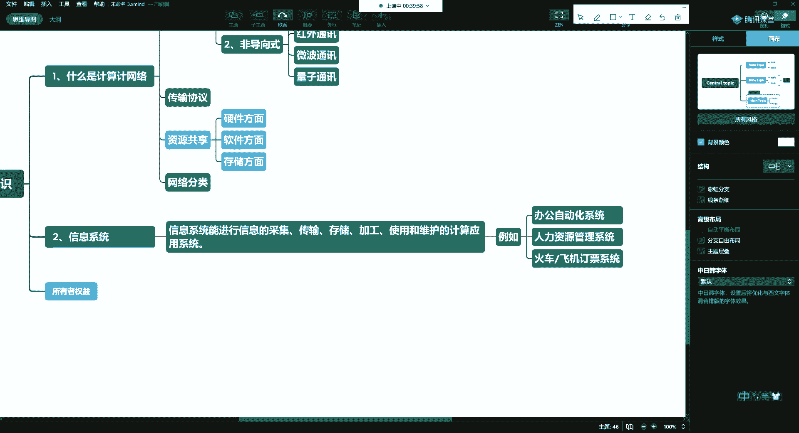

# 学不会我退出网安圈！中国红客技术正需要传人！全套666集还怕学不会？（网络安全／黑客技术） - P8：3.2-网络安全基础-计算机基础（下） - 一个小小小白帽 - BV1Sy4y1D7qv

我们能够使用啊，并且呢还能够进行维护，这样的一个计算机应用系统，我们就称之为信息系统。

啊那么有什么是计算机信息系统。

例如，我们常见的有很多，比如说我们见到很多了，比如说办公自动化，这就是一个比如说我们还会经常见到的，比如说人力资源管理系统。

对啊，还有比如说销售用的这些cm，对不对啊，比如说这个马尔滨教育。

我们用的这个这个云平台，对吧啊等等等等，以及将来开发的一些a p p啊，比如什么火车呀，飞机呀，是不是有订票系统，等啊这几个都是比如说你去超市了，看那个收银的啊，他是不是也有一个操作系统是吧。

哎还有比如说一些进行盘点的一些功能，所以呢去超市的时候，我们经常呢人家收钱，我站在后边啊，我们看他那系统长啥样，这个每个人可能爱好不一样对吧，我们计算机行业的总想看看人家的系统长啥样，看着挺好玩儿的好。

