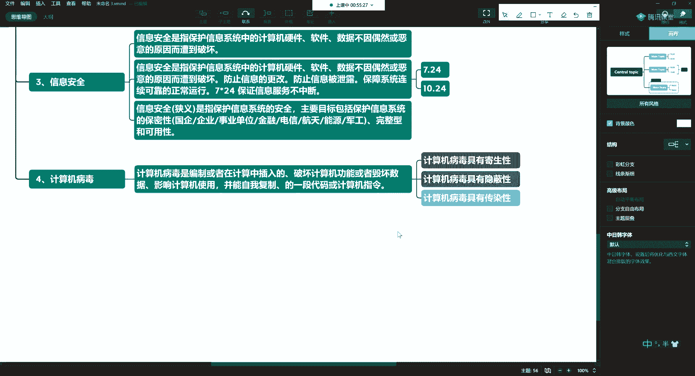
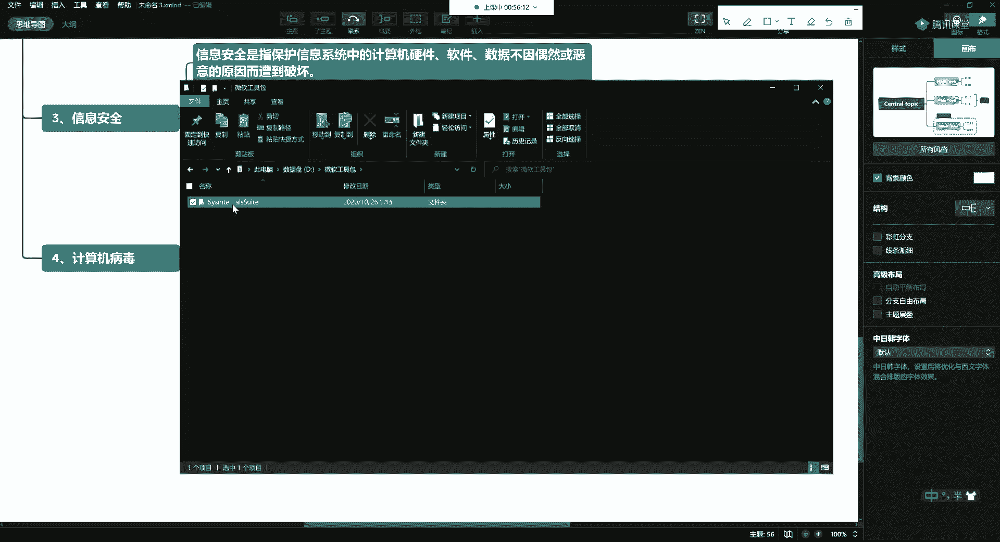
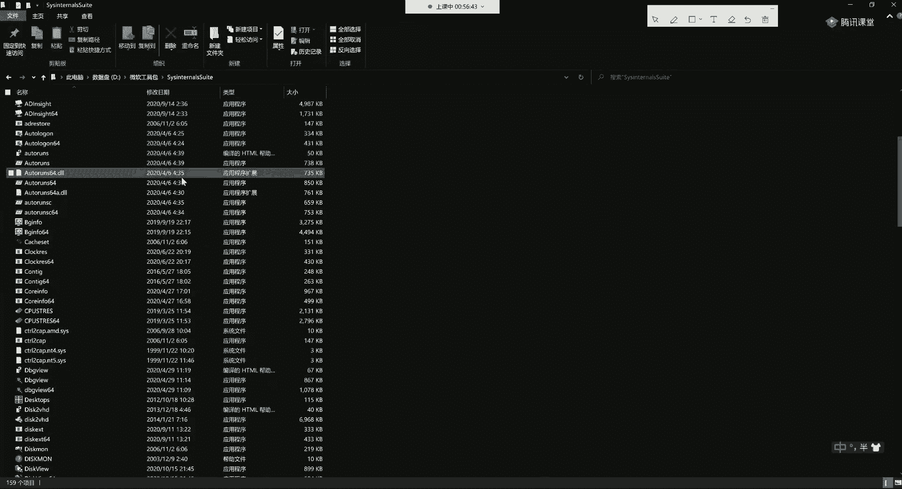
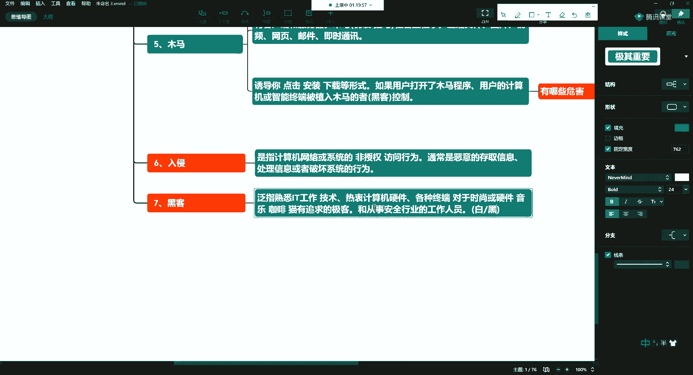

# 学不会我退出网安圈！中国红客技术正需要传人！全套666集还怕学不会？（网络安全／黑客技术） - P9：4.1-网络安全基础-病D、恶意程序、入侵（上） - 一个小小小白帽 - BV1Sy4y1D7qv

好然后呢第三个呢咱们介绍一下信息安全啊，那么信息安全呢它是一个较大的一个学科啊，那要不你做啥的呢，那你对吧，哎可着劲儿的，你可以去介绍，那么信息安全呢它是写在这儿啊，信息安全就是指。

那么我们在这里头其实是矛和盾的关系对吧，唉我们这里都是白帽黑客，即便是你说的是搞邪恶，他也是白帽的，就是我们是用在正当地方的，当然也有一些人呢它会变成老鼠屎啊，它会用到一些邪恶的地方。

总而言之言而总之啊，你会灵活应用就是一件好事啊，至于你用在哪，反正我是告诉你，用在一个这个合法的范围内是吧，如果你非不听你，你就不乐意，你就要走上犯罪道路，那我能把你咋地，我也不能把你咋地对吧。

哎所以信息安全是指保护信息系统，就是第二个，我们刚才为啥要介绍信息系统啊，我们就是保护他这些系统里头的这些信息，所以保护信息系统中用的计算机硬件，唉首先咱得保证硬件啊，那比如说人家要人家就玩混的。

我要不黑你怎么办，我把你的硬盘都拔走啊，是不是，那你数据也都丢了，所以说我们要保个硬件啊，我们经常会听说一些ci h病毒对吧，它会专门对硬盘下手的啊，会破坏你的引导，损坏你的硬件等等等等。

这也是所以对它的硬件软件，还有数据，那么这句话怎么说呢，叫不因偶然，恶意的原因，遭到破坏啊，这这这是文绉绉的一个话啊，换成我们老百姓的话，就是防止他搞你啊，这个网络安全呢永远在路上。

那么它实际上是一个矛和盾的东西，比如说你出现了一个新的攻击手段啊，那肯定过一段时间就会有一种防御手段的出现，对吧，哎所以说呢网络安全这句话还是那句话啊，网络安全永远在路上好好，那么光破坏不行吧。

是不是唉这种呢是攻击性比较强的，说他就来破坏你的系统，那么还有是什么呢，比如说防止，信息的更改啊，这个也不行，比如说您弄一个网站对吧，哎他丑他他恨你，对不对，他把你黑掉了，然后网站首页给你改了啊。

来这么一句，那你也受不了，所以呢也要防止信息的一些篡改，那么信息的篡改呢就有很多种方式，我们就要了解操作系统对吧，我们操作系统中有md 5的一个值啊，昨天我们在讲的150个命令的时候，也介绍过了。

我们可以写一个脚本啊，让它在后台运行，一旦监测到你核心的目录发生改变了，那马上进行告警啊，所以将来的这种监控呢也是一些，比如说防止入侵呢，或者检测入侵的一些有效手段，所以防止信息被更改，那么还有什么呢。

防止信息被泄露，啊你看那个今天我看了一个新闻啊，今天说什么呢，美国大选这个还没有接票呢，现在股票的这个数据基本上就已经出来了，被黑客盗了啊，就已经放在网上说这谁投了特朗普啊，谁投了拜登。

现在呢网上这些票都知道了，所以呢防止更改，防止信息泄露哈，那么我们所说的网络网络在这儿呢，其实呢都要加一个限定，就是我们正常的网络，实际上呢我们在网络中呢还会有深网，对于一般的普通人的生活呢。

你可能觉得对你影响不大啊，但是呢这里都充斥着暴力对吧啊，在这上边都可以干啊，所以说接触不到一般的像什么暴力啊，军火啊，哎等啊，什么雇凶杀人呐啊各种揭秘啊对吧，等这些信息都可以在网上去卖啊。

所以说呢这些东西呢都是，比较邪恶的，那么在于我们国内呢，是因为对网络呢，实际上进行了很多的监督和限制啊，今天我又看了一条新闻，就是现在国家呢对嗯，这些浏览器就是我们国内出的这些浏览器。

你浏览器你都要走一些流量对吧，哎对于浏览器呢，这些嗯流量以及上面的新闻和内容进行审查啊，现在国家在做这件事，那么最近呢国家呢还对国内的，大概有几10万款的这种安卓平台的app啊，进行整治和下载对吧。

那些广告啊里头有些木马啊啊等等等等，包括一些加密呀，非明文的加密呀啊等都要进行整治，勒令的一些下降啊，所以防止信息泄露啊，保障系统连续可靠的正常运行，那什么叫连这个话，我给你翻译一下。

七成就是7x24小时乘以360对吧，那我同学这为啥是360，不是365呢，实际上呢你要是去银行去看啊，他平均起来它是360算的啊，因为这有一个平均平均的日期，那你要说通俗一点呢，就是365啊对吧。

好那么简单说呢就是7x24啊，这样的去进行啊，那么对于这个系统的这一块的话呢，是由运维工程师来做啊，所以呢我们这块呢就不不做过多的限制了哈，那么我们一般的服务器呢买来从开机到它下架，一般都是跑2年啊。

那如果是戴尔的等这些国际品牌的话呢，你跑3年没有问题，硬件都不带坏的，如果是国内的品牌，大概跑个2年左右，就这这那出问题有一些毛病啊，所以呢保证系统的安全可靠的正常运行，这是一个啊。

那么保证信息服务不中断，那么这个也是啊，所以说呢如果你做安全的话呢，那你会7月24号你也过一回结，对吧，1024呢，那你也过一会接哈，好那这里头你过两回节啊，你能收两回礼物，是不是唉这个你7月24号呢。

你可以收个iphone，10月24号呢，你再收个ipad对吧，哎你这样的话呢1年对不对，你这三件套你就收了俩，然后你自己在天上钱买个电脑，这不就三件套了吗，是不是。

所以说呢这个广大的这个这个这个男同胞是吧，哎你一定要回去给媳妇普法一下啊，说我们这个工作1年要过两回节啊，这两回节很重要，一个是7月24，一个是10月24，那么信息安全呢狭义上呢是指什么呢。

啊这有广义的狭义的啊，这个东西呢在这儿呢讲这些东西呢啊，都是一些文字性的描述啊，所以呢可能会相对枯燥一点啊，信息安全是吧，我们狭义上讲，啊他不是相对论和狭义相对论，广义相对论，那么这里头呢狭义上讲呢。

就是指保护信息系统的安全，还是跟第二个相关啊，我们要保护他的安全，主要的目标包括保护信息系统的保密性，所以有什么一样的企业优先要去做这些，比如说我们这些国企啊，你看现在国企在安全岗位都标配了啊。

然后有一些企业和事业单位，啊你看那些这个这个这个这个医院，研究科研机构啊等等等等也有，然后就是金融电信航天航空能源啊，所以你看呢就是嗯学安全完了以后呢，实际上你去一些大厂都是比较好的啊。

比如能源是什么呢，国家电网啊对吧，中石油中石化啊都需要这些课，所以说我们要保证它的一些保密性，尤其是像金融行业对吧啊，还有一些特殊行业啊，就是军事部门的，叫军工单位的。

当这些个我们通常要保证数据的保密性啊，那如果从云计算角度来讲呢，保证数据的完整性，啊我可用性主要就是这一方面啊，那么如果我们展开来说，这个信息安全就指的是信息呃，安全的一个广义上来说，这里的内容就大了。

所以说呢我们在后边，我们再慢慢的去给大家介绍啊，媳妇儿说每个月14号都是情人节，诸葛钢铁啊，这也是一个有趣的灵魂啊，这哥们儿啊，这个情人节好办呀，你这不就是送花巧克力嘛对吧，拿个程序对不对。

我们给他打点花对吧，唉你就买块巧克力，德芙是不是嗯底下711就能解决啊，好然后基础知识的第四个啊，第四个第四个我们说一说什么呢，我们说一下计算机病毒，哎你不要犯困啊，今天我们也有干货。

我们会写恶意程序啊，怎么着把自己电脑搞死啊，除了fc炸弹以外的，把自己搞死也会有很多，所以计算机病毒呢也是我们经常见到的，是不是计算机病毒是啥啊，他就是一个恶意程序，所以计算机病毒呢啊就是编制啊。

上面编写编写制作啊，或者在计算机中插入的，破坏计算机，功能或者毁坏数据，影响计算机使用，并且呢能够自我复制，啊这样的一段代码，或者叫计算机指令，对吧哎也可以叫啊程序代码，刚才说了啊。

其实就是这样的一个东西啊，所以说它有什么特点呢，啊我计算机的这些病毒啊，计算机的这个病毒具有什么特点呀，唉寄生，啊寄生，比如它可以注入到某一个程序上啊，当你这个程序运行的时候，顺带把它一块弄上对吧。

哎这里头就有，所以这是一个典型的特点，寄生性，那还有什么呢，隐蔽性啊，不是很轻易的就被你发现，但是呢通过一些专业的工具啊，或者一些专业的知识，我们还可以去甄别它，好第三个呢就是具有什么呢，具有传染性啊。

这几个特点，那么我们平时的话呢。

比如说有同学会问说老师啊啊亮哥，我平时我弄一个什么样的工具啊，可以去对吧，这时候呢我们可以使用这个微软的啊一些工具，我找找，微软的工具包啊，那么实际上呢有很多人呢认为呢说做渗透啊，等等等等啊。

就非得是用咖喱，非得用这样的，其实不是，除了ky以外呢，也有很多，比如说忍者系统，比如说鹦鹉螺系统啊，比如说windows系统，那么还有微软自家的出现了这种安全的工具机。

那么这里头你看光微软的这种工具集，这里头就有上百款，大概有200多款去可以去做的，这里头就有200多万，所以这些个东西呢，都可以通过微软的官网来下载啊，这些东西呢可以维护你的操作系统。

比如说你windows 10的启动项对吧，哎那么你怎么去删除它等等等等，都可以通过这些东西来进行下载啊。

所以呢你如果就做一个windows系统的一些渗透，和一些黑客的工作，就可以用它来完成好，这是给大家介绍的啊，计算机病毒，那么写一些简单的病毒，其实它就是一个代码，一个程序，对不对，好写一些啊。

那么代码其实并不可怕，他只是啊它实现了，特殊的功能就是他的需求不一样，比如说举个例子，就是我们这样的网络，是不是他可以跟你去聊天，他也可以去传输文件，对不对，我也可以利用你的漏洞。

在你不知情的情况下并进行攻击啊，然后我可以上传或下载，啊你的数据是不是哎，那么换句话说用我们老百姓的话，那就是我们他把这个技术啊没有用到正道上啊，所以我们所学的这些技术，都是一把双刃剑，你不要问我。

你能干什么，对不对，其实学完了以后，这个东西呢是靠你自己想象的，你心有多大，你想象力有多大啊，你思维有多开阔，你就能干，你想成这样的事，那你如果呢就是老师教你呀，这样你就是这样对吧。

哎那这时候那你就只能干这么点事儿是吧，你要去想，因为有些东西呢，有些东西我们没法在电视上播啊，所以你只能自己去体会哈，第五个呢就是说说什么是木马，啊木马，那么这里头的木马呢。

也是在我们计算机中经常出现的啊，那么全称呢叫特洛伊木马，是不是啊，咳咳咳，木马是一种，用来非法收集信息或控制另一台计算机，的特定程序，不管病毒也好，木马也好，他们都是程序啊，都是为了达到一些特定的目的。

那么木马的话呢，就像我们去签一个木偶一样啊，他的目的就是，我能悄悄的收集你计算机中的资料，或者是通过黑客发出指令，对你远程的计算机进行远程控制，好，通常这样的程序，在我们程序架构里头是典型的cs架构。

那什么是cs架构，好这个对于开发人员来讲呢，他们其实是有优势的啊，他知道什么是cs架构，所谓的cs架构呢，就是我们在这里头c是指客户端，啊s就是我们的server端，就是我们的服务器端。

那么这个就是典型的一个cs架构啊，然后的话呢还有与之对应的，还有b s架构，所谓的b呢指的就是浏览器，s指的依然是，你的服务器端啊，诶这么别扭呢啊丢一个字母好，那么这样的话呢，你这个用户是吧。

你的pc被人家攻击了以后呢，他植入这个木马就是一个特定的程序啊，那么植入这个过程是很复杂的一个过程，那么稍后呢我们会给你讲，黑客黑掉你的，这个整个过程是什么样的一个过程啊，然后的话呢对你这边呢。

比如说就诶对吧，安装啊，上传，安装一个程序，那么这个程序特殊，那么特殊在哪儿呢，这里头做过免杀，什么叫免杀呀，就是欺骗你的杀毒软件，让他觉得他是在白名单里的，唉我是一个正常的程序，比如说他也叫qq。

跟你腾讯那个qq，他会觉得是一个啊，因为他不是恶意的，所以在这里头呢就会有一些加壳对吧，哎或者呢这里会涉及到底层的，比如说c语言会涉及到汇编，会涉及到花指令啊等等等等。

所以这里头呢如果想深入的去做这一步，是需要你有很强的计算机编程，以及底层的这种功力的啊，好那么这时候呢我们就可以啊通过cs架构，然后通过客户端，客户端怎么连接你呢，就是通过tcp ip协议。

啊tcp ip协议，那么就通过三次握手和四次挥手啊，这种方式建立连接，好，然后进行数据的传输哈，那么通常刚才说了，通常呢这个程序呢是c s架构的啊，有，有客户端和服务器端啊，这两个，角色啊这两个部分。

那么木马呢通常会伪装成程序包啊，压缩文件，所以这里头也是我们经常小白啊，容易中招的啊，那这里头的伪装或者说给你挂嘛啊，这里头这个东西就叫做社会工程学，所谓社会工程学呢，就是利用你的人的啊行为习惯说。

我们不但要研究程序，对计算机等内容进行精通，我们还要研究人啊，所以说呢这里头比如说我伪装成一个压缩文件，当你一解压，我顺便就把它解压到某一个地方去执行了啊，当然我还可以隐藏的是图片啊。

发一个特别好看的小姐姐，衣服穿的特别少诶，那你肯定愿意看，穿的多了，你肯定不愿意看呀对吧，或者说我这有这个某某老师最新的动作片啊，你愿不愿意看好一愿意看完犊子了啊，还可以是什么呢，发视频。

啊发视频起一个很有噱头的一个标题，你点点点，那么视频呢它可以做两头的这种加密，也可以在中间做时间，时间轴对吧，时间轴的话呢也可以去跳各种各样的事，所以这里头都可以啊，通过各种行，包括还可以通过网页哎。

给你一个网页啊，邮件即时通讯，啥意思，qq啊或钉钉对吧，唉或企业微信啊等等等等，gp给你发一个说叫什么full max for mail，这个这个邮件客户端，定金客户端，你点完犊子对吧，中招了。

有很多互网行动啊，你会发现，有时候他们这个服务器被内网的服务器被打穿，都是什么，都是一些维护人员在一些论坛上，比如说上边放出什么最新互网行动工具包，点下来一解压缩一双机啪叽就打穿了，都被黑了。

其实就是这么样的一个过程啊，那么这些个内容呢都是干啥呢，所谓社会工程学呢都会引诱你啊，叫诱导你诱导你点击呀，安装啊哈诱导你下载啊啊等形式诶，就让你防不胜防，你觉得很合理。

比如说他这里埋了一个wifi对吧，这个wifi你能搜到，比如说你出差或者在机场，或者在这个这个火车站啊，经常容易会出现这种情况，因为你着急用网啊，比如你抢票啊是吧，哎他现在放出来一个没有加密的。

那这时候它会诱导你下载，你下载完了以后就完犊子了啊，那么如果用户打开了，啊我打开了这种木马程序，你的计算机，或者是什么呢，比如说一些智能终端，就像咱们手机ipad呀啊，哎你这些智能终端啊。

比如安卓的是吧，有ios有安卓的啊，那么这样的终端你一旦使用的时候，那就会被，植入木马，主啊，哎就会被他们控制，啊那么然后达到一些什么呢，窃取你的数据啊，所以说这里头会有一些危害啊，有哪些危害。

嗨他们的目的就告诉你，这一般的都很多的都是这种境外的啊，敌特对吧，哎跟我们对着干的啊，会造成数据被窃取，那么一种呢就是跟我们看电影似的这种特工，这真事儿啊，这真有，那么还有一种呢被窃取，这属于商业间谍。

比如说我跟你竞标对吧，你写标书，我写标书，我要看你的这个底价是多少，对不对，哎干掉你这样的话能得到这样的东西啊，所以造成了数据被窃取，那么还可以干嘛呢，比如说被修改，篡改好比如说你这是一个电站，对不对。

你是一个核电站，那这时候如果你被控制了啊，那是不是就可以让你那个燃料棒过热是吧，哎还在干着干什么呢，那叫电子账户，比如说里头可以是邮件，对不对啊，或者说里头你的资金现在呢你去银行办一张卡。

银行的话呢都会把这个嗯小额转账，免小额免密支付或转账这个功能给你关闭，是因为最近的这些问题频繁，啊还有可能呢这些东西被盗用，比如你的qq号被盗了啊，植入木马，它可以干什么呢，伪装你，啊跟你的家人。

朋友圈去报警，比如说你们在这个手机中啊，备注，比如说你的爱人啊，你的女朋友和你的男朋友，那么你们最好用个昵称啊，不要赤裸裸的写个老婆啊，如果人多的话，你这些老婆123456，是不是你得给标注清楚了。

那这样的话呢在别人利用你信息的时候呢，他就可以伪装你给他们发信息啊，比如说问咱家密码是多少，这卡密码是多少对吧，哎字你给他回一封，回一封就完了啊，所以呢一些备注要注意啊，这是我们简单的说一些木马。

那么如果在windows下做木马的话呢，需要对windows的win 32哈的sdk的编程，有所了解才可以啊，好这是木马，我们也给大家介绍了啊，第六个我们要介绍一个什么呢。

第六个呢我们介绍一些我们所谓的入侵啊，那么一听到这儿呢，可能大家听着就不大舒服啊，容易让人联想是吧，哎我们经常说某个女孩子去夜跑了，然后被人怎么怎么着了啊，就经常会有这样的，反正呢就带有很强的不安全感。

是不是，那么这个入侵呢在计算机里头也是这样的啊，是指，计算机网络或者系统好，对吧，所谓入侵呢就是在你不情愿的情况下，是不是怎么怎么着了哈，那在计算机里呢就是非授权的啊，你没有被授权，没有被允许对吧。

你就过来亲亲抱抱，举高高，那肯定是不行的，那一个逼兜就得抽过去，抽死你，是不是啊，所以这个姐姐如果要学过过肩摔等这些东西，那你就完犊子了啊，对不对，还有经常一些小哥哥也会遇到女流氓打劫啊。

所以这东西你也不好说，所以呢这个东西引申为就是非授权的，不愿意的，不情愿的啊，不是但是呢说了这句话呢，这个广大男同事啊，这些未婚的这个这个这个男同事，你也不要害怕，你不要说说亮哥说了没授权对吧。

那就就不能怎么样对吧，唉你该亲还是得亲啊，如果他不躲，那那是不是那就属于默认授权啊，这东西你你你不要死穴啊，不要死学，我说的是一般情况下，那你怎么着人家也得挣扎两下子，你不挣扎，显得不够矜持是吧。

中摊大劲儿了呢，觉得哎呀万一你要会错意了，觉得人家不愿意啊，人家心里觉得你是大傻子，那也不好对吧，所以还还是啊属于未授权的，那么未授权的什么呢，访问行为啊，那这样你不就记住了吗，对不对。

唉那你不能看到一姑娘，你老问人家对吧，你不能老问你说我可以抱你吗对吧，我可以亲你吗，你老问你问人家，人家只能说那不行啊，对不对，对吧，那姑娘问多了，人就说你别老问行不行，人家就觉得没劲了，是不是。

那你该往上冲，你就还得是往上冲的啊，所以这里头指的是非授权的访问行为啊，通常是恶意的，通常是个意思，好吧哎这里头一定要注意啊，这通常是恶意的，当然你也不能说了，说哎这个就老实说了啊。

这那意思告诉你别死读书啊，那你要整天就逮着上大街上看过来，女的吧唧就冲上去抱人家，那不行，是不是，那你总得有一些感情基础吧是吧，发发短信，唱唱歌，喝喝酒，是不是看过电影的，你总得有一个过程。

你上来你就我可以抱你吗，那人家觉得你是臭流氓，要么你就有神经病是吧，好了，通常是恶意的，恶意的干嘛呢，存取信息，处理信息说人家黑掉你电脑是干嘛，是来玩的吗，好不容易才进来，是不是啊，他一定要干点事情嘛。

那么就存取一些信息啊，看搜索你电脑里头有没有好玩的这种账号，密码啊对吧，你以为他进来以后，到你的系统中就为了看看片吗，看看那些种子吗，那多无聊啊，对不对，好那发，然后呢通过这些信息能够干嘛呢。

可以了解你的兴趣爱好啊，知道你是什么样的一个人，然后呢，他们有很多人呢是喜欢在暗地里偷偷的去观察，你对吧，看你都上了什么网站了，看什么电影了呀，做什么工作的呀等等等等。

那么处理信息呢就是啊他为了想长期的看你，那么为了以后入侵的时候更方便怎么办，那就做一些免杀的木马放在你的电脑里啊，那这种免杀的话呢，可以通过多次加壳这种简单的操作，当然也有更复杂的那种操作。

它过不同的杀毒软件有不同的技巧，但是呢一般国外的会相对来说复杂一点，比如说360大概也就需要四行半的代码，就可以直接过掉360做面杀，所以呢这个大家用这个呃，我用杀毒软件的时候呢。

我还是强烈建议大家如果有实力啊，还是用一些正版的，比如卡巴斯基都这样的，国内的这些软件呢尽量的少用啊，没什么多大的作用，只是一种阿q精神好了，这是信息处理啊，那么或者破坏，系统的行为，是不是。

那这个也是啊，就是你这个小姐姐真的要往你身上扑啊，你要觉得人家长得也挺好看的是吧，那你就别反抗，你讲三道的也得反抗一下，是不是啊，嗯对吧，哎那如果反抗过大的话呢，人家就他一巴掌抽晕你，是不是。

那你就不知道了，所以这就是属于破坏性的行为啊，所以在这儿对于入侵简单的给大家说一说啊，我电脑一直裸奔，裸奔挺好的呀，啊裸奔也挺好对吧，你这属于无招胜有招嘛，就是哎你愿意来，你来对吧，我这里的啥玩意儿。

你可以随便看，是不是来者不拒，第七个就是我们在安全里头，经常见到的一些内容，就是黑客，其实之前的话呢我给大家说过了，黑客是什么，那么这个东西呢在国内啊，我们泛指之前是一个很好的一个对吧。

唉放置呢是熟悉it工作，it技术，热衷计算机硬件，这种各种终端，比如手机啊，pad呀对吧，对于时尚或硬件音乐有追求，这种极客，嗯还可以对对好啊，等这些东西，所以呢你你为什么你看这些人呢。

一般的这些这些屌丝为什么爱养猫呢，对吧，哎是这样的啊，就是他老是觉得自己是老鼠对吧，蓝猫抓老鼠这种游戏对吧，哎这种极客，啊这些人还有一种呢就是从事安全行业的，工作人员，只不过呢这里头有好的有坏的。

好没有绝对的好，坏，也没有绝对的坏，好与坏都是相对的，有很多的这种白帽黑客啊，就是白天上班的时候，就在安全公司呢挖掘各种各样的漏洞，去堵漏洞啊，跟黑客做斗争。

等晚上一下班呢，摇身一变。